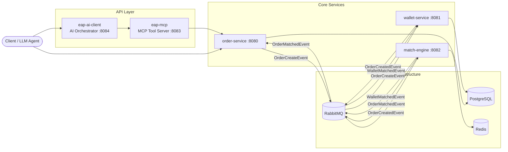

**English** | **[中文](README.md)**

# EAP — Electricity Auction Platform

> Event-driven electricity auction platform built with Spring Boot microservices.
> Simulates high-frequency order placement, asset reservation, and order matching
> with Redis-based order books and asynchronous event workflows.

Inspired by cryptocurrency exchanges and academic research on electricity markets,
EAP models a backend system for high-frequency auction trading. The platform uses
a microservice architecture with event-driven design, and integrates LLM agents
for automated market simulation and stress testing.

### Core Problems

- How to prevent asset overselling under high-concurrency order placement?
- How to ensure data consistency across distributed services without distributed transactions?
- How to guarantee atomic matching while maintaining price-time priority in the order book?

---

## Architecture



### Data Flow

| Step | Flow | Sync/Async | Failure Risk |
|------|------|-----------|-------------|
| 1 | Client → Order Service | Sync (REST) | Request validation failure → returns 4xx |
| 2 | Order → RabbitMQ → Wallet | **Async** | Wallet validation fails → emits `OrderFailedEvent` to notify upstream |
| 3 | Wallet → RabbitMQ → Match Engine | **Async** | No counterparty → order enters order book and waits; match failure → order stays in Redis |
| 4 | Match Engine → RabbitMQ → Order + Wallet | **Async** | Event redelivery → three-layer idempotency (Redis SETNX / `existsByMatchId()` / DB UNIQUE) |

> All cross-service communication is async and event-driven — no direct HTTP calls between services, so a single-point failure won't cause cascading blocks.

---

## Order Lifecycle

Each order progresses through states via events, keeping services fully decoupled:

```
User places order
    │
    ▼
OrderCreateEvent ──► Wallet validates & locks assets
    │
    ▼
OrderCreatedEvent ──► Match Engine performs matching
    │
    ▼
OrderMatchedEvent ──► Order Service updates status
WalletMatchedEvent ──► Wallet performs final settlement
```

| Event | Trigger | Order Status |
|-------|---------|-------------|
| `OrderCreateEvent` | User places an order | `PENDING` |
| `OrderCreatedEvent` | Wallet approves asset reservation | `CREATED` |
| `OrderMatchedEvent` | Match Engine completes a trade | `MATCHED` |

---

## Services

| Module | Description |
|--------|-------------|
| **eap-order** | Order placement & query API; maintains order state machine (PENDING → CREATED → MATCHED) |
| **eap-wallet** | Receives order events, validates & locks user assets, performs final settlement after matching |
| **eap-matchEngine** | Redis ZSET-based order book with Lua scripts ensuring atomic matching under high concurrency |
| **eap-mcp** | MCP interface — exposes system operations to LLMs and external tools via standard protocol |
| **eap-ai-client** | AI orchestration layer — sends orders and executes market simulation strategies via MCP |
| **eap-common** | Shared DTOs, constants, and utilities |

---

## Quick Start

```bash
# Prerequisites: Docker, JDK 17+

# 1. Start infrastructure (PostgreSQL, RabbitMQ, Redis)
make dev-up

# 2. Build & run all services
make run-all

# 3. (Optional) Start AI services — requires Ollama
make ai-start

# 4. Stop everything
make dev-down
```

See [DEV-GUIDE.md](DEV-GUIDE.md) for detailed setup instructions.

---

## Tech Stack

| Category | Technology |
|----------|-----------|
| Framework | Spring Boot, Spring Web, Spring AMQP |
| API | OpenAPI Generator (API-first — generates controllers & DTOs) |
| Messaging | RabbitMQ (event-driven backbone) |
| Data | PostgreSQL, Redis (order book) |
| AI/LLM | Spring AI, MCP Protocol, Ollama |
| Testing | JUnit5, Mockito, Spring Cloud Contract, Testcontainers |
| DevOps | Docker Compose, Makefile |

---

## Testing Strategy

- **Unit Tests** — JUnit5 + Mockito
- **Contract Tests** — Spring Cloud Contract (validates cross-service event schemas)
- **Integration Tests** — Testcontainers (PostgreSQL, RabbitMQ, Redis)
- **Simulation Tests** — MCP + LLM automated order placement, end-to-end event flow verification

---

## Engineering Decisions

### Trade-offs

| Decision | Chosen | Alternative | Why |
|----------|--------|-------------|-----|
| Message broker | RabbitMQ | Kafka | System focuses on routing and per-message ack, not log retention or partitioning; RabbitMQ's exchange/routing-key model fits event dispatch better |
| Order book storage | Redis ZSET + Lua | RDBMS | Matching requires price-sorted real-time queries; ZSET supports this natively; Lua scripts guarantee atomic lookup + removal + matching, avoiding DB lock contention |
| Concurrency control | Optimistic locking (`@Version`) | Pessimistic locking (`SELECT FOR UPDATE`) | Most requests don't conflict (different users, different wallets); optimistic locking reduces DB lock hold time, retry on conflict |
| LLM integration | MCP Protocol | Direct REST calls | MCP provides standardized tool descriptions; LLM agents auto-discover and invoke system functions without per-LLM adapters |

### Data Consistency & Oversell Prevention

Multiple layers of protection ensure data consistency throughout the order lifecycle:

| Layer | Mechanism | Protection |
|-------|-----------|------------|
| **Process Design** | Wallet-first validation | Orders must pass asset verification and locking before entering the matching engine, eliminating overselling at the flow level |
| **Concurrency Control** | `@Version` optimistic locking on WalletEntity | Concurrent modifications to the same wallet trigger `OptimisticLockException`, preventing lost updates |
| **Matching Atomicity** | Redis Lua scripts | Order book lookup, removal, and matching execute within a single Lua script, guaranteed atomic by Redis |
| **Distributed Locking** | Redisson distributed lock | Partial match re-addition protected by distributed locks, preventing race conditions during concurrent matching |
| **Duplicate Match Prevention** | `match_id UNIQUE` + `existsByMatchId()` + Redis SETNX | Three-layer dedup: Redis blocks first, application checks second, database constraint as final guarantee |
| **Transaction Atomicity** | `@Transactional` on all event listeners | Balance validation and asset locking execute within a single transaction — no intermediate state where validation passes but locking fails |

### Failure Handling

```
Wallet validation fails (insufficient balance / amount / wallet not found)
    │
    ▼
OrderFailedEvent (with failureType + reason)
    │
    ▼
Order Service updates status → SSE real-time push to frontend
```

- **Validation failure**: Wallet emits `OrderFailedEvent` with categorized failure types (`INSUFFICIENT_BALANCE` / `INSUFFICIENT_AMOUNT` / `WALLET_NOT_FOUND`); Order Service updates order status and notifies the frontend via SSE
- **Price difference refund**: When a buy order is placed at price 100 but matches at 80, the system automatically refunds the locked difference to `availableCurrency`
- **Match idempotency**: Match Engine uses Redis SETNX to track processed matchIds; duplicate events are skipped and orders are returned to the order book

---

## Known Limitations

| Limitation | Impact | Possible Improvement |
|-----------|--------|---------------------|
| Single match-engine instance | Cannot horizontally scale matching throughput | Partitioned queues + sharded matching by trading pair |
| No strict cross-partition message ordering | Edge-case matching order anomalies under extreme concurrency | Introduce sequence IDs or switch to Kafka partition ordering |
| No real market latency simulation | Stress test results don't directly translate to production | Add network delay injection (e.g., Toxiproxy) |
| No CI/CD pipeline | Deployment is still manual | Integrate GitHub Actions + container registry |

---

## Technical Writing Series

This project is accompanied by a 30-day technical writing series (in Chinese) covering system design, event-driven architecture, Redis matching, contract testing, and LLM integration:

> [ithome series/](ithome%20series/) — Full 30-article series

---

## Project Structure

```
eap/
├── eap-common/          # Shared DTOs, constants, utilities
├── eap-order/           # Order Service
├── eap-wallet/          # Wallet Service
├── eap-matchEngine/     # Match Engine
├── eap-mcp/             # MCP Tool Server
├── eap-ai-client/       # AI Orchestrator
├── ithome series/       # 30-day technical writing series
├── docker-compose.yml
└── Makefile
```
