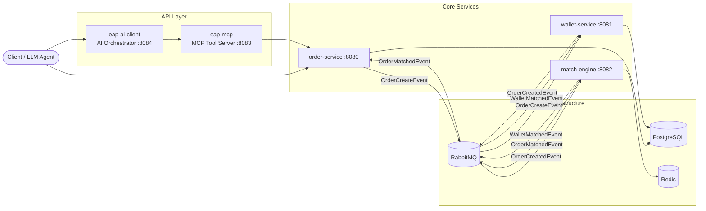

**[English](README.en.md)** | **中文**

# EAP — Electricity Auction Platform

> 專案文件與 Claude/BMAD 歷史脈絡整理請先看 [PROJECT_STATE.md](PROJECT_STATE.md)。

> Event-driven electricity auction platform built with Spring Boot microservices.
> Simulates high-frequency order placement, asset reservation, and order matching
> with Redis-based order books and asynchronous event workflows.

模擬「電力交易所」的後端系統，靈感來自虛擬幣交易所與碩士研究題目。
採用微服務架構 + 事件驅動設計，整合 LLM 進行市場模擬與自動化壓測。

### Core Problems

- 高併發掛單下，如何防止資產超賣（overselling）？
- 跨服務的分散式交易，如何確保資料一致性而不使用分散式事務？
- 撮合引擎如何在維持價格優先順序的同時，保證原子操作？

---

## Architecture



### Data Flow

| Step | Flow | Sync/Async | Failure Risk |
|------|------|-----------|-------------|
| 1 | Client → Order Service | Sync (REST) | 請求驗證失敗，直接回 4xx |
| 2 | Order → RabbitMQ → Wallet | **Async** | Wallet 驗證失敗 → 發 `OrderFailedEvent` 通知上游 |
| 3 | Wallet → RabbitMQ → Match Engine | **Async** | 無對手單 → 掛入訂單簿等待；撮合失敗 → 訂單留在 Redis |
| 4 | Match Engine → RabbitMQ → Order + Wallet | **Async** | 事件重送 → 三層冪等防護（Redis SETNX / `existsByMatchId()` / DB UNIQUE） |

> 所有跨服務通訊皆為非同步事件驅動，服務間無直接 HTTP 呼叫，單點故障不會導致連鎖阻塞。

---

## Order Lifecycle

每筆訂單透過事件推進狀態，服務間保持解耦：

```
User places order
    │
    ▼
OrderCreateEvent ──► Wallet 驗證資產、鎖定額度
    │
    ▼
OrderCreatedEvent ──► Match Engine 撮合
    │
    ▼
OrderMatchedEvent ──► Order 更新狀態
WalletMatchedEvent ──► Wallet 最終結算
```

| Event | Trigger | Order Status |
|-------|---------|-------------|
| `OrderCreateEvent` | 使用者掛單 | `PENDING` |
| `OrderCreatedEvent` | Wallet 資產核定通過 | `CREATED` |
| `OrderMatchedEvent` | Match Engine 撮合成交 | `MATCHED` |

---

## Services

| Module | Description |
|--------|-------------|
| **eap-order** | 掛單與查詢 API，維護訂單狀態 (PENDING → CREATED → MATCHED) |
| **eap-wallet** | 接收掛單事件，驗證與鎖定資產，成交後最終結算 |
| **eap-matchEngine** | Redis ZSET 訂單簿，Lua script 保證撮合原子性，支援高併發 |
| **eap-mcp** | MCP 介面，讓 LLM 或外部工具透過標準協議與系統互動 |
| **eap-ai-client** | AI 編排層，透過 MCP 發送掛單、執行市場模擬策略 |
| **eap-common** | 共用 DTO、常數、工具類 |

---

## Quick Start

```bash
# Prerequisites: Docker, JDK 17+

# 1. Start infrastructure (PostgreSQL, RabbitMQ, Redis)
make dev-up

# 2. Build & run all services
make run-all

# 3. (Optional) Start AI services — requires Ollama
make ai-start

# 4. Stop everything
make dev-down
```

詳細開發指引請見 [DEV-GUIDE.md](DEV-GUIDE.md)。

---

## Tech Stack

| Category | Technology |
|----------|-----------|
| Framework | Spring Boot, Spring Web, Spring AMQP |
| API | OpenAPI Generator (API-first, 生成 Controller 與 DTO) |
| Messaging | RabbitMQ (事件驅動骨幹) |
| Data | PostgreSQL, Redis (撮合訂單簿) |
| AI/LLM | Spring AI, MCP Protocol, Ollama |
| Testing | JUnit5, Mockito, Spring Cloud Contract, Testcontainers |
| DevOps | Docker Compose, Makefile |

---

## Testing Strategy

- **Unit Tests** — JUnit5 + Mockito
- **Contract Tests** — Spring Cloud Contract（驗證跨服務事件格式）
- **Integration Tests** — Testcontainers（PostgreSQL、RabbitMQ、Redis）
- **Simulation Tests** — MCP + LLM 自動下單，驗證端到端事件流

---

## Engineering Decisions

### Trade-offs

| Decision | Chosen | Alternative | Why |
|----------|--------|-------------|-----|
| Message broker | RabbitMQ | Kafka | 本系統重點在 routing 與 per-message ack，不需要 Kafka 的 log retention 與 partition 模型；RabbitMQ 的 exchange/routing-key 更貼合事件分發需求 |
| Order book storage | Redis ZSET + Lua | RDBMS | 撮合需要按價格排序的即時查詢，ZSET 天然支援；Lua script 保證查詢+移除+撮合在單一原子操作內完成，避免 DB 的 lock contention |
| Concurrency control | Optimistic locking (`@Version`) | Pessimistic locking (`SELECT FOR UPDATE`) | 交易系統大部分請求不會衝突（不同用戶操作不同錢包），樂觀鎖減少 DB lock 持有時間，衝突時 retry 即可 |
| LLM integration | MCP Protocol | 直接 REST call | MCP 提供標準化工具描述，LLM agent 可自動發現與呼叫系統功能，不需要為每個 LLM 寫 adapter |

### Data Consistency & Oversell Prevention

本系統採用多層防護確保資料一致性：

| Layer | Mechanism | Protection |
|-------|-----------|------------|
| **流程設計** | Wallet-first validation | 訂單必須先通過資產核定與鎖定，才能進入撮合，從流程上排除超賣 |
| **併發控制** | `@Version` optimistic locking on WalletEntity | 兩個併發請求修改同一錢包時，後者觸發 `OptimisticLockException`，防止 lost update |
| **撮合原子性** | Redis Lua scripts | 訂單簿的查詢、移除、撮合在單一 Lua script 內完成，Redis 保證原子執行 |
| **分散式鎖** | Redisson distributed lock | 撮合過程中的 partial match re-add 透過分散式鎖保護，防止競爭條件 |
| **重複撮合防護** | `match_id UNIQUE` constraint + `existsByMatchId()` + Redis SETNX | 三層防護：Redis 層先擋、應用層再檢查、資料庫層最終保證 |
| **交易原子性** | `@Transactional` on all event listeners | 餘額驗證 + 資產鎖定在同一事務內完成，不會出現「檢查通過但鎖定失敗」的中間狀態 |

### Failure Handling

```
Wallet 驗證失敗（餘額不足 / 電量不足 / 錢包不存在）
    │
    ▼
OrderFailedEvent (帶 failureType + reason)
    │
    ▼
Order Service 更新狀態 → SSE 即時推送前端
```

- **驗證失敗**：Wallet 發出 `OrderFailedEvent`，帶有分類（`INSUFFICIENT_BALANCE` / `INSUFFICIENT_AMOUNT` / `WALLET_NOT_FOUND`），Order Service 據此更新訂單狀態並透過 SSE 通知前端
- **成交價差退款**：買方掛單價 100 但實際成交價 80 時，系統自動退還鎖定差額至 `availableCurrency`
- **撮合冪等性**：Match Engine 透過 Redis SETNX 記錄已處理的 matchId，重複事件直接跳過並將訂單歸還訂單簿

---

## Known Limitations

| Limitation | Impact | Possible Improvement |
|-----------|--------|---------------------|
| Match Engine 為單一實例 | 無法水平擴展撮合吞吐量 | 依交易對分區（partitioned queues + sharded matching） |
| 無嚴格跨 partition 訊息順序保證 | 極端併發下可能產生非預期撮合順序 | 引入 sequence ID 或切換至 Kafka partition ordering |
| 無真實市場延遲模擬 | 壓測結果無法直接類比 production 環境 | 加入 network delay injection（如 Toxiproxy） |
| 無 CI/CD pipeline | 部署仍為手動流程 | 整合 GitHub Actions + container registry |

---

## iThome 鐵人賽系列

本專案有完整的 30 天技術寫作系列，涵蓋系統設計、事件驅動、Redis 撮合、契約測試到 LLM 整合：

> [ithome series/](ithome%20series/) — 完整 30 篇文章

---

## Project Structure

```
eap/
├── eap-common/          # Shared DTOs, constants, utilities
├── eap-order/           # Order Service
├── eap-wallet/          # Wallet Service
├── eap-matchEngine/     # Match Engine
├── eap-mcp/             # MCP Tool Server
├── eap-ai-client/       # AI Orchestrator
├── ithome series/       # 30-day technical writing series
├── docker-compose.yml
└── Makefile
```
