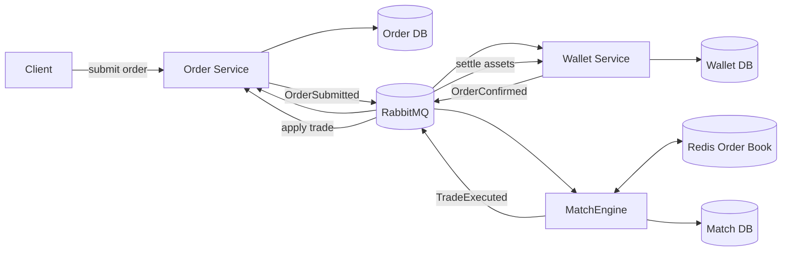
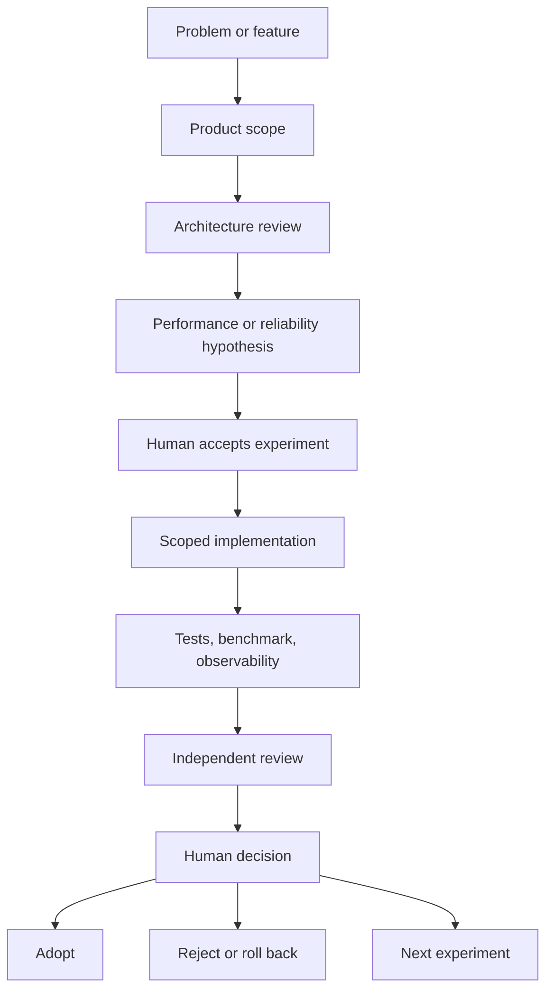

**English** | **[中文](README.zh-TW.md)**

# EAP - Event-Driven Auction Platform for Electricity Markets

EAP is an independently built, event-driven electricity market backend. It supports Continuous Double Auction (CDA) and Timed Double Auction (TDA) modes and is implemented with Java, Spring Boot, RabbitMQ, PostgreSQL, and Redis Lua.

The project is designed around three questions: which service owns each business fact, how a trade remains correct under retries and partial failures, and how an engineering claim can be verified with durable evidence. It is not a CRUD demo or a benchmark-only project.

> **Evidence snapshot:** the current same-host, shuffled mixed-HTTP CDA evidence supports a short-window lower-bound class of about `700 accepted orders/s`. A separate historical high-volume run verified `100,000` completed trades from `200,000` HTTP orders without missing trade records or asset discrepancies. These workloads have different boundaries and are not production SLAs. See the [performance report](docs/performance-report.md) for exact definitions and limitations.

## System Overview

The CDA path is split into three state-owning services. Order owns the order lifecycle, Wallet owns assets and settlement, and MatchEngine owns the order book and trade decision. RabbitMQ carries integration events; each service commits only its own database state.



There is no distributed transaction across the services. A service that must publish an event writes its local state and transactional outbox in one database transaction. The relay publishes later with broker confirmation, while consumers use idempotency and local transactions to tolerate at-least-once delivery.

## CDA Business Flow

1. A client submits a BUY or SELL order through the Order HTTP API.
2. Order validates the command, appends the order event, and writes an outbox record atomically.
3. Wallet consumes the submitted order, reserves the required asset, and publishes the confirmed order through its outbox.
4. MatchEngine admits the confirmed order into a Redis sorted-set order book and performs atomic matching with Lua.
5. A match commits the `TradeExecuted` fact, trade outbox, and any required reservation-cleanup task in the MatchEngine database.
6. Order applies the trade to its command-side order state; Wallet settles the buyer and seller assets.
7. Operational verification compares the durable trade IDs owned by MatchEngine, Order, and Wallet, reconciles assets, and checks that queues and retry debt have drained.

MatchEngine does not maintain a separate downstream completion view and does not wait for completion callbacks from Order or Wallet. Those services own their results. Cross-service convergence is verification outside the transaction path, not another business dependency.

See [the architecture guide](docs/architecture.md) for transaction boundaries, event flows, recovery behavior, and the separate TDA flow.

## Service Ownership

| Service | Owns | Main responsibility |
| --- | --- | --- |
| [eap-order](https://github.com/Yitin-tsai/eap-order) | Order command events and trade application | HTTP order entry, order lifecycle, command-side state, rebuildable projections |
| [eap-wallet](https://github.com/Yitin-tsai/eap-wallet) | Balances, reservations, and settlement facts | Asset validation, reservation, trade settlement, wallet outbox |
| [eap-matchEngine](https://github.com/Yitin-tsai/eap-matchEngine) | Order book and `TradeExecuted` facts | CDA matching, Redis reservation recovery, trade persistence; TDA scheduling and clearing |
| [eap-common](https://github.com/Yitin-tsai/eap-common) | Shared integration contracts | Event and DTO definitions; no business-state ownership |
| [eap-mcp](https://github.com/Yitin-tsai/eap-mcp) / [eap-ai-client](https://github.com/Yitin-tsai/eap-ai-client) | Controlled AI tooling | Experimental control-plane operations, never core transaction correctness |

TDA is implemented as a separate market mode that collects confirmed stepped bids and clears them on a schedule. It has not yet completed the same reliability and capacity campaign as CDA, so CDA evidence is not generalized to TDA.

## Reliability Model

| Failure or consistency risk | Current control |
| --- | --- |
| Database commit succeeds but event publication fails | Transactional outbox and retryable relay |
| RabbitMQ redelivers an event | Database-backed idempotency and unique constraints |
| Consumer stops before acknowledgement | Manual ACK after the local transaction commits |
| Poison event cannot be processed | Retry policy plus DLX / DLQ |
| Redis reservation cleanup is interrupted | Durable cleanup task, exact `tradeId` correlation, and reconciliation |
| Read projection is delayed | Projection remains rebuildable and does not block command-side trade application |
| A local metric looks healthy while the workflow is incomplete | Three-service trade-ID equality, asset reconciliation, and final queue/debt drain |

A CDA trade is called business-complete only when MatchEngine has persisted the trade, Order has applied it, Wallet has settled it, all three durable trade-ID sets agree, assets reconcile, and the measured queues and retry debt are empty.

## AI-Assisted Engineering Workflow

EAP uses AI as bounded engineering roles rather than as an autonomous code generator. Product Scope challenges whether a change is worth building; Architect reviews ownership and consistency; Performance Analyst defines the workload and hypothesis; Implementation works only within an accepted specification; QA and Reviewer search for correctness failures and unsupported claims. The human owner makes every architecture, risk, adoption, rollback, deployment, and public-claim decision.



Every experiment records its baseline, one primary variable, commands, observations, correctness gate, and decision. High-throughput changes are rejected when transaction or concurrency tests show that their results cannot be rolled back safely. Rejected experiments remain documented so the project does not repeat an unsafe optimization without new evidence.

Read [EAP's evidence-driven AI engineering workflow](docs/ai-engineering-workflow.md) for the role contracts and real adopted/rejected cases. The [Hello World Dev Conference case study](docs/talks/hello-world-dev-conference-2026-case-study.md) explains how this workflow supports self-review, feature expansion, and enterprise SDLC practices.

## Engineering Evidence

Performance is evidence for the architecture, not the homepage's main subject. EAP separates accepted HTTP orders, component throughput, same-window completed trades, full-lifecycle throughput, short diagnostics, and soak tests. A result is published only with its workload boundary and correctness outcome.

- [Performance report](docs/performance-report.md): current claims, definitions, limitations, and bottleneck history.
- [Benchmark taxonomy](docs/benchmarks/load-test-taxonomy.md): what each workload measures and what it cannot claim.
- [Latest canonical mixed-HTTP diagnostic](docs/benchmarks/2026-08-07-canonical-mixed-http-diagnostic.md): the current CDA boundary and accepted/rejected experiments.
- [Wallet robustness report](docs/benchmarks/2026-08-05-wallet-settlement-robustness.md): transaction safety, mixed-flow, soak, and failure evidence.

## Run Locally

```bash
make dev-env
make dev-up
make run-all
```

Build and test:

```bash
make build
make test
```

See [DEV-GUIDE.md](DEV-GUIDE.md) for repository setup and service operations. Load-test entry points are under [scripts/load-test/](scripts/load-test/); use the [public benchmark runbook](docs/benchmarks/2026-07-public-benchmark.md) before comparing results.

## Reading Order

1. [Architecture](docs/architecture.md) - service ownership, CDA/TDA flows, transaction boundaries, and completion semantics.
2. [AI engineering workflow](docs/ai-engineering-workflow.md) - role contracts, human checkpoints, evidence gates, and rejected experiments.
3. [Conference case study](docs/talks/hello-world-dev-conference-2026-case-study.md) - how the workflow is applied and generalized.
4. [Performance report](docs/performance-report.md) - benchmark contracts and current evidence.
5. [Benchmark taxonomy](docs/benchmarks/load-test-taxonomy.md) - detailed workload boundaries.
6. Service repositories: [Order](https://github.com/Yitin-tsai/eap-order), [Wallet](https://github.com/Yitin-tsai/eap-wallet), [MatchEngine](https://github.com/Yitin-tsai/eap-matchEngine), and [Common](https://github.com/Yitin-tsai/eap-common).

The frozen experiment history under `docs/archive/performance/` is retained for traceability but is not part of the normal introduction path.
