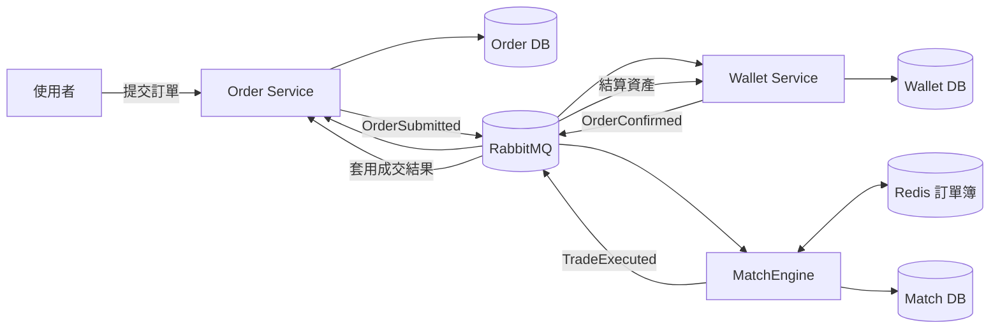
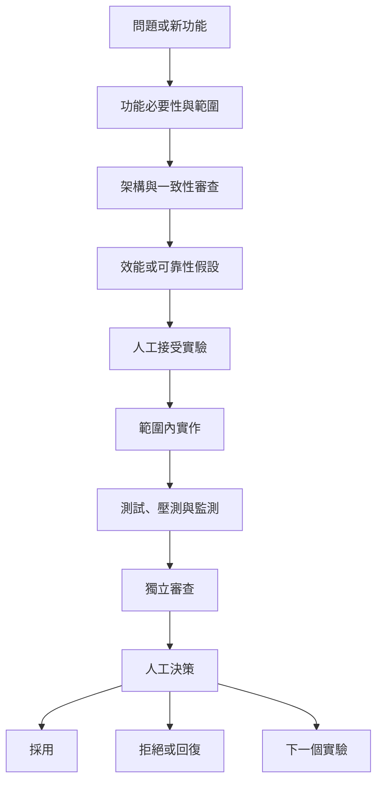

**[English](README.md)** | **中文**

# EAP - 事件驅動電力市場交易平台

EAP 是一套獨立開發的事件驅動電力市場後端，支援連續雙向競價（Continuous Double Auction，CDA）與定時集合競價（Timed Double Auction，TDA），使用 Java、Spring Boot、RabbitMQ、PostgreSQL 與 Redis Lua 建置。

專案主要回答三個工程問題：每一項業務事實應由哪個服務負責、交易如何在重試與局部失敗下維持正確，以及工程成果如何用持久化證據驗證。它不是單純的 CRUD 範例，也不是只為了展示壓測數字的專案。

> **證據摘要：** 目前同機、隨機混合 HTTP 的 CDA 短時間證據，支持約 `700 accepted orders/s` 等級的安全下界。另一個歷史高資料量測試曾以 `200,000` 筆 HTTP 訂單完成 `100,000` 筆交易，沒有交易紀錄遺失或資產差異。兩者工作負載不同，也都不是正式環境 SLA；完整定義與限制請見[效能報告](docs/performance-report.md)。

## 系統總覽

CDA 核心由三個各自擁有狀態的服務組成：Order 負責訂單生命週期，Wallet 負責資產與結算，MatchEngine 負責訂單簿與成交決策。RabbitMQ 傳遞整合事件，每個服務只提交自己擁有的資料庫狀態。



服務之間沒有分散式交易。需要發布事件的服務，會在同一筆本地資料庫交易中寫入狀態與 Transactional Outbox，再由 relay 等待 RabbitMQ 確認後發布。Consumer 透過冪等紀錄與本地交易承受 at-least-once delivery。

## CDA 完整業務流程

1. 使用者透過 Order HTTP API 提交 BUY 或 SELL 訂單。
2. Order 驗證命令，在同一筆交易中寫入訂單事件與 outbox。
3. Wallet 接收訂單、保留所需資產，再透過自己的 outbox 發布確認結果。
4. MatchEngine 將合格訂單放入 Redis sorted-set 訂單簿，並用 Lua 原子執行撮合。
5. 成交時，MatchEngine 在同一筆資料庫交易中寫入 `TradeExecuted`、trade outbox，以及必要的 reservation cleanup task。
6. Order 將成交結果套用到命令端訂單狀態；Wallet 完成買賣雙方資產結算。
7. 營運驗證在交易路徑之外，比對 MatchEngine、Order、Wallet 各自持久化的 trade ID，核對資產，並確認 queue 與 retry debt 已清空。

MatchEngine 不再維護額外的下游 Completion View，也不等待 Order 或 Wallet 回傳完成事件。各服務擁有自己的處理結果；跨服務收斂是交易路徑之外的驗證，不是新的業務依賴。

完整交易邊界、事件流、復原方式與獨立的 TDA 流程請見[架構文件](docs/architecture.md)。

## 服務責任

| 服務 | 擁有的資料 | 主要責任 |
| --- | --- | --- |
| [eap-order](https://github.com/Yitin-tsai/eap-order) | 訂單命令事件與成交套用結果 | HTTP 下單、訂單生命週期、命令端狀態與可重建 projection |
| [eap-wallet](https://github.com/Yitin-tsai/eap-wallet) | 餘額、資產保留與結算事實 | 驗資、資產保留、交易結算與 wallet outbox |
| [eap-matchEngine](https://github.com/Yitin-tsai/eap-matchEngine) | 訂單簿與 `TradeExecuted` | CDA 撮合、Redis reservation 復原、成交持久化；TDA 排程與清算 |
| [eap-common](https://github.com/Yitin-tsai/eap-common) | 共用整合契約 | Event 與 DTO 定義，不擁有業務狀態 |
| [eap-mcp](https://github.com/Yitin-tsai/eap-mcp)／[eap-ai-client](https://github.com/Yitin-tsai/eap-ai-client) | 受控 AI 工具 | 實驗性 control-plane 操作，不參與核心交易正確性 |

TDA 是另一條已實作的市場模式，會收集通過驗資的階梯式出價，再依排程統一清算。目前尚未完成與 CDA 同等的可靠性與容量驗證，因此不能把 CDA 的證據直接套用到 TDA。

## 可靠性設計

| 失敗或一致性風險 | 現行控制方式 |
| --- | --- |
| 資料庫提交成功，但事件發布失敗 | Transactional Outbox 與可重試 relay |
| RabbitMQ 重複投遞事件 | 資料庫冪等紀錄與唯一約束 |
| Consumer 在 ACK 前停止 | 本地交易提交後才進行 manual ACK |
| 錯誤事件無法處理 | Retry policy 與 DLX／DLQ |
| Redis reservation 清理中斷 | 持久化 cleanup task、精確 `tradeId` 對應與 reconciliation |
| 讀取 projection 延遲 | Projection 可重建，且不阻擋命令端交易套用 |
| 局部指標正常，但完整流程尚未完成 | 三服務 trade-ID 一致、資產核對及 queue／retry debt 清空 |

CDA 交易只有在 MatchEngine 已寫入成交、Order 已套用成交、Wallet 已完成結算、三服務持久化 trade-ID 集合一致、資產正確，而且量測範圍內的 queue 與 retry debt 都清空後，才算完整業務完成。

## AI 工程協作流程

EAP 將 AI 限制成不同工程角色，而不是讓 AI 自動產生程式後直接採用。Product Scope 先質疑功能是否值得做；Architect 審查服務責任與一致性；Performance Analyst 定義工作負載與假設；Implementation 只能依人工接受的規格實作；QA 與 Reviewer 主動尋找正確性反例及不成立的宣稱。架構、風險、採用、回復、部署與公開說法，最後都由人工負責人決定。



每次實驗都要記錄 baseline、單一主要變因、執行命令、觀測資料、正確性關卡與最終決策。即使修改提高局部 TPS，只要交易或 concurrency tests 證明結果無法安全 rollback，仍會被拒絕。被拒絕的實驗也保留，避免未來在沒有新證據時重做相同的不安全最佳化。

角色契約與真實採用／拒絕案例請見 [EAP 證據驅動 AI 工程工作流](docs/ai-engineering-workflow.md)。[Hello World Dev Conference 案例說明](docs/talks/hello-world-dev-conference-2026-case-study.md)則整理這套流程如何用於自我審查、功能擴充與企業 SDLC。

## 工程證據

效能資料用來驗證架構，不是首頁的主體。EAP 分開記錄 HTTP 接受速率、元件隔離吞吐量、同窗完成交易、完整流程吞吐量、短時間診斷與長時間測試；每個數字都必須附帶工作負載邊界與正確性結果。

- [效能報告](docs/performance-report.md)：目前宣稱、定義、限制與瓶頸歷程。
- [壓測分類](docs/benchmarks/load-test-taxonomy.md)：各種工作負載能證明及不能證明的內容。
- [最新 canonical mixed HTTP 診斷](docs/benchmarks/2026-08-07-canonical-mixed-http-diagnostic.md)：目前 CDA 邊界與採用／拒絕實驗。
- [Wallet 穩健性報告](docs/benchmarks/2026-08-05-wallet-settlement-robustness.md)：交易安全、混合流量、長時間及故障證據。

## 本機執行

```bash
make dev-env
make dev-up
make run-all
```

建置與測試：

```bash
make build
make test
```

Repository 初始化與服務操作請見 [DEV-GUIDE.md](DEV-GUIDE.md)。壓測入口位於 [scripts/load-test/](scripts/load-test/)；比較數據前請先閱讀[公開壓測 runbook](docs/benchmarks/2026-07-public-benchmark.md)。

## 建議閱讀順序

1. [架構文件](docs/architecture.md)：服務責任、CDA／TDA 流程、交易邊界與完成語意。
2. [AI 工程工作流](docs/ai-engineering-workflow.md)：角色契約、人工檢查點、證據關卡與 rejected experiments。
3. [研討會案例說明](docs/talks/hello-world-dev-conference-2026-case-study.md)：工作流如何實際運作與泛化。
4. [效能報告](docs/performance-report.md)：壓測合約與目前證據。
5. [壓測分類](docs/benchmarks/load-test-taxonomy.md)：詳細工作負載邊界。
6. 各服務 repository：[Order](https://github.com/Yitin-tsai/eap-order)、[Wallet](https://github.com/Yitin-tsai/eap-wallet)、[MatchEngine](https://github.com/Yitin-tsai/eap-matchEngine) 與 [Common](https://github.com/Yitin-tsai/eap-common)。

`docs/archive/performance/` 下的凍結實驗歷史會保留供追溯，但不屬於一般讀者的專案介紹路徑。
