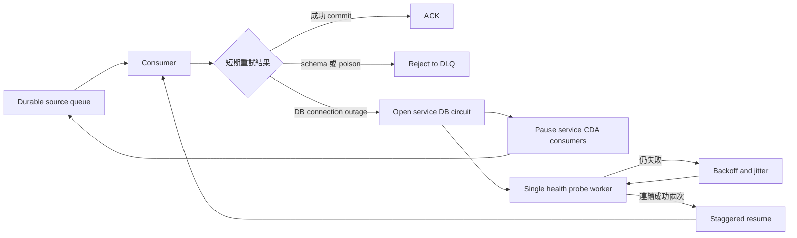

# ADR-004：CDA inbox commit 前的資料庫中斷恢復

> Ticket：EAP-REL-104  
> 日期：2026-09-17  
> 狀態：Accepted，已實作並完成故障注入驗證  
> 範圍：Order、Wallet、MatchEngine 的 CDA consumer；TDA 與 DLQ control plane 不在本次範圍

## 問題

Durable inbox 只能保護「事件已成功寫入 inbox」之後的 crash window。若 RabbitMQ 已把事件
交給 consumer，但該服務的 PostgreSQL 在 inbox commit 前中斷，原本的行為是：

1. Spring listener 在記憶體中嘗試最多三次；
2. 約數秒後耗盡；
3. `default-requeue-rejected=false` 將事件送進 shared DLQ；
4. outage 持續越久，DLQ 中越多其實沒有壞掉的合法事件。

Order 的 manual-ack trade listener 還有另一個風險：若連「記錄 retryable marker」都因 DB
中斷而失敗，原本會立即 `nack(requeue=true)`，形成沒有 backoff 的 hot loop。

## 決策

REL-104 採用「**service-local database circuit breaker＋暫停 CDA listener container**」：



- 合法事件在 DB outage 期間留在原本的 durable source queue，不消耗 DLQ。
- 每個服務只有自己的 circuit state；不建立跨服務 coordinator。
- circuit 開啟後，由單一背景 worker 探測該服務自己的 datasource。
- probe 使用 exponential backoff，預設從 2 秒開始、最高 30 秒，並加入正負 20% jitter。
- 連續兩次 probe 成功才恢復；listener group 每 2 秒依序啟動，降低 DB 恢復瞬間的連線尖峰。
- source queue 的重新投遞仍可能重複，因此 inbox／local transaction 的既有冪等保護仍是必要條件。

RabbitMQ 將 consumer acknowledgement 與 publisher confirm 定義為兩套彼此獨立的安全機制；
consumer ACK 只表示 delivery 可從 queue 刪除。連線或 channel 關閉時，尚未 ACK 的 delivery
會重新排隊。這正是本決策保留訊息的基礎：在 local durable commit 前不 ACK。
參考 [RabbitMQ Consumer Acknowledgements and Publisher Confirms](https://www.rabbitmq.com/docs/confirms)。

## 為什麼本次不採 delayed retry queue

delayed retry queue 適合隔離單筆、短暫且不代表整個 dependency 掛掉的錯誤，但不是這張
ticket 的最小解：

- consumer 必須先把原訊息 republish 到 retry queue，再 ACK 原 delivery；這兩步不是原子交易。
- confirm 前 ACK 可能遺失；confirm 後 ACK 若失敗則可能重複，需要額外 retry identity 與稽核。
- 以每個 source queue 建立多個固定 TTL tier，會增加 queue、binding、header 與監控數量。
- 整個 PostgreSQL 中斷時，每則訊息反覆 republish 只會放大 broker I/O，並在 TTL 到期時形成波峰。
- RabbitMQ 也說明，一般 classic queue 的 dead-letter republish 預設不使用 publisher confirm；
  clustered broker 下不能把 DLX 當成無條件安全的原子搬移。
  參考 [RabbitMQ Dead Letter Exchanges — Safety](https://www.rabbitmq.com/docs/dlx#safety)。

因此 REL-104 讓 dependency-wide outage 使用 pause/circuit breaker。日後若有明確的「單筆
transient prerequisite」需求，可以另開 ticket 評估固定 delay tier；不能把它混同於 DB outage。

## 錯誤分類

| 類型 | 例子 | REL-104 行為 | 原因 |
|---|---|---|---|
| Database unavailable | SQLState `08xxx`、PostgreSQL `57P01/57P02/57P03`、JDBC connection exception、connection refused/reset | 短期 retry 耗盡後 requeue、開 circuit、暫停 CDA consumers | payload 合法，等待 dependency 恢復 |
| Lock／serialization | deadlock、`40001`、`CannotAcquireLockException` | 只用既有 bounded retry；耗盡後 terminal path | 不代表整個 DB 掛掉，不能停止所有 queue |
| Schema／conversion | JSON 無法反序列化、必要欄位缺失 | reject，不 requeue，進 DLQ | 重試不會改變 payload |
| Identity／invariant | 同 identity 不同 payload、確定違反狀態機 | 先由 owner inbox 保存 conflict；已保存則 ACK，否則 terminal | 需要調查，不可假裝是 infrastructure outage |
| Unknown | 未列入 allowlist 的例外 | fail closed：不開 service circuit，進 terminal path | 避免一個程式 bug 停止整個服務 |

錯誤分類器刻意很窄，只辨識 SQLState `08`、PostgreSQL 明確的 shutdown／cannot-connect
狀態、JDBC connection wrapper，以及位於 SQL／JDBC cause chain 內的網路連線錯誤。單獨的
RabbitMQ／Redis `ConnectException` 不會被誤判為 DB outage。Hikari connection acquisition timeout 預設
收斂為 2 秒，避免每個 consumer thread 在 30 秒預設值上同時阻塞。
`SQLState 40`、constraint violation 與任意 `DataAccessException` 都不會開 circuit。

## 服務所有權與 commit boundary

| 服務 | 由 circuit 管理的 CDA listener | 安全 ACK 邊界 |
|---|---|---|
| Order | reservation succeeded、order failed、trade executed、cancellation result、reservation released | 對應 inbox／event store／recovery marker 已 commit |
| Wallet | order submitted、trade executed、cancellation result | `wallet_message_inbox` identity 與 payload 已 commit |
| MatchEngine | reservation succeeded、cancellation requested | admission inbox／cancellation durable decision 已 commit |

每個 `@RabbitListener` 都有穩定 container ID。服務 circuit 只停止本服務上述 CDA containers；
不停止其他服務，也不把 runtime circuit state 放進 `eap-common`。共用模組只保存無狀態、窄範圍的
database-outage classifier。

Order 的兩條 manual batch listener 設為 `forceStop=true`，停止時會把尚未處理的 prefetch
delivery 重新排隊。本次將 broker batch size 固定維持預設 `1`；若未來放大 batch，必須先補
per-delivery poison isolation，避免一筆壞訊息拖累整批。

## Crash window 的語意

```text
delivery ──> local durable commit ──> ACK
                │                       │
                │ crash                 │ ACK lost / connection lost
                ▼                       ▼
          broker redelivery       broker redelivery
                └──────────────┬──────────────┘
                               ▼
                     inbox / identity dedupe
```

- commit 前 DB outage：不 ACK，事件留在 source queue；circuit 避免 hot-loop。
- commit 後、ACK 前 crash：RabbitMQ 可能重送；durable inbox 或 idempotent local transaction 去重。
- 恢復 probe 只回答「DB 現在可連線」，不代表 business complete；仍要等 source queue、inbox、
  outbox、projection 等 durable debt 全部歸零。

## 可觀測性與設定

每個服務提供下列 Micrometer 指標並帶 `service` tag：

- `eap.rabbit.cda.db.circuit.open`：目前是否開路（0／1）。
- `eap.rabbit.cda.db.circuit.opened`：累積開路次數。
- `eap.rabbit.cda.db.probe`：恢復探測次數。
- `eap.rabbit.cda.db.probe.failure`：探測失敗次數。

可調參數：

```yaml
eap.rabbit.db-outage:
  initial-probe-delay-ms: 2000
  maximum-probe-delay-ms: 30000
  resume-spacing-ms: 2000
  probe-timeout-seconds: 2
```

這些參數不改變 happy-path listener 行為；正常處理不增加 RabbitMQ publish 或 DB write。

## 驗收條件

1. 對 Order、Wallet、MatchEngine 分別注入至少 60 秒 PostgreSQL outage。
2. outage 期間有效事件保留在 durable source queue，transient-outage DLQ delta 必須為 0。
3. 開路後 listener invocation 不 hot-loop，DB health probe 維持 single-flight 且有 backoff。
4. DB 恢復後自動 resume／drain，不需要手動重播。
5. duplicate 與 commit-before-ACK crash 只產生一次 business effect。
6. poison payload 只進 DLQ，不可開啟 service database circuit。
7. 最終使用與 schema-v4 full-chain gate 相同的 owner-local `DurableDebtSnapshot` 契約，
   對故障注入所屬服務的完整固定 work allowlist 驗證 fresh／healthy／exact／zero；不把
   focused probe 誤稱為完整全鏈 schema-v4 壓測。

## 最終驗證（2026-09-17）

- Order＋Wallet R6：requested outage 60 秒、實測 73 秒；兩條 source queue 都有 backlog
  且 consumer count 降為 0，pause 維持至 DB recovery。兩個 circuit 各 probe 6 次、其中
  4 次失敗，最後 `open=0`。200／200 trade effects 精確收斂，Trade ID 無缺漏，DLQ
  peak／final 都是 0，兩服務完整固定 durable-debt work 全數歸零。
- MatchEngine R2：requested outage 60 秒、實測 71 秒；同樣驗證 backlog、consumer pause、
  pause-held 與自動 resume。200／200 admission inbox 最終為 `APPLIED`，DLQ 0→0，五項
  Match durable debt 全數歸零。
- Wallet 真實 RabbitMQ poison test：poison 訊息依有限次數重試後進 DLQ，且不開啟 DB circuit。

以上是 correctness／liveness failure-injection evidence，不是 capacity、TPS ceiling 或
production SLA。可重跑命令、結果與測試邊界見
[REL-104 故障恢復報告](../benchmarks/2026-09-17-rel104-db-outage-recovery.md)。

## 後續而非本次範圍

- REL-105：Order Saga timeout detector，找出 queue 已空但 lifecycle 長期沒有前進的訂單。
- REL-106：DLQ recovery control plane，提供可見、可判斷、可稽核、受保護的單筆重播。
- TDA consumer 的相同行為要另行盤點，不能因 CDA 完成便宣稱全平台都具備此保護。
