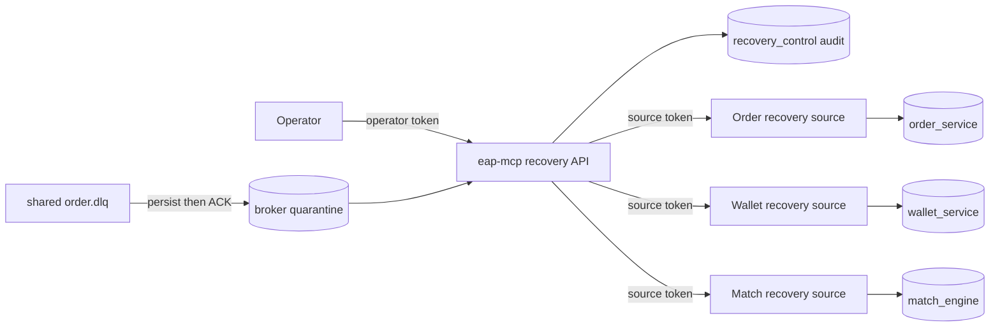

# ADR-005：Failure Recovery Control Plane 的所有權與安全邊界

> Ticket：EAP-REL-106
>
> 狀態：Accepted
>
> 日期：2026-09-17

> 2026-09-18 補充：本 ADR 保留 REL-106 第一版的安全邊界；shared DLQ 的第一個
> owner-aware 條件式重播由 [ADR-006](ADR-006-owner-aware-shared-dlq-replay.zh-TW.md)
> 擴充。只有 Wallet `TradeExecutedEvent` 的 allowlisted transient route 開放，其餘 case
> 仍遵守本 ADR 的 fail-closed 規則。

## 背景

REL-103 讓 Order、Wallet、MatchEngine 用共同的 durable-debt 語意揭露 retry／terminal
工作；REL-104 處理 inbox commit 前的 dependency-wide database outage；REL-105 找出 queue
已空但 Saga 長時間未前進的訂單。剩下的缺口是：terminal row 或 dead letter 已經可見，卻
沒有一個受保護、可預演、可稽核且不會繞過 bounded context 的操作入口。

直接讓中央工具連進三個 service schema 改狀態會破壞資料所有權，也會把 recovery policy
複製到第四個服務。因此本 ADR 決定把「政策判斷與狀態轉移」留在資料擁有者，中央只負責
聚合、身分驗證、操作節流、operator disposition 與 audit。

## 決策

### 1. 兩層 control plane

- `eap-mcp` 是操作入口，不是交易 correctness dependency，也不暴露成 LLM/MCP tool。
- Order、Wallet、MatchEngine 各自查詢、分類並重開自己擁有的 terminal work。
- `eap-mcp` 不直接更新三個 service schema。
- 所有 recovery endpoint 預設關閉；啟用時需設定獨立 operator token 與 source token。

### 2. 單筆操作與 optimistic fingerprint

case ID 編碼 service、debt type、work 與 source ID；fingerprint 則包含狀態、attempt、error、
payload 與最後更新時間。Operator 必須先 inspect，再帶著看到的 fingerprint dry-run／execute。
若 row 在兩次操作之間改變，source 會拒絕舊 fingerprint。這是 recovery 操作的 TOCTOU
防護，不是 distributed lock。

第一版只有單筆操作，沒有 bulk replay。`PARK`／`RESOLVE` 只記錄中央 disposition，不會
假裝修改了 service-owned business fact；`REPLAY` 才會要求 owner 將工作移回自己的 retry
狀態。

### 3. 重播政策由 owner 強制執行

| Failure class | Replay | 理由 |
|---|---:|---|
| transient／retry exhausted | 可 | dependency 已恢復後，可交回原本的 idempotent worker |
| outbox publish exhausted | 可 | 只改回 `PENDING`，仍由原 relay 發布 |
| schema／identity／invariant | 不可 | 多撞一次不會修正契約或互斥事實，可能擴大資產錯誤 |
| prerequisite／Saga timeout | 不可直接 replay | 先找缺少的事實；timeout detector 不能捏造補償結果 |
| unknown | 不可 | 無法證明重播安全時 fail closed |

Control plane 不直接執行 Wallet balance mutation、Redis cleanup、取消補償或事件發布。它只把
安全的 technical terminal row 重設成原 worker 能接手的狀態。

### 4. actionId 同時在中央與 source 持久化

單靠中央 audit 仍有 crash window：source 已套用重播，但 HTTP response 在中央保存前遺失。
因此三個 owner schema 都新增 `recovery_source_actions`。Source 在同一筆 local transaction
內鎖住 actionId、條件更新 terminal row、保存完整結果；相同 actionId 再送時直接回傳第一次
結果。中央 `recovery_actions` 則保存 operator、reason、attempt、前後 snapshot、結果與錯誤。

這沒有創造 distributed transaction。中央失敗後以相同 actionId 重試，靠 source ledger
收斂；它仍是 at-least-once command 加兩端 idempotency。

### 5. shared DLQ 先 quarantine，不假裝可安全 redrive

RabbitMQ 沒有真正無副作用的 peek。REL-106 在明確啟用 broker capture 時，以 manual ACK
consumer 讀取 `order.dlq`，先把 body、Base64 原文、headers、`x-death`、原 queue／exchange／
routing key 與分類提交到 `recovery_control.broker_dead_letters`，DB commit 後才 ACK。Crash
before commit 會 requeue；commit after、ACK before crash 時 duplicate capture 由 case identity
去重。

但現行 `order.dlx` 是 fanout shared DLX，dead letter 不能可靠證明 consumer owner，也沒有
統一 business-state preflight。故本版 broker case 只允許 inspect、PARK、RESOLVE，不提供
redrive；即使文字看似 transient 也一樣 fail closed。per-consumer DLQ、穩定 message identity
與 owner-specific preflight 是後續 topology 工作，不能用一個「重送」按鈕掩蓋。

## 效能邊界

- list 每個 source 最多讀 100 筆，中央最後再裁成 requested limit。
- 查詢只掃 terminal partial index 或 bounded timeout snapshot，不進交易 hot path。
- 新增的 source action ledger 只在人工 recovery action 寫入，正常訂單完全不碰此表。
- operator action 預設每人每分鐘最多 10 個新 actionId；同 actionId 的失敗重試不重複計額。
- broker capture 預設關閉，不會改變既有壓測 queue drain 語意。

## 被拒絕的方案

### 中央直接更新所有 schema

拒絕。這會繞過 owner 的條件更新、transaction manager 與 recovery policy，中央也必須知道
每張內部表的狀態機。

### 對所有 terminal／DLQ 一律自動重送

拒絕。identity conflict、schema bug、asset invariant 與業務狀態改變都不是 retry 能修好的
問題，無界重送只會形成 poison loop。

### 讓 LLM 直接呼叫 recovery tool

拒絕。`eap-mcp` 目前雖是 MCP server，但 recovery API 只存在受保護的 internal HTTP surface，
沒有註冊成 AI tool。Production RBAC／approval workflow 仍屬 EAP-SEC-304。

## 後果

好處是 terminal debt 從「查得到但靠 SQL 手修」升級成可分類、可預演、單筆受控且有兩端
idempotency 的操作流程。代價是多一個中央 audit schema、三張小型 source action ledger，
並且必須誠實接受 shared DLQ 在沒有 owner-specific preflight 時不能安全 redrive。REL-107
後續依 ADR-006 只開放有 exact topology ownership、owner preflight 與冪等 backstop 的單一
vertical slice；其餘 queue 仍維持 fail closed。
