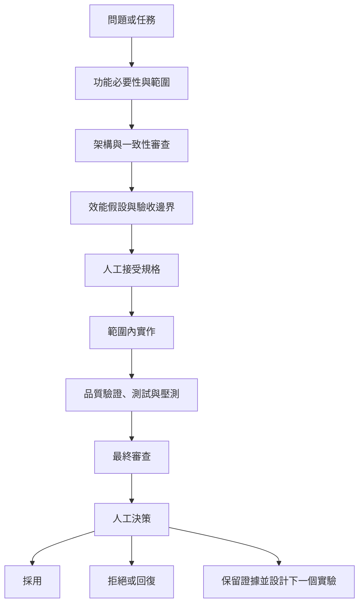

# EAP 證據驅動 AI 工程工作流

本文件是 EAP 專案唯一的 AI 工程協作權威說明。內容描述目前實際採用的多角色工作方式：如何討論功能是否值得做、如何限制 AI 與實作者的權限、如何設定壓測邊界，以及如何依一致性、效能與監測證據決定保留或否決修改。

EAP 同時具有連續雙向競價（CDA）與定時集合競價（TDA）功能；目前公開效能實驗與本文件中的吞吐量案例只驗證 CDA。角色審查必須阻止不同交易模式沿用彼此未驗證的可靠性或容量宣稱。

## 核心主張

AI 的價值不只在加速產生程式碼，而是協助個人開發者把直覺拆成可以被挑戰、被測量、也可能被否決的工程假設。

AI 的輸出只是決策輸入。AI 不能自行決定架構、接受風險、部署正式環境或發布效能宣稱。每個修改都必須經過基準、控制變因、測試、監測資料、正確性關卡與人工決策。被拒絕或無法判定的實驗也必須保留，避免日後在沒有新證據時重做不安全或無效的方案。

## 為什麼個人專案需要角色分離

個人開發時，同一個人很容易連續扮演需求提出者、架構師、實作者、測試者與審查者，最後只找支持原始想法的證據。EAP 以多角色 AI 工作流刻意切斷這條思考捷徑：

- 產品範圍角色先質疑功能是否有必要。
- 架構角色檢查服務責任歸屬、權威資料來源、事件流與一致性。
- 效能角色先定義測量邊界，再提出瓶頸假設。
- 實作角色只能修改人工已接受的範圍。
- 品質驗證與最終審查角色嘗試找出反例、競態、交易漏洞與錯誤宣稱。
- 人工負責人整合證據，決定採用、拒絕、回復或進行下一個實驗。

這些角色不等於真實組織中的獨立簽核者，也不能取代團隊審查。它們的作用是建立有順序、有權限限制、可以重複執行的自我審查程序。

## 實際工作流程



流程不是形式上的瀑布。任何角色發現前提不成立，都可以把工作退回前一階段；但不能在實作過程中悄悄改變架構、工作負載、完成定義或驗收門檻。

## 角色契約

| 角色 | 輸入 | 必須產出 | 可以修改檔案嗎 | 禁止事項 | 人工檢查點 |
| --- | --- | --- | --- | --- | --- |
| 產品範圍 | 問題、使用情境、目前能力、限制 | 建置／延後／刪除／縮小範圍決策，最小可行範圍、非目標、成功條件 | 預設不行 | 直接調校實作，或因為技術有趣就擴大範圍 | 人工確認功能必要性與優先順序 |
| 架構審查 | 已接受範圍、服務邊界、事件與資料責任歸屬 | 核准／有條件核准／拒絕，事件流、一致性風險、實作前阻擋項目 | 不行，預設唯讀 | 寫程式、產生修改，或用效能理由放棄資料正確性 | 人工接受服務責任歸屬、資料庫交易邊界與不變條件 |
| 效能分析 | 完成定義、基準、環境、架構限制、既有報告 | TPS 定義、成本模型、瓶頸假設、監測項目、單一主要變因與停止條件 | 不行，預設唯讀 | 混用不同工作負載，或把局部、短時間、同機結果當正式容量 | 人工接受實驗設計與宣稱邊界 |
| 實作負責人 | 已接受的架構與效能規格 | 小而可審查的程式、設定、資料庫變更或測試修改，以及實際驗證結果 | 可以，但只能改已接受範圍 | 靜默重設計、降低正確性關卡、覆蓋無關的既有修改 | 人工確認變更差異仍符合規格 |
| 品質驗證 | 規格、變更差異、失敗模型、壓測合約 | 驗收條件、測試矩陣、故障注入、實際執行命令與結果 | 預設唯讀；只有明確授權才寫測試 | 只測正常路徑、接受快取測試、忽略 RabbitMQ 佇列清空或錯誤率 | 人工確認測試確實執行且覆蓋主要風險 |
| 最終審查 | 規格、變更差異、測試、執行期證據、已知限制 | 依嚴重度排列的阻擋項目、非阻擋問題、效能風險與缺少測試 | 不行，預設唯讀 | 代替實作者重寫功能，或核准沒有證據的假設 | 人工處理阻擋項目並決定是否可採用 |
| 人工負責人 | 所有角色輸出與業務脈絡 | 採用、拒絕、回復、縮小範圍或下一個實驗 | 可以，或授權特定修改 | 把架構、風險、正式環境部署或公開宣稱交給 AI | 最終決策與責任歸屬 |

架構、效能、品質驗證與最終審查角色預設唯讀。實作負責人若發現規格本身有問題，必須停止並退回架構或效能審查，不能自行改變設計。

## 如何討論新功能是否有必要

新功能不直接從「能不能寫」開始，而先回答以下問題：

1. **解決什麼問題？** 是真實業務缺口、可靠性風險、效能瓶頸，還是只有技術展示需求？
2. **為什麼現在做？** 它是否阻擋目前目標，或只是未來可能使用的能力？
3. **最小可行範圍是什麼？** 哪些內容必須現在完成，哪些可以延後？
4. **由誰擁有？** 功能應屬於 Order、Wallet、MatchEngine、Trigger、AI Client、MCP 或 infra？誰是權威資料來源？
5. **改變哪些不變條件？** 是否新增資料庫交易邊界、事件順序、冪等、重試、DLQ 或資料回復要求？
6. **如何證明有價值？** 應以功能驗收、可靠性、可維運性、效能或領域能力中的哪一項衡量？
7. **不做有什麼代價？** 若沒有明確代價，優先考慮延後、刪除或縮小範圍。

產品範圍角色的輸出不是一律「做」，而是以下四種決策之一：

- **建置：** 問題明確，而且現在值得投入。
- **縮小後建置：** 只做能驗證核心價值的最小可行版本。
- **延後：** 有價值，但不是目前阻擋項目。
- **刪除：** 成本、耦合或維護負擔高於實際價值。

純效能任務可以簡化產品審查，但仍要說明改善哪一段業務完成流程。新產品功能必須先走產品範圍；涉及訊息佇列、資料庫交易、outbox 或跨服務一致性的修改，至少必須包含架構、效能、品質驗證與最終審查。

最近一次 AI-assisted 程式與文件核對也示範了這個邊界：TDA 已具備出價、驗資、收集與清算功能，但審查發現直接發布事件、出價重送冪等、驗資拒絕回授與整場競價收斂仍有缺口。因此決策是保留「已實作 TDA」的功能描述，同時拒絕把 CDA 的 outbox、可靠性與 TPS 證據套用到 TDA。這不是否定功能，而是把「可以執行」與「已證明可可靠運作」分開。

## 多代理如何實際運作

多代理不是每個任務都要啟用，也不是把完整對話複製給很多代理後等待共識。EAP 的實際規則如下：

- 只有在使用者要求平行分析，而且問題能拆成互不修改檔案的獨立審查時才使用子代理。
- 優先平行派出一至三個彼此獨立的唯讀角色，例如架構、效能與品質驗證；主代理保留整體脈絡與最終責任。
- 每個代理只收到精簡任務摘要：角色、禁止事項、精確問題、允許讀取的檔案、輸出長度與停止條件。
- 預設不傳遞完整歷史，避免代理被無關脈絡影響。
- 子代理不得再建立下一層代理，除非使用者明確要求。
- 唯讀代理不得修改檔案；實作只在規格被人工接受後開始。
- 子代理逾時時只要求一次立即總結；再次失敗便由主代理繼續，並記錄缺少哪一份審查。
- 主代理負責合併互相衝突的意見、執行最終修改、驗證結果與對外說明。

標準子代理任務應包含：

```text
角色：架構審查／效能分析／品質驗證／最終審查
禁止：不得修改檔案、不得建立子代理、不得擴大題目
問題：一個可以明確回答的工程問題
脈絡：必要的基準、限制與目標檔案
輸出：決策、證據、風險、下一步與停止條件
```

這種安排的目的不是增加代理數量，而是讓不同觀點在實作前後形成可追溯的反對意見。

## 一次功能擴充如何走完流程

近期 Order 交易投影問題可說明這個模式：

1. **問題：** 混合 HTTP 壓測中，Order 的投影尚未就緒時會延後交易套用，造成持久化積壓。
2. **範圍：** 目標不是刪除投影，而是不讓可重建的讀取模型阻擋主要交易完成路徑。
3. **架構：** MatchEngine 已產生持久化交易事實，Order 應把命令端交易套用與投影就緒狀態分離；無法立即套用的事件必須有持久化 `inbox` 與補償程序，不能只靠記憶體重試。
4. **效能：** 使用同一混合 HTTP 合約，比較完成速率、積壓斜率、Order outbox／inbox 積壓與三服務收斂，不能用 SQL 隔離測試取代全鏈證據。
5. **實作：** 實作持久化 `inbox`、補償程序、明確的 `rejected`／`not-ready` 狀態與資料庫產生的寫入時間，只修改已接受的責任邊界。
6. **品質驗證：** 驗證重複事件、延遲、重新投遞、投影尚未完成、服務重啟、三服務相同 `trade_id` 與最終清空。
7. **審查與人工決策：** 正確性阻擋項目必須先修；即使最終都能收斂，若量測期間積壓持續成長，仍不能宣稱容量通過。

這段工作最終形成 [Order `376a4e1`](https://github.com/Yitin-tsai/eap-order/commit/376a4e181e278d2ab594e7b694aee0b87132f56e) 的持久化交易套用與完整生命週期壓測能力。文件只宣稱「AI 輔助分析與審查」；若沒有保存提案來源，不會把設計歸功於 AI。

## 壓測開始前先定義邊界

EAP 不先看 TPS 數字，而先說明測量的是哪一條邊界。

### 指標邊界

- **排程輸入速率：** 壓測產生器嘗試送出的 orders/s。
- **HTTP 接受速率：** Order API 實際接受的 orders/s。
- **訊息確認速率：** RabbitMQ 發布確認完成的輸入速率。
- **訂單簿進入速率：** 合格訂單進入 MatchEngine 訂單簿的速率。
- **BUY 觸發完成速率：** 依序測試先準備賣方流動性，再由 BUY 訂單觸發完成的 trades/s。
- **同窗完成速率：** 測量時間窗內實際完成的 trades/s。
- **完整流程速率：** 從測量開始，到三服務資料收斂且指定 RabbitMQ 佇列清空為止所得的 trades/s。

這些數字名稱不同，分母與起點也不同，不能互換。

### 工作負載邊界

| 類型 | 用途 | 不能宣稱什麼 |
| --- | --- | --- |
| 元件隔離測試 | 測單一 SQL、Redis Lua 或局部元件上限 | 不能代表跨服務完成容量 |
| 已確認訂單完成鏈 | 跳過完整 HTTP 接收流程，從已確認訂單開始 | 不能代表使用者完整下單流程 |
| 依序完整 HTTP | 先建立一側流動性，再量另一側觸發成交 | 只能作上限診斷，不能代表雙邊混合市場 |
| 隨機混合 HTTP | BUY／SELL 以固定隨機種子混合進入完整 HTTP 流程 | 可找較真實的短時間容量邊界，但仍不是長期 SLA |
| 階梯式測試 | 以固定間距逐級增加 orders/s | 用於找第一個不可持續階段，不代表每階段都能長期維持 |
| 穩態測試 | 暖機後以固定速率觀察完成量與積壓斜率 | 短時間通過不能自動視為長時間測試通過 |
| 長時間測試 | 長時間固定速率，要求最終積壓收斂 | 同機通過仍不是正式環境容量保證 |
| 深度診斷 | 高頻採集 CPU、RabbitMQ、DB、WAL、連線池與計時資料 | 會產生觀測者效應，不能直接取代低觀測容量測試 |

隨機種子、使用者數、到達模式、執行設定、暖機時間、測量時間窗、清空逾時、壓測產生器位置與各儲存庫版本，都是工作負載合約的一部分。任何一項不同，都必須先判斷是否仍能進行同條件 A/B 比較。

## 完整業務交易正確性關卡

對 EAP 而言，HTTP 200、MatchEngine 產生交易或 RabbitMQ 佇列最後清空，都不足以單獨證明成功。完整交易至少要求：

- 目標數量的持久化 `TradeExecuted` 交易事實已寫入 MatchEngine。
- Order 命令端已套用相同交易。
- Wallet 已完成相同交易的資產結算。
- MatchEngine、Order、Wallet 的 `trade_id` 集合完全相同。
- 買賣雙方資產與保留額核對正確。
- 重複事件、冪等與訂單重複使用檢查通過。
- 指定 RabbitMQ `ready`／`unacked`、持久化寄件匣（outbox）、收件匣（inbox）與 DLQ 積壓歸零。
- 有效資產保留、訂單簿與應歸零的鎖定資產已收斂。
- 壓測產物保存版本、參數、時間窗、錯誤與限制。

投影是可重建的讀取模型，因此投影延遲可以是監測指標，但不能阻擋命令端的業務完成；反之，也不能因投影最後追上，就忽略命令路徑在測量期間累積的持久化積壓。

## 容量關卡與停止條件

壓測是否通過，不只看最後有沒有全部完成。每次執行前應固定：

- 目標排程／接受 orders/s 與允許誤差。
- HTTP 逾時、429、503 與其他錯誤上限。
- 測量時間窗內的完成率下限。
- 積壓最大值與積壓斜率上限。
- p95／p99 延遲或明確的直方圖上限。
- RabbitMQ 佇列、DLQ、持久化寄件匣、收件匣與資產保留的最終清空條件。
- 三服務資料與資產核對。
- 是否需要多個隨機種子、重複執行範圍、長時間測試或外部壓測產生器。

若輸入速率沒有達標，即使完成 TPS 很高也不能宣稱目標容量通過。若最後全部收斂，但測量時間窗內積壓持續成長，該速率仍是不具持續性的失敗點。若正確性關卡失敗，該次執行只能作診斷，不能納入效能平均。

## 如何決定保留、拒絕或繼續調查

### 採用

修改只有在以下條件同時成立時才能採用：

- 基準與候選方案使用同一工作負載合約。
- 單一主要變因清楚，其他差異已記錄。
- 測試確實執行，不是快取或未觸發目標路徑。
- 正確性關卡全部通過。
- 完整流程吞吐量、延遲、積壓或資源證據支持假設。
- 改善不是由降低輸入、延長清空時間、關閉必要功能或增加不安全風險取得。
- 人工負責人接受取捨、限制與回復方式。

### 拒絕或回復

以下任一情況足以拒絕修改：

- 資料庫交易、資產、冪等、重複事件、DLQ 或資料一致性失敗。
- 只有隔離測試 TPS 變好，但完整流程無改善或變差。
- 積壓、WAL、鎖競爭、RabbitMQ 佇列或尾端延遲惡化。
- 不同工作負載、隨機種子、時間長度或執行設定被錯當成 A/B。
- 監測負擔、同機 CPU 或壓測產生器限制使歸因失真。
- 增加併行度、批次大小或連線池容量只移動瓶頸，沒有通過業務關卡。
- 無法提供可重現命令、實驗產物或程式版本。

### 無法判定

當結果互相衝突、觀測本身干擾測試、壓測產生器沒有達到輸入目標，或尚無法區分程式與主機限制時，狀態必須標成「無法判定」，而不是挑最好的一次當成果。此時保留：

- 完整參數與程式版本。
- 成功與失敗樣本。
- 已知觀測者效應或量測缺陷。
- 下一個只改一項變因的實驗。
- 明確停止條件。

## 標準實驗紀錄模板

```markdown
## 實驗：<名稱>

- 問題：
- 業務完成定義：
- 不可退讓的正確性條件：
- 基準：<程式版本、環境、工作負載、時間窗、結果>
- 假設：
- AI 的角色與貢獻：<AI 輔助分析與審查，或來源未記錄>
- 實作前的人工決策：
- 單一主要變因：
- 程式或設定修改：
- 測試與壓測命令：
- 監測證據：
- 正確性關卡：
- 結果：
- 決定：<採用／拒絕／無法判定>
- 回復方式或後續：
- 相關 commit 與實驗產物：
```

若現有紀錄無法確認構想由誰提出，就寫「來源未記錄」。只有證據確定時才描述 AI 提案；否則統一使用「AI 輔助分析與審查」。

## 真實案例一：採用撮合訂單保留清理批次化

TPS169 的依序完整 HTTP 基準，會為每筆撮合訂單保留清理各執行一次 `UPDATE`。BUY 觸發完成速率為 `664.26 trades/s`，最大積壓為 `14110`，MatchEngine 到 Wallet 的 p95 延遲為 `13.624s`。

AI 輔助效能分析與審查，協助驗證「逐筆清理造成寫入放大，進而延遲共同完成路徑」的假設；原始批次化構想的提出者沒有被記錄。實作保留可持久化、可重試的撮合訂單保留清理任務，只把已取得處理權的清理任務改為批次完成，使約 `30000` 次逐筆更新降為約 `32` 次批次陳述式。

同一合約下的候選方案達到 `922.38 BUY 觸發 trades/s`，最大積壓降至 `6261`，MatchEngine 到 Wallet 的 p95 延遲降至 `4.478s`。修改前後都通過三服務相同的 30K `trade_id`、資產正確，以及訂單簿、資產保留、RabbitMQ 佇列與 DLQ 清空關卡。

這項修改被採用，不是因為單一 SQL 計時變快，而是完整流程的吞吐量、延遲、積壓與正確性證據都朝相同方向改善。它仍是預先準備 SELL 流動性的 **依序上限工作負載**，不是雙邊混合流量的正式環境容量。證據見 [效能報告](performance-report.md#30k-schema-v2-cleanup-optimization) 與 MatchEngine 提交紀錄 [`69908e2`](https://github.com/Yitin-tsai/eap-matchEngine/commit/69908e2aa7665791542205cd9da70978c0035429)。

## 真實案例二：拒絕 Wallet 自動提交

Wallet 實驗移除事件監聽器外層的明確資料庫交易。在 30K 隔離測試中，以 8 個並行工作執行緒處理時，結算吞吐量從 `11799.16` 提升到 `20405.04 settlements/s`，約 `+72.9%`；全鏈 Wallet 資料庫交易平均時間從 `21.13ms` 降至 `9.26ms`。

但 Java 後置條件是在 SQL 陳述式回傳後，才確認結算紀錄與兩個 Wallet 更新是否全部成功。使用陳述式自動提交時，錯誤結果已經提交，Java 驗證失敗也不能回復。強制重新執行 PostgreSQL 整合測試後，還重現買賣角色對調時的 Wallet 死結；先前顯示無須重跑的測試，並不是新修改的有效證據。

因此高 TPS 版本被拒絕。現行版本恢復每個事件一個明確資料庫交易，以固定 Wallet UUID 順序鎖定資料列，並增加 Wallet 不存在、賣方餘額不足，以及買賣角色對調的併行測試。隔離測試的 `20405.04 settlements/s` 與舊 `900 orders/s` 結果只能保留為已拒絕版本與歷史診斷，不能當成現行容量。

這個案例說明：不論最佳化由 AI 或工程師提出，只要資料庫交易邊界不安全，就必須讓正確性證據否決較高 TPS。證據見 [Wallet 穩健性報告](benchmarks/2026-08-05-wallet-settlement-robustness.md#wallet-boundary-experiment-and-correction)、[效能報告](performance-report.md#2026-08-05-wallet-boundary-and-repeated-steady-state) 與 Wallet 修正提交紀錄 [`a5065d6`](https://github.com/Yitin-tsai/eap-wallet/commit/a5065d6b4eb54daead8357495e8b2bfe5f2dbc84)。

## 近期案例三：從排程假設到一致性否決

2026-08-07 的現行混合 HTTP 工作樹測試，先用單一 700 orders/s 階段確認新的使用者輪替方式不再產生人工 429：`17500/17500` HTTP 訂單被接受，`8750` 筆交易在三服務完全一致，完整流程為 `320.47 trades/s`。

接著以相同隨機種子執行 deep 階梯診斷。700 階通過，800 階只有 `167.93 trades/s` 的同窗完成量，最大積壓升至 `4090`，因此未達容量關卡；但停止輸入後，`37500` 筆訂單與 `18750` 筆交易仍全部正確收斂。這代表它是「測量窗內不可持續」，不是資料遺失。

監測資料顯示 MatchEngine 的 Spring 排程器只有 1 條執行緒，而撮合訂單保留清理單批最慢 `9.380s`；Order 與 Wallet 的 p95 持久化延遲同時約為 `7.38s`。AI 輔助分析與審查將單一變因縮小為「隔離清理與交易事件外送排程」。相同隨機種子的受控比較中，800 階段從 `167.93` 提升到 `383.45 trades/s`，最大積壓從 `4090` 降到 `246`，而且 `18750` 筆交易通過完整正確性關卡，因此採用排程隔離。

但後續擴大階梯時，700、800、900 階段雖通過測量窗關卡，最終核對卻發現 1 張買單被撮合 2 次，導致 MatchEngine 比 Order 與 Wallet 多 1 筆交易，並留下 1 筆 DLQ。整次執行因此被正確性關卡否決，連同看似較高的 900 階段數字都不能成為容量宣稱。

追查後確認，撮合訂單保留修復工作以跨程序時間戳推測對應交易，可能把已成交訂單誤判為孤兒並放回訂單簿。修正後，每個 Redis 撮合訂單保留狀態直接記錄預期的 `tradeId`，清理與修復必須核對相同識別碼才能修改。修正後的 52500 筆訂單全部收斂為三服務一致的 26250 筆交易，資產、訂單簿、撮合訂單保留、佇列與 DLQ 均歸零；600 與 700 階段通過，800 階段仍未達效能關卡。

這個案例同時保留「採用」與「否決」：採用有完整證據支持的排程隔離，否決未通過最終一致性檢查的高 TPS 結果，並把公開混合流量下界維持在 700 orders/s。證據見 [2026-08-07 現行混合流量診斷](benchmarks/2026-08-07-canonical-mixed-http-diagnostic.md)。

## 一致性、效能、監測與決策

| 面向 | EAP 證據 | 主要角色責任 |
| --- | --- | --- |
| 一致性 | 三服務 `trade_id` 集合相等、資產核對、冪等、資料庫交易邊界、重試／DLQ | 架構、品質驗證、最終審查 |
| 效能 | 壓測合約、TPS、完成比例、積壓斜率、DB／WAL、延遲 | 效能分析 |
| 監測 | RabbitMQ `ready`／`unacked`、DLQ、Hikari、PostgreSQL 等待狀態、應用程式計時器、Grafana／Prometheus | 效能分析、品質驗證 |
| 決策 | 採用／拒絕／無法判定的實驗、回復方式、後續任務 | 人工負責人 |

監測不是免費的旁觀者。同機 CPU 飽和時，高頻 SQL 掃描、RabbitMQ 管理介面輪詢與深度診斷會搶走被測系統資源。因此低觀測容量測試與深度診斷測試是不同的證據類型：深度診斷可以解釋瓶頸，但不能直接取代它干擾過的容量結果。

## 對應企業工程流程

| EAP 工作流 | 企業實務 |
| --- | --- |
| 問題與必要性 | Jira、GitHub Issue、事件紀錄、變更請求 |
| 架構決策 | ADR、RFC、設計審查 |
| 受限 AI 角色 | 最小必要脈絡存取、核准工具、資料邊界 |
| 範圍內實作 | 限定範圍的程式分支與 PR |
| 品質驗證與正確性關卡 | CI、整合測試、故障注入、發布條件 |
| 壓測產物 | 發布產物、儀表板、測試報告 |
| 人工決策 | Code Owner、變更核准、發布權限 |
| 已拒絕實驗 | PR 評論、ADR、決策紀錄、回復紀錄 |

這套方法也可用於同步 API、批次系統、ETL 與既有系統重構，不依賴電力交易、RabbitMQ、Codex 或特定 AI 供應商。可泛化的是角色邊界、可否證假設、控制變因、正確性優先與人工負責。

## 企業治理限制

- 不將正式環境密鑰、客戶資料或公司內部程式碼提供給未核准的 AI。
- 每個 AI 角色只能取得完成其任務所需的最小脈絡、檔案與工具。
- AI 沒有正式環境部署權限，也不能接受營運、法遵或資安風險。
- 公開數據與技術宣稱必須由工程師確認來源、程式版本、工作負載邊界、限制與可重現性。
- 採用、拒絕與無法判定的實驗都應進入決策紀錄，不能只保留成功案例。

## 公開證據來源

- [系統架構](architecture.md)
- [壓測分類與邊界](benchmarks/load-test-taxonomy.md)
- [效能權威報告](performance-report.md)
- [Wallet 結算穩健性報告](benchmarks/2026-08-05-wallet-settlement-robustness.md)
- [平衡混合 HTTP 階梯式壓測報告](benchmarks/2026-08-04-balanced-mixed-http-staircase.md)
- [2026-08-07 現行混合流量診斷](benchmarks/2026-08-07-canonical-mixed-http-diagnostic.md)

## 實際工作流工件

以下技能檔案不是文件中的假想角色，而是專案內可重複使用的 Codex 工作流定義。每份技能都限制角色責任、禁止事項、輸出格式與完成條件：

- [產品範圍審查](../skills/eap-product-scope/SKILL.md)
- [架構審查](../skills/eap-architect-review/SKILL.md)
- [效能分析](../skills/eap-performance-review/SKILL.md)
- [實作負責人](../skills/eap-implementation-lead/SKILL.md)
- [品質驗證](../skills/eap-qa-lead/SKILL.md)
- [最終審查](../skills/eap-reviewer/SKILL.md)
- [完整功能流程](../skills/eap-feature-pipeline/SKILL.md)

這些工件讓角色契約可以直接被執行與審查；但技能仍不具有人工簽核、正式環境部署或公開宣稱的權限。
