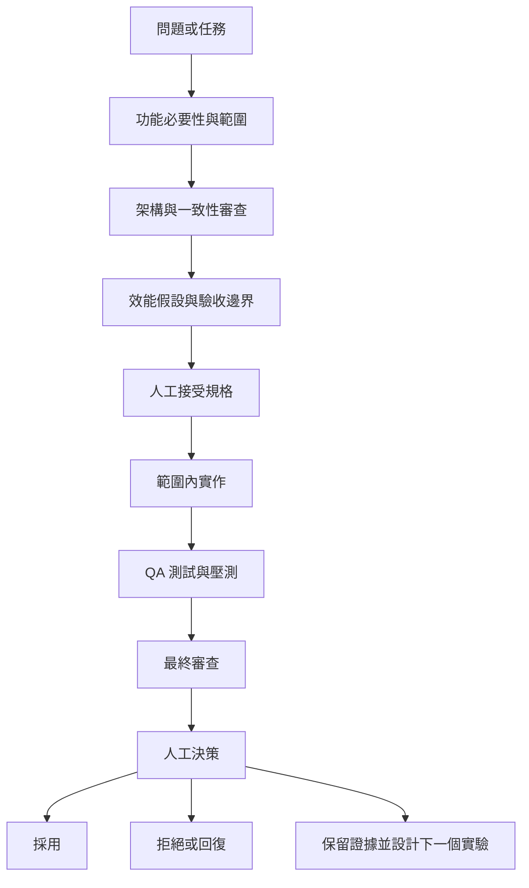

# EAP 證據驅動 AI 工程工作流

本文件是 EAP 專案唯一的 AI 工程協作權威說明。內容描述目前實際採用的多角色工作方式：如何討論功能是否值得做、如何限制 AI 與實作者的權限、如何設定壓測邊界，以及如何依一致性、效能與監測證據決定保留或否決修改。

## 核心主張

AI 的價值不只在加速產生程式碼，而是協助個人開發者把直覺拆成可以被挑戰、被測量、也可能被否決的工程假設。

AI 的輸出只是決策輸入。AI 不能自行決定架構、接受風險、部署正式環境或發布效能宣稱。每個修改都必須經過基準、控制變因、測試、監測資料、正確性關卡與人工決策。被拒絕或無法判定的實驗也必須保留，避免日後在沒有新證據時重做不安全或無效的方案。

## 為什麼個人專案需要角色分離

個人開發時，同一個人很容易連續扮演需求提出者、架構師、實作者、測試者與審查者，最後只找支持原始想法的證據。EAP 以多角色 AI 工作流刻意切斷這條思考捷徑：

- 產品範圍角色先質疑功能是否有必要。
- 架構角色檢查服務 ownership、source of truth、事件流與一致性。
- 效能角色先定義測量邊界，再提出瓶頸假設。
- 實作角色只能修改人工已接受的範圍。
- QA 與 Reviewer 嘗試找出反例、競態、交易漏洞與錯誤宣稱。
- 人工負責人整合證據，決定採用、拒絕、回復或進行下一個實驗。

這些角色不等於真實組織中的獨立簽核者，也不能取代團隊審查。它們的作用是建立有順序、有權限限制、可以重複執行的自我審查程序。

## 實際工作流程



流程不是形式上的瀑布。任何角色發現前提不成立，都可以把工作退回前一階段；但不能在實作過程中悄悄改變架構、workload、完成定義或驗收門檻。

## 角色契約

| 角色 | 輸入 | 必須產出 | 可以修改檔案嗎 | 禁止事項 | 人工檢查點 |
| --- | --- | --- | --- | --- | --- |
| 產品範圍 | 問題、使用情境、目前能力、限制 | 建置／延後／刪除／縮小範圍決策，MVP、非目標、成功條件 | 預設不行 | 直接調校實作，或因為技術有趣就擴大範圍 | 人工確認功能必要性與優先順序 |
| 架構審查 | 已接受範圍、服務邊界、事件與資料 ownership | 核准／有條件核准／拒絕，事件流、一致性風險、實作前阻擋項目 | 不行，預設唯讀 | 寫程式、產生 patch、用效能理由放棄資料正確性 | 人工接受服務 ownership、transaction boundary 與不變條件 |
| 效能分析 | 完成定義、基準、環境、架構限制、既有報告 | TPS 定義、成本模型、瓶頸假設、監測項目、單一主要變因與停止條件 | 不行，預設唯讀 | 混用不同 workload，或把局部、短時間、同機結果當正式容量 | 人工接受實驗設計與宣稱邊界 |
| 實作負責人 | 已接受的架構與效能規格 | 小而可審查的程式、設定、migration 或測試修改，以及實際驗證結果 | 可以，但只能改已接受範圍 | 靜默重設計、降低 correctness gate、覆蓋無關的既有修改 | 人工確認 diff 仍符合規格 |
| QA 驗證 | 規格、diff、失敗模型、壓測合約 | 驗收條件、測試矩陣、failure injection、實際執行命令與結果 | 預設唯讀；只有明確授權才寫測試 | 只測 happy path、接受快取測試、忽略 queue drain 或錯誤率 | 人工確認測試確實執行且覆蓋主要風險 |
| 最終審查 | 規格、diff、測試、runtime evidence、已知限制 | 依嚴重度排列的 blocker、非阻擋問題、效能風險與缺少測試 | 不行，預設唯讀 | 代替實作者重寫功能，或核准沒有證據的假設 | 人工處理 blocker 並決定是否可採用 |
| 人工負責人 | 所有角色輸出與業務脈絡 | 採用、拒絕、回復、縮小範圍或下一個實驗 | 可以，或授權特定修改 | 把架構、風險、production deployment 或公開宣稱交給 AI | 最終決策與責任歸屬 |

架構、效能、QA 與 Reviewer 預設唯讀。實作負責人若發現規格本身有問題，必須停止並退回架構或效能審查，不能自行改變設計。

## 如何討論新功能是否有必要

新功能不直接從「能不能寫」開始，而先回答以下問題：

1. **解決什麼問題？** 是真實業務缺口、可靠性風險、效能瓶頸，還是只有技術展示需求？
2. **為什麼現在做？** 它是否阻擋目前目標，或只是未來可能使用的能力？
3. **最小可行範圍是什麼？** 哪些內容必須現在完成，哪些可以延後？
4. **由誰擁有？** 功能應屬於 Order、Wallet、MatchEngine、Trigger、AI Client、MCP 或 infra？誰是 source of truth？
5. **改變哪些不變條件？** 是否新增 transaction boundary、事件順序、冪等、retry、DLQ 或資料回復要求？
6. **如何證明有價值？** 應以功能驗收、可靠性、可維運性、效能或領域能力中的哪一項衡量？
7. **不做有什麼代價？** 若沒有明確代價，優先考慮延後、刪除或縮小範圍。

產品範圍角色的輸出不是一律「做」，而是以下四種決策之一：

- **建置：** 問題明確，而且現在值得投入。
- **縮小後建置：** 只做能驗證核心價值的 MVP。
- **延後：** 有價值，但不是目前阻擋項目。
- **刪除：** 成本、耦合或維護負擔高於實際價值。

純效能任務可以簡化產品審查，但仍要說明改善哪一段業務完成流程。新產品功能必須先走產品範圍；涉及 MQ、資料庫、transaction、outbox 或跨服務一致性的修改，至少必須包含架構、效能、QA 與 Reviewer。

## 多代理如何實際運作

多代理不是每個任務都要啟用，也不是把完整對話複製給很多代理後等待共識。EAP 的實際規則如下：

- 只有在使用者要求平行分析，而且問題能拆成互不修改檔案的獨立審查時才使用子代理。
- 優先平行派出一至兩個唯讀角色，例如架構與效能；主代理保留整體脈絡與最終責任。
- 每個代理只收到精簡 brief：角色、禁止事項、精確問題、允許讀取的檔案、輸出長度與停止條件。
- 預設不傳遞完整歷史，避免代理被無關脈絡影響。
- 子代理不得再建立下一層代理，除非使用者明確要求。
- 唯讀代理不得修改檔案；實作只在規格被人工接受後開始。
- 子代理逾時時只要求一次立即總結；再次失敗便由主代理繼續，並記錄缺少哪一份審查。
- 主代理負責合併互相衝突的意見、執行最終修改、驗證結果與對外說明。

標準子代理任務應包含：

```text
角色：架構審查／效能分析／QA／Reviewer
禁止：不得修改檔案、不得建立子代理、不得擴大題目
問題：一個可以明確回答的工程問題
脈絡：必要的基準、限制與目標檔案
輸出：決策、證據、風險、下一步與停止條件
```

這種安排的目的不是增加代理數量，而是讓不同觀點在實作前後形成可追溯的反對意見。

## 一次功能擴充如何走完流程

近期 Order trade projection 問題可說明這個模式：

1. **問題：** mixed HTTP 壓測中，Order 的 projection 尚未 ready 時會延後 trade application，造成 durable backlog。
2. **範圍：** 目標不是刪除 projection，而是不讓可重建 read model 阻擋主要交易完成路徑。
3. **架構：** MatchEngine 已產生 durable trade fact，Order 應把 command-side trade application 與 projection readiness 分離；無法立即套用的事件必須有 durable inbox 與 reconciler，不能只靠記憶體重試。
4. **效能：** 使用同一 mixed HTTP contract 比較 completion、backlog slope、Order outbox/inbox debt 與三服務收斂，不能用 isolated SQL 取代全鏈證據。
5. **實作：** 實作 durable inbox、reconciler、明確的 rejected／not-ready 狀態與資料庫 insertion timestamp，只修改已接受的責任邊界。
6. **QA：** 驗證 duplicate、延遲、重新投遞、projection 未 ready、服務重啟、三服務相同 `trade_id` 與最終 drain。
7. **審查與人工決策：** correctness blocker 必須先修；即使最終都能收斂，若量測期間 backlog 持續成長，仍不能宣稱容量通過。

這段工作最終形成 [Order `376a4e1`](https://github.com/Yitin-tsai/eap-order/commit/376a4e181e278d2ab594e7b694aee0b87132f56e) 的 durable trade application 與 lifecycle load-test 能力。文件只宣稱 AI-assisted analysis/review；若沒有保存提案來源，不會把設計歸功於 AI。

## 壓測開始前先定義邊界

EAP 不先看 TPS 數字，而先說明測量的是哪一條邊界。

### 指標邊界

- **排程輸入速率：** load generator 嘗試送出的 orders/s。
- **HTTP 接受速率：** Order API 實際接受的 orders/s。
- **Broker confirmed 速率：** RabbitMQ publisher confirm 完成的輸入速率。
- **Order book admission：** 合格訂單進入 MatchEngine order book 的速率。
- **BUY-triggered completion：** sequential 測試在賣方流動性已準備後，BUY phase 觸發完成的 trades/s。
- **同窗完成速率：** measurement window 內實際完成的 trades/s。
- **完整流程速率：** 從測量開始，到三服務資料收斂且指定 queues drain 的 completed trades/s。

這些數字名稱不同，分母與起點也不同，不能互換。

### 工作負載邊界

| 類型 | 用途 | 不能宣稱什麼 |
| --- | --- | --- |
| isolated benchmark | 測單一 SQL、Redis Lua 或局部元件上限 | 不能代表跨服務完成容量 |
| seeded matched completion | 跳過完整 HTTP admission，從已確認訂單開始 | 不能代表使用者完整下單流程 |
| sequential full HTTP | 先建立一側流動性，再量另一側觸發成交 | 只能作上限診斷，不能代表雙邊混合市場 |
| shuffled mixed HTTP | BUY／SELL 以固定 seed 混合進入完整 HTTP 流程 | 可找較真實的短時間容量邊界，但仍不是長期 SLA |
| staircase | 以固定間距逐級增加 orders/s | 用於找第一個不可持續階段，不代表每階段都能長期維持 |
| steady state | warmup 後以固定速率觀察 completion 與 backlog slope | 短時間通過不能自動升級為 soak 結論 |
| soak | 長時間固定速率，要求最終 debt 收斂 | 同機通過仍不是 production 容量保證 |
| deep diagnostic | 高頻採集 CPU、Rabbit、DB、WAL、pool 與 timer | 會有 observer effect，不能直接取代低觀測 capacity run |

seed、使用者數、arrival pattern、runtime profile、warmup、measurement window、drain timeout、load generator 位置與 repository commits 都是 workload 的一部分。任何一項不同，都必須先判斷是否仍能做同 contract A/B。

## 完整業務交易正確性關卡

對 EAP 而言，HTTP 200、MatchEngine 產生 trade 或 queue 最後清空，都不足以單獨證明成功。完整交易至少要求：

- 目標數量的 `TradeExecuted` durable facts 已寫入 MatchEngine。
- Order command side 已套用相同交易。
- Wallet 已完成相同交易的資產結算。
- MatchEngine、Order、Wallet 的 `trade_id` 集合完全相同。
- 買賣雙方資產與 reservation reconciliation 正確。
- duplicate、idempotency 與 order reuse 檢查通過。
- 指定 RabbitMQ ready／unacked、outbox、inbox 與 DLQ debt 歸零。
- active reservations、order book 與應歸零的鎖定資產已收斂。
- benchmark artifact 保存 revision、參數、時間窗、錯誤與限制。

Projection 是可重建 read model，因此 projection lag 可以是監測指標，但不能阻擋 command-side business completion；反之，也不能因 projection 最後追上就忽略 command path 在測量期間累積的 durable debt。

## 容量關卡與停止條件

壓測是否通過，不只看最後有沒有全部完成。每個 run 在開始前應固定：

- 目標 offered／accepted orders/s 與允許誤差。
- HTTP timeout、429、503 與其他錯誤上限。
- measurement window 內的完成率下限。
- backlog 最大值與 backlog slope 上限。
- p95／p99 latency 或明確 histogram bound。
- queue、DLQ、outbox、inbox 與 reservation 的 final drain 條件。
- 三服務資料與資產 reconciliation。
- 是否需要多 seed、repeat range、長時間 soak 或外部 load generator。

若輸入速率沒有達標，即使完成 TPS 很高也不能宣稱目標容量通過。若最後全部收斂，但 measurement window 內 backlog 持續成長，該速率仍是不具持續性的失敗點。若 correctness gate 失敗，該 run 只能作診斷，不能納入效能平均。

## 如何決定保留、拒絕或繼續調查

### 採用

修改只有在以下條件同時成立時才能採用：

- baseline 與 candidate 使用同一 workload contract。
- 單一主要變因清楚，其他差異已記錄。
- 測試確實執行，不是快取或未觸發目標路徑。
- correctness gate 全部通過。
- 完整流程 throughput、latency、backlog 或 resource evidence 支持假設。
- 改善不是由降低輸入、延長 drain、關閉必要功能或增加不安全風險取得。
- 人工負責人接受 trade-off、限制與 rollback 方式。

### 拒絕或回復

以下任一情況足以拒絕修改：

- transaction、資產、冪等、duplicate、DLQ 或資料一致性失敗。
- 只有 isolated TPS 變好，但完整流程無改善或變差。
- backlog、WAL、lock contention、queue debt 或 tail latency 惡化。
- 不同 workload、seed、duration 或 runtime profile 被錯當成 A/B。
- 監測負擔、同機 CPU 或 load generator 限制使歸因失真。
- 增加 concurrency、batch 或 pool 只移動瓶頸，沒有通過業務 gate。
- 無法提供可重現命令、artifact 或 revision。

### 無法判定

當結果互相衝突、觀測本身干擾測試、driver 沒有達到輸入目標，或尚無法區分 code 與 host 限制時，狀態必須標成「無法判定」，而不是挑最好的一次當成果。此時保留：

- 完整參數與 revision。
- 成功與失敗樣本。
- 已知 observer effect 或量測缺陷。
- 下一個只改一項變因的實驗。
- 明確停止條件。

## 標準實驗紀錄模板

```markdown
## 實驗：<名稱>

- 問題：
- 業務完成定義：
- 不可退讓的正確性條件：
- 基準：<revision、環境、workload、時間窗、結果>
- 假設：
- AI 的角色與貢獻：<AI-assisted analysis/review，或來源未記錄>
- 實作前的人工決策：
- 單一主要變因：
- 程式或設定修改：
- 測試與壓測命令：
- 監測證據：
- 正確性關卡：
- 結果：
- 決定：<採用／拒絕／無法判定>
- 回復方式或後續：
- 相關 commit 與 artifact：
```

若現有紀錄無法確認構想由誰提出，就寫「來源未記錄」。只有證據確定時才描述 AI 提案；否則統一使用「AI-assisted analysis/review」。

## 真實案例一：採用 reservation cleanup batching

TPS169 sequential full-HTTP baseline 對每筆 reservation cleanup 執行一次 `UPDATE`，BUY-triggered completion 為 `664.26 trades/s`，最大 backlog `14110`，Match-to-Wallet p95 `13.624s`。

AI-assisted 效能分析與審查協助驗證「逐筆 cleanup write amplification 延遲共同完成路徑」的假設；原始 batching 構想的提出者沒有被記錄。實作保留 durable、retryable cleanup task，只把完成標記改成 claimed batch 一次處理，約 `30000` 次逐筆更新降為約 `32` 次 batch statements。

同 contract candidate 達到 `922.38 BUY-triggered trades/s`，最大 backlog 降至 `6261`，Match-to-Wallet p95 降至 `4.478s`。前後都通過三服務相同 30K `trade_id`、資產正確、book／reservation／queue／DLQ drain。

這項修改被採用，不是因為單一 SQL timer 變快，而是完整流程 throughput、latency、backlog 與 correctness evidence 同方向改善。它仍是預先準備 SELL 流動性的 **sequential upper-bound workload**，不是 mixed-flow production capacity。證據見 [效能報告](performance-report.md#30k-schema-v2-cleanup-optimization) 與 MatchEngine commit [`69908e2`](https://github.com/Yitin-tsai/eap-matchEngine/commit/69908e2aa7665791542205cd9da70978c0035429)。

## 真實案例二：拒絕 Wallet autocommit

Wallet 實驗移除 listener 外層 explicit transaction。isolated 30K、八 worker settlement 從 `11799.16` 提升到 `20405.04 settlements/s`，約 `+72.9%`；full-chain Wallet transaction mean 從 `21.13ms` 降至 `9.26ms`。

但 Java postcondition 在 SQL statement 回傳後才確認 settlement row 與兩個 wallet updates 是否全部成功。使用 statement autocommit 時，錯誤結果已經提交，Java 驗證失敗也不能 rollback。強制重新執行 PostgreSQL integration test 還重現 reversed-role wallet deadlock；先前顯示 up-to-date 的測試不是新修改的有效證據。

因此高 TPS 版本被拒絕。現行版本恢復每個 event 一個 explicit transaction，以固定 wallet UUID 順序鎖定資料列，並增加 missing wallet、insufficient seller balance 與 reversed-role concurrency tests。isolated `20405.04 settlements/s` 與舊 900 orders/s 結果只能保留作 rejected／historical diagnostics，不能當 current capacity。

這個案例說明：不論最佳化由 AI 或工程師提出，只要 transaction boundary 不安全，就必須讓 correctness evidence 否決較高 TPS。證據見 [Wallet robustness report](benchmarks/2026-08-05-wallet-settlement-robustness.md#wallet-boundary-experiment-and-correction)、[效能報告](performance-report.md#2026-08-05-wallet-boundary-and-repeated-steady-state) 與 Wallet corrective commit [`a5065d6`](https://github.com/Yitin-tsai/eap-wallet/commit/a5065d6b4eb54daead8357495e8b2bfe5f2dbc84)。

## 一致性、效能、監測與決策

| 面向 | EAP 證據 | 主要角色責任 |
| --- | --- | --- |
| 一致性 | 三服務 `trade_id` equality、資產 reconciliation、冪等、transaction boundary、retry／DLQ | 架構、QA、Reviewer |
| 效能 | benchmark contract、TPS、completion ratio、backlog slope、DB／WAL、latency | 效能分析 |
| 監測 | RabbitMQ ready／unacked、DLQ、Hikari、PostgreSQL wait、application timer、Grafana／Prometheus | 效能分析、QA |
| 決策 | accepted／rejected／inconclusive experiment、rollback、follow-up ticket | 人工負責人 |

監測不是免費的旁觀者。同機 CPU 飽和時，高頻 SQL 掃描、RabbitMQ management polling 與 deep diagnostics 會搶走被測系統資源。因此低觀測 capacity run 與 deep diagnostic run 是不同證據類型：deep run 可以解釋瓶頸，但不能直接取代它干擾過的容量結果。

## 對應企業工程流程

| EAP 工作流 | 企業實務 |
| --- | --- |
| 問題與必要性 | Jira、GitHub Issue、incident、change request |
| 架構決策 | ADR、RFC、design review |
| 受限 AI 角色 | least-context access、核准工具、資料邊界 |
| 範圍內實作 | scoped branch、pull request |
| QA 與 correctness gate | CI、integration test、failure injection、release criteria |
| benchmark artifact | release artifact、dashboard、test report |
| 人工決策 | Code Owner、change approval、release authority |
| rejected experiment | PR comment、ADR、decision log、rollback record |

這套方法也可用於同步 API、批次系統、ETL 與既有系統重構，不依賴電力交易、RabbitMQ、Codex 或特定 AI vendor。可泛化的是角色邊界、可否證假設、控制變因、正確性優先與人工負責。

## 企業治理限制

- 不將 production secrets、客戶資料或公司內部程式碼提供給未核准的 AI。
- 每個 AI 角色只能取得完成其任務所需的最小脈絡、檔案與工具。
- AI 沒有 production deployment authority，也不能接受營運、法遵或資安風險。
- 公開數據與技術宣稱必須由工程師確認來源、revision、workload boundary、限制與可重現性。
- accepted、rejected 與 inconclusive experiments 都應進入 decision log，不能只保留成功案例。

## 公開證據來源

- [系統架構](architecture.md)
- [壓測分類與邊界](benchmarks/load-test-taxonomy.md)
- [效能權威報告](performance-report.md)
- [Wallet settlement robustness](benchmarks/2026-08-05-wallet-settlement-robustness.md)
- [Balanced mixed HTTP staircase](benchmarks/2026-08-04-balanced-mixed-http-staircase.md)
