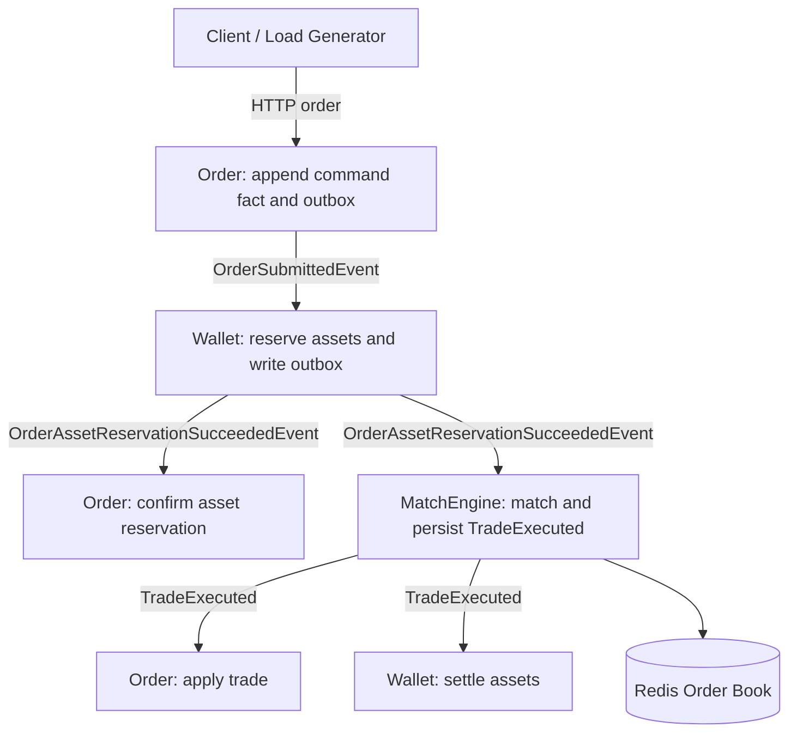
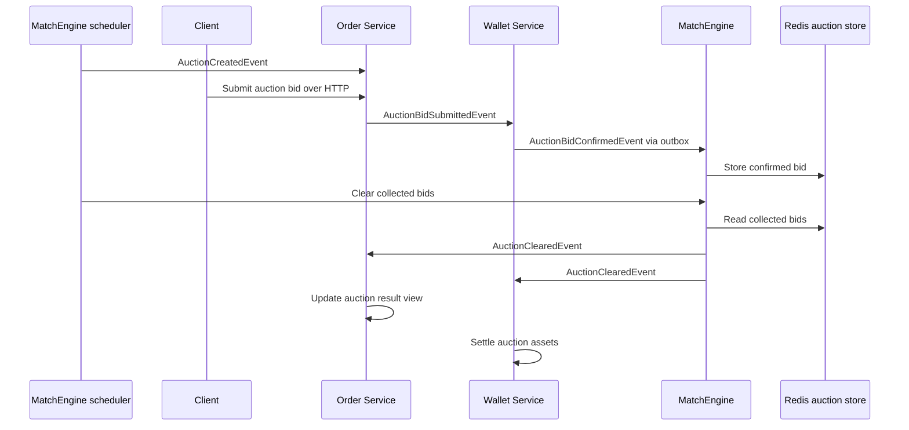
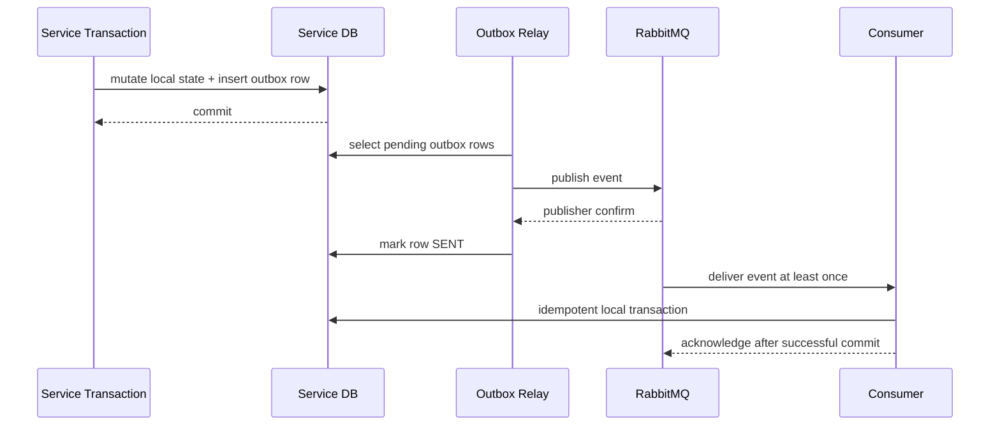
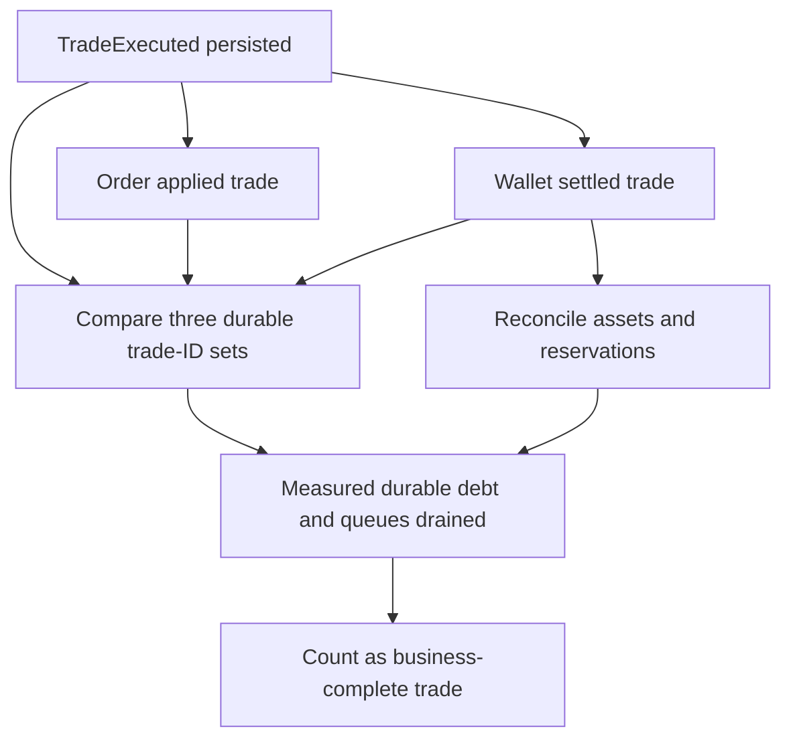
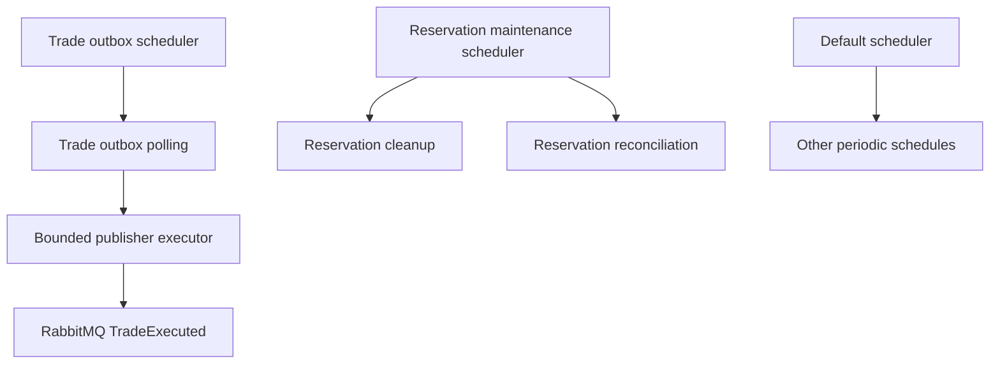

**English** | **[繁體中文](architecture.zh-TW.md)**

# EAP Architecture

EAP is an event-driven electricity market backend with Continuous Double Auction (CDA) and Timed Double Auction (TDA) paths. Its architecture is intentionally organized around transaction ownership, event reliability, and measurable completion semantics rather than service count.

## Architecture Goals

- Keep trade execution facts append-only and auditable.
- Avoid distributed transactions across Order, Wallet, and MatchEngine.
- Preserve correctness under RabbitMQ at-least-once delivery.
- Separate command-side facts from rebuildable read projections.
- Make throughput claims measurable through business completion gates.

## Continuous Double Auction Flow

```text
Client / Load Generator
  |
  v
Order Service
  - validates command shape
  - appends order command event
  - writes order outbox
  |
  v
Wallet Service
  - reserves buyer/seller assets
  - writes wallet state and outbox
  |
  v
MatchEngine
  - stores open orders in Redis ZSET
  - executes atomic matching through Lua
  - persists TradeExecuted facts
  - writes trade outbox
  |
  +--> Order Service applies TradeExecuted
  |
  +--> Wallet Service settles TradeExecuted

Operational verification
  - compares MatchEngine, Order, and Wallet durable trade facts outside the transaction path
  - reconciles assets and reservations
  - verifies measured queues, DLQ, outbox/inbox, and cleanup retry debt are drained
```



This is the current business-completion and capacity-test path. All public completed-trade TPS values in this repository refer to this CDA flow unless a report explicitly defines another workload.

## Timed Double Auction Flow

TDA accepts stepped bids during an auction session and clears them as a batch on a MatchEngine schedule:



The implemented TDA path does not yet have the same evidence boundary as CDA. It is a functional market-mode implementation with the following current gaps:

- Order persists an auction bid, then publishes `AuctionBidSubmittedEvent` directly; this is a database/RabbitMQ dual write.
- Wallet atomically reserves assets and writes `AuctionBidConfirmedEvent` to its outbox, but the bid consumer has no durable message-idempotency claim. A sequential redelivery can reserve the same bid again.
- Wallet reservation failure returns without a rejection event, leaving Order without a terminal reservation result.
- MatchEngine directly publishes `AuctionCreatedEvent` and `AuctionClearedEvent`; auction lifecycle publication does not use the CDA trade outbox.
- Order catches auction-result processing exceptions inside its listener, and Wallet continues after individual settlement failures. Broker redelivery alone therefore cannot prove whole-auction convergence.
- No TDA benchmark currently verifies bid/result equality, auction asset reconciliation, retry debt, and final queue drain as one completion contract.

The CDA throughput, queue-drain, outbox, and three-service `trade_id` claims must not be generalized to TDA. Closing these gaps requires a separate architecture decision and correctness campaign, not a documentation-only promotion.

## Service Ownership

| Service | Source of Truth | Not Responsible For |
| --- | --- | --- |
| Order | CDA order command lifecycle, order event stream, order trade application; TDA bid entry and result view | wallet balance, trade execution fact ownership |
| Wallet | CDA/TDA balances and reservations, CDA settlement ledger, TDA settlement, wallet outbox | order lifecycle source of truth, matching or auction clearing |
| MatchEngine | CDA order book, matching decision and `TradeExecuted`; TDA bid collection, scheduling and clearing | wallet mutation, order projection, downstream completion state |
| Common | event and DTO contracts | business state ownership |
| MCP / AI Client | controlled operational tools and agent experiments | core transaction correctness |
| Trigger | conditional-order experiment | core transaction path or current capacity claim; its code still consumes the retired `order.matched` contract and is not connected to the current flow |

## Transaction Boundaries

EAP avoids a single distributed transaction. In the CDA core path, a transition that must emit an integration event commits its local state and outbox atomically, then publishes asynchronously. Terminal Order trade application and Wallet settlement persist local results without emitting completion callbacks.

```text
local DB transaction:
  mutate service-owned state
  write outbox row
commit
outbox relay:
  publish event
  wait for broker confirm
  mark outbox row SENT
```

This design accepts eventual consistency and makes retries explicit. Duplicate messages are expected and handled through database-backed idempotency. MatchEngine additionally commits a reservation-cleanup task with the trade when deferred Redis cleanup is required; this is local retry state, not a downstream completion marker.



If the relay crashes after publisher confirm but before marking `SENT`, the event can be published again. This is an expected failure mode. Downstream consumers must absorb duplicates through idempotency keys and unique constraints.

The diagram describes the CDA reliability contract and Wallet's TDA bid-confirmation publication. Order's TDA bid submission and MatchEngine's TDA lifecycle publications are current exceptions and are listed as an explicit gap above; they must not inherit the outbox guarantee by documentation alone.

## Completion Semantics

A trade is not counted as business-complete when the MatchEngine only emits `TradeExecuted`. The current business gate requires:

1. MatchEngine persisted `TradeExecuted`.
2. Order persisted the corresponding command-side trade application.
3. Wallet persisted the corresponding settlement and the resulting assets reconcile.
4. MatchEngine, Order, and Wallet contain the same durable `trade_id` set.
5. RabbitMQ ready and unacked messages, the DLQ, and measured durable debt drained to zero.

Order projection lag cannot rewrite an already durable command-side trade because the projection is rebuildable. It still matters to whole-system sustained capacity: user-visible state and durable inbox work must not fall progressively behind. The benchmark therefore reports the trade-completion gate separately from read-model and inbox convergence, and requires both before claiming that the complete service chain is sustainable.

MatchEngine does not receive Order or Wallet completion callbacks. Each downstream service owns its durable result, retry state, idempotency, and failure handling. Full-flow verification compares the three service-owned durable tables outside the transaction path; it does not create another business state inside MatchEngine.



## Reliability Controls

| Risk | Control |
| --- | --- |
| DB commit succeeds but event publish fails | transactional outbox |
| duplicate RabbitMQ delivery | unique constraints and idempotent consumers |
| consumer fails before acknowledgement | local transaction rollback or idempotent replay; explicit manual ACK is used only by listeners configured for it |
| poison message blocks queue | DLX / DLQ and retry state |
| projection falls behind | checkpointed projector and lag metrics |
| downstream application is delayed | service-owned retry/inbox state, DLQ alerts, and external durable-fact reconciliation |
| Redis reservation cleanup is interrupted | durable cleanup task plus reservation reconciler |
| benchmark observer effect | light/deep diagnostics levels and queue-first sampling |

## Current Scaling Boundary

The current bottleneck is not one isolated service operation. Redis/Lua matching, combined Match processing, RabbitMQ-to-Match intake, TradeExecuted fanout, and Match relay plus downstream application all run materially faster in their isolated diagnostics than the complete mixed HTTP flow. These probes rule out a standalone ceiling; they do not remove those components from the integrated path.

- `TradeExecuted` persistence and trade outbox relay.
- Order trade application and event-store writes.
- Wallet reservation/confirmation outbox and trade settlement.
- Service-owned idempotency, retry, and reliability writes.

The 2026-08-07 deep mixed HTTP diagnostic exposed an additional MatchEngine scheduling boundary. Spring reported one `taskScheduler` worker while reservation cleanup, trade outbox polling, reservation reconciliation, and auction jobs shared that scheduler. A cleanup invocation reached `9.380s`; Match-to-Order and Match-to-Wallet p95 lag rose together to about `7.38s`. MatchEngine now separates the trade-outbox scheduler from reservation maintenance and retains a default scheduler for other periodic work.



The same-seed controlled A/B improved the 800-stage completion rate from `167.93` to `383.45 trades/s` and reduced maximum backlog from `4090` to `246`, with exact final convergence. Scheduler isolation is therefore current architecture. Later repeats did not make 800 a stable capacity point, so this is an adopted scheduling fix rather than a higher public capacity claim.

The 2026-08-14 isolated boundary campaign then measured the real Match listener at up to `918.46 persisted trades/s`, direct downstream Order/Wallet fanout at up to `1972.77 durable trades/s`, and pre-seeded Match relay plus downstream convergence at `2125.20-2521.07 trades/s`. All are short component diagnostics with `capacityClaimAllowed=false`. In the canonical mixed HTTP recheck, `600 orders/s` passed 3 valid seeds, `624` passed 2 and failed 1, and `648` passed only 1 short sample with elevated HTTP tail latency and transient backlog. Two later 624 long-window runs passed, followed by two release-pinned `648 orders/s` 15-minute runs at `315.96` and `314.84 same-window trades/s`. Both 648 runs converged exactly, establishing that historical revision's same-host lower-bound class at `648 accepted orders/s`; their `4001-4907` maximum backlog, higher tail latency, pool pressure, and high shared-host CPU make this a pressure boundary rather than comfortable capacity.

Redis resting-order reservations also carry the exact durable `tradeId` they are expected to produce. Cleanup, compensation, and orphan reconciliation present that ID to Lua before changing the reservation. This prevents an old cleanup or a timestamp-based false negative from releasing a consumed order or deleting a newer reservation for the same order ID.

The remaining pressure appears only when HTTP admission, reservation, confirmation, matching, relays, settlement, three databases, RabbitMQ, JVMs, monitoring, and the load generator compete on the same host. The 648 long repeats reached Order command-pool pending peaks of `90` and `91`, Wallet pending peaks of `25`, and system CPU averages of roughly `85-88%`. Their full-lifecycle rates remained in the same `301-310 trades/s` range as 624 despite the higher accepted input. These are pressure signals rather than proof that a larger pool is the fix. A later low-external-observability repeat matched the accepted run through its first half but degraded late; because the generator's exact one-second durable-count monitor remained active and resource diagnostics were absent, it is inconclusive for attribution. A prepared-sync diagnostic moved deterministic schedule and JSON construction outside the traffic clock and calibrated at `1999.98 requests/s` against a no-op endpoint, but its full-chain 1200/2000 probes still missed offered-load gates. The external Vegeta driver subsequently removed the Java driver's scheduling ambiguity and passed a short equivalence sandwich at 648, but it did not create additional service capacity. A release-pinned 20-minute 700 run supplied all `882000` requests and converged exactly, yet completed only `240.01 same-window trades/s` and required about `844.93s` of post-input drain. RabbitMQ backlog alone did not expose this service-owned debt. The next decisive step is per-stage durable-debt measurement before another high-cost capacity repeat; a separate load-generator host remains necessary only when testing beyond the same-host boundary.

The 2026-09-03 reliability revision adds Wallet, Order, and Match durable inboxes plus separate Order execution/reservation state, so the historical 648 number does not transfer. With an explicit Order reservation-result inbox level/slope gate, one k6 long-window seed passes at `200 orders/s` and `100 trades/s`. The 300 and 400 runs eventually converge correctly but accumulate at least 51K and 53K service-owned inbox rows, so both are rejected as whole-system sustained capacity. The current bottleneck is the sustained drain rate of Order's reservation-result worker and projector. See the [current-version campaign](benchmarks/2026-09-03-current-version-full-chain.md).

## Why Not Split More Services Now

Splitting Order into more services or adding more databases would not remove the fundamental write cost of order state, settlement state, outbox rows, and idempotency gates. It would add consistency and reconciliation cost before the existing SQL/write model is fully optimized.

The current architecture keeps the service boundaries stable and focuses tuning on hot-path SQL, outbox relay behavior, and batching where it does not change business semantics.

## Order Book Source of Truth

Redis is the hot matching state, not the long-term audit source of truth. PostgreSQL keeps command-side order facts and `TradeExecuted` facts. If the Redis generation is lost or cannot be trusted, the intended recovery path is to stop both order admission and cancellation arbitration, rebuild the open order book and processing fences from durable order, trade, and cancellation facts, verify the rebuilt state, and only then resume consumers.

The future extension point is a MatchEngine readiness gate in front of both RabbitMQ listeners. It will own a `READY` or `RECOVERING` generation state and prevent either event type from bypassing reconstruction. The current scope does not implement automatic full-book rebuild or claim that matching may continue after Redis state loss; it deliberately avoids adding a PostgreSQL lookup to every steady-state order as a partial substitute.

## Price-Time Priority

The matching engine uses Redis sorted sets and Lua scripts so add-order, match, and partial-fill operations are atomic inside Redis. Price priority is encoded in sorted-set ordering; time priority depends on stable sequence/timestamp ordering inside the score/member design.

The current architecture intentionally keeps one matching authority per market/product path. Horizontal scaling should shard by market/product rather than letting multiple workers mutate the same order book without a sequencer.

## RabbitMQ Ordering Scope

RabbitMQ ordering is treated as queue-scoped, not global. Once multiple consumers are enabled, the system does not rely on broker-level total ordering for correctness. Business correctness is protected through:

- single matching authority for matching decisions;
- idempotent local consumers;
- unique constraints for duplicate delivery;
- service-owned idempotency that tolerates Order-before-Wallet and Wallet-before-Order completion.

Any future per-account or per-market strict ordering requirement should be implemented as an explicit partitioning/sequencing design, not as an implicit RabbitMQ assumption.

## Optional Control-Plane Modules

`eap-mcp` and `eap-ai-client` expose controlled backend tools and local AI experiments. They do not participate in order acceptance, reservation, matching, settlement, or benchmark completion. Their availability cannot affect whether a trade is correct.

`eap-trigger` is also outside the core path. Its current Go implementation still listens for the retired `order.matched` event and therefore must be migrated to a Trigger-owned `TradeExecutedEvent` queue before it can be described as integrated. Until that migration and end-to-end tests exist, it is a learning module rather than an active platform capability.

## Shared Contract Versioning

`eap-common` is convenient for a personal multi-repo project, but it creates compile-time coupling between services. The intended production direction is:

- additive event changes by default;
- explicit event names and versions, such as `TradeExecutedV1`;
- consumers tolerate unknown fields;
- breaking changes require a new event version and a migration window.

## Backpressure Policy

If input stays above completed capacity, queue lag will grow. The production policy should prefer bounded admission over unbounded queue growth:

- reject or rate-limit new order intake when downstream queues exceed thresholds;
- report accepted throughput and completed throughput separately;
- keep final queue drain as part of benchmark acceptance;
- expose queue backlog over time, not only final zero backlog.

## CDA Cancellation Arbitration

Cancellation is an asynchronous business decision rather than a synchronous delete.
Order accepts a cancellation request with HTTP `202`, appends
`OrderCancellationRequestedV1` and an outbox record atomically, and leaves the order's
tradable state unchanged until MatchEngine returns a durable result. The request carries
the immutable original order amount derived from Order's command state. This is distinct
from the mutable unmatched remainder that MatchEngine may later remove from Redis after
one or more partial fills.

MatchEngine is the sole cancellation arbiter:

1. It first persists a `PENDING` recovery record in
   `match_engine.order_cancellations`, then records a Redis cancellation intent. The
   database row makes an interrupted request discoverable; it is not itself an
   admission fence.
2. Redis owns the cancellation linearization points. For an order not yet admitted,
   the intent is checked by the same Lua boundary that performs admission. For a
   visible resting order, cancellation Lua and matching Lua compete to remove the same
   ZSET member. Whichever Redis operation wins determines whether cancellation blocks
   admission, removes the remainder, or loses to matching. Normal
   `OrderAssetReservationSucceededEvent` admission does not query the cancellation table.
3. For an open resting order, cancellation succeeds only when the cancellation Lua
   script actually removes one ZSET member. The script returns the exact removed
   order snapshot. An order already removed into a match reservation cannot also be
   reported as cancelled.
4. A request interrupted before the Redis intent, or one that loses to an in-flight
   admission or reservation, remains pending. Reconciliation restores the intent and
   waits while admission is still processing. Workers claim rows with `SKIP LOCKED`, a
   bounded lease, and exponential retry delay so multiple instances do not repeatedly
   process the same unresolved cancellation. It then follows a visible remainder or a
   durable trade and emits `CANCELLED`, `ALREADY_MATCHED`, or `NOT_OPEN` through the
   transactional outbox. The durable decision stores both the immutable original amount
   and the exact cancelled remainder; replay identity uses the former, while Order and
   Wallet apply the latter.

Wallet treats MatchEngine's atomic cancellation result as the authoritative fact for
the exact unmatched quantity. Order submissions and cancellation results are first
stored in `wallet_service.message_inbox`; a listener ACK represents durable intake,
then a leased worker classifies and retries processing. Wallet derives the asset delta,
applies it once, and stores only a cancellation application keyed by both cancellation
ID and order ID. Normal order reservation and trade settlement do not maintain a second
order-state projection inside Wallet.

Because trade settlement consumes the matched quantity and cancellation releases the
disjoint remainder, either delivery order converges to the same balances. Order stores
cancellation results in a durable inbox. If a result arrives before an earlier trade has
updated command state, it remains `PENDING_PREREQUISITE`. Applying MatchEngine's
`CANCELLED` result appends `OrderCancellationAcceptedV1` and moves Order to
`CANCELLING`; it no longer claims final completion at this point.

Wallet atomically commits the cancellation application, balance update, release
publication guard, `OrderAssetReservationReleasedEvent` outbox, and Wallet inbox
`APPLIED` state. Order receives this Wallet-owned fact through another durable inbox;
an early release is deferred until the accepted cancellation is visible, after which
`OrderCancellationCompletedV1` moves the lifecycle to `CANCELLED`. The release event
contains workflow identity and released quantity, not Wallet balances or table shape.
`ALREADY_MATCHED` converges through the normal trade event, while `NOT_OPEN` without a
durable trade remains visible consistency debt.

Focused PostgreSQL and Redis integration tests cover atomic cancellation versus
reservation, duplicate results, conflicting identities, and both cancellation/trade
delivery orders. The cross-service HTTP lifecycle also exercises open-order,
partial-fill, and bounded concurrent match/cancel scenarios. These are correctness
tests, not a cancellation-heavy capacity benchmark. The published CDA throughput
boundary still excludes cancellation-heavy
traffic until a separately defined workload and full-lifecycle gate are recorded.
The ownership decision, rejected Wallet projection, and post-change regression
evidence are recorded in the
[2026-08-24 cancellation report](benchmarks/2026-08-24-cancellation-ownership-and-regression.md).

Cancellation is also a useful capacity and system-design scenario: repeated requests still
consume HTTP, Redis, and database work even when the business command is idempotent, while
many unique open orders create real arbitration and release work. The current Order endpoint
uses `userId` for a local rate-limit example and leaves a replaceable policy boundary for
account quotas, open-order limits, cancellation-ratio controls, or queue-aware admission.
Those controls are discussion and extension points rather than the current learning project's
deployment backlog. They also do not replace atomic arbitration or idempotency guarantees.

This boundary deliberately trusts MatchEngine's immutable cancellation fact in the same
way Wallet trusts `TradeExecuted`. Wallet still owns balance calculation, non-negative
guards, transaction rollback, and idempotent application; MatchEngine does not command
an absolute Wallet balance. This keeps cancellation-only persistence off the normal
order and trade write paths while preserving replay and out-of-order convergence.
