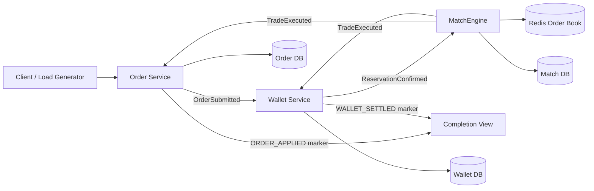
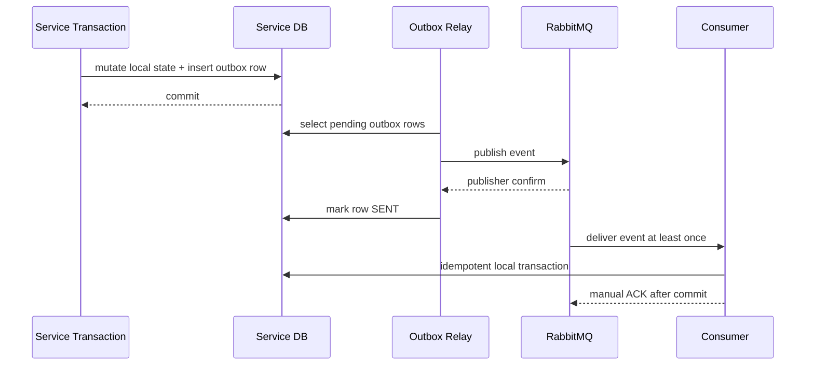
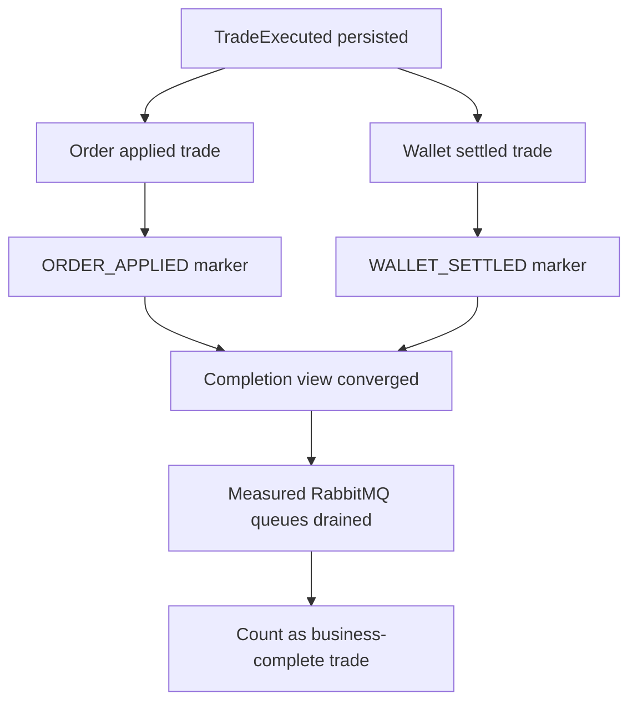

# EAP Architecture

EAP is an event-driven electricity market backend. Its architecture is intentionally organized around transaction ownership, event reliability, and measurable completion semantics rather than service count.

## Architecture Goals

- Keep trade execution facts append-only and auditable.
- Avoid distributed transactions across Order, Wallet, and MatchEngine.
- Preserve correctness under RabbitMQ at-least-once delivery.
- Separate command-side facts from rebuildable read projections.
- Make throughput claims measurable through business completion gates.

## High-Level Flow

```text
Client / Load Generator
  |
  v
Order Service
  - validates command shape
  - appends order command event
  - writes order outbox
  |
  v
Wallet Service
  - reserves buyer/seller assets
  - writes wallet state and outbox
  |
  v
MatchEngine
  - stores open orders in Redis ZSET
  - executes atomic matching through Lua
  - persists TradeExecuted facts
  - writes trade outbox
  |
  +--> Order Service applies TradeExecuted
  |
  +--> Wallet Service settles TradeExecuted
  |
  v
MatchEngine completion view
  - receives ORDER_APPLIED marker
  - receives WALLET_SETTLED marker
  - marks trade complete after both sides converge
```



## Service Ownership

| Service | Source of Truth | Not Responsible For |
| --- | --- | --- |
| Order | order command lifecycle, order event stream, order trade application | wallet balance, trade execution fact ownership |
| Wallet | balances, reservations, settlement ledger, wallet outbox | order lifecycle source of truth, matching |
| MatchEngine | order book, matching decision, `TradeExecuted`, completion view | wallet mutation, order projection |
| Common | event and DTO contracts | business state ownership |
| MCP / AI Client | controlled operational tools and agent experiments | core transaction correctness |
| Trigger | conditional-order experiment | current core TPS target |

## Transaction Boundaries

EAP avoids a single distributed transaction. Each service commits its own state and outbox atomically, then publishes integration events asynchronously.

```text
local DB transaction:
  mutate service-owned state
  write outbox row
commit
outbox relay:
  publish event
  wait for broker confirm
  mark outbox row SENT
```

This design accepts eventual consistency and makes retries explicit. Duplicate messages are expected and handled through database-backed idempotency.



If the relay crashes after publisher confirm but before marking `SENT`, the event can be published again. This is an expected failure mode. Downstream consumers must absorb duplicates through idempotency keys and unique constraints.

## Completion Semantics

A trade is not counted as business-complete when the MatchEngine only emits `TradeExecuted`. The current business gate requires:

1. MatchEngine persisted `TradeExecuted`.
2. Order consumed the trade and applied it to command-side order state.
3. Wallet consumed the trade and settled balances.
4. MatchEngine completion view received both `ORDER_APPLIED` and `WALLET_SETTLED` markers.
5. RabbitMQ ready and unacked messages drained to zero for the measured queues.

Order projection lag is reported separately. It is not part of the command-side business gate because projections are rebuildable read models.



## Reliability Controls

| Risk | Control |
| --- | --- |
| DB commit succeeds but event publish fails | transactional outbox |
| duplicate RabbitMQ delivery | unique constraints and idempotent consumers |
| consumer crashes before ACK | manual ACK after local transaction |
| poison message blocks queue | DLX / DLQ and retry state |
| projection falls behind | checkpointed projector and lag metrics |
| benchmark observer effect | light/deep diagnostics levels and queue-first sampling |

## Current Scaling Boundary

The current bottleneck is not Redis matching. Redis Lua matching has a much higher isolated throughput than the completed E2E flow. The limiting path is the database-backed reliability model around:

- `TradeExecuted` persistence and trade outbox relay.
- Order trade application and event-store writes.
- Wallet settlement and wallet outbox relay.
- Completion marker convergence.

This is a useful architecture result: the system currently trades raw throughput for clear ownership, replayability, and duplicate-safe settlement.

## Why Not Split More Services Now

Splitting Order into more services or adding more databases would not remove the fundamental write cost of order state, settlement state, outbox rows, and idempotency gates. It would add consistency and reconciliation cost before the existing SQL/write model is fully optimized.

The current architecture keeps the service boundaries stable and focuses tuning on hot-path SQL, outbox relay behavior, and batching where it does not change business semantics.

## Order Book Source of Truth

Redis is the hot matching state, not the long-term audit source of truth. PostgreSQL keeps command-side order facts and `TradeExecuted` facts. If Redis state is lost, the intended recovery path is to rebuild the open order book from durable order/trade facts and reject or pause matching while rebuilding.

The current benchmark focuses on hot-path matching and completion throughput. A production release would need an explicit Redis rebuild runbook and recovery test.

## Price-Time Priority

The matching engine uses Redis sorted sets and Lua scripts so add-order, match, and partial-fill operations are atomic inside Redis. Price priority is encoded in sorted-set ordering; time priority depends on stable sequence/timestamp ordering inside the score/member design.

The current architecture intentionally keeps one matching authority per market/product path. Horizontal scaling should shard by market/product rather than letting multiple workers mutate the same order book without a sequencer.

## RabbitMQ Ordering Scope

RabbitMQ ordering is treated as queue-scoped, not global. Once multiple consumers are enabled, the system does not rely on broker-level total ordering for correctness. Business correctness is protected through:

- single matching authority for matching decisions;
- idempotent local consumers;
- unique constraints for duplicate delivery;
- completion markers that tolerate Order-before-Wallet and Wallet-before-Order arrival.

Any future per-account or per-market strict ordering requirement should be implemented as an explicit partitioning/sequencing design, not as an implicit RabbitMQ assumption.

## Shared Contract Versioning

`eap-common` is convenient for a personal multi-repo project, but it creates compile-time coupling between services. The intended production direction is:

- additive event changes by default;
- explicit event names and versions, such as `TradeExecutedV1`;
- consumers tolerate unknown fields;
- breaking changes require a new event version and a migration window.

## Backpressure Policy

If input stays above completed capacity, queue lag will grow. The production policy should prefer bounded admission over unbounded queue growth:

- reject or rate-limit new order intake when downstream queues exceed thresholds;
- report accepted throughput and completed throughput separately;
- keep final queue drain as part of benchmark acceptance;
- expose queue backlog over time, not only final zero backlog.
