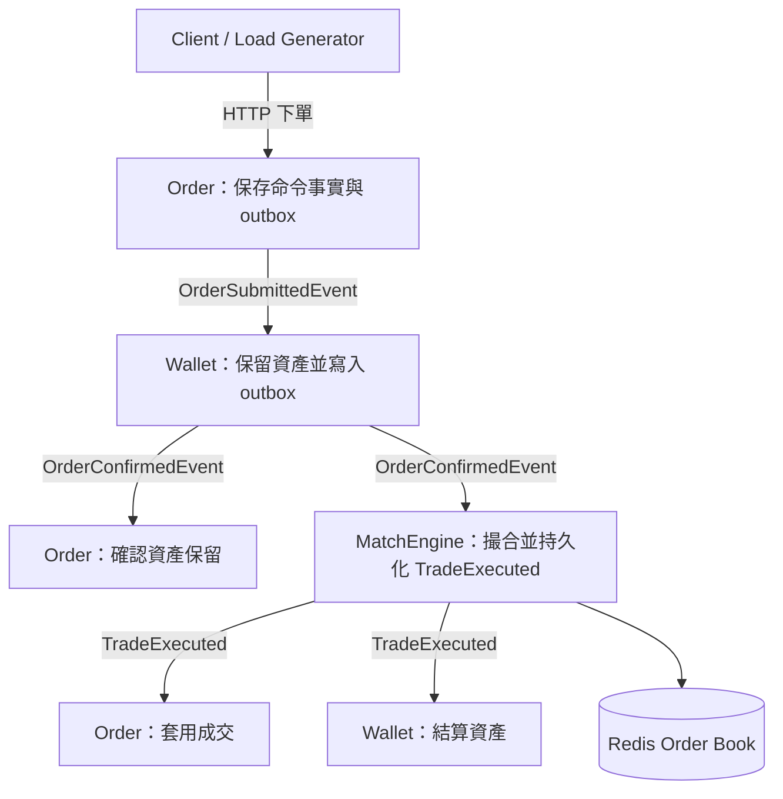
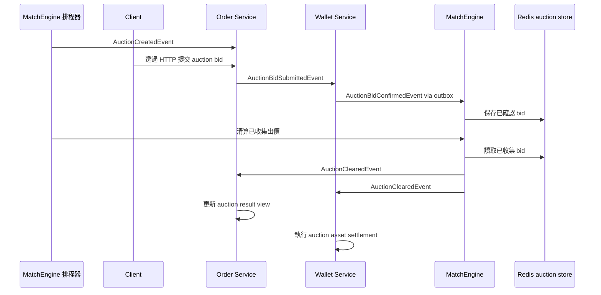
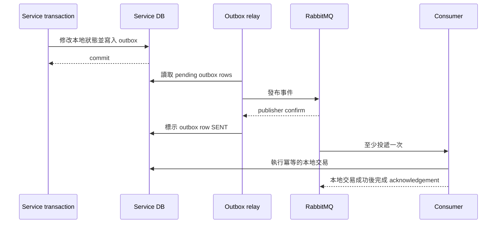
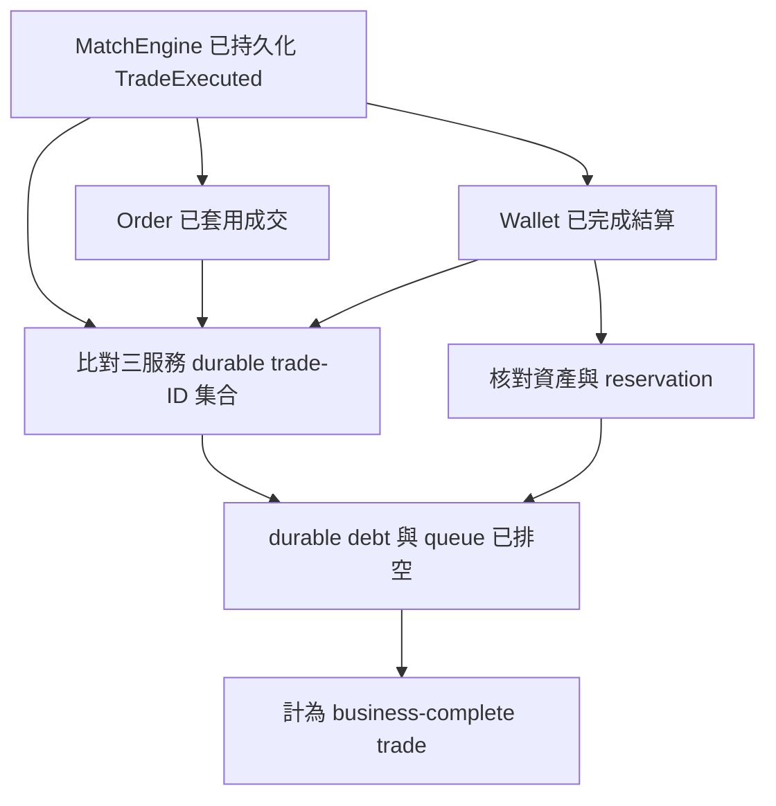
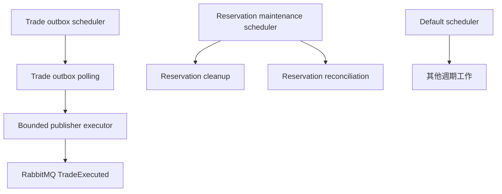

**[English](architecture.md)** | **繁體中文**

# EAP 系統架構

EAP 是一套事件驅動的電力市場後端，包含連續雙向競價（Continuous Double Auction，CDA）與定時集合競價（Timed Double Auction，TDA）兩條流程。架構不是以服務數量為目標，而是圍繞交易責任、事件可靠性與可量測的完成語意設計。

> 本文件的 Mermaid 圖使用 VS Code 內建預覽可支援的 `graph` 與 `sequenceDiagram` 語法。請用「Markdown: Open Preview」或 `Cmd+Shift+V` 開啟，不要使用一般文字編輯畫面判斷是否成功。如果 VS Code 1.121 以上仍無法顯示，可停用已被官方標示為 deprecated 的 `bierner.markdown-mermaid` 擴充套件後執行「Developer: Reload Window」；新版 VS Code 已內建 Mermaid 支援。

## 架構目標

- 讓成交事實保持 append-only 且可稽核。
- 避免在 Order、Wallet 與 MatchEngine 之間使用分散式交易。
- 在 RabbitMQ at-least-once delivery 下維持正確性。
- 分離命令端事實與可重建的讀取 projection。
- 以完整業務交易的正確性關卡衡量吞吐量，而不是只看單一服務數字。

## 連續雙向競價流程

```text
Client / Load Generator
  |
  v
Order Service
  - 驗證命令格式
  - append 訂單命令事件
  - 寫入 Order outbox
  |
  v
Wallet Service
  - 保留買方或賣方資產
  - 寫入 Wallet 狀態與 outbox
  |
  v
MatchEngine
  - 在 Redis ZSET 保存未成交訂單
  - 透過 Lua 在單一 Redis 操作內撮合
  - 持久化 TradeExecuted 事實
  - 寫入 Trade outbox
  |
  +--> Order Service 套用 TradeExecuted
  |
  +--> Wallet Service 結算 TradeExecuted

交易路徑外的驗證
  - 比對 MatchEngine、Order、Wallet 的持久化成交事實
  - 核對資產與 reservation
  - 確認量測範圍內的 queue、DLQ、outbox/inbox 與 cleanup retry debt 已排空
```



這是目前用來定義業務完成與容量測試的主要路徑。除非個別報告另行定義 workload，repository 對外公布的 completed-trade TPS 都指這條 CDA 流程。

## 定時集合競價流程

TDA 在競價時段內接收階梯式出價，並由 MatchEngine 的排程工作一次清算：



目前 TDA 尚未具備和 CDA 相同的證據邊界。它是已實作的市場模式，但仍有以下缺口：

- Order 持久化 auction bid 後直接發布 `AuctionBidSubmittedEvent`，仍有 database／RabbitMQ dual-write 風險。
- Wallet 會在同一筆交易中保留資產並寫入 `AuctionBidConfirmedEvent` outbox，但 bid consumer 沒有持久化的訊息冪等 claim；同一筆 bid 依序重送時可能再次保留資產。
- Wallet 驗資失敗時直接返回，沒有發布 rejection event，因此 Order 不一定能取得終止結果。
- MatchEngine 直接發布 `AuctionCreatedEvent` 與 `AuctionClearedEvent`，auction lifecycle 尚未使用 CDA trade outbox 的可靠性邊界。
- Order 在 listener 內攔截 auction-result 例外，Wallet 也會在單筆 settlement 失敗後繼續處理；只靠 broker redelivery 無法證明整場競價必定收斂。
- 尚無一個 TDA benchmark 同時驗證 bid/result 相等、auction 資產核對、retry debt 與 final queue drain。

CDA 的吞吐量、queue drain、outbox 與三服務 `trade_id` 證據不能直接套用到 TDA。若要補齊這些缺口，需要獨立的架構決策與正確性驗證活動，不能只修改文件就把 TDA 提升成相同等級的能力宣稱。

## 服務責任

| 服務 | 權威資料／Source of Truth | 不負責的事項 |
| --- | --- | --- |
| Order | CDA 訂單命令生命週期、訂單事件流、訂單成交套用；TDA bid entry 與結果檢視 | Wallet balance、成交決策事實 |
| Wallet | CDA／TDA balance 與 reservation、CDA settlement ledger、TDA settlement、Wallet outbox | 訂單生命週期、撮合或 auction clearing |
| MatchEngine | CDA order book、撮合決策與 `TradeExecuted`；TDA bid collection、排程與清算 | Wallet 資產異動、Order projection、下游完成狀態 |
| Common | Event 與 DTO 合約 | 業務狀態 ownership |
| MCP／AI Client | 受控的操作工具與 AI 實驗 | 核心交易正確性 |
| Trigger | 條件單學習實驗 | 核心交易路徑或現行容量宣稱；目前仍消費已退役的 `order.matched` 合約，未接入現行流程 |

## 交易邊界

EAP 不建立橫跨所有服務的分散式交易。在 CDA 核心路徑中，需要發布整合事件的狀態轉換，會在同一筆本地資料庫交易中提交服務自身狀態與 outbox，再於交易外非同步發布。Order 最終套用成交與 Wallet 結算只保存各自的本地結果，不發布 completion callback。

```text
本地資料庫交易：
  修改服務自身擁有的狀態
  寫入 outbox row
commit
outbox relay：
  發布事件
  等待 broker confirm
  將 outbox row 標示為 SENT
```

此設計接受 eventual consistency，並把 retry 當成正常流程。系統預期訊息可能重送，consumer 透過資料庫冪等紀錄吸收重複。若 Redis cleanup 必須延後執行，MatchEngine 會在成交交易中一併提交 reservation-cleanup task；它是 MatchEngine 自己的本地重試狀態，不是下游 completion marker。



如果 relay 在收到 publisher confirm 後、把 outbox 標示成 `SENT` 前當機，同一事件可能再次發布。這是預期中的 failure window，下游必須用 idempotency key 與 unique constraint 吸收 duplicate。

上圖描述 CDA 的可靠性合約，以及 Wallet 發布 TDA bid confirmation 的部分。Order 直接發布 TDA bid submission、MatchEngine 直接發布 TDA lifecycle event 仍是前一節列出的缺口，不能因文件畫了 outbox 圖就自動繼承相同保證。

ACK mode 也不是所有 listener 都完全相同：Order 的特定 batch listener 明確使用 manual ACK；Wallet 與 MatchEngine 的主要 listener 則在本地交易成功並正常返回後，由 container 完成 acknowledgement。架構不依賴「所有 listener 都是 manual ACK」這個不成立的假設，而是要求 acknowledgement 不得先於必要的本地持久化結果。

## 完成語意

MatchEngine 只發布 `TradeExecuted` 時，尚不能把交易計為 business-complete。現行正確性關卡要求：

1. MatchEngine 已持久化 `TradeExecuted`。
2. Order 已持久化相對應的 command-side trade application。
3. Wallet 已持久化 settlement，而且資產結果核對正確。
4. MatchEngine、Order、Wallet 擁有完全相同的 durable `trade_id` 集合。
5. RabbitMQ ready／unacked、DLQ 與量測範圍內的 durable debt 都已排空。

Order projection lag 會另外報告，但不屬於 command-side business gate，因為 projection 是可以重建的 read model。

MatchEngine 不接收 Order 或 Wallet 的 completion callback。每個下游服務各自擁有持久化結果、retry state、idempotency 與 failure handling。完整流程的 verifier 在交易路徑外比對三個服務擁有的 durable table，不會在 MatchEngine 再建立另一份跨服務業務狀態。



## 可靠性控制

| 風險 | 控制方式 |
| --- | --- |
| DB commit 成功但事件發布失敗 | transactional outbox |
| RabbitMQ 重複投遞 | unique constraint 與冪等 consumer |
| consumer 在 acknowledgement 前失敗 | 本地交易 rollback 或冪等 replay；只有明確設定的 listener 使用 manual ACK |
| poison message 阻塞 queue | DLX／DLQ 與有限 retry state |
| projection 落後 | checkpointed projector 與 lag metrics |
| 下游套用延遲 | service-owned retry／inbox state、DLQ alert 與外部 durable-fact reconciliation |
| Redis reservation cleanup 中斷 | durable cleanup task 與 reservation reconciler |
| benchmark observer effect | light／deep diagnostics level 與 queue-first sampling |

## 現行擴充邊界

目前瓶頸不是某一個孤立服務操作。Redis／Lua matching、合併後的 Match processing、RabbitMQ-to-Match intake、`TradeExecuted` fanout，以及 Match relay 加下游套用，在各自的 isolated diagnostic 中都明顯快於完整 mixed HTTP flow。這些探針能排除單一元件已經到達硬上限，但不代表元件已離開整合路徑或不會共同形成壓力。

整合路徑主要包含：

- `TradeExecuted` 持久化與 trade outbox relay。
- Order trade application 與 event-store writes。
- Wallet reservation／confirmation outbox 與 trade settlement。
- 各服務的 idempotency、retry 與 reliability writes。

2026-08-07 的 deep mixed HTTP diagnostic 額外暴露了 MatchEngine scheduler 的競爭。Spring 當時只有一個 `taskScheduler` worker，reservation cleanup、trade outbox polling、reservation reconciliation 與 auction job 共用同一 scheduler；單次 cleanup 最長達 `9.380s`，Match-to-Order 與 Match-to-Wallet p95 lag 同時升到約 `7.38s`。MatchEngine 現在將 trade-outbox scheduler 與 reservation maintenance scheduler 分離，並保留 default scheduler 處理其他週期工作。



相同 seed 的受控 A/B 中，800-stage completion rate 從 `167.93` 提升到 `383.45 trades/s`，maximum backlog 從 `4090` 降至 `246`，並通過最終資料收斂，因此採用 scheduler isolation。然而後續 repeat 沒有讓 800 成為穩定容量點，所以這是已採用的排程修正，不是更高的公開容量宣稱。

2026-08-14 的 isolated boundary campaign 量到：真實 Match listener 最高約 `918.46 persisted trades/s`、直接下游 Order／Wallet fanout 最高約 `1972.77 durable trades/s`、預先建立交易資料的 Match relay 加下游收斂約 `2125.20-2521.07 trades/s`。這些都是 `capacityClaimAllowed=false` 的短時間 component diagnostic，不能當成完整系統 TPS。

在 canonical mixed HTTP recheck 中，`600 orders/s` 有 3 個有效 seed 通過，`624` 有 2 個通過、1 個失敗，`648` 當時只有 1 個短樣本通過且 HTTP tail latency 與 transient backlog 偏高。之後兩個 624 長窗通過，再由兩個 release-pinned `648 orders/s`、15 分鐘長窗分別達到 `315.96` 與 `314.84 same-window trades/s`。兩輪 648 都完整收斂，建立目前同機 `648 accepted orders/s` 下界；但最大 backlog 達 `4001-4907`，tail latency、pool pressure 與 shared-host CPU 都較高，因此它是壓力邊界，不是舒適容量。

Redis resting-order reservation 也會保存預期產生的精確 durable `tradeId`。Cleanup、compensation 與 orphan reconciliation 在修改 reservation 前，都必須把該 ID 交給 Lua 核對，避免舊 cleanup 或依 timestamp 推測造成的 false negative，錯誤釋放已成交訂單，或刪除相同 order ID 的更新 reservation generation。

剩餘壓力只會在 HTTP admission、reservation、confirmation、matching、relay、settlement、三個資料庫、RabbitMQ、多個 JVM、monitoring 與 load generator 同時競爭同一台主機時出現。兩輪 648 長測中，Order command-pool pending peak 為 `90` 與 `91`，Wallet peak 為 `25`，system CPU average 約 `85-88%`；提高 accepted input 後，full-lifecycle rate 仍落在和 624 相同的 `301-310 trades/s` 範圍。這些是共享資源壓力訊號，不能直接推論「把 pool 調大」就是解法。

後續低 external-observability repeat 在前半段接近已通過 run，後半段卻退化；但 load generator 內仍保留每秒一次的 durable-count monitor，而且缺少 resource diagnostics，因此無法判定原因。Prepared-sync diagnostic 把 deterministic schedule 和 JSON 建構移出 traffic clock，並在 no-op endpoint 校準到 `1999.98 requests/s`，但 full-chain 1200／2000 probe 仍未達 offered-load gate。外部 Vegeta driver 排除了 Java driver scheduling 的歧義，也通過短時間的 648 equivalence sandwich，但沒有創造新的服務容量。

一輪 release-pinned 20 分鐘 700 測試完整送入 `882000` 個 request 並最終正確收斂，但 same-window 只完成 `240.01 trades/s`，輸入結束後還需要約 `844.93s` 排空。只看 RabbitMQ backlog 無法揭露這些 service-owned debt。因此下一個有判斷力的步驟，是先量每個 durable stage 的 debt 與 slope，再執行另一輪高成本容量測試；只有在要突破同機邊界時，才需要把 load generator 移到另一台主機。

## 為什麼現在不再拆更多服務

把 Order 拆成更多服務或再增加資料庫，不會消除 order state、settlement state、outbox row 與 idempotency gate 的基本寫入成本，反而會在現有 SQL／write model 尚未最佳化前增加一致性與 reconciliation 成本。

目前維持穩定的服務邊界，優先調整 hot-path SQL、outbox relay 行為與不改變業務語意的 batching。

## 訂單簿的權威來源

Redis 是撮合用的即時狀態，不是長期 audit source of truth。PostgreSQL 保存 command-side order fact 與 `TradeExecuted` fact。如果 Redis generation 遺失或無法信任，預期復原方式是停止 order admission 與 cancellation arbitration，根據持久化的 order、trade 與 cancellation fact 重建 open order book 和 processing fence，驗證重建結果後才恢復 consumer。

未來擴充點是在兩個 RabbitMQ listener 前加入 MatchEngine readiness gate，由它管理 `READY`／`RECOVERING` generation state，避免任何一種事件繞過 reconstruction。目前尚未實作自動 full-book rebuild，也不宣稱 Redis state 遺失後可以繼續撮合；系統刻意不在每張穩態訂單上增加 PostgreSQL lookup，因為那不是完整重建機制的替代品。

## 價格與時間優先

MatchEngine 使用 Redis sorted set 與 Lua script，讓 add-order、match 和 partial-fill 操作在 Redis 的單一執行邊界內完成。Price priority 編碼在 sorted-set ordering；time priority 則依賴 score／member 設計中的穩定 sequence 或 timestamp ordering。

目前每個 market／product path 刻意只保留一個 matching authority。水平擴充應依 market／product 分片，而不是讓多個 worker 在沒有 sequencer 的情況下同時修改同一本 order book。

## RabbitMQ 順序範圍

EAP 把 RabbitMQ ordering 視為 queue-scoped，而不是 global ordering。開啟多個 consumer 後，系統不依賴 broker 提供全域處理順序，業務正確性來自：

- 撮合決策只有一個 matching authority。
- 本地 consumer 必須冪等。
- duplicate delivery 由 unique constraint 收斂。
- service-owned idempotency 必須容許 Order-before-Wallet 或 Wallet-before-Order 的完成順序。

若未來真的出現 per-account 或 per-market 的嚴格順序需求，必須建立明確的 partitioning／sequencing 設計，不能把它當成 RabbitMQ 隱含保證。

## 選配的 Control Plane 模組

`eap-mcp` 與 `eap-ai-client` 提供受控後端工具與本地 AI 實驗，不參與 order acceptance、reservation、matching、settlement 或 benchmark completion。這些模組是否可用，不得影響交易正確性。

`eap-trigger` 也不在核心交易路徑中。目前 Go 實作仍監聽已退役的 `order.matched` event；在遷移成 Trigger 自己擁有的 `TradeExecutedEvent` queue 並通過 end-to-end test 前，只能描述成學習模組，不能說是已整合的平台能力。

## 共用合約版本

`eap-common` 對個人 multi-repo 專案很方便，但也在服務之間建立 compile-time coupling。預期的 production 方向是：

- 預設只新增欄位，不任意破壞既有 event。
- 使用明確的 event 名稱與版本，例如 `TradeExecutedV1`。
- consumer 容許未知欄位。
- breaking change 必須建立新 event version 與 migration window。

## Backpressure 策略

當 input 長時間高於 completed capacity，queue lag 會持續成長。Production policy 應優先採取 bounded admission，而不是讓 queue 無限制堆積：

- 下游 queue 超過 threshold 時，拒絕或 rate-limit 新訂單。
- 分開報告 accepted throughput 與 completed throughput。
- benchmark acceptance 必須包含 final queue drain。
- 觀察 queue backlog 隨時間的變化，不只看最後是否歸零。

## CDA 取消訂單的競爭判定

取消訂單是非同步的業務決策，不是同步刪除。Order 接受取消請求後回傳 HTTP `202`，並在同一筆交易 append `OrderCancellationRequestedV1` 與 outbox；在 MatchEngine 回傳持久化結果前，不會先修改訂單的 tradable state。請求攜帶由 Order command state 推導出的 immutable original amount；它和經過部分成交後，MatchEngine 可能從 Redis 移除的 mutable unmatched remainder 是不同概念。

MatchEngine 是唯一的 cancellation arbiter：

1. 先在 `match_engine.order_cancellations` 保存 `PENDING` recovery record，再寫入 Redis cancellation intent。DB row 讓中斷的 request 可被重新發現，但它本身不是 admission fence。
2. Redis 決定 cancellation 的先後結果。尚未 admission 的訂單，由 admission 使用的同一個 Lua 邊界檢查 intent；已存在 order book 的訂單，cancellation Lua 與 matching Lua 會競爭移除同一個 ZSET member。先成功的 Redis operation 決定取消是阻止 admission、移除剩餘量，或輸給 matching。正常 `OrderConfirmed` 處理不查 PostgreSQL cancellation table。
3. 對 open resting order 而言，只有 cancellation Lua 實際移除一個 ZSET member 時才算成功，並直接回傳被移除的精確 order snapshot。已經進入 match reservation 的訂單不能同時被回報為 cancelled。
4. 如果 request 在 Redis intent 寫入前中斷，或輸給正在進行的 admission／reservation，狀態會維持 pending。Reconciliation 會補回 intent，並在 admission 仍處理中時等待。Worker 使用 `SKIP LOCKED`、bounded lease 與 exponential retry delay claim row，避免多個 instance 重複處理同一筆尚未解決的 cancellation。最後依 visible remainder 或 durable trade，透過 transactional outbox 發布 `CANCELLED`、`ALREADY_MATCHED` 或 `NOT_OPEN`。Durable decision 同時保存 immutable original amount 與精確 cancelled remainder；前者用來驗證 replay identity，後者供 Order 與 Wallet 套用。

Wallet 把 MatchEngine 的 cancellation result 當作精確 unmatched quantity 的權威事實。Wallet 自己推導 asset delta，只套用一次，並以 cancellation ID 與 order ID 保存狹義的 cancellation application。正常 reservation 與 trade settlement 不會在 Wallet 維護第二份 order-state projection。

Trade settlement 消耗 matched quantity，cancellation 釋放彼此不重疊的 remainder，因此兩種事件不論哪個先抵達都應收斂成相同 balance。Order 會把 cancellation result 放入 durable inbox；如果 cancellation result 比較早到，但先前 trade 尚未更新 Order command state，就保持 `PENDING_PREREQUISITE` 並重試，而不是阻塞或推翻 trade application。`ALREADY_MATCHED` 透過正常 trade event 收斂；若 `NOT_OPEN` 又找不到 durable trade，則保留成可觀測 consistency debt，不會靜默當作 cancellation 已完成。

Focused PostgreSQL／Redis integration test 涵蓋 cancellation 對 reservation、duplicate result、identity conflict，以及 cancellation／trade 兩種抵達順序。跨服務 HTTP lifecycle 也測試 open order、partial fill 與有限次 match/cancel concurrency。這些屬於正確性證據，不是 cancellation-heavy capacity benchmark。在另行定義 workload 與 full-lifecycle gate 前，現行公開 CDA throughput boundary 不包含 cancellation-heavy 流量。

Ownership 決策、被拒絕的 Wallet projection 與修改後回歸證據，記錄在 [2026-08-24 取消責任與回歸報告](benchmarks/2026-08-24-cancellation-ownership-and-regression.md)。

取消功能也是一個有用的容量與系統設計情境：即使業務命令冪等，重複 request 仍會消耗 HTTP、Redis 與 database work；大量不同的 open order 則產生真正的 arbitration 與 asset release 工作。目前 Order endpoint 只用 `userId` 示範本地 rate limit，並保留可替換 policy boundary，未來可以放 account quota、open-order limit、cancellation-ratio control 或 queue-aware admission。這些是討論與擴充點，不是目前學習專案的部署 backlog，也不能取代競爭判定與冪等保證。

這個邊界刻意信任 MatchEngine 提供的 immutable cancellation fact，就像 Wallet 信任 `TradeExecuted` 一樣。Wallet 仍擁有 balance calculation、non-negative guard、transaction rollback 與 idempotent application；MatchEngine 不會命令 Wallet 寫入某個絕對 balance。這讓 cancellation-only persistence 不會進入正常 order／trade write path，同時保留 replay 與 out-of-order convergence。
