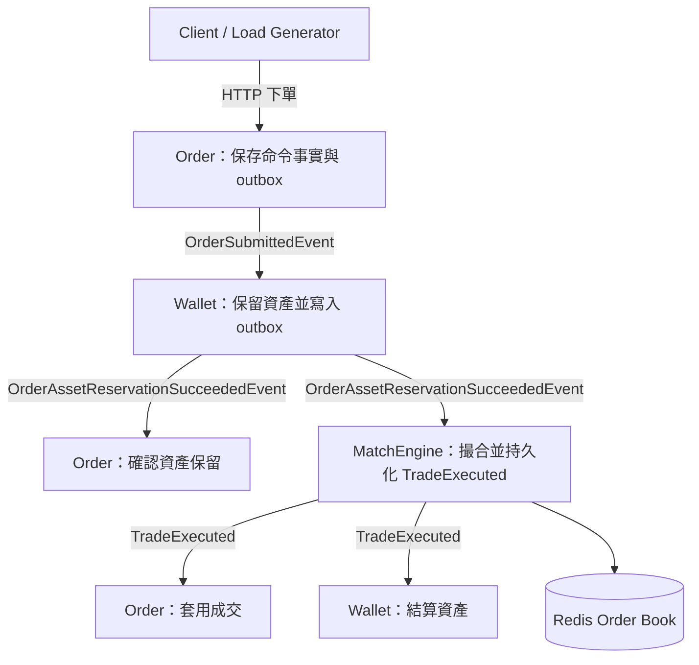
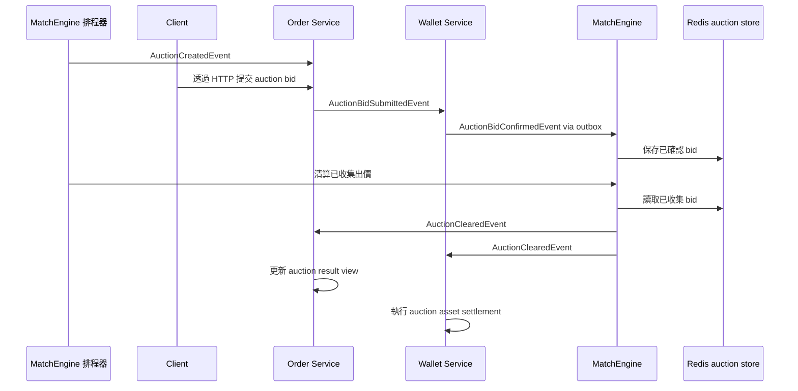
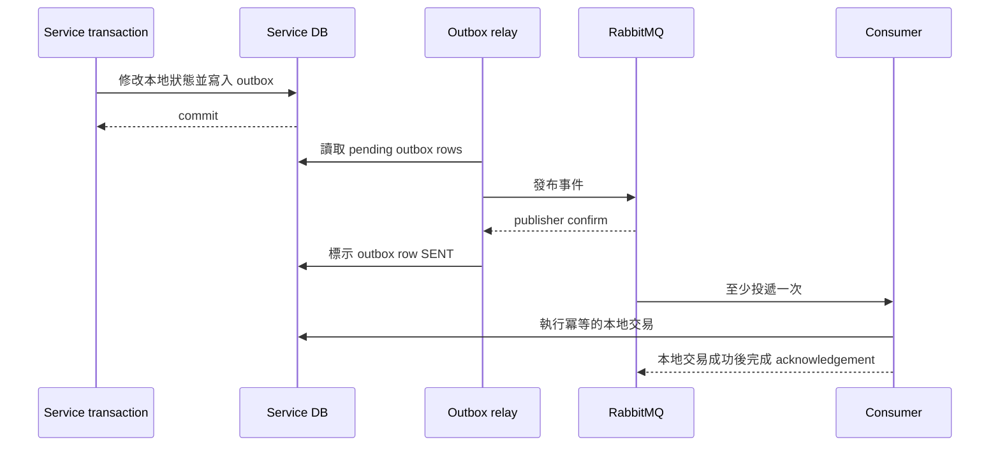
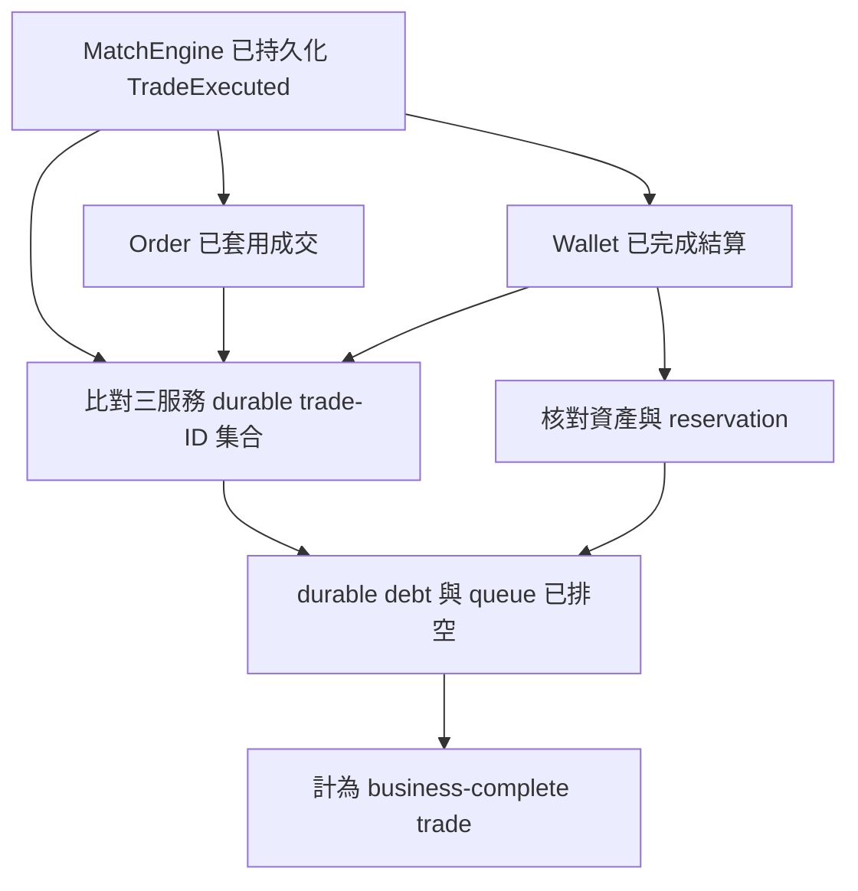
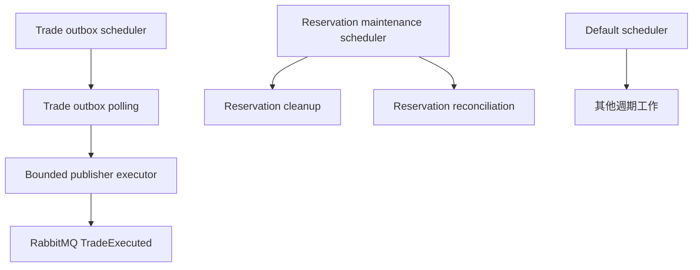

**[English](architecture.md)** | **繁體中文**

# EAP 系統架構

EAP 是一套事件驅動的電力市場後端，包含連續雙向競價（Continuous Double Auction，CDA）與定時集合競價（Timed Double Auction，TDA）兩條流程。架構不是以服務數量為目標，而是圍繞交易責任、事件可靠性與可量測的完成語意設計。

> 文件定位：本文只描述目前的服務邊界、資料 ownership、事件流程、一致性模型與擴充限制。歷史壓測過程與各版本數字集中在[效能報告](performance-report.md)和[Benchmark 索引](benchmarks/README.md)，不在架構文件重複維護。

> 本文件的 Mermaid 圖使用 VS Code 內建預覽可支援的 `graph` 與 `sequenceDiagram` 語法。請用「Markdown: Open Preview」或 `Cmd+Shift+V` 開啟，不要使用一般文字編輯畫面判斷是否成功。如果 VS Code 1.121 以上仍無法顯示，可停用已被官方標示為 deprecated 的 `bierner.markdown-mermaid` 擴充套件後執行「Developer: Reload Window」；新版 VS Code 已內建 Mermaid 支援。

## 架構目標

- 讓成交事實保持 append-only 且可稽核。
- 避免在 Order、Wallet 與 MatchEngine 之間使用分散式交易。
- 在 RabbitMQ at-least-once delivery 下維持正確性。
- 分離命令端事實與可重建的讀取 projection。
- 以完整業務交易的正確性關卡衡量吞吐量，而不是只看單一服務數字。

## 連續雙向競價流程

```text
Client / Load Generator
  |
  v
Order Service
  - 驗證命令格式
  - append 訂單命令事件
  - 寫入 Order outbox
  |
  v
Wallet Service
  - 保留買方或賣方資產
  - 寫入 Wallet 狀態與 outbox
  |
  v
MatchEngine
  - 在 Redis ZSET 保存未成交訂單
  - 透過 Lua 在單一 Redis 操作內撮合
  - 持久化 TradeExecuted 事實
  - 寫入 Trade outbox
  |
  +--> Order Service 套用 TradeExecuted
  |
  +--> Wallet Service 結算 TradeExecuted

交易路徑外的驗證
  - 比對 MatchEngine、Order、Wallet 的持久化成交事實
  - 核對資產與 reservation
  - 確認量測範圍內的 queue、DLQ、outbox/inbox 與 cleanup retry debt 已排空
```



這是目前定義 business-complete 的主要路徑。壓測 workload、版本與數字由個別 benchmark 文件負責，不能從架構圖直接推導容量。

## 定時集合競價流程

TDA 在競價時段內接收階梯式出價，並由 MatchEngine 的排程工作一次清算：



目前 TDA 尚未具備和 CDA 相同的證據邊界。它是已實作的市場模式，但仍有以下缺口：

- Order 持久化 auction bid 後直接發布 `AuctionBidSubmittedEvent`，仍有 database／RabbitMQ dual-write 風險。
- Wallet 會在同一筆交易中保留資產並寫入 `AuctionBidConfirmedEvent` outbox，但 bid consumer 沒有持久化的訊息冪等 claim；同一筆 bid 依序重送時可能再次保留資產。
- Wallet 驗資失敗時直接返回，沒有發布 rejection event，因此 Order 不一定能取得終止結果。
- MatchEngine 直接發布 `AuctionCreatedEvent` 與 `AuctionClearedEvent`，auction lifecycle 尚未使用 CDA trade outbox 的可靠性邊界。
- Order 在 listener 內攔截 auction-result 例外，Wallet 也會在單筆 settlement 失敗後繼續處理；只靠 broker redelivery 無法證明整場競價必定收斂。
- 尚無一個 TDA benchmark 同時驗證 bid/result 相等、auction 資產核對、retry debt 與 final queue drain。

CDA 的吞吐量、queue drain、outbox 與三服務 `trade_id` 證據不能直接套用到 TDA。若要補齊這些缺口，需要獨立的架構決策與正確性驗證活動，不能只修改文件就把 TDA 提升成相同等級的能力宣稱。

## 服務責任

| 服務 | 權威資料／Source of Truth | 不負責的事項 |
| --- | --- | --- |
| Order | CDA 訂單命令生命週期、訂單事件流、訂單成交套用；TDA bid entry 與結果檢視 | Wallet balance、成交決策事實 |
| Wallet | CDA／TDA balance 與 reservation、CDA settlement ledger、TDA settlement、Wallet outbox | 訂單生命週期、撮合或 auction clearing |
| MatchEngine | CDA order book、撮合決策與 `TradeExecuted`；TDA bid collection、排程與清算 | Wallet 資產異動、Order projection、下游完成狀態 |
| Common | Event 與 DTO 合約 | 業務狀態 ownership |
| MCP／AI Client | 受控的操作工具與 AI 實驗 | 核心交易正確性 |
| Trigger | 條件單學習實驗 | 核心交易路徑或現行容量宣稱；目前仍消費已退役的 `order.matched` 合約，未接入現行流程 |

## 交易邊界

EAP 不建立橫跨所有服務的分散式交易。在 CDA 核心路徑中，需要發布整合事件的狀態轉換，會在同一筆本地資料庫交易中提交服務自身狀態與 outbox，再於交易外非同步發布。Order 最終套用成交與 Wallet 結算只保存各自的本地結果，不發布 completion callback。

```text
本地資料庫交易：
  修改服務自身擁有的狀態
  寫入 outbox row
commit
outbox relay：
  發布事件
  等待 broker confirm
  將 outbox row 標示為 SENT
```

此設計接受 eventual consistency，並把 retry 當成正常流程。系統預期訊息可能重送，consumer 透過資料庫冪等紀錄吸收重複。若 Redis cleanup 必須延後執行，MatchEngine 會在成交交易中一併提交 reservation-cleanup task；它是 MatchEngine 自己的本地重試狀態，不是下游 completion marker。



如果 relay 在收到 publisher confirm 後、把 outbox 標示成 `SENT` 前當機，同一事件可能再次發布。這是預期中的 failure window，下游必須用 idempotency key 與 unique constraint 吸收 duplicate。

上圖描述 CDA 的可靠性合約，以及 Wallet 發布 TDA bid confirmation 的部分。Order 直接發布 TDA bid submission、MatchEngine 直接發布 TDA lifecycle event 仍是前一節列出的缺口，不能因文件畫了 outbox 圖就自動繼承相同保證。

ACK mode 也不是所有 listener 都完全相同：Order 的特定 batch listener 明確使用 manual ACK；Wallet 與 MatchEngine 的主要 listener 則在本地交易成功並正常返回後，由 container 完成 acknowledgement。架構不依賴「所有 listener 都是 manual ACK」這個不成立的假設，而是要求 acknowledgement 不得先於必要的本地持久化結果。

## 完成語意

MatchEngine 只發布 `TradeExecuted` 時，尚不能把交易計為 business-complete。現行正確性關卡要求：

1. MatchEngine 已持久化 `TradeExecuted`。
2. Order 已持久化相對應的 command-side trade application。
3. Wallet 已持久化 settlement，而且資產結果核對正確。
4. MatchEngine、Order、Wallet 擁有完全相同的 durable `trade_id` 集合。
5. RabbitMQ ready／unacked、DLQ 與量測範圍內的 durable debt 都已排空。

Order projection lag 不會改寫已成立的 command-side 成交事實，因為 projection 是可重建的 read model；但對「完整系統可持續容量」而言，使用者查詢狀態與 durable inbox 也不能長期落後。因此壓測會把交易完成 gate 與 read-model／inbox 收斂 gate 分開呈現，最後兩者都必須通過才可宣稱整條服務穩態跟得上。

MatchEngine 不接收 Order 或 Wallet 的 completion callback。每個下游服務各自擁有持久化結果、retry state、idempotency 與 failure handling。完整流程的 verifier 在交易路徑外比對三個服務擁有的 durable table，不會在 MatchEngine 再建立另一份跨服務業務狀態。



## 可靠性控制

| 風險 | 控制方式 |
| --- | --- |
| DB commit 成功但事件發布失敗 | transactional outbox |
| RabbitMQ 重複投遞 | unique constraint 與冪等 consumer |
| consumer 在 acknowledgement 前失敗 | 先 durable intake 的 consumer 由 inbox identity 吸收 redelivery；尚未完成 intake 時由 broker redelivery |
| poison message 阻塞 queue | DLX／DLQ 與有限 retry state |
| projection 落後 | checkpointed projector 與 lag metrics |
| 下游套用延遲 | service-owned retry／inbox state、DLQ 可觀測性與外部 durable-fact reconciliation |
| Redis reservation cleanup 中斷 | durable cleanup task 與 reservation reconciler |
| inbox commit 前資料庫不可用 | listener 不 ACK，交由短期 broker retry／DLQ；尚未具備所有服務一致的 delayed retry／consumer pause |

## 擴充與效能邊界

架構文件不保存某次壓測的 TPS 排行。容量必須綁定 source revision、workload、執行環境與 business-complete gate；同一個元件的 isolated throughput 也不能等同完整交易容量。[2026-09-04 全鏈報告](benchmarks/2026-09-04-current-reliability-full-chain.md)已在 Wallet trade inbox 加入後，以 schema v3 同時 gate 三服務 inbox backlog／oldest age／terminal debt 及完整 business-complete 條件，單一 seed 通過 200 orders/s 長窗。由於來源未提交、driver 同機且 PostgreSQL `synchronous_commit=off`，它仍只是目前 worktree 的診斷下界，不是正式容量上限。

完整 CDA 路徑的成本來自多個本地一致性邊界疊加，而不是只有 RabbitMQ 或 Redis：

- Order append event、更新 command state 並寫入 outbox。
- Wallet durable intake、條件式資產異動與 result outbox。
- MatchEngine admission inbox、Redis Lua 撮合、trade fact 與 outbox。
- Order／Wallet durable intake 並套用 `TradeExecuted`，以及各服務的 idempotency、retry 與 reconciliation writes。
- Order projector 把 event stream 更新成使用者查詢的 `orders_current`。

### 排程與 durable debt

MatchEngine 已把 trade-outbox polling、reservation maintenance 與其他週期工作分開，避免一個長時間 cleanup 阻塞成交事件發布：



RabbitMQ queue 清空不代表服務已追上。Listener 可以先把訊息提交到 service-owned inbox 後 ACK，工作再由本地 worker 套用；因此 queue depth、inbox level／oldest age／slope、outbox debt、projection lag 都是不同的排隊點。最新版 200 orders/s 長窗的 Order／Wallet／Match inbox oldest age max 為 `1/1/0s`，沒有持續累積；較早 300／400 實驗仍顯示 Order reservation-result worker 是提高邊界前的首要量測對象，但尚未用目前版本重跑到足以重新定位瓶頸。

### 水平擴充單位

| 元件 | 可擴充方式 | 必須保留的限制 |
| --- | --- | --- |
| Order command／consumer | 依 order stream 並行；inbox worker 以 lease、fencing 與 `SKIP LOCKED` 分工 | 同一 aggregate version 仍需序列化；projector checkpoint 不可跳過 global-position gap |
| Wallet | 不同 user／wallet 可分片或並行 | 同一 wallet row 是資產 invariant 的鎖定邊界，不能用非原子的 cache 判斷取代 |
| MatchEngine | 依 market／product 分片 | 同一本 order book 只保留一個 matching authority，否則 price-time priority 與 cancel/match 裁決會失去單一順序 |
| Outbox／Inbox worker | bounded concurrency、batch、lease recovery | 必須保留 idempotency、claim fencing、publisher confirm 與 retry debt，不以無界 thread pool 換吞吐量 |
| Query projection | batching、獨立 pool，必要時再移到 read database | query 可接受 lag；command 不可用 projection 裁決資產、成交或取消 |

因此擴充順序是：先量每個 durable stage 的 arrival／completion／debt，再調整 worker isolation、batch 或 bounded concurrency；只有證據顯示單機共享資源成為限制時，才把 load generator、database 或 market partition 移到不同節點。這些修改都必須保留最終 trade-ID、資產與 retry debt 核對，不能只用 HTTP 成功率判定改善。

## 為什麼現在不再拆更多服務

把 Order 拆成更多服務或再增加資料庫，不會消除 order state、settlement state、outbox row 與 idempotency gate 的基本寫入成本，反而會在現有 SQL／write model 尚未最佳化前增加一致性與 reconciliation 成本。

目前維持穩定的服務邊界，優先調整 hot-path SQL、outbox relay 行為與不改變業務語意的 batching。

## 訂單簿的權威來源

Redis 是撮合用的即時狀態，不是長期 audit source of truth。PostgreSQL 保存 command-side order fact 與 `TradeExecuted` fact。如果 Redis generation 遺失或無法信任，預期復原方式是停止 order admission 與 cancellation arbitration，根據持久化的 order、trade 與 cancellation fact 重建 open order book 和 processing fence，驗證重建結果後才恢復 consumer。

Redis resting-order reservation 會保存預期產生的精確 durable `tradeId`。Cleanup、compensation 與 orphan reconciliation 在修改 reservation 前，都必須把該 ID 交給 Lua 核對，避免舊 cleanup 依 timestamp 猜測而錯誤釋放已成交訂單，或刪除同一 order ID 的更新 reservation generation。

Cleanup Lua 也會解析 reservation JSON，精確核對 `orderId`，而不是用字串包含判斷。
只有實際刪除成功與 reservation 已不存在可視為成功；order identity 不符或較新的
`tradeId` 已取得 ownership 時，Lua 保持 Redis 零變更，cleanup task 立即進 terminal
`FAILED` 並保存診斷內容。只有 timeout、連線與 script 執行等技術錯誤使用 bounded
backoff retry，避免舊任務在新 reservation 稍後消失後被錯誤洗成成功。

Cleanup task 的 lease 現在另保存 instance owner、每次 claim 唯一 token 與到期時間；
renew、完成、重排與 terminal 更新都必須核對 owner＋token。Orphan reconciler 也不再只寫
log：invalid payload、ownership conflict 與耗盡的 technical failure 會保存到
`reservation_reconciliation_issues`，包含原始 payload、generation＋trade／payload
fingerprint、attempt 與最後錯誤；只有完全相同的 terminal identity 會被跳過，同一 Redis
key 的後續新 reservation 不會被舊紀錄隔離。reconciler 在動 Redis 前也會核對 durable
trade 的 market、order、user、sequence、price 與 quantity；不一致時 fail closed。這些是
durable recovery debt，不等於已修好 Redis 資料。terminal row 不會因 Redis key 消失就
自動 resolved；只有 retryable mutation debt 能在直接核對 fingerprint 已不存在後收斂。
reservation scan 與 retryable absence check 都使用有界、可輪轉的 page，不會每 5 秒全掃
Redis keyspace 或整張 issue table。

目前 `tradeId` **不是 UUID**，而是 MatchEngine 依 `<marketId>-<Redis match sequence>` 產生的 market-scoped 穩定字串；`sequence` 使用正整數 `BIGINT`，跨服務欄位契約上限為 80 字元。現行 CDA 的 `marketId` 固定為 `ENERGY-SPOT`，即使 sequence 達 19 位數，trade ID 也只有 31 字元。80 是 schema 的安全容量，不代表正常 ID 需要那麼長；若未來允許外部建立 market，應在 market 建立／下單入口限制 market ID，而不是等 Redis 已 reserve 訂單後才驗證 trade ID。

trade persistence 發生錯誤時，MatchEngine 的順序是：先讓同一筆 PostgreSQL transaction 中的 `trade_executions`、outbox 與 cleanup task 一起 rollback，再以 reservation 內相同的 `tradeId` 立即把 resting order 放回 Redis，最後把例外交給 durable admission inbox 分類。DB／Redis 暫時故障會 backoff retry；payload 或 constraint 類永久錯誤會留下 terminal record。若即時 release 本身也因 Redis 故障失敗，原始錯誤仍保留，reservation 則由 stale-reservation reconciler 依「DB 是否已有 durable trade」決定稍後 release 或 complete。因此 trade ID 產生器必須是單純、可重算且不拋錯的函式，不能在補償路徑再次阻斷修復。

MatchEngine 現在以 PostgreSQL control row 管理 `READY`／`RECOVERING`、單調遞增的
fence epoch、generation UUID、Redis `run_id`、CAS version 與 verification manifest。
每個 CDA mutation Lua 都在第一次寫入前同時核對 generation sentinel 和 Redis 實際
`run_id`；因此 Redis 即使保留舊資料重啟，舊 worker 也不能趁 monitor 尚未刷新時寫入。
generation 不可信時，admission worker、cancellation arbitration 與 Redis maintenance
fail closed，但 Rabbit listener 仍可把訊息 durable intake 到 PostgreSQL inbox。

重新開放必須由 operator 帶當次 epoch／generation／version token 與 rebuild manifest；
MatchEngine 串行化 activation，逐筆核對 detail key、market、side、score、user index、
pending cancellation、durable watermark 與 debt；其中 completed-admission bitmap 必須
逐 bit 對回 PostgreSQL 中 `APPLIED` 的 admission inbox，不能用 Redis 自己證明 Redis。
取消 intent／marker 也必須對回 durable cancellation identity，marker 不得與同一張
visible order 共存；control transition CAS 則同時核對 version、epoch、generation 與
Redis run-id，避免舊 process 以 reset 前的 control snapshot 降級新 generation。
staged sentinel 後再驗一次，最後才以 PostgreSQL CAS 標成 `READY`。這些完整核對只在
recovery control path 發生，不在正常撮合 hot path 增加 PostgreSQL lookup。目前仍未
實作自動 full-book rebuild，也不宣稱 Redis state 遺失後能不中斷撮合；完整 rebuild
input 保留在 `EAP-MATCH-202`。詳細規格見
[MatchEngine Redis generation 與 fail-closed readiness](features/match-orderbook-generation-readiness.zh-TW.md)。

activation 使用 PostgreSQL exclusive advisory lock；取消請求從 durable `PENDING` 寫入
到 READY-generation Redis intent 建立則使用同一 lock key 的 shared 模式。因此多筆取消
仍能並行，但 activation 必須等所有較早開始的取消 intake 完成，不能在 final manifest
snapshot 與 `READY` CAS 之間漏掉取消事實。若取消先提交於 `RECOVERING`，缺少對應 intent
會讓 activation fail closed；若 activation 先完成，取消會在新 generation 寫好 intent
才離開 barrier。

一般 runtime status 只核對 control、sentinel 與 `run_id`；完整 manifest 是另外的非破壞性
診斷，而且只能在 queue／inbox／reservation 已收斂後解讀。正常撮合中的 reservation 或
completed-bit-before-`APPLIED` 都是合法暫態，不能由一個 GET status 誤判後關閉 generation。
只有 `RECOVERING` activation 的 quiescent full verification 能決定是否重新開放。

## 價格與時間優先

MatchEngine 使用 Redis sorted set 與 Lua script，讓 add-order、match 和 partial-fill 操作在 Redis 的單一執行邊界內完成。Price priority 編碼在 sorted-set ordering；time priority 則依賴 score／member 設計中的穩定 sequence 或 timestamp ordering。

同一 user 的買賣單不得互相成交。這項規則由 MatchEngine 在同一個 Lua 候選單選擇邊界執行：保留自己的 resting order、跳到下一筆 price-time eligible 的其他使用者訂單；如果只有自己的流動性，就讓 incoming order 正常進簿而不建立 `TradeExecuted`。Wallet 不重新撮合，但會拒絕 buyer／seller 相同或成交價超出任一方 limit 的事件，避免錯誤跨服務事實異動資產。

目前每個 market／product path 刻意只保留一個 matching authority。水平擴充應依 market／product 分片，而不是讓多個 worker 在沒有 sequencer 的情況下同時修改同一本 order book。

## RabbitMQ 順序範圍

EAP 把 RabbitMQ ordering 視為 queue-scoped，而不是 global ordering。開啟多個 consumer 後，系統不依賴 broker 提供全域處理順序，業務正確性來自：

- 撮合決策只有一個 matching authority。
- 本地 consumer 必須冪等。
- duplicate delivery 由 unique constraint 收斂。
- service-owned idempotency 必須容許 Order-before-Wallet 或 Wallet-before-Order 的完成順序。

若未來真的出現 per-account 或 per-market 的嚴格順序需求，必須建立明確的 partitioning／sequencing 設計，不能把它當成 RabbitMQ 隱含保證。

## 選配的 Control Plane 模組

`eap-mcp` 與 `eap-ai-client` 提供受控後端工具與本地 AI 實驗，不參與 order acceptance、reservation、matching、settlement 或 benchmark completion。這些模組是否可用，不得影響交易正確性。

`eap-trigger` 也不在核心交易路徑中。目前 Go 實作仍監聽已退役的 `order.matched` event；在遷移成 Trigger 自己擁有的 `TradeExecutedEvent` queue 並通過 end-to-end test 前，只能描述成學習模組，不能說是已整合的平台能力。

## 共用合約版本

`eap-common` 對個人 multi-repo 專案很方便，但也在服務之間建立 compile-time coupling。預期的 production 方向是：

- 預設只新增欄位，不任意破壞既有 event。
- 使用明確的 event 名稱與版本，例如 `TradeExecutedV1`。
- consumer 容許未知欄位。
- breaking change 必須建立新 event version 與 migration window。

## Backpressure 策略

當 input 長時間高於 completed capacity，工作會累積在 RabbitMQ、outbox、inbox 或 projection。現行 Order admission 已有 Wallet queue backpressure guard 與 user-based local rate-limit 示範，但尚未形成涵蓋所有 service-owned debt 的 production policy。

完整策略應優先採取 bounded admission，而不是讓任一層無限制堆積：

- 下游 queue、inbox oldest age 或 retry debt 超過 threshold 時，拒絕或 rate-limit 新訂單。
- admission 判斷必須使用低成本、可降級的健康訊號；監測失敗時要有明確 fail-open／fail-closed policy。
- worker concurrency 與 in-flight work 必須有上限，避免把 broker backlog 轉成 database connection 或 JVM memory exhaustion。
- 對外分開定義 command accepted、durable fact、query visible 與 business complete，不把其中一個當成全部完成。

## CDA 取消訂單的競爭判定

取消訂單是非同步的業務決策，不是同步刪除。Order 接受取消請求後回傳 HTTP `202`，並在同一筆交易 append `OrderCancellationRequestedV1` 與 outbox；在 MatchEngine 回傳持久化結果前，不會先修改訂單的 tradable state。請求攜帶由 Order command state 推導出的 immutable original amount；它和經過部分成交後，MatchEngine 可能從 Redis 移除的 mutable unmatched remainder 是不同概念。

MatchEngine 是唯一的 cancellation arbiter：

1. 先在 `match_engine.order_cancellations` 保存 `PENDING` recovery record，再寫入 Redis cancellation intent。DB row 讓中斷的 request 可被重新發現，但它本身不是 admission fence。
2. Redis 決定 cancellation 的先後結果。尚未 admission 的訂單，由 admission 使用的同一個 Lua 邊界檢查 intent；已存在 order book 的訂單，cancellation Lua 與 matching Lua 會競爭移除同一個 ZSET member。先成功的 Redis operation 決定取消是阻止 admission、移除剩餘量，或輸給 matching。正常 `OrderAssetReservationSucceededEvent` admission 不查 PostgreSQL cancellation table。
3. 對 open resting order 而言，只有 cancellation Lua 實際移除一個 ZSET member 時才算成功，並直接回傳被移除的精確 order snapshot。已經進入 match reservation 的訂單不能同時被回報為 cancelled。
4. 如果 request 在 Redis intent 寫入前中斷，或輸給正在進行的 admission／reservation，狀態會維持 pending。Reconciliation 會補回 intent，並在 admission 仍處理中時等待。Worker 使用 `SKIP LOCKED`、bounded lease 與 exponential retry delay claim row，避免多個 instance 重複處理同一筆尚未解決的 cancellation。prerequisite waiting 與 technical attempt 分開計時；前者不消耗 20 次 technical budget 但會告警，後者耗盡或遇到 order-book invariant 時成為 durable `FAILED_TERMINAL`。最後依 visible remainder 或 durable trade，透過 transactional outbox 發布 `CANCELLED`、`ALREADY_MATCHED` 或 `NOT_OPEN`。Durable decision 同時保存 immutable original amount 與精確 cancelled remainder；前者用來驗證 replay identity，後者供 Order 與 Wallet 套用。

Wallet 把 MatchEngine 的 cancellation result 當作精確 unmatched quantity 的權威事實。Order submission、`TradeExecutedEvent` 與 cancellation result 都先寫入 `wallet_service.message_inbox`；listener durable intake 後 ACK，再由 lease worker分類、backoff 與重試。Wallet 自己推導 asset delta，只套用一次，並以 cancellation ID、order ID 或 trade ID 保存狹義的 application fact。Wallet 不維護第二份 order-state projection。

Trade settlement 消耗 matched quantity，cancellation 釋放彼此不重疊的 remainder，因此兩種事件不論哪個先抵達都應收斂成相同 balance。Order 會把 cancellation result 放入 durable inbox；如果 cancellation result 比較早到，但先前 trade 尚未更新 Order command state，就保持 `PENDING_PREREQUISITE` 並重試，而不是阻塞或推翻 trade application。MatchEngine 的 `CANCELLED` 套用完成後，Order append `OrderCancellationAcceptedV1` 並進入 `CANCELLING`，不會過早宣稱整張訂單已完成取消。

Wallet 真正釋放資產時，cancellation application、balance update、release publication guard、`OrderAssetReservationReleasedEvent` outbox 與 Wallet inbox `APPLIED` 在同一筆 local transaction 提交。Order 另以 durable release inbox 接收這個 Wallet-owned fact；若它早於 cancellation accepted 抵達就 defer，條件成立後 append `OrderCancellationCompletedV1`，此時狀態才是 `CANCELLED`。`ALREADY_MATCHED` 透過正常 trade event 收斂；若 `NOT_OPEN` 又找不到 durable trade，則保留成可觀測 consistency debt，不會靜默當作 cancellation 已完成。

取消命令即使冪等，重複 request 仍會消耗 HTTP、Redis 與 database work；大量不同的 open order 則產生真正的 arbitration 與 asset-release 工作。因此 cancellation rate 也是未來 admission policy 的輸入之一，但不能取代 Redis 競爭判定與資料庫冪等保證。

這個邊界刻意信任 MatchEngine 提供的 immutable cancellation fact，就像 Wallet 信任 `TradeExecuted` 一樣。Wallet 仍擁有 balance calculation、non-negative guard、transaction rollback 與 idempotent application；MatchEngine 不會命令 Wallet 寫入某個絕對 balance。Wallet 回傳的 release event 也只提供 workflow identity 與 released quantity，不暴露餘額或 Wallet table schema。這讓 cancellation-only persistence 不會進入正常 order／trade write path，同時保留 replay 與 out-of-order convergence。Match 本地失敗分類見 [Match terminal error semantics](match-terminal-error-semantics.zh-TW.md)；跨服務完成語意見 [Wallet Inbox 與取消訂單最終確認](wallet-inbox-and-cancellation-completion.zh-TW.md)。

## 目前已知限制

- TDA 尚未具備 CDA 等級的 outbox、consumer idempotency、rejection event 與完整收斂驗證，兩條流程的保證不能混用。
- Wallet 的 reservation／trade settlement／cancellation-result 都已使用同一套 durable inbox、lease worker 與本地 transaction；最新版 200 orders/s 長窗已驗證正流程沒有巨大退化，但 200 以上的精確邊界尚未重測。
- 各 inbox 寫入前若服務資料庫長時間不可用，仍可能耗盡 broker retry 後進 DLQ；尚無一致的 delayed retry／consumer pause。
- 尚未建立全域 Saga timeout detector，也沒有完整的 DLQ 分類、審核與安全 replay control plane。
- Redis order book 已有 `READY／RECOVERING` generation gate 與受控 activation，但尚無
  自動 full-book rebuild；Redis generation 遺失時會安全停撮，不能宣稱不中斷繼續撮合。
- Order 已有 logical CQRS 與可重建 projection，但 user query 仍使用 primary database，尚未完成 read replica 或獨立 read-database isolation。

詳細 happy path、retry、亂序與 crash window 請讀[訂單事件完整生命週期](order-event-lifecycle.zh-TW.md)；一致性設計的理由與保證邊界請讀[事件驅動一致性的五個核心問題](event-consistency-five-questions.zh-TW.md)。
