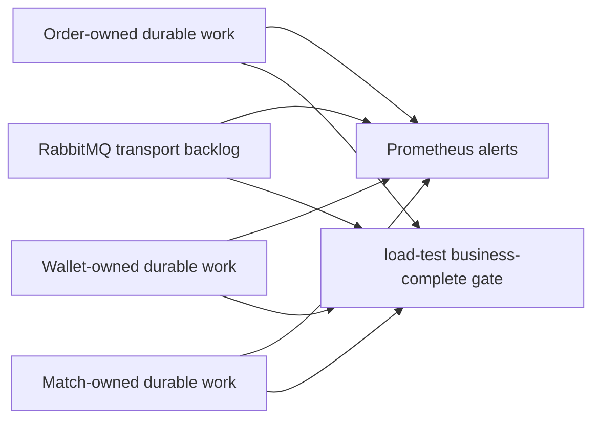

# EAP Durable Debt SLO 與完成關卡

> 更新日期：2026-09-15  
> 對應工作：EAP-REL-103  
> 契約版本：`DurableDebtSnapshot` v1；load-test result schema v4

## 這次解決的問題

RabbitMQ queue 清空，只表示 broker 當下沒有 ready／unacked message，不表示三個服務已經完成工作。Consumer 可以先把訊息寫進本地 inbox 後 ACK，接著才由 worker 套用；outbox、取消裁決、Redis cleanup、reservation reconciliation 與 CQRS projection 也都可能在 RabbitMQ 歸零後繼續累積。

因此 EAP 把這些「服務已持久化接管、但還沒有完成，或已經需要人工介入」的工作統稱為 **durable debt**。REL-103 的目的不是新增一個中央資料庫，而是讓三個服務用同一份唯讀契約揭露自己的權威狀態，再讓 Prometheus、操作人員與壓測完成關卡讀取相同語意。



## 為什麼不建立中央 debt table

Inbox、outbox、projection checkpoint 與 Match recovery task 的資料擁有者仍是原服務。若另建中央表，系統會多出「本地狀態已變、中央狀態尚未同步」的新一致性問題，而且中央表可能錯誤取代真正的 source of truth。

現行設計是：

1. 每個服務以一個本地 SQL snapshot 聚合自己擁有的未完成工作。
2. 每 5 秒更新一次記憶體 cache；Prometheus scrape 與 Actuator endpoint 都讀 cache，不在 scrape thread 查資料庫。
3. `/actuator/durableDebt` 回傳有版本的固定欄位契約。
4. 壓測 schema v4 讀三個 endpoint；Prometheus 讀相同 Micrometer metrics。
5. RabbitMQ DLQ 由 RabbitMQ Prometheus plugin 直接觀測，再用 recording rule 映射成相同語意。

這維持了 ownership：服務負責回答自己的 debt，外部 verifier 只負責比較與判定，不回寫業務狀態。

## 契約語意

每個固定的 `service + work` 都提供：

| 欄位 | 意義 |
| --- | --- |
| `totalCount` | 所有未解決工作，包含可自動恢復與 terminal debt |
| `retryCount` | `totalCount` 的子集合；已經歷失敗、等待或正在自動重試的工作 |
| `terminalCount` | `totalCount` 的子集合；自動重試不應再掩蓋、需要受控處理的工作 |
| `oldestUnresolvedAgeSeconds` | 最舊未解決工作的年齡；重試不會重設起算點 |
| `observationSuccess` | 最近一次本地 snapshot query 是否成功 |
| `snapshotAgeSeconds` | 距離最近一次成功 snapshot 的秒數 |
| `contractVersion` | 消費端可接受的契約版本，目前是 `1` |

`retryCount` 與 `terminalCount` 是分類視角，不相加用來推導 `totalCount`。例如一筆剛進入 `PENDING`、尚未失敗的工作屬於 total，但不是 retry；terminal work 仍然是未解決工作，所以同時屬於 total。

### 為什麼 observation 也必須是 gate

若資料庫斷線，cache 會保留最後一次成功的 component 數值，方便值班人員看見故障前的狀態；同時把 `observationSuccess=false`，而 `snapshotAgeSeconds` 會持續增加。壓測與告警要求最近一次觀測成功且 age 不超過 15 秒，因此「上一次剛好是 0」不可能在 DB outage 時被誤判成完成。

服務啟動後若從未成功觀測，`observedAt` 是 epoch、component 暫為 0，但 `observationSuccess=false` 且 snapshot age 很大，仍會 fail closed。

## 三個服務實際納入哪些工作

### Order

| `work` | total | retry | terminal／特殊語意 |
| --- | --- | --- | --- |
| `asset_reservation_result_inbox` | 非 `APPLIED` 或已記錄 conflict | `FAILED_RETRYABLE`，或有錯誤的 `IN_PROGRESS` | `FAILED_PERMANENT` 或 applied identity conflict |
| `trade_execution_inbox` | 非 `APPLIED` | `PENDING_PREREQUISITE`、`FAILED_RETRYABLE`，或有錯誤的 `IN_PROGRESS` | `FAILED_PERMANENT` |
| `cancellation_result_inbox` | 非 `APPLIED` | prerequisite／retryable／有錯誤的 in-progress | `FAILED_PERMANENT` |
| `asset_reservation_released_inbox` | 非 `APPLIED` 或已記錄 conflict | prerequisite／retryable／有錯誤的 in-progress | `FAILED_PERMANENT` 或 applied identity conflict |
| `event_outbox` | 非 `SENT` | 有過 publish attempt 的 `PENDING`／`IN_FLIGHT` | `FAILED` |
| `orders_current_projection` | event-store tail 與 checkpoint 的 lag，或目前有 failure marker | checkpoint 的 `failure_count > 0` | 現行沒有自動分類成 terminal；錯誤本身會持久化供診斷 |

Projection 以前只有 lag，projector 若反覆失敗只能從 log 猜。現在 checkpoint 多保存 `failure_count`、`first_failure_at`、`last_failure_at`、`last_error`。成功跑過後才清除 failure marker；因此 projection 即使沒有新增 event、但仍在失敗，也不會顯示成零工作。

### Wallet

Wallet 的三種訊息共用 `message_inbox`，snapshot 依 `message_type` 分成：

- `order_submission_inbox`
- `cancellation_result_inbox`
- `trade_execution_inbox`

非 `APPLIED` 或帶 conflict 的 row 屬 total；`FAILED_RETRYABLE` 與帶 error 的 `IN_PROGRESS` 屬 retry；`FAILED_PERMANENT` 與 identity conflict 屬 terminal。`event_outbox` 則採用與 Order outbox 相同的 pending／attempt／failed 語意。

### MatchEngine

| `work` | total | retry | terminal |
| --- | --- | --- | --- |
| `order_admission_inbox` | 非 `APPLIED` 或 conflict | prerequisite／retryable／有錯誤的 in-progress | permanent 或 applied conflict |
| `trade_outbox` | 非 `SENT` | 有過 attempt 的 `PENDING` | `FAILED` |
| `reservation_cleanup` | 非 `COMPLETED` | 有過 attempt 的 `PENDING`／`PROCESSING` | `FAILED` |
| `order_cancellation` | `PENDING`／`IN_PROGRESS`／`FAILED_TERMINAL` | prerequisite 或 technical counter 已增加 | `FAILED_TERMINAL` |
| `reservation_reconciliation` | `RETRYABLE`／`TERMINAL` issue | `RETRYABLE` | `TERMINAL` |

最舊年齡使用最初的 `received_at`、`created_at` 或 `first_seen_at`，不是 `next_attempt_at` 或 `updated_at`；否則每次 backoff 都會把老問題偽裝成新問題。

## HTTP 與 Prometheus 介面

服務內部 inspection endpoint：

```text
GET http://localhost:8080/eap-order/actuator/durableDebt
GET http://localhost:8081/eap-wallet/actuator/durableDebt
GET http://localhost:8082/match-engine/actuator/durableDebt
```

主要 metrics：

```text
eap_durable_debt_items{service,work,class="total|retry|terminal"}
eap_durable_debt_oldest_age_seconds{service,work}
eap_durable_debt_observation_success{service}
eap_durable_debt_snapshot_age_seconds{service}
eap_durable_debt_contract_version{service}
eap_durable_debt_refresh_failures_total{service}
```

Label 只使用編譯期固定的 service／work／class，不放 order ID、trade ID、exception 或 payload，避免高 cardinality。

RabbitMQ 3.13 的 Prometheus plugin 在 `/metrics/per-object` 提供 `rabbitmq_queue_messages` 與 `rabbitmq_queue_head_message_timestamp`。現行 shared `order.dlq` 被映射成：

- `total = terminal = ready + unacked` 的 broker queue count；
- `retry = 0`，因為 queue-level metric 無法把 shared DLQ 拆成各 owner 的可重播子集合；
- oldest age 由 queue head timestamp 計算，不為了查看訊息而 consume；
- queue metric 缺失本身就是 critical alert，不能當成空 queue。

EAP-REL-106 已提供 persist-before-ACK quarantine、inspect、分類與可稽核處置。REL-107 以
broker `x-death.queue` 與 exact topology allowlist 識別 `TradeExecutedEvent` owner；Wallet
以 durable inbox、Order 以 recovery inbox 加 trade application 執行各自 preflight。目前只有
這兩條 transient route 可條件式重播。由於 queue metric
仍無法安全聚合「可 replay」數量，SLO contract 繼續把整條 DLQ 視為 terminal debt；其他
consumer 必須先補 owner-specific preflight，或另行遷移 per-consumer DLQ。

## SLO 與告警規則

| 條件 | 初始規則 | 理由 |
| --- | --- | --- |
| terminal debt | `> 0` 持續 30 秒 | 自動 retry 不會解決，需要立即看見 |
| oldest unresolved | `> 30s` 持續 2 分鐘 | 比瞬間 queue spike 更能表示 liveness 問題 |
| total backlog | `> 6000` 持續 2 分鐘 | 與目前 200 orders/s 診斷 profile 的上限對齊 |
| 持續成長 | 5 分鐘斜率 `> 2/s` 且增加 `> 600`，再持續 5 分鐘 | 避免只因短暫 burst 告警 |
| observation failed | `== 0` 持續 30 秒 | 不可把不可觀測當健康 |
| snapshot stale | `> 15s` 持續 30 秒 | 5 秒 refresh 下容許短暫延遲，但 fail closed |
| contract mismatch | `!= 1` 持續 30 秒 | 防止 producer／consumer 對 status mapping 理解不同 |

這些是目前本機學習與診斷環境的初始閾值，不是 production SLA。實際部署需依流量、值班反應時間與錯誤預算校準。

## Business-complete gate

schema v4 的完整交易最後必須同時滿足：

1. Match、Order、Wallet 的 durable `trade_id` 集合完全一致。
2. Wallet 資產與 reservation 核對正確。
3. Order read model checkpoint 追上 event-store tail。
4. Redis order book、reservation 與 RabbitMQ measured queues 排空。
5. 三個服務回傳正確 contract version、正確固定 work 清單、成功且不超過 15 秒的 snapshot。
6. 每一個 service-owned `work` 的 `totalCount == 0`；由於 retry／terminal 都是 total 子集合，也會一併歸零。
7. DLQ 為 0 且 RabbitMQ metrics 可讀。

因此下列狀況一定失敗：

```text
Rabbit queue = 0
Wallet trade_execution_inbox total = 1
=> NOT business complete

所有 component 上次值 = 0
但 Order DB outage，observationSuccess = false
=> NOT business complete

Order inbox row 已 APPLIED
但 conflict_detected_at != null，terminal = 1
=> NOT business complete
```

schema v4 仍保留 schema v3 的聚合 inbox 欄位，讓既有報告可比較；
`steadyDurableDebtComponents` 會逐服務、逐 work 保存 measurement window 的
start／end／max／slope、retry／terminal max 與 oldest-age max，
`finalDurableDebtComponents` 則是完整最終狀態。steady、external-k6 與 staircase 都會在
流量進行中套用 per-work gate，不能靠停流後才排空 outbox／cleanup 取得假 PASS。
長窗 monitor 只讀 endpoint cache，不再每秒對歷史 inbox table 各自執行掃描。

## 查詢成本與資料庫變更

每個服務每 5 秒只做一次本地聚合 snapshot。資料庫 migration 為 unresolved rows 加 partial age index：

- Order：四個 inbox 與 order event outbox。
- Wallet：message inbox 與 outbox。
- Match：admission inbox、trade outbox、cleanup、cancellation、reconciliation issue。

這使成本主要跟目前未完成 debt 成長，而不是跟歷史完成交易總量成長。Prometheus scrape 與 Actuator request 只讀記憶體 snapshot，不占用應用程式 JDBC connection 做即時聚合。

代價是每個服務多一個固定頻率的 read query、Order projection failure 多幾個 checkpoint 欄位，以及約數十條固定 metrics series。這個成本換來一致的 liveness 定義、fail-closed observation 與可稽核的壓測完成條件。

### 部署與效能邊界

- 目前 Prometheus 對固定 component 數量的完整性檢查，假設每個服務只有一個 application instance。未來水平擴展時，必須先依 `service`／`work` 聚合，或讓 contract 明確帶入 replica 維度，不能直接沿用單實例計數。
- migration 目前使用一般 `CREATE INDEX`，適合本機學習環境與尚未累積大量資料的資料庫；正式環境的大表應安排維護窗口，或改用 PostgreSQL `CREATE INDEX CONCURRENTLY` 的部署流程，避免長時間阻塞寫入。
- 目前已用 integration test 證明每個固定 work 的非零 debt 能被正確查出，但尚未以接近 production 歷史資料量執行 `EXPLAIN (ANALYZE, BUFFERS)`。因此 schema v4 smoke 能證明 contract 與 correctness gate，不等於已證明大資料量下的查詢成本。

## 目前仍未解決的事

- CDA inbox commit 前的 DB connectivity outage 已由 EAP-REL-104 處理：合法 delivery 不 ACK、不轉送 retry queue，而是留在 durable source queue；service-local circuit 暫停 consumer，DB 恢復後自動 resume。這不涵蓋 TDA consumer，也不代替 Saga timeout 或 terminal recovery。
- 訂單可能沒有任何明顯 queue debt、卻長時間卡在 Saga state；EAP-REL-105 已提供 [warning-only timeout detector](order-saga-timeout-detector.zh-TW.md)。
- Terminal debt 已由 EAP-REL-106 接入統一的 inspect／dry-run／rate-limited single-case replay／
  park／resolve 與 audit control plane；replay policy 仍由 owner 強制執行。
- EAP-REL-107 已把核心 CDA 的 DB outage、consumer crash、duplicate、late event 與兩條 trade
  redrive preflight 納入同一 campaign；尚未覆蓋的是 Match 與非 `TradeExecutedEvent` 的其他
  shared-DLQ route，以及一次同時 kill 三個核心 JVM 的 HTTP 全鏈 run。
- RabbitMQ 目前使用 shared DLQ；Wallet／Order trade 已以 broker route evidence 與各自的
  owner preflight 開放 conditional replay，其餘 route 仍 fail closed，不能宣稱全域 DLQ recovery。

換句話說，REL-103 解決的是「失敗不能被 queue=0 隱藏」與「所有觀測者使用同一套債務語意」，不是把所有失敗自動修好。

## 驗證方式

快速檢查 endpoint：

```bash
curl -fsS http://localhost:8080/eap-order/actuator/durableDebt | jq
curl -fsS http://localhost:8081/eap-wallet/actuator/durableDebt | jq
curl -fsS http://localhost:8082/match-engine/actuator/durableDebt | jq
```

Prometheus 設定與規則：

```bash
docker run --rm --entrypoint /bin/promtool \
  -v "$PWD/observability/prometheus:/etc/prometheus:ro" \
  prom/prometheus:v2.55.1 \
  check config /etc/prometheus/prometheus.yml
```

規則測試會另外驗證服務觀測消失、terminal debt、非空 DLQ 缺少 head timestamp，
以及空 DLQ 的零 age 語意：

```bash
docker run --rm --entrypoint /bin/promtool \
  -v "$PWD/observability/prometheus:/etc/prometheus:ro" \
  prom/prometheus:v2.55.1 \
  test rules /etc/prometheus/tests/eap-durable-debt.test.yml
```

完整長窗仍使用 `scripts/load-test/run-http-matched-steady-state.sh`。短 smoke 只能驗證 wiring 與 correctness gate，不可提升容量宣稱。

### 2026-09-15 schema v4 correctness smoke

`REL103_DURABLE_DEBT_SMOKE_R3` 以 k6 送入 100 筆訂單並形成 50 筆成交：HTTP
`100/100` 接受、Match／Order／Wallet 的 50 個 `tradeId` 完全一致、資產核對通過，
projection lag、Rabbit queue、DLQ、active reservation 與三服務 15 個 durable work 的
最終 debt 都是 0；snapshot observation 也全部健康。成功後 harness 自動移除隔離的
containers、volumes 與 network。

這次量測只有 2 秒 warmup、3 秒 measurement，且為避免短窗完成率取樣雜訊，
`MIN_COMPLETION_RATIO` 明確降為 `0.80`。因此即使 artifact 依該次自訂 gate 顯示
`validForSustainedCapacity=true`，它也只能證明 schema-v4 wiring 與 business-complete
判定可運作，不能取代 2026-09-04 的 200 orders/s 長窗診斷，更不能作為新的容量宣稱。

取消訂單的 primary full-chain runner 也已升級為 schema v4。驗證 run
`REL103_CANCELLATION_SCHEMA_V4_R1` 跑過 open-order cancel、partial-fill remainder
cancel 與 4 次 bounded match/cancel race；Order／Wallet 的取消完成事實各 10 筆完全
收斂，三服務 trade ID 與資產核對正確，active reservation、Queue、DLQ、三個 outbox
及全部 15 個 durable work 最終都是 0。這仍是 correctness contract，不是取消吞吐量
或廣泛隨機 race 的容量證據。
