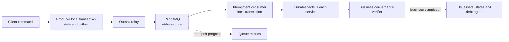
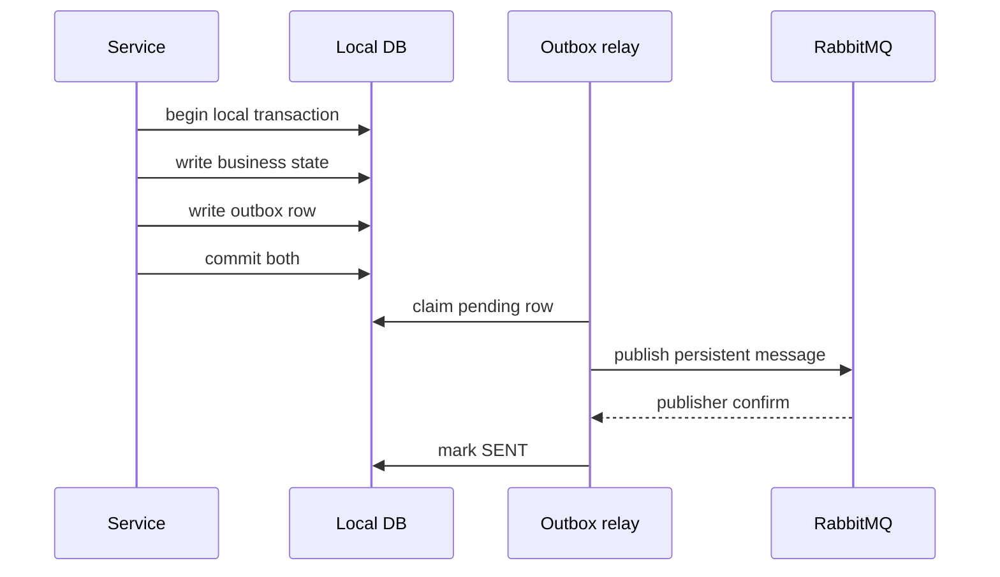
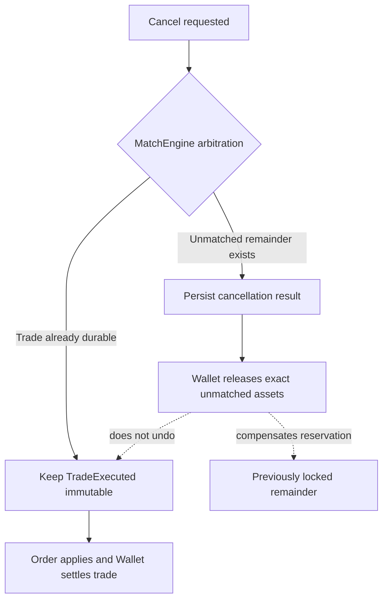

# 事件驅動一致性的五個核心問題

> 文件狀態：依 2026-08-27 workspace 的 CDA 架構與實作整理。本文負責解釋設計觀念；每個事件在 Order、Wallet、MatchEngine 的實際處理與失敗路徑，請搭配 [CDA 訂單事件完整生命週期](order-event-lifecycle.zh-TW.md) 閱讀。

## 怎麼閱讀，才能把記憶找回來

不要從 class name 或 pattern 名稱開始背。每次只挑一張 order，以同一套順序走四遍：

1. **先畫責任**：Order 擁有訂單生命週期，Wallet 擁有資產，MatchEngine 擁有撮合、取消訂單競爭結果與 durable trade。先問「這個事實誰有權決定？」
2. **再追提交點**：沿 happy path 找出每一個 local commit。每遇到 PostgreSQL commit、Redis reservation、Rabbit ACK，就說出它證明什麼、還沒有證明什麼。
3. **把 crash 插進每條箭頭**：依序想像「commit 前」、「commit 後 publish 前」、「publish 後 ACK 前」、「consumer commit 後 ACK 前」當機，找出 durable evidence 還留在哪裡。
4. **替回復手段分類**：它是 local rollback、retry、defer、reconciliation、compensation，還是 business reversal？如果只會回答「Saga 會處理」，代表還沒有理解到可操作的程度。

一個 20 分鐘的回憶練習：先關掉文件，手畫三個服務、RabbitMQ、Redis 與三個 PostgreSQL；寫出 `orderId`、`tradeId`、`cancellationId`；再任選一個故障點解釋「哪個事實已提交、誰能重做、怎麼避免重複效果」。最後才打開文件校正。能完成這個練習，比背出 Outbox 定義更接近真正理解。

## 架構判定

EAP 目前的 CDA 設計可以描述為：**各服務內使用本地 ACID transaction，服務之間使用 transactional outbox、RabbitMQ at-least-once delivery、冪等 consumer、retry／DLQ／reconciler 與外部對帳，讓流程最終收斂。**

這個說法有條件成立，條件是不能把下列概念混在一起：

- RabbitMQ 接受訊息，不等於 consumer 已完成本地交易。
- consumer 完成本地交易，不等於其他服務都已完成。
- queue 暫時為零，不等於整筆交易已滿足業務不變量。
- outbox 提升事件發布可靠性，不等於 exactly-once，也不會自動修正錯誤的業務語意。
- Saga compensation 是新的、可追蹤的業務動作，不是跨服務 database rollback。

## 先用 DDD、CQRS 與 Event Sourcing 定位問題

### DDD 先問語言與責任，不是先切 microservice

[Eric Evans 的 DDD Reference](https://www.domainlanguage.com/ddd/reference/) 和 [Martin Fowler 對 Bounded Context 的整理](https://martinfowler.com/bliki/BoundedContext.html) 都把重點放在模型適用的邊界：同一個詞在不同 context 可以有不同模型，但 context 之間必須有明確關係。套回 EAP：

| Context | 它能決定的事實 | 其他服務只能如何使用 |
| --- | --- | --- |
| Order | 命令是否被接受、訂單目前生命週期 | 接收 Wallet／Match 的事實後更新自己的 order model，不能自己推算餘額或成交權威結果 |
| Wallet | available／locked asset、reservation、settlement | 根據 order／trade／cancellation identity 套用資產效果，不能決定 order book 狀態 |
| MatchEngine | order book 競爭、durable trade、取消訂單結果 | 發布成交或 unmatched remainder；不能直接修改 Wallet balance 或 Order projection |

這就是為什麼 EAP 不讓 Order 同步查 Wallet DB 後自行扣款，也不讓 Wallet 看到取消請求就猜剩餘量。服務切分的價值不是部署數量，而是讓「誰能宣布某個事實」沒有兩個答案。

### EAP 的 CQRS 是 Order 內的局部設計

[Fowler 對 CQRS 的原始說明](https://martinfowler.com/bliki/CQRS.html) 是把更新模型與顯示模型分開；[Microsoft 的 CQRS pattern](https://learn.microsoft.com/en-us/azure/architecture/patterns/cqrs) 也明確指出兩者可以共用同一個 datastore，或再進一步使用不同 datastore。EAP 目前採用前者：

- **Command side** 以 order event stream、stream head 與 `order_matching_state` 驗證版本、owner、remaining amount 和可否取消；命令成功時 append domain event，需要跨服務通知時同時寫 outbox。
- **Query side** 由 `OrdersCurrentProjector` 依 `global_position` 讀取 event store，更新可重建的 `orders_current`；`OrderQueryService` 直接查這張為使用者列表塑形的表。
- **物理部署** 仍預設是同一個 Order PostgreSQL。Projector 有獨立 datasource／connection pool，但 query service 現在仍使用 primary `JdbcTemplate`；所以這是 logical CQRS，不是 read replica，也不是完全獨立的 read database。

這樣做的原因是命令模型需要 concurrency control、event identity 和不變量，查詢模型需要依 user／status 快速列出現在狀態；硬用同一個 object／SQL 同時服務兩種需求會互相牽制。影響則是讀取可能落後 event store，projection 需要 checkpoint、版本檢查、重建與 lag 監控；同一個 PostgreSQL 也代表兩邊仍共享 CPU、I/O 與 lock 資源，獨立 pool 只隔離 connection budget，不等於基礎設施隔離。完整機制見生命週期文件的「Order 的 CQRS／讀寫分離」一節。

### Event-driven 不等於 Event Sourcing

[Fowler 對 Event Sourcing 的定義](https://martinfowler.com/eaaDev/EventSourcing.html) 是以事件序列保存狀態的每一次變更，並能由事件重建目前狀態。EAP 只有 **Order bounded context** 符合這個局部模型：

- `OrderSubmissionRequestedV1`、`OrderAssetReservationConfirmedV1`、`OrderMatchedV1` 等是 Order 的 domain event，保存在 Order event store。
- `OrderSubmittedEvent`、`OrderAssetReservationSucceededEvent`、`TradeExecutedEvent` 等是跨 bounded context 的 integration event，透過 outbox／RabbitMQ 傳遞。
- outbox 是「待發布意圖」，不是 event store；RabbitMQ 是 transport，也不是業務歷史的 source of truth。
- Wallet 的 balance／ledger 與 MatchEngine 的 trade tables 雖然會消費、發布事件，現況不能因此被稱為 event-sourced。

這三個概念的因果關係是：DDD 先決定 ownership；Order 在自己的 context 內選擇 CQRS／Event Sourcing；跨 context 的流程才以 integration event 和 Saga 串接。不要反過來因為用了 RabbitMQ，就推論整個系統自然具有 DDD、CQRS 或 Event Sourcing。

## 1. 為什麼這不是 distributed transaction

### 先定義 distributed transaction

分散式交易通常代表多個資源參與同一個全域交易，並由協調機制保證它們共同 commit 或共同 rollback。典型例子是 two-phase commit（2PC）：Order DB、Wallet DB 等參與者先 prepare，再由 coordinator 決定全部提交或全部取消。

EAP 沒有這個全域交易邊界：

- Order、Wallet、MatchEngine 各自擁有獨立 PostgreSQL。
- MatchEngine 還同時使用 Redis 保存 order book 與 reservation。
- RabbitMQ 是非同步傳輸媒介，不參與三個資料庫的共同 commit。
- 沒有 transaction coordinator、prepare phase 或 global transaction ID 來命令所有資源共同 commit／rollback。
- 每個服務可以先提交自己的事實，其他服務稍後才看到並處理，因此中間狀態會對系統可見。

例如 Order 接受下單並提交後，Wallet 可能尚未驗資；MatchEngine 寫入 `trade_executions` 後，Order 的成交套用與 Wallet 的資產結算也可能尚未完成。這些暫時不一致不是違反目前架構，而是 eventual consistency 的正常狀態。系統要做的是讓它可偵測、可重試、可收斂，不能假裝中間狀態不存在。

### EAP 實際提供的是什麼

| 邊界 | 提供的保證 | 失敗時的處理 |
| --- | --- | --- |
| 單一 PostgreSQL transaction | 本服務 state、冪等紀錄與 outbox／application 一起 commit 或 rollback | 本地 rollback 後重試 |
| 單一 Redis Lua script | 同一個 order book 操作內的競爭判定不可被插入 | 依 reservation 與 durable trade reconciliation |
| PostgreSQL 與 RabbitMQ 之間 | outbox row 先 durable commit，relay 之後反覆發布 | relay retry、terminal `FAILED` 告警與受控處理 |
| 服務與服務之間 | 透過事件、冪等、補償與對帳最終收斂 | listener retry、DLQ、inbox／reconciler 或人工 recovery |

所以它是「分散式業務流程」，但不是「分散式 ACID transaction」。Saga 也不會把它變成 distributed transaction；Saga 是把一個跨服務流程拆成多個本地交易，必要時再執行後續補償。

### 為什麼刻意不使用 distributed transaction

- PostgreSQL、Redis 與 RabbitMQ 不適合被假設為一個共同、可攜且可靠的 ACID 資源。
- 長時間持有跨服務鎖會放大延遲、降低可用性，也讓一個服務的問題阻塞整條鏈。
- 各 bounded context 應只提交自己擁有的資料，不應讓另一個服務直接參與或控制它的 database transaction。
- 交易系統更需要保留每一步已發生事實與修復軌跡；把所有事情包成一次不可觀測的「成功／失敗」反而會隱藏營運責任。

代價是系統必須明確處理 intermediate state、duplicate、out-of-order、retry debt、terminal failure 與 reconciliation。這些不是免費得到的能力。

### 常見錯誤說法與精確說法

| 不精確 | 精確 |
| --- | --- |
| 「RabbitMQ 幫三個服務做 transaction。」 | RabbitMQ 傳遞事件；每個服務只在自己的資料庫內做 transaction。 |
| 「用了 Saga，所以可以一起 rollback。」 | Saga 以一連串本地交易與補償動作收斂，沒有共同 rollback。 |
| 「最後一致，所以中間錯誤不用管。」 | 中間狀態必須有 correlation ID、retry state、告警與修復路徑。 |

## 2. Outbox 解決什麼、不能解決什麼

### 它解決的是 producer 的 dual-write failure window

若 producer 先更新 database，再直接 publish RabbitMQ，會有兩個危險順序：

1. database commit 成功，process 在 publish 前當機：本地狀態存在，但事件永遠沒送出。
2. 先 publish，database transaction 後來 rollback：下游看見一個其實沒有成立的事實。

Transactional outbox 把「本地狀態」和「待發布事件」寫進**同一個本地 database transaction**。兩者一起 commit，或一起 rollback。commit 後由 relay 讀取 outbox，再發布到 RabbitMQ。

這能保證：只要業務事實已經以正確程式路徑 commit，相對應的發布意圖也已 durable 保存；RabbitMQ 暫時不可用或服務重啟時，relay 仍能重試。

### 它不能提供 exactly-once publish

存在一個無法用單一 database transaction 消除的窗口：

1. relay 已成功 publish，broker 也接受訊息。
2. relay 在 outbox row 標成 `SENT` 前當機，或 confirm response 遺失。
3. 重啟後 relay 看到 row 仍是 `PENDING`／可重試狀態，再發布一次。

因此 outbox 的合理合約是 **at-least-once publish**。它選擇「可能重複，但不要靜默遺失」，然後把重複交給 consumer 的 idempotency 處理。

### Outbox 能與不能處理的邊界

| Outbox 能處理 | Outbox 不能單獨處理 |
| --- | --- |
| state 與 outbox insert 的本地原子性 | 跨服務共同 commit／rollback |
| broker 暫時不可用後重新發布 | exactly-once delivery 或 exactly-once business effect |
| process 重啟後找回尚未送出的發布意圖 | consumer 是否正確處理、是否已完成 |
| 保存 payload、attempt、status 供稽核 | event schema／內容本身寫錯 |
| 配合 publisher confirm 判斷 broker 是否接受 | unroutable、poison message、DLQ 的自動業務判讀，除非另行設計 |
| 配合 backoff 處理暫時故障 | 無限重試仍無法修復的永久錯誤 |

特別要注意三種常被混稱為「訊息沒進 outbox」的情況：

1. **同一筆 transaction 中 outbox insert 失敗**：business state 也 rollback，這正是 outbox 解決的問題。
2. **state 和 outbox 已 commit，但還沒 publish**：row 留在待發布狀態，relay 可以恢復。
3. **程式碼根本沒有建立 outbox，或設定關閉 outbox write**：database 不知道本來應該有一個 event，relay 無從恢復。這是 semantic omission／configuration bug，只能靠 invariant、測試、reconciliation 與受控 backfill 找出並修正。

Outbox 也不能解決 client 的 response ambiguity。若 database 已 commit，但 HTTP response 回到 client 前連線中斷，client 仍不知道命令是否成功；這需要獨立的 client-visible idempotency key 與第一次 response 保存合約。

## 3. at-least-once 為何需要 idempotency

### 重複不是例外，而是交付模型的一部分

At-least-once 的承諾是：只要持續恢復與重試，訊息至少有機會被處理一次；它不承諾只出現一次。duplicate 可能來自：

- outbox publish 成功，但 `SENT` 尚未 commit。
- consumer 本地 transaction 已 commit，但 ACK 尚未送達 broker。
- consumer process 在 commit 與 ACK 之間當機。
- network timeout 讓 producer／consumer 無法判斷上一次操作結果。
- 營運人員從 DLQ 或 outbox 受控 replay。

如果 consumer 每次收到訊息都再次扣款、增加成交量或釋放資產，可靠重送反而會破壞正確性。因此 delivery semantics 與 state transition semantics 必須分開：訊息可以來很多次，同一個業務效果只能成立一次。

### 正確的冪等不是單純「看過就 return」

安全的 consumer 通常要在同一筆本地 transaction 內：

1. 以穩定 business identity claim 或插入唯一 application record。
2. 驗證相同 identity 的 immutable payload 沒有衝突。
3. 寫入本地業務狀態。
4. 若還要發下一個事件，同時寫入本服務 outbox。
5. commit 成功後才讓 listener ACK。

若「已處理標記」先 commit，但業務效果後來失敗，重送會被錯誤略過；若業務效果先 commit，冪等標記卻沒成功，也會在重送時重複套用。兩者必須共享本地 transaction 或以等價的唯一約束保護。

EAP 使用的 identity 依業務事實而不同：

| 事實 | 主要 identity | 要阻止的重複效果 |
| --- | --- | --- |
| 下單／驗資 | `orderId`／event identity | 重複鎖定同一張訂單的資產 |
| 成交 | `tradeId` | Order 重複扣 remaining、Wallet 重複結算 |
| 取消訂單 | `cancellationId` 加 order／owner identity | 重複裁決或重複釋放 unmatched remainder |

相同 ID、相同 immutable payload 可以視為 replay；相同 ID 卻帶不同 order、數量或價格是 conflict，不能當成「已處理」而靜默吞掉。

### 能宣稱到哪裡

`at-least-once delivery + idempotent local transition` 可以得到接近 **effectively-once business effect** 的結果，但不能改稱 exactly-once messaging：

- broker 或 relay 仍可能實際傳送多次。
- duplicate request 仍會消耗 network、queue、CPU 與 database unique-check 容量。
- 外部不可逆 side effect 若沒有自己的 idempotency contract，仍可能重複。
- 不同 event 的 out-of-order 不是 idempotency 本身能解決，需要 prerequisite state、inbox 或 reconciler。

## 4. Rabbit queue 清空為何不等於 business complete

### Queue 只回答 transport backlog 的局部問題

某個 queue 的 `ready = 0` 與 `unacked = 0`，最多表示在那個觀測瞬間，該 queue 沒有等待投遞或處理中的訊息。它沒有證明：

- producer 的 outbox 都已發布；事件可能還停在 `PENDING`／`FAILED`。
- 訊息曾被正確 route 到所有必要 queue；也可能根本沒建立、被丟到 DLQ 或送錯 routing key。
- 其他 fan-out queue 也處理完成；Order queue 空，不代表 Wallet queue 空。
- consumer ACK 前後的本地 durable state 正確且滿足業務不變量。
- consumer 把工作轉存進 durable inbox 後已真正套用；broker queue 可以先清空，但 inbox 仍在等 prerequisite。
- Redis reservation、cleanup task、cancellation decision 或其他 service-owned retry debt 已收斂。
- 沒有新訊息正準備 publish；queue depth 是會競爭變動的瞬時值。

最極端的反例是：producer 因 bug 完全沒建立 outbox，所有 queue 從頭到尾都是零，但業務流程根本沒有開始。另一個反例是 poison message 已 dead-letter，原 queue 也會歸零，卻顯然不是成功完成。

### EAP 的 business-complete 必須從 durable facts 定義

對一筆 CDA 成交，至少要能證明：

1. MatchEngine 已保存唯一、不可變的 durable `tradeId`。
2. Order 已對 buyer／seller order 各自套用該成交，remaining amount 與狀態合理。
3. Wallet 已以相同 `tradeId` 完成一次結算。
4. buyer／seller 的 available／locked 資產、energy 與 price improvement 守恆。
5. 與這筆流程相關的 outbox、inbox、cleanup、cancellation pending 或 terminal failure 已排除。

對一整次壓測 campaign，還要再證明：

- MatchEngine、Order、Wallet 的 durable `tradeId` **集合**一致，而不只是 count 碰巧相同。
- workload 的 offered、scheduled、sent、HTTP accepted、rejected／dropped 定義清楚。
- 所有相關 Rabbit queues 的 ready／unacked 與 DLQ 已清空。
- outbox `PENDING`／`IN_FLIGHT`／`FAILED`、Order inbox retry debt、Match cleanup／reservation debt 已清空。
- 輸入停止後允許的 drain window、資料觀測時間點與預期未成交 remainder 有明確說明。

因此「queue 清空」是 business-complete 的必要觀測之一，但不是充分條件。更精確地說：

> Queue depth 告訴我 transport 是否仍有可見 backlog；跨服務 durable fact、資產不變量與 retry debt 才告訴我業務是否收斂。

## 5. Saga compensation 為什麼不是 rollback 已成交交易

### Local rollback、compensation、business reversal 是三件事

| 概念 | 發生時機 | 語意 |
| --- | --- | --- |
| Local transaction rollback | 本地 transaction 尚未 commit | 本服務這一步從未成立，不留下部分更新 |
| Saga compensation | 某些前置步驟已 commit，但流程不能照原方向繼續 | 新增一個反向或釋放動作，抵銷仍可撤銷的效果，並保留歷史 |
| Business reversal／correction | 已成立的業務事實之後需要修正 | 建立新的更正、沖銷或反向交易，不刪除原始事實 |

已成交交易一旦在 MatchEngine durable commit，`TradeExecuted` 就是已發生事實。它可能已被 Order 套用、Wallet 結算、外部觀測或用於後續決策。此時沒有一個跨三個服務的 transaction 可以把所有歷史倒轉到「從未成交」，也無法撤回已被其他 actor 看見的事實。

直接刪除成交或把狀態改回去會造成幾個問題：

- 破壞 append-only audit trail，無法說明資產為何曾改變。
- 無法保證所有 consumer 都同步倒退，也無法撤回已送達的 event。
- late／duplicate event 可能再次把舊成交套用回來。
- 取消訂單會和成交競爭，錯誤 rollback 可能釋放已經交割的資產，造成 double spend。

### EAP 的 compensation 實際補償什麼

- Wallet 驗資失敗時，不是回滾其他服務；它不保留資產，發布終止事實讓 Order 記錄失敗。
- MatchEngine 在 Redis 已 reserve、但 trade DB transaction 尚未成功時，恢復自己擁有的 reservation／order book 狀態。因為 durable trade 尚未成立，這仍是失敗復原，不是撤銷成交。
- 取消成功時，只釋放 authority 判定出的 **unmatched remainder**。已 durable 成交的 matched quantity 繼續由 Order 與 Wallet 套用。
- cleanup task 與 reservation reconciler 修復 Redis 與 Match PostgreSQL 的 crash window，不會假裝替 Order 或 Wallet rollback。

把 EAP 的機制精確分類，會比全部叫「補償」更容易記：

| EAP 情境 | 正確分類 | 已提交什麼 | 回復動作真正做什麼 |
| --- | --- | --- | --- |
| state 與 outbox 同一 transaction，outbox insert 失敗 | local rollback | 尚未提交 | 整筆交易不成立，讓原操作重做 |
| broker 暫時不可用，outbox 保留 `PENDING` | retry | producer fact 與發布意圖 | 反覆嘗試傳遞同一事實，不反轉業務 |
| Trade 早於 Order confirmation 抵達 | defer／reconcile | Match trade 已成立；Order prerequisite 未齊 | durable inbox 等 prerequisite 後再向前套用 |
| Redis 已 reserve，但 Match trade DB 尚未 commit 就失敗 | technical compensation／failure recovery | 沒有 durable trade | 把 Match 自己暫時拿走的 reservation 放回 order book |
| Match trade 已 commit，Redis cleanup 尚未完成 | roll-forward reconciliation | durable trade 已成立 | 依 durable trade 完成 cleanup，不撤銷成交 |
| 取消成功後 Wallet 釋放 unmatched remainder | business compensation | 原資產 reservation 與取消結果已成立 | 以新、冪等且可稽核的 application 釋放未成交鎖定額 |
| 已成立成交後發現業務錯誤 | business reversal（目前未實作） | durable trade 已成立且可能已結算 | 建立新的 reversal／adjustment 事實，不刪除舊 trade |

[Microsoft 的 Saga pattern](https://learn.microsoft.com/en-us/azure/architecture/patterns/saga) 把步驟區分為 compensable、pivot 與 retryable transaction。映射到 EAP 時，可以把 MatchEngine 成功提交 `trade_executions` 與 trade outbox 視為成交流程的 **pivot／不可再當作未成交處理的界線**。這是用該模型解釋 EAP 的判讀，不是程式裡存在一個名為 pivot 的元件。pivot 之前可恢復 reservation；pivot 之後 Order、Wallet 與 Redis cleanup 都必須 roll forward，若要修正則新增 reversal。

Saga 也沒有自動提供 isolation。EAP 用 Redis Lua 處理 match／cancel 競爭、Wallet row lock／atomic CTE 保護資產、unique business identity 吸收 duplicate、market sequence／aggregate version 偵測順序，以及 Order inbox 等待 prerequisite。這些才是流程在併發下不會互相踩壞的具體設計；「用了 Saga」本身不是隔離保證。

若未來真的要處理錯誤成交，應設計新的 `TradeReversed`／adjustment 類型與嚴格 authority、correlation、ledger entry、冪等及稽核規則，而不是刪除 `TradeExecuted` 或對三個 database 做假 rollback。這是新的業務能力；目前 EAP 的取消訂單流程不等同於成交沖銷。

## 把五題串成一個完整因果關係

1. 因為沒有跨 PostgreSQL、Redis、RabbitMQ 的 distributed transaction，所以每個服務只能可靠提交自己的本地事實。
2. 為避免「本地已 commit、事件卻遺失」的 dual-write 問題，producer 使用 transactional outbox。
3. Outbox relay 與 broker retry 會帶來 duplicate，因此 consumer 必須用 business identity 做冪等本地轉換。
4. 訊息被 ACK 或 queue 歸零只代表傳輸進度；整體是否完成仍要核對各服務 durable facts、資產不變量及所有 retry debt。
5. 若流程已部分提交，Saga 只能以新的補償動作向前收斂；對已成立成交保留事實，取消只處理尚未成交的 remainder。

這五點共同構成同一個設計，不是五個互不相關的 pattern。

## 面試／1-on-1 的兩分鐘回答

> 我的系統不是 distributed transaction。Order、Wallet、MatchEngine 各自只在自己的 PostgreSQL 做 ACID transaction，RabbitMQ 和 Redis 也沒有參與一個全域 commit，所以中間狀態可能存在。我用 transactional outbox 解決本地狀態與事件發布的 dual-write：狀態和發布意圖一起 commit，再由 relay 重試送出；但 publish 成功和標記 `SENT` 之間仍有重複窗口，所以它不是 exactly-once。
>
> 因為 delivery 是 at-least-once，consumer 必須用 order ID、trade ID、cancellation ID，在同一個本地 transaction 內去重並套用效果，得到 effectively-once 的本地狀態轉換。即使 Rabbit queue 為零，也只代表 transport 暫時沒有 backlog；我還要比對 Match、Order、Wallet 的 trade ID 集合、資產守恆，以及 outbox、inbox、DLQ、cleanup debt 才能說 business complete。
>
> Saga 的補償也不是把已成交交易 rollback。成交一旦 durable 就是不可變事實；取消只釋放尚未成交的 reservation。若真的需要沖銷成交，必須新增一筆可稽核、可冪等的 reversal，而不是刪除歷史。這個設計接受 eventual consistency，但要求每個不一致窗口都有 identity、重試、補償或對帳出口。

## 主管繼續追問時的自我檢查

- 若 outbox 永久 `FAILED`，誰收到告警、誰能安全 replay，如何避免 poison event 無限循環？
- 每一種 consumer 是否都把冪等紀錄和業務效果放在同一個 local transaction？
- ACK 是在 durable commit 後發生，還是可能先 ACK 再失敗？
- 相同 identity、不同 payload 時，是明確 conflict 還是被錯當 duplicate？
- 哪些 consumer 只有 broker retry／DLQ，哪些另有 durable inbox 與 reconciler？
- 如何從 order／trade／cancellation ID 找出一條流程的所有 durable facts 與 debt？
- business-complete 是針對單筆訂單、單筆成交，還是整次 benchmark？三者的 invariant 是否分開定義？
- compensation 的 authority 是誰？它只修改自己擁有的狀態，還是越界替其他服務決定結果？
- 若要支援成交沖銷，是否已有獨立的 ledger、event contract、權限與 audit 設計？若沒有，就不能把取消訂單宣稱成 rollback trade。

## 目前已知的工程缺口

這些缺口不否定現有設計；把它們說清楚，反而表示知道 pattern 的保證邊界：

Wallet reservation 的具體改善計畫、依賴與 Definition of Done 已記錄在 [Wallet 驗資可靠性與 Saga 自動恢復 ticket](features/wallet-reservation-reliability-and-saga-recovery.zh-TW.md)。

- Redis 全量資料遺失後，尚沒有由 PostgreSQL 自動重建完整 order book 並通過 readiness gate 的完整流程；現有 reconciler 主要修復局部 reservation crash window。
- Wallet 的 reservation 與 cancellation-result consumer 已使用 service-owned durable inbox；`TradeExecutedEvent` settlement 仍使用獨立的本地交易、`trade_id` 冪等、短期 Rabbit retry 與 DLQ，尚未納入同一套 lease inbox。
- shared DLQ 尚未形成帶分類、審核、payload conflict 檢查與受控 replay 的 recovery control plane。
- Wallet 有預設關閉的 failed-outbox admin recovery；Order／Match 的 terminal outbox recovery 仍較依賴告警、runbook 與資料庫操作。
- client 在「commit 後、HTTP response 前」斷線時仍有結果不確定性；完整解法需要 client-visible idempotency key 與第一次 response 保存。
- CQRS projection 有 checkpoint 與 repair，但仍需要明確的 lag SLO／告警；query service 遇到資料庫例外目前回空集合，也可能讓 read-side 故障看起來像「沒有訂單」。

## 建議的外部閱讀順序

先用短篇原始資料建立判斷框架，再回 EAP 找一個具體證據；不必一開始逐頁讀完所有書：

1. **模型與邊界**：讀 [DDD Reference](https://www.domainlanguage.com/ddd/reference/) 與 [Bounded Context](https://martinfowler.com/bliki/BoundedContext.html)，回來回答「Order、Wallet、Match 對 `order` 各自看見什麼」。書籍再選讀 Eric Evans 的 [Domain-Driven Design](https://www.informit.com/store/domain-driven-design-tackling-complexity-in-the-heart-9780321125217) strategic design 章節，或 Vaughn Vernon 的 [Implementing Domain-Driven Design](https://www.pearson.com/en-us/subject-catalog/p/implementing-domain-driven-design/P200000009616/9780321834577) bounded context／aggregate 章節。
2. **讀寫模型與歷史**：讀 Fowler 的 [CQRS](https://martinfowler.com/bliki/CQRS.html) 與 [Event Sourcing](https://martinfowler.com/eaaDev/EventSourcing.html)，回來辨認 `order_event_store`、`order_stream_heads`、`order_matching_state`、`orders_current` 各自服務哪個問題。
3. **跨服務一致性**：讀 AWS 的 [Transactional Outbox](https://docs.aws.amazon.com/prescriptive-guidance/latest/cloud-design-patterns/transactional-outbox.html)、Chris Richardson 的 [Saga](https://microservices.io/patterns/data/saga.html) 與 [Idempotent Consumer](https://microservices.io/patterns/communication-style/idempotent-consumer.html)，回來逐一找 EAP 的 duplicate window、business identity 與 compensation authority。系統化書籍可讀 Richardson 的 [Microservices Patterns](https://www.manning.com/books/microservices-patterns)。
4. **失敗與營運**：讀 Google SRE 的 [Addressing Cascading Failures](https://sre.google/sre-book/addressing-cascading-failures/)；它提醒 retries 會放大過載，應使用 backoff、jitter、retry budget，且永久錯誤要 fail fast。回來檢查 EAP 哪些 retry 有界、哪些 debt 會告警、哪些仍可能 hot-loop。
5. **服務邊界與可維運性**：Sam Newman 的 [Building Microservices](https://samnewman.io/books/building_microservices/) 適合用來反問：如果每個服務真的獨立部署，ownership、觀測、schema evolution 和 recovery runbook 是否也獨立成立。

每讀完一篇，只產出三句筆記：「作者要解決的 failure 是什麼」、「pattern 不保證什麼」、「EAP 哪一個 table／listener／reconciler 是證據」。這能避免把讀書變成名詞收集。

## 搭配閱讀

1. [CDA 訂單事件完整生命週期](order-event-lifecycle.zh-TW.md)：把本文觀念映射到每一個服務、listener、retry、outbox／inbox 與取消分支。
2. [系統架構](architecture.zh-TW.md)：服務 ownership、CDA／TDA 能力邊界與一致性模型。
3. [面試快速入口](interview-guide.zh-TW.md)：專案功能、效能證據與可快速展開的故事。
4. [效能報告](performance-report.md)：business-complete 如何成為壓測 correctness gate，而不只看 HTTP TPS 或 queue depth。
