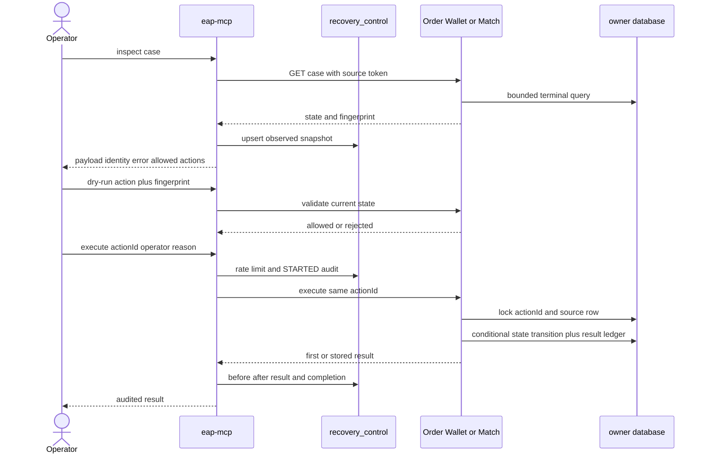
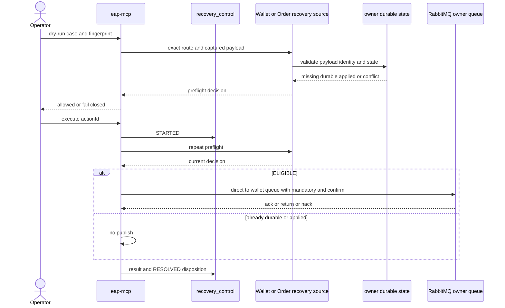

# Failure Recovery Control Plane 操作與實作指南（REL-106）

這份文件說明 EAP 如何把 terminal debt 從「告警後手動下 SQL」提升成受保護的單筆 recovery
流程。基本 ownership 決策先看 [ADR-005](adr/ADR-005-failure-recovery-control-plane.zh-TW.md)，
shared DLQ 條件式重播看
[ADR-006](adr/ADR-006-owner-aware-shared-dlq-replay.zh-TW.md)；durable debt 的定義先看
[Durable Debt SLO](durable-debt-slo.zh-TW.md)。

## 它解決什麼

Control plane 統一列出五類 debt：

| 類型 | 來源 | 第一版能做什麼 |
|---|---|---|
| `INBOX_TERMINAL` | 三個服務的 durable inbox／cancellation workflow | inspect；暫時性耗盡可 replay；其餘 park／resolve |
| `OUTBOX_TERMINAL` | Order、Wallet、Match outbox | inspect；條件式重設為 `PENDING` |
| `CLEANUP_TERMINAL` | Match reservation cleanup／reconciliation | technical exhausted 可回原 worker；ownership conflict 不可 replay |
| `SAGA_TIMEOUT` | Order warning-only detector | inspect、park、resolve；不自動取消或補償 |
| `BROKER_DEAD_LETTER` | shared `order.dlq` quarantine | inspect、park、resolve；allowlisted transient Wallet／Order trade 可經 owner preflight 後 replay |

它不解決 producer 根本沒建立 outbox、Redis 全量重建、跨服務 atomic commit，也不會替人判斷
哪一份 identity conflict payload 才是真的。

## 一次操作的完整流程



如果 Owner 已完成但 response 遺失，operator 必須重送完全相同的 actionId、case、fingerprint、
operator 與 reason。中央會沿用第一次 audit；Owner 則從 `recovery_source_actions` 回傳第一次
結果。換新的 actionId 代表新的操作意圖，不是 network retry。

## 各服務實際重開方式

| Owner work | Replay 前提 | 執行結果 |
|---|---|---|
| Order reservation result／asset release inbox | `FAILED_PERMANENT`、無 conflict、`RETRY_EXHAUSTED_%` | `FAILED_RETRYABLE`，清 lease／error，交回 inbox worker |
| Order event outbox | `FAILED` | `PENDING`、attempt 歸零，交回 relay |
| Wallet 三種 message inbox | 同上，且 message identity 未 conflict | `FAILED_RETRYABLE`，交回 Wallet reconciler |
| Wallet outbox | `FAILED` | `PENDING`，交回 Wallet outbox relay |
| Match order admission | retry exhausted、無 identity conflict | `PENDING`，交回 admission worker |
| Match trade outbox | `FAILED` | `PENDING`，交回 trade relay |
| Match reservation cleanup | `FAILED`＋`RETRY_EXHAUSTED_%` | `PENDING`，清 claim token，交回 fenced cleanup worker |
| Match cancellation | `FAILED_TERMINAL`＋`RETRY_EXHAUSTED_%` | `PENDING`，交回 cancellation reconciler |
| Match reservation reconciliation | transient terminal | `RETRYABLE`，交回 reconciler |

注意「交回 worker」和「直接修好」不同。Control plane 不執行 domain mutation；原 worker
仍要重新取得 lease、跑 idempotency guard 並在自己的 local transaction 完成。

## Shared DLQ 的條件式重播

目前開放的是 `wallet.tradeExecuted.queue` 與 `order.tradeExecuted.queue` 的
`TradeExecutedEvent`。MCP 必須從 broker `x-death` 同時核對 source queue、
`trade.exchange`、`trade.executed`，failure class 也必須是明確的 transient；owner 由 exact
topology allowlist 決定，不會解析 JSON 後猜測。



Owner 回覆 `ALREADY_DURABLE` 或 `ALREADY_APPLIED` 時，execute 是安全 no-op，不會為了「真的
按過重播」而再次送訊息。Wallet 查 `message_inbox`；Order 因 happy path 不一定寫 recovery
inbox，必須同時查 `order_trade_execution_inbox` 與 `order_trade_applications`。identity
conflict、permanent failure、invalid payload、unknown route 一律拒絕。真正 publish 時只送回
owner queue，不回送 topic exchange；publisher return、nack 或 timeout 會保留失敗狀態。
完整理由見 ADR-006。

## API 與保護

中央入口位於 `eap-mcp`：

- `GET /internal/recovery/v1/cases?limit=50`
- `GET /internal/recovery/v1/cases/{caseId}`
- `POST /internal/recovery/v1/cases/{caseId}/dry-run`
- `POST /internal/recovery/v1/cases/{caseId}/actions`
- `GET /internal/recovery/v1/actions/{actionId}`

所有中央請求需要 `X-EAP-Recovery-Operator-Token`。Execute 另需 `X-EAP-Operator`，body 必須有
UUID `actionId`、`action`、inspect 得到的 `expectedFingerprint` 與具體 `reason`。

Source endpoint 同路徑但在各服務內，使用 `X-EAP-Recovery-Source-Token`；它只應讓中央服務
存取。兩層 endpoint 預設皆 disabled，且不能把空 token 當有效設定。

範例設定使用環境變數，不把秘密寫進 repository：

```yaml
eap:
  recovery-source:
    enabled: ${EAP_RECOVERY_SOURCE_ENABLED:false}
    token: ${EAP_RECOVERY_SOURCE_TOKEN}
```

```yaml
eap:
  recovery-control:
    enabled: ${EAP_RECOVERY_CONTROL_ENABLED:false}
    operator-token: ${EAP_RECOVERY_OPERATOR_TOKEN}
    source-token: ${EAP_RECOVERY_SOURCE_TOKEN}
    max-actions-per-operator-minute: 10
    broker-dlq:
      enabled: ${EAP_RECOVERY_BROKER_DLQ_ENABLED:false}
      replay-confirm-timeout-ms: 5000
```

`EAP_RECOVERY_CONTROL_ENABLED=true` 會一併啟用 control-plane Liquibase migration 與 DB
health check；也可用 `EAP_RECOVERY_DB_ENABLED` 明確覆寫。只有在明確接受「將 shared DLQ
搬到 PostgreSQL quarantine」的操作語意後，才能打開 `EAP_RECOVERY_BROKER_DLQ_ENABLED`，
且必須確保 recovery DB migration 已啟用。這不是純觀察開關。

## Operator runbook

1. 先 list，確認 source 是否全部可達；partial response 的 `sourceErrors` 不能忽略。
2. inspect payload、identity、attempt、first／last error 與 failure class。
3. 修復 prerequisite 或 dependency；不要把 replay 當修復本身。
4. 用最新 fingerprint dry-run。
5. 為這次意圖產生一個 actionId，填寫能被事後理解的 reason。
6. execute；若 response 不確定，只能重送同 actionId。
7. 查 action audit，確認 status、attempt、before／after 與結果。
8. 再查 owner durable debt 與 business invariant；`APPLIED` 只代表 recovery command 已被 owner
   接受，不等於整條 Saga business complete。

## 資料表

中央 `recovery_control` schema：

- `recovery_cases`：最近一次觀察、fingerprint、PARK／RESOLVE disposition。
- `recovery_actions`：operator、reason、attempt、before／after、result、錯誤與時間。
- `broker_dead_letters`：shared DLQ 的原文、Base64 body、headers、route、failure class 與 x-death count。

Owner schema：

- `order_service.recovery_source_actions`
- `wallet_service.recovery_source_actions`
- `match_engine.recovery_source_actions`

這些 action table 不在正常訂單路徑上，只服務低頻人工 recovery。

## 已驗證與尚未驗證

2026-09-17 已通過：共同 contract unit test、中央 service unit test、中央 PostgreSQL audit／
broker quarantine integration test，以及 Order／Wallet／Match 各自的 PostgreSQL（Match 另含
Redis）replay policy 與 actionId idempotency test。所有既有 repo unit tests也通過。

2026-09-18 再通過 Wallet 一般 test task `113` cases（其中 `37` 個 integration cases 依
task 分流而 skipped）、`54` PostgreSQL integration；Order 一般 test task `213` cases（其中
`58` 個 integration cases 分流 skipped）、`58` PostgreSQL integration；MCP 一般 test task
`23` cases（其中 `9` 個 integration cases 分流 skipped）、`7` PostgreSQL integration 與
`2` real Rabbit integration。所有 task 均為 `0` failures／`0` errors；被分流的案例已在各自
integration task 執行。這組證據涵蓋 Wallet／Order trade 的 business-state preflight、
same-message/different-consumer case identity、transient-only allowlist、owner dispatch、direct
owner queue 與 publisher confirm。

同日的 MCP process-crash campaign 另在 Rabbit confirm 後、central audit commit 前
`SIGKILL` 真實 JVM。重啟後以相同 actionId 從 attempt 1 恢復為 attempt 2；兩次 at-least-once
delivery 最終只形成一筆 Wallet inbox 與一筆 settlement，case 才從 `OPEN` 轉為 `RESOLVED`。

尚未宣稱完成的是 production RBAC／approval、Match 與非 TradeExecuted consumer 的
owner-specific redrive，以及跨 instance 分散式 operator quota。這些分別屬 EAP-SEC-304 與
後續 DLQ route 切片。confirm→audit 的真實 process-crash campaign 目前以 Wallet owner route
驗證；Order route 本輪完成 deterministic owner-state 與真實 Rabbit transport 驗證，沒有把它
誤寫成第二次 process-crash campaign。
