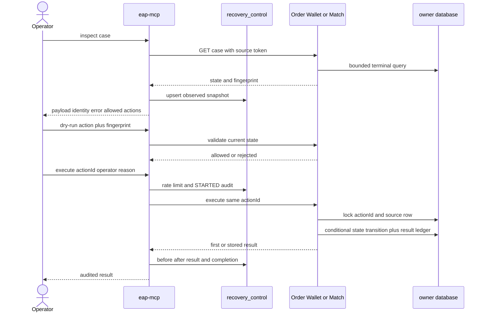

# Failure Recovery Control Plane 操作與實作指南（REL-106）

這份文件說明 EAP 如何把 terminal debt 從「告警後手動下 SQL」提升成受保護的單筆 recovery
流程。設計決策先看 [ADR-005](adr/ADR-005-failure-recovery-control-plane.zh-TW.md)；durable debt
的定義先看 [Durable Debt SLO](durable-debt-slo.zh-TW.md)。

## 它解決什麼

Control plane 統一列出五類 debt：

| 類型 | 來源 | 第一版能做什麼 |
|---|---|---|
| `INBOX_TERMINAL` | 三個服務的 durable inbox／cancellation workflow | inspect；暫時性耗盡可 replay；其餘 park／resolve |
| `OUTBOX_TERMINAL` | Order、Wallet、Match outbox | inspect；條件式重設為 `PENDING` |
| `CLEANUP_TERMINAL` | Match reservation cleanup／reconciliation | technical exhausted 可回原 worker；ownership conflict 不可 replay |
| `SAGA_TIMEOUT` | Order warning-only detector | inspect、park、resolve；不自動取消或補償 |
| `BROKER_DEAD_LETTER` | shared `order.dlq` quarantine | payload／header／route inspect、park、resolve；本版不 redrive |

它不解決 producer 根本沒建立 outbox、Redis 全量重建、跨服務 atomic commit，也不會替人判斷
哪一份 identity conflict payload 才是真的。

## 一次操作的完整流程



如果 Owner 已完成但 response 遺失，operator 必須重送完全相同的 actionId、case、fingerprint、
operator 與 reason。中央會沿用第一次 audit；Owner 則從 `recovery_source_actions` 回傳第一次
結果。換新的 actionId 代表新的操作意圖，不是 network retry。

## 各服務實際重開方式

| Owner work | Replay 前提 | 執行結果 |
|---|---|---|
| Order reservation result／asset release inbox | `FAILED_PERMANENT`、無 conflict、`RETRY_EXHAUSTED_%` | `FAILED_RETRYABLE`，清 lease／error，交回 inbox worker |
| Order event outbox | `FAILED` | `PENDING`、attempt 歸零，交回 relay |
| Wallet 三種 message inbox | 同上，且 message identity 未 conflict | `FAILED_RETRYABLE`，交回 Wallet reconciler |
| Wallet outbox | `FAILED` | `PENDING`，交回 Wallet outbox relay |
| Match order admission | retry exhausted、無 identity conflict | `PENDING`，交回 admission worker |
| Match trade outbox | `FAILED` | `PENDING`，交回 trade relay |
| Match reservation cleanup | `FAILED`＋`RETRY_EXHAUSTED_%` | `PENDING`，清 claim token，交回 fenced cleanup worker |
| Match cancellation | `FAILED_TERMINAL`＋`RETRY_EXHAUSTED_%` | `PENDING`，交回 cancellation reconciler |
| Match reservation reconciliation | transient terminal | `RETRYABLE`，交回 reconciler |

注意「交回 worker」和「直接修好」不同。Control plane 不執行 domain mutation；原 worker
仍要重新取得 lease、跑 idempotency guard 並在自己的 local transaction 完成。

## API 與保護

中央入口位於 `eap-mcp`：

- `GET /internal/recovery/v1/cases?limit=50`
- `GET /internal/recovery/v1/cases/{caseId}`
- `POST /internal/recovery/v1/cases/{caseId}/dry-run`
- `POST /internal/recovery/v1/cases/{caseId}/actions`
- `GET /internal/recovery/v1/actions/{actionId}`

所有中央請求需要 `X-EAP-Recovery-Operator-Token`。Execute 另需 `X-EAP-Operator`，body 必須有
UUID `actionId`、`action`、inspect 得到的 `expectedFingerprint` 與具體 `reason`。

Source endpoint 同路徑但在各服務內，使用 `X-EAP-Recovery-Source-Token`；它只應讓中央服務
存取。兩層 endpoint 預設皆 disabled，且不能把空 token 當有效設定。

範例設定使用環境變數，不把秘密寫進 repository：

```yaml
eap:
  recovery-source:
    enabled: ${EAP_RECOVERY_SOURCE_ENABLED:false}
    token: ${EAP_RECOVERY_SOURCE_TOKEN}
```

```yaml
eap:
  recovery-control:
    enabled: ${EAP_RECOVERY_CONTROL_ENABLED:false}
    operator-token: ${EAP_RECOVERY_OPERATOR_TOKEN}
    source-token: ${EAP_RECOVERY_SOURCE_TOKEN}
    max-actions-per-operator-minute: 10
    broker-dlq:
      enabled: ${EAP_RECOVERY_BROKER_DLQ_ENABLED:false}
```

`EAP_RECOVERY_CONTROL_ENABLED=true` 會一併啟用 control-plane Liquibase migration 與 DB
health check；也可用 `EAP_RECOVERY_DB_ENABLED` 明確覆寫。只有在明確接受「將 shared DLQ
搬到 PostgreSQL quarantine」的操作語意後，才能打開 `EAP_RECOVERY_BROKER_DLQ_ENABLED`，
且必須確保 recovery DB migration 已啟用。這不是純觀察開關。

## Operator runbook

1. 先 list，確認 source 是否全部可達；partial response 的 `sourceErrors` 不能忽略。
2. inspect payload、identity、attempt、first／last error 與 failure class。
3. 修復 prerequisite 或 dependency；不要把 replay 當修復本身。
4. 用最新 fingerprint dry-run。
5. 為這次意圖產生一個 actionId，填寫能被事後理解的 reason。
6. execute；若 response 不確定，只能重送同 actionId。
7. 查 action audit，確認 status、attempt、before／after 與結果。
8. 再查 owner durable debt 與 business invariant；`APPLIED` 只代表 recovery command 已被 owner
   接受，不等於整條 Saga business complete。

## 資料表

中央 `recovery_control` schema：

- `recovery_cases`：最近一次觀察、fingerprint、PARK／RESOLVE disposition。
- `recovery_actions`：operator、reason、attempt、before／after、result、錯誤與時間。
- `broker_dead_letters`：shared DLQ 的原文、Base64 body、headers、route、failure class 與 x-death count。

Owner schema：

- `order_service.recovery_source_actions`
- `wallet_service.recovery_source_actions`
- `match_engine.recovery_source_actions`

這些 action table 不在正常訂單路徑上，只服務低頻人工 recovery。

## 已驗證與尚未驗證

2026-09-17 已通過：共同 contract unit test、中央 service unit test、中央 PostgreSQL audit／
broker quarantine integration test，以及 Order／Wallet／Match 各自的 PostgreSQL（Match 另含
Redis）replay policy 與 actionId idempotency test。所有既有 repo unit tests也通過。

尚未宣稱完成的是 production RBAC／approval、per-consumer DLQ redrive、跨 instance 分散式
operator quota，以及完整 response-loss／late-event／business-state failure campaign。這些分別
屬 EAP-SEC-304、後續 DLQ topology 與 EAP-REL-107。
