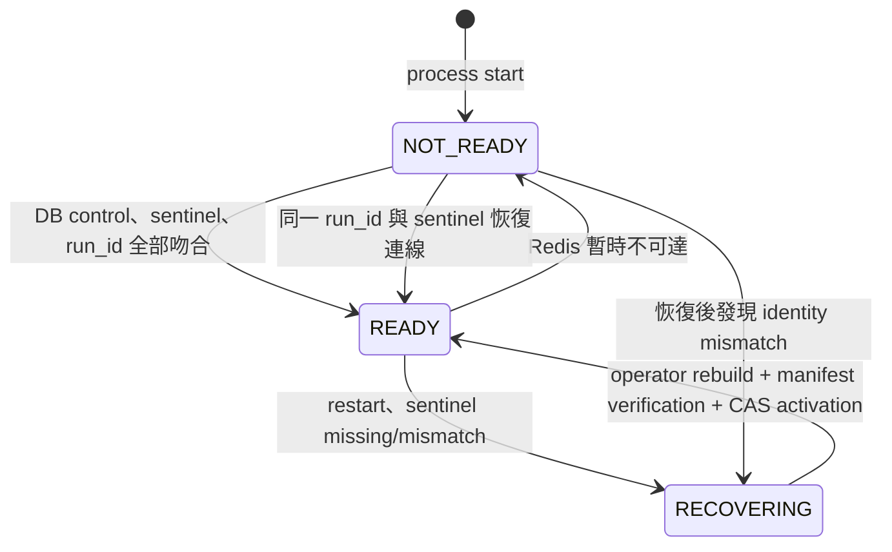

# MatchEngine Redis 訂單簿 generation 與 fail-closed readiness

> Ticket：EAP-REL-101  
> 狀態：完成（2026-09-14）  
> 範圍：CDA MatchEngine；TDA auction 不在本次範圍

## 問題

MatchEngine 的 PostgreSQL 已保存 admission inbox、成交、取消決策與 Redis cleanup
工作，但 CDA 的即時訂單簿、processing fence 與 reservation 仍在 Redis。個別
reservation 可以用 durable trade 修復，不代表 Redis 全量遺失後的空訂單簿可信。

若 Redis 被清空或換成另一個 instance，而 MatchEngine 繼續接單，舊的 open order
會憑空消失；取消訂單也可能把「Redis 查不到」誤判為 `NOT_OPEN`。因此本 ticket
先建立 fail-closed gate，不假裝已完成自動重建。

## 邊界與事實來源

- Order 保存訂單生命週期與原始 order facts。
- Match PostgreSQL 保存 Match 已接收的 reservation-success payload、durable trade、
  cancellation decision、outbox 與 cleanup debt。
- Redis 是可重建的 CDA runtime state，不是長期稽核來源。
- Wallet balance 不參與 order-book rebuild。
- 本設計不把每一次 Redis mutation 同步複製到 PostgreSQL；完整 durable rebuild
  仍屬 `EAP-MATCH-202`。

## Control state

Match PostgreSQL 以單一 shard `CDA_GLOBAL` 保存權威控制列：

| 欄位 | 用意 |
| --- | --- |
| `state` | `RECOVERING` 或 `READY` |
| `fence_epoch` | 單調遞增的 fencing 世代 |
| `generation` | 此次可接受 runtime state 的 UUID |
| `redis_run_id` | 識別 Redis process restart |
| `version` | PostgreSQL CAS，阻止舊 operator 覆寫新 recovery |
| `transition_reason`／時間 | 稽核為何關閉或重新開放 |
| verification manifest | 保存 rebuild 來源 watermark、count、quantity、digest 與 operator |

Redis 只保存鏡像 sentinel：

```text
match:orderbook:control = READY|<epoch>|<generation>|<redis-run-id>
```

Match process 的本地 gate 一律先以 `NOT_READY` 啟動。只有 PostgreSQL control row
為 `READY`、Redis sentinel 完全相同，而且 Redis `run_id` 未改變，才可變成 ready。
Redis 不得自行產生 generation，也不得因為「現在看起來是空的」就自動補 sentinel。

## 狀態轉移



暫時連不到 Redis 時只先關閉 process-local gate；若恢復後仍是同一 run 與 sentinel，
可以重新 READY，不會為網路抖動直接換 generation。偵測到 restart／identity mismatch
時，服務先關閉本地 gate，再以 PostgreSQL CAS 將 control 降為
`RECOVERING`，並在仍能連到 Redis 時使舊 sentinel 失效。舊 process 即使仍握有上一代
本地狀態，Lua 也會因 sentinel 不符而拒絕寫入。

## 哪些工作可以繼續

- Rabbit listener 仍可把 reservation-success 寫進 PostgreSQL admission inbox 並 ACK；
  訊息不會因 Redis 故障被大量送入 DLQ。
- admission worker 不 claim 新工作，也不撮合。
- cancellation request 只先保存 `PENDING`，不可讀空 Redis 後發布業務結果；其
  reconciler 等到新 generation ready 才繼續。
- reservation cleanup、reservation reconciler 與所有 CDA Redis mutation 都停止。
- PostgreSQL/Rabbit 的 trade outbox relay 可繼續；它不改 Redis order book。
- order-book／market-data read 回報 unavailable，不能把未知 generation 的空集合
  當成可信市場狀態。
- process liveness 可以是 `UP`，readiness 必須是 `DOWN`／`OUT_OF_SERVICE`。

## 為何 fence 必須在 Lua 裡

只在 Java 先呼叫 `isReady()` 有 TOCTOU：檢查通過後、Lua 執行前，Redis 仍可能被
清空或切換。所有會新增、reserve、release、complete、remove、取消或維護 CDA state
的 Lua，都要把 sentinel key 與呼叫者預期值帶進同一個原子操作，並在任何寫入前比較。
generation mismatch 是 prerequisite，不耗盡一般 technical retry 後變成永久失敗。

每個 production Lua 還會從 sentinel 取出預期 `run_id`，並在同一個 script 內讀取
Redis `INFO server` 的實際 `run_id`。因此 Redis restart 即使透過 RDB／AOF 保留舊
sentinel，舊 worker 仍無法在 monitor 下一次輪詢前寫入。這個安全檢查位於 Redis
linearization point，不依賴 Java snapshot 恰好已刷新。

## 初始化與恢復

沒有自動 bootstrap。首次建立全新環境時，operator-only 操作必須同時證明：

1. Match durable facts／debt 是空的；
2. Redis 沒有任何 CDA order-book、order、reservation、processing、cancel 或 match
   sequence key；
3. control row 尚不存在，或是同一次未完成的空環境初始化。

全量遺失後的重新開放必須附 verification manifest，至少包含 source watermarks、
open-order count、quantity、identity digest、operator 與 reason。服務重新計算 Redis
manifest 並比對後，先切換 Redis sentinel，再以 recovery token／version CAS 將
PostgreSQL 設成 `READY`。中途任何 crash 都保持 fail closed。

`match:incoming-order:completed:<market>:<shard>` bitmap 也不是 Redis 可以自行宣稱的
完成事實。每一個 set bit 都必須精確對回 PostgreSQL `order_admission_inbox` 中同一個
market sequence 的 `APPLIED` row；缺 bit、額外 bit 或額外 shard key 都拒絕 activation。
bitmap 仍是 runtime 的快速冪等 projection，不會在正常撮合 hot path 查 PostgreSQL；
只在 operator recovery verification 時由 durable inbox 產生預期集合並完整核對。

取消流程的 Redis intent／marker 也屬於必須驗證的 runtime fence。尚未完成的 durable
cancellation 必須有相同 cancellation ID 的 intent；已完成決策在 TTL 到期前可以保留
intent／marker，但每個 Redis identity 都必須對到 PostgreSQL 的同一筆 cancellation。
marker 內的 removed-order snapshot 會逐欄核對 durable decision，而且 marker 絕不可和
同一 order 的 visible detail／ZSET member 共存，否則重播可能回 duplicate 卻沒有真的
移除訂單。

activation 與 cancellation durable intake 共用同一把 PostgreSQL advisory barrier：
activation 取得 exclusive lock；每個取消請求從寫入 `PENDING` 到「READY 時建立 Redis
intent」則持有 shared lock。取消請求彼此仍可並行，但 activation 不可能略過一筆正在
提交的取消。先完成 intake 的 `PENDING` 必須被 manifest 看見；先完成 activation 的情況，
取消則會在新 generation 上建立 intent 後才離開 barrier。這補上了分開讀取 DB snapshot
與最後 `READY` CAS 之間的 TOCTOU。

本 ticket 建立 gate、控制狀態、operator activation contract 與 failure tests；如何從
Order／Match durable facts 自動產生完整 open-order rebuild input，留在
`EAP-MATCH-202`。

## 操作者 activation contract

正式設定預設不暴露 write endpoint；目前只有隔離的 `loadtest` profile 開啟。正式環境
若要啟用，必須先放在 management network／authentication／RBAC 後方，operator identity
不能由任意 caller 自填。

先讀取狀態，取得這一次 recovery 的 token：

```bash
curl -fsS http://localhost:8082/match-engine/actuator/orderBookRuntime
```

完成外部 rebuild 後，以同一個 `fenceEpoch`、`generation`、`version` 送出 manifest：

```json
{
  "action": "ACTIVATE_REBUILT",
  "operator": "authenticated-operator-id",
  "reason": "rebuild from durable watermark 4200",
  "manifestId": "rebuild-20260914-001",
  "expectedFenceEpoch": 8,
  "expectedGeneration": "00000000-0000-0000-0000-000000000008",
  "expectedVersion": 12,
  "sourceOrderWatermark": 4200,
  "sourceTradeWatermark": 1900,
  "expectedOpenOrderCount": 137,
  "expectedOpenQuantity": 822,
  "expectedIdentityDigest": "<sha256>"
}
```

activation 由 PostgreSQL exclusive advisory lock 跨 instance 串行化，並與 cancellation
intake 的 shared advisory lock 形成上述 barrier；服務會逐筆核對 detail key、
market、side、composite score、user index、pending cancellation、processing／reservation
debt、cancellation intent／marker、completed-admission bitmap、match sequence 與 source watermark。驗證前後若 Redis
`run_id`、manifest 或 recovery token 任一改變，就保持 `RECOVERING`。sentinel staged
後還會再驗一次，最後才以 PostgreSQL CAS 標成 `READY`。

所有 recovery CAS 都同時比對 `state`、`version`、`fenceEpoch`、`generation` 與
`redisRunId`，不是只看可能在測試 truncate／reinitialize 後重複的 version 數字。舊
process 即使保留 reset 前的 control snapshot，也不能把新 generation 誤降回
`RECOVERING`。

一般 `orderBookRuntime` 狀態端點只同步核對 PostgreSQL control、generation sentinel 與
`run_id`，不掃描 full manifest。原因是正常撮合的 reservation 窗口會暫時留下未在 ZSET
的 order detail，而 admission 也會短暫出現 Redis completed bit 先於 PostgreSQL `APPLIED`；
這些不是 corruption，GET status 不得因此停止撮合。

完整檢視另放在只讀、非破壞性的 `orderBookRuntimeManifest` 診斷端點。呼叫者必須先證明
queue、inbox、reservation 與 cleanup 已收斂；檢視失敗只回傳 `redisManifestError`，不會
刪 sentinel 或把 control 降級。壓測 final gate 在業務收斂後才呼叫它，並同時要求
`localReady=true`、DB `READY`、`redisManifest` 存在且沒有 error。真正具 promotion 權限的
full verification 只存在於 `RECOVERING` activation，此時 mutation worker 已由 gate 停止。

## 驗收案例

- 正常 process restart、同一 Redis run 與 sentinel：可恢復 ready。
- Redis `FLUSHDB`：readiness 失敗，admission inbox 仍可 intake，但不能 APPLIED。
- Redis restart 即使保留資料：`run_id` 改變後仍 fail closed。
- sentinel generation mismatch：舊 worker 的 Lua 寫入被拒絕。
- recovery 期間 cancellation 保持 `PENDING`，不發布 `NOT_OPEN`。
- cleanup/reconciler 不得把 missing reservation 當成功後清除 durable debt。
- 錯誤／過期 manifest 或 CAS version 不得 reopen。
- completed bitmap 必須與 durable `APPLIED` inbox 完全相同，stray／missing bit 都不得 reopen。
- cancellation marker 不得與 visible order 共存，且 marker／intent identity 必須對應 durable decision。
- reset 前的舊 control snapshot 不得以重複 version 降級 reset 後的新 generation。
- 相同 recovery token 並發 activation 只能有一個成功。
- activation 與 cancellation intake 並發時，必須等待 intake 完成；缺少 Redis intent
  的 durable `PENDING` cancellation 不得被漏過並切成 `READY`。
- active reservation 與 completed-bit-before-`APPLIED` 窗口查一般 status 不得誤停撮；
  非破壞性 manifest inspection 可以回報暫態不一致，但不能改寫 generation。
- 經驗證的新 generation activation 後，等待中的 admission／cancellation 才能續跑。

## 實作與驗證證據

- Match unit suite：通過。
- Spring PostgreSQL／Redis crash-recovery：48 tests，0 failure；包含真實 advisory-lock
  waiter 的 activation／cancellation intake 競態、snapshot 缺口，以及 cancellation marker
  TTL 到期後 durable completed fact 與 visible order 衝突的 fail-closed 測試。
- 真實 Redis SAVE＋restart retaining-data fence：1 test，0 failure。
- `REL101_RUNTIME_SMOKE_R7`：80/80 HTTP accepted、Match／Order／Wallet 各 40 筆相同
  trade ID、final queue／DLQ／inbox／outbox／cleanup／reservation／order-book debt 全為 0，
  最終 fresh runtime status 為 `READY`，Redis manifest 完整，且
  `completedAdmissionCount=80` 精確對應 durable `APPLIED` inbox；cancellation intent／
  marker count 均為 0。這是 correctness smoke，不屬於容量證據。
- `REL101_ORDER_ADMISSION_SAFE_RESET_R3`：consumer-disabled schema bootstrap 後先停服務，
  再 purge queue／truncate DB／FLUSH Redis，最後啟動並 `INITIALIZE_EMPTY`；traffic-only
  generator 回報 `resetData=false`、`flushRedisOnReset=false`，20/20 HTTP accepted、20/20
  admission inbox `APPLIED`、20/20 訂單可見、queue debt 為 0。
- `REL101_MANIFEST_ENDPOINT_R8`：極短 k6 診斷接受 60/60 orders，Match／Order／Wallet
  各 30 筆相同 trade、資產一致、所有 final queue／DLQ／inbox debt 為 0；獨立 manifest
  endpoint 回報 `READY`、`completedAdmissionCount=60`、`matchSequence=30` 且無 error。
  由於 measurement window 只有 2 秒，steady completion ratio `0.8032` 未達 `0.95`，完整
  runner 正確拒絕 capacity PASS；本筆只證明新 endpoint 與 final gate wiring，不作效能宣稱。
