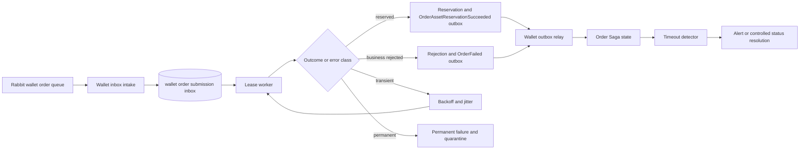

# Ticket：Wallet 驗資可靠性與 Saga 自動恢復

> 狀態：Core inbox implemented／recovery control plane conditional
>
> 建立日期：2026-08-27
>
> 最近更新：2026-09-04
>
> 範圍：CDA `OrderSubmittedEvent → Wallet reservation → OrderAssetReservationSucceededEvent／OrderFailedEvent`，並延伸至 `OrderCancellationResultEvent → Wallet release → OrderAssetReservationReleasedEvent → Order final cancellation`。不把所有 consumer 一次改造成通用框架。

## 2026-09-04 Implementation Checkpoint

已完成：

- Wallet 統一 `message_inbox`、identity/payload conflict guard、lease worker、error classifier、backoff＋jitter 與 status metrics。
- Wallet 不保留沒有合法使用案例的 `PENDING_PREREQUISITE`；取消釋放超過 locked asset 會原子 rollback 並成為 `PERMANENT_ASSET_INVARIANT`。
- 驗資或拒絕、既有 business idempotency、result outbox 與 inbox `APPLIED` 的單一 local transaction。
- 取消結果也先進 Wallet inbox；資產釋放、cancellation application、release publication guard、`OrderAssetReservationReleasedEvent` outbox 與 inbox `APPLIED` 單一提交。
- Order 以第二張 durable inbox 接收 release fact，生命週期拆成 `CANCELLING → CANCELLED`，並能 defer 先到的 release event。
- PostgreSQL integration tests 覆蓋 duplicate、payload conflict、expired lease reclaim、lost-lease rollback、effect/outbox/inbox atomicity；三服務 RabbitMQ cancellation lifecycle 已收斂且無 queue／DLQ／outbox debt。
- Wallet 不建立訂單級鎖定資產歸屬；`order_id` 只作冪等 identity。reservation feasibility 已合併到最終 conditional `UPDATE`，會在等待 row lock 後依最新 aggregate balance 重新判斷。
- `wallets` 的 available／locked currency／amount 已加入非負數 database constraints；舊 `/v1/wallet/check` 非交易寫入入口已移除。
- `TradeExecutedEvent` 已納入同一張 Wallet `message_inbox`：listener 在 durable intake 後返回，lease worker 再把 `trade_settlements`、buyer／seller balance 與 inbox `APPLIED` 放在同一筆 transaction；lost lease 會使全部效果 rollback。
- `message_id` 已由 UUID 改為 `VARCHAR(80)`，讓 UUID order／cancellation identity 與原生字串 `tradeId` 使用同一套 inbox，而不製造雜湊後的假 identity；same trade ID／different payload 會永久隔離。
- 金額乘法改用 exact arithmetic；overflow 是永久 invalid event，不會把截斷後的數字寫進資產。
- 受控 PostgreSQL 競態測試覆蓋不同命令競爭同一 Wallet：初始 100、第一筆鎖定 80 後，第二筆 80 必須拒絕，最終固定為 available 20／locked 80；另驗證四種負數寫入均被 database 拒絕。
- Wallet trade inbox 加入後，2026-09-04 以三服務 inbox backlog／oldest age／terminal debt 與 final outbox／cleanup gate 重跑 200 orders/s、15 分鐘量測並通過；三服務各 `96000` 筆 trade 完全一致，Wallet inbox max `389`、oldest age max `1s`、terminal debt `0`，最終 debt 歸零。現況以[最新全鏈報告](../benchmarks/2026-09-04-current-reliability-full-chain.md)為準，不能沿用舊 648 或中間版本 400。

後續狀態：

- inbox commit 前 Wallet DB 長時間 connectivity outage 已由 REL-104 的 consumer pause／service-local circuit 完成；poison 仍進 DLQ。
- Order warning-only Saga timeout detector 與 oldest-age alert 已由 REL-105／REL-103 完成；自動 prerequisite recovery／補償未完成。
- 完整 DLQ inspect／classify／rate-limited replay／audit control plane。
- 60 秒 DB outage、consumer process kill、duplicate／late event 的真實 Rabbit failure-injection campaign；目前只有 PostgreSQL transaction／lease integration evidence。

詳細實作與驗收數據見 [Wallet Inbox 與取消訂單最終確認](../wallet-inbox-and-cancellation-completion.zh-TW.md)。以下 Current Baseline 保留的是改造前問題背景；Target／task list 同時記錄已完成與剩餘工作。

## Goal

把 Wallet 驗資從「短暫 service retry＋Rabbit retry，耗盡後進 DLQ」提升為可持久化、可分類、可自動長期重試、可偵測卡住 Saga，並能以 failure injection 證明安全性的流程。

成功指標：

1. Wallet DB 暫停 60 秒後恢復，合法訂單不需人工 replay，能自動完成 reservation／rejection。
2. consumer 或 worker 在 inbox、reservation、outbox、ACK 前後 crash，不會重複鎖定資產，也不會遺失結果事件。
3. 相同 identity／相同 payload 是安全 replay；相同 identity／不同 payload 會被隔離並告警。
4. 沒有超過約定 age 卻未告警的 `PENDING_ASSET_CHECK`／Wallet inbox debt。
5. DLQ 主要接收永久／poison message，不再是幾秒級 DB outage 的正常終點。

## Historical Baseline Before This Change

目前 Wallet 收到 `OrderSubmittedEvent` 後直接執行 reservation transaction：

- service 內只對 `CannotAcquireLockException` 立即重試最多 3 次，沒有 backoff／jitter。
- exception 仍拋出時，由 Spring Rabbit listener 再嘗試最多 3 次，約在 1 秒、2 秒後重試；耗盡且 `default-requeue-rejected=false` 時進 shared DLQ。
- 餘額不足、電量不足、wallet 不存在等已知業務結果，會在同一 transaction 建立 `OrderFailedEvent` outbox；reservation 成功則建立 `OrderAssetReservationSucceededEvent` outbox。
- `order_id` idempotency、資產異動與結果 outbox 已有本地 transaction／row-count 保護。
- Wallet trade／cancellation listener 當時同樣主要依賴 broker retry＋DLQ，沒有 service-owned durable inbox；目前兩者都已完成 inbox 改造，此段只保留歷史背景。
- Order 已對 trade 與 cancellation result 實作 durable inbox／lease reconciler，可以作為設計參考，但不能直接複製所有語意。

目前保住的是 safety：技術失敗不會被誤報成餘額不足，也不會留下 transaction 內的半套資產異動。缺少的是 liveness：短期 retry 耗盡後，Order 可能永久停在 `PENDING_ASSET_CHECK`，且 recovery 需要人工判讀 DLQ。

## 為什麼以前會宣稱有 Saga Pattern

「EAP 有 Saga 結構」與「Saga 已處理所有錯誤」是兩個不同命題。前者成立，後者是過度宣稱。

EAP 已具備 choreography-based Saga 的結構：

- 跨服務流程被拆成 Order、Wallet、MatchEngine 各自擁有的 local transaction。
- 下一步由 `OrderSubmittedEvent`、`OrderAssetReservationSucceededEvent`、`TradeExecutedEvent`、cancellation events 接續。
- producer 使用 outbox，consumer 使用 business identity 做冪等。
- 取消成功會釋放 unmatched reservation；Match 在 durable trade 前後使用不同的 Redis recovery／roll-forward 路徑。
- 已成交事實不做跨服務 rollback。

但 Saga pattern 本身不會自動產生 retry、timeout、DLQ replay、監控或 compensation。後續 REL-103～105 已補上 durable-debt 監控、intake DB outage recovery 與 Order warning-only timeout detection；EAP 仍缺：

- 尚未納入 durable inbox 的 consumer，以及跨服務一致的 oldest-age／retry-debt 告警。
- 跨三服務、能安全決定處置的 end-to-end Saga deadline authority；Order detector 目前只列候選。
- terminal outbox／DLQ 的完整 recovery control plane。
- Wallet DB outage、consumer crash、late event 的系統性 failure-injection 證據。

因此後續文件與面試的精確說法應是：

> EAP 已實作 CDA choreography Saga 的主要業務步驟、local transaction、outbox、冪等與部分補償。Order 驗資結果、Wallet reservation／trade／cancellation-result 與 Match admission 已有各服務擁有的 durable inbox；CDA intake DB outage 可 pause/resume，Order 也能 warning-only 偵測卡住 Saga，但 terminal DLQ／outbox control plane 與跨服務自動處置仍未完成。

不得再使用下列說法：

- 「用了 Saga，所以所有 failure 都會自動恢復。」
- 「進 DLQ 就代表 Saga 已處理完成。」
- 「技術 exception 會自動轉成上游業務失敗。」
- 「所有 consumer 都具有相同的 inbox／reconciler 保證。」TDA 與部分非核心 listener 仍不能套用 CDA 核心路徑的保證。

## Target



### 1. Wallet Durable Inbox

新增 Wallet-owned inbox，至少保存：

| 欄位 | 用途 |
| --- | --- |
| `event_id`／`order_id` | 穩定 delivery／business identity；建立唯一約束 |
| canonical payload／hash／schema version | 判定相同 replay 或 identity conflict |
| `status` | `PENDING`、`PROCESSING`、`APPLIED`、`REJECTED`、`FAILED_RETRYABLE`、`FAILED_PERMANENT` |
| `attempt_count`／`next_retry_at` | retry lifecycle |
| `claimed_by`／`claim_until` | worker lease 與 crash recovery |
| `error_type`／`last_error` | 分類、告警與人工判讀 |
| received／updated／completed time | backlog age 與稽核 |

Rabbit listener 的責任縮小為：驗證 envelope、以 identity／payload hash 寫入 inbox、local commit 後 ACK。duplicate 相同 payload 正常 ACK；identity 相同而 payload 不同，標為 permanent conflict 並隔離。

保留既有 `order_submission_idempotency` 作為 business effect guard；inbox 是 delivery／processing lifecycle。第一版不應同時發明兩套互相競爭的業務狀態：worker transaction 必須讓 idempotency、reservation／rejection、result outbox 與 inbox terminal status 一起 commit。

若 Wallet DB 在 intake 時完全不可用，inbox 也無法保存，訊息不可 ACK。需在 Sprint 0 選定「暫停 listener container」或「Rabbit delayed retry queues」方案，不能沿用三次後直接 quarantine 的一般策略。

### 2. Wallet Transient／Permanent 與跨服務 Prerequisite 邊界

| 類別 | EAP 例子 | 動作 |
| --- | --- | --- |
| Business result | 餘額／電量不足、wallet 不存在 | 正常 commit rejection＋`OrderFailedEvent` outbox，不 retry |
| Transient | lock／deadlock、connection timeout、短暫 DB／broker unavailable | rollback，寫 `FAILED_RETRYABLE` 與下次時間 |
| Permanent | malformed schema、缺 identity、相同 ID 不同 payload、資產不變量矛盾 | fail fast，`FAILED_PERMANENT`、告警／quarantine |
| Prerequisite | 事件正確但必要的 upstream fact 尚未可見 | 只在確實存在跨 queue 亂序的 owner（目前是 Order）保存與重排；Wallet 不建立此狀態 |
| Unknown | 尚未分類的 exception | 小量 transient retry；重複相同 fingerprint 後轉 permanent review |

Wallet order submission 已包含驗資所需 snapshot；取消結果也源自 Wallet reservation commit 後發布的 confirmation。若取消要求釋放的數量超過 locked asset，等待 settlement 只會讓 locked asset 更少，不會自行修復。因此 Wallet 不建立 `PENDING_PREREQUISITE`：缺 wallet／asset 必須分類為合法 business result 或 `PERMANENT_ASSET_INVARIANT`。Prerequisite 類別只供 Order trade／cancellation／release 等確實存在跨 queue 亂序的流程。

錯誤分類保存在本地 retry state；不要每次 retry 都發出會驅動 Order 狀態的「技術失敗事件」。只有 Wallet 形成 durable、不可再改變的業務決定時，才能發布 terminal business fact。

### 3. Backoff＋Jitter＋Lease Worker

Worker 使用短 transaction claim 到期 rows：

```text
PENDING／FAILED_RETRYABLE／expired PROCESSING lease
    → FOR UPDATE SKIP LOCKED
    → PROCESSING＋claimed_by＋claim_until
```

處理成功時，以 claimed owner／status 作 fencing check；worker crash 後由 lease expiry 讓其他 instance 接手。不得在 listener／worker thread 內長時間 `sleep`。

Retry policy 應包含：

- exponential backoff，例如 1 秒、2 秒、4 秒、8 秒，逐步提升到分鐘級。
- full／bounded jitter，避免大量訊息在 DB 恢復瞬間同步重試。
- 依 error class 設定不同 policy；permanent 不進 retry loop。
- 以 message age、oldest pending、進度與 error fingerprint 告警，不能只看 attempt count。
- 設定 retry budget／max age；耗盡後保留 durable debt，不可靜默刪除。

若 inbox 已成功落盤，Wallet DB 後續 outage 不會丟訊息；scheduler 恢復後可以重新 claim。若 outage 發生在 intake 前，broker 必須保留訊息並使用 delayed retry／consumer pause，這是不同 failure window。

### 4. Order Saga Timeout Detector

Order 擁有訂單生命週期與等待期限。Detector 掃描長時間停在 `PENDING_ASSET_CHECK` 的 durable Order state，至少分兩層：

1. **Warning deadline**：標記／量測 `PROCESSING_DELAYED`，發 alert；不改變業務結果。
2. **Business deadline**：必須先完成 status／expiry protocol，才可決定 terminal state；第一版只做警告與診斷，不自動過期。

未來若要自動處理，Order 只能提出 `ReservationStatusRequested`／`ReservationExpiryRequested` 類型的 request，Wallet 依自己擁有的 facts 回覆：

- 已 rejected：回覆或補發 rejection fact。
- 已 reserved：回覆或補發 confirmation fact。
- 尚未處理且產品允許過期：Wallet 原子寫 terminal guard＋expired fact，阻止晚到原始訊息再次 reservation。
- reservation 已可能送入 Match：不能由 Order／Wallet直接解鎖，必須進入 Match-owned cancellation arbitration。

這是輕量 process manager，不需要立刻引入新的中央 Saga service。Order 追蹤 deadline，但不能越權修改 Wallet 或 Match 狀態。

### 5. DLQ Recovery Control Plane

DLQ 定位為 quarantine，不是正常 retry queue。最小 control plane 不需先做 UI，但要提供：

- List／Inspect：source queue、routing key、event type、schema、business identity、payload、`x-death`、first／last error。
- Classify：transient、permanent、schema、identity、invariant、unknown。
- Replay：原因修正後，以原 identity 受控送回原 exchange／queue。
- Park／Resolve：保留待處理或記錄已完成的人工判斷。
- Audit：操作者、時間、理由、replay count 與結果。
- Safety：batch limit、rate limit、dry-run／payload conflict 檢查，避免 retry storm。

需評估把 shared `order.dlq` 拆成 per-bounded-context DLQ，或至少在中央 quarantine store 保存原始 owner／queue。Control plane 只能管理 transport debt；它不得看到一筆 Wallet message 就自行發布 `OrderFailedEvent`。

### 6. Failure-injection Tests

至少驗證下列 crash windows：

| 情境 | 注入位置 | 必須證明 |
| --- | --- | --- |
| DB outage | inbox commit 前 Wallet DB 停 60 秒 | message 不遺失、不形成 DLQ flood；DB 恢復後自動處理 |
| Consumer crash | inbox commit 前／後、ACK 前 | broker redelivery 最後只留下同 identity inbox row |
| Worker crash | claim 後、business transaction 前／中／commit 後 | lease 可接手；reservation、outbox、terminal state 不會半套 |
| Duplicate | 相同 ID＋相同 payload | reservation／outbox business effect 恰好一次 |
| Identity conflict | 相同 ID＋不同 payload | permanent quarantine，不被當成成功 duplicate |
| Late event | warning／expiry 後原始 event 才抵達 | 不產生 confirmed＋expired 矛盾；terminal guard 生效 |
| Outbox ambiguity | broker confirm 後、`SENT` 前 crash | event 可重送，下游 effect 仍一次 |
| Retry storm | 大批 inbox 同時遇到 DB outage 後恢復 | jitter 分散重試；connection pool 不被恢復流量再次打垮 |

必須核對的不變量：

- 同一 `order_id` 最多一個 terminal reservation result。
- 不同時存在 confirmed 與 rejected／expired 業務結果。
- available＋locked asset 守恆。
- duplicate 不產生第二次 reservation。
- 沒有永久 `PROCESSING` row；lease 過期可恢復。
- transient outage 恢復後不需要人工 replay。
- permanent debt 可列出、分類、告警與稽核。
- 所有超過 Saga age threshold 的訂單都能被偵測。

## Scope Decisions

- 第一階段原先只處理 `OrderSubmittedEvent` intake／reservation；後續已在相同機制中納入 cancellation result 與 `TradeExecutedEvent`，但三種 message 仍保留各自的業務 identity 與 transaction effect。
- 沿用 PostgreSQL、RabbitMQ 與既有 Wallet outbox，不引入 Kafka或新的 Saga framework。
- 沿用至少一次 delivery＋冪等 local effect，不宣稱 exactly-once messaging。
- 第一版 Order timeout detector 只提供狀態、metric 與告警；自動 expiry 必須先完成跨 Wallet／Match protocol review。
- DLQ control plane 第一版可以是受保護 admin API＋資料記錄，不需要前端。

## Architect Review

### Decision

Conditional。

Wallet durable inbox、分類、lease worker 與 failure tests 可以進入設計／實作；Order 自動 expiry 與資產補償尚未核准，需先定義 terminal authority 與 late confirmation／Match admission 的競爭規則。

### Boundary Check

- Wallet owns reservation processing and retry state。
- Order owns Saga age／deadline and user-visible order lifecycle。
- MatchEngine owns match／cancel arbitration once an order may have entered matching。
- Recovery tooling owns replay mechanics, not business decisions。

### Event Flow

- success／business rejection 必須由 Wallet local transaction＋outbox發布。
- transient failure 保留在 Wallet inbox retry state；不發布矛盾的上游 business failure。
- timeout 先觀測；任何 terminal event 都必須由有權確認本地事實的服務 durable commit。

### Consistency Risks

- inbox 與既有 idempotency table 若各自獨立更新，會形成兩套互相矛盾的 process state。
- listener intake DB outage 若仍沿用三次 retry，durable inbox 無法解決「還沒進 inbox」的窗口。
- 自動 expiry 若繞過 Match 可能釋放已成交資產。
- 未分類 exception 無限 retry 會形成 poison loop；過早 permanent 又會降低可用性。
- DLQ 自動 replay 若沒有 rate limit／payload conflict guard，可能造成重複風暴。

### Must Fix Before Implementation

- [x] 接受 inbox state machine、唯一 identity 與 immutable payload contract。
- [ ] 選定 intake DB outage 的 delayed retry 或 consumer-pause 策略。
- [x] 列出 exception taxonomy、default unknown policy 與 retry budget。
- [x] 定義 lease duration、fencing、backoff／jitter；age alerts 尚未完成。
- [x] 確認 reservation、trade settlement、cancellation result、business idempotency／outbox 與 inbox terminal state 的單一 transaction。
- [ ] 定義第一版 Saga warning threshold；自動 expiry 留在未核准範圍。
- [ ] 定義 DLQ ownership、replay authorization 與 audit。

### Recommended Task Split

依下方 Scrum Board 執行；先完成可靠接收與自動恢復，再做 timeout protocol 和 control plane。

## Performance Review

- Listener 不得用長時間 sleep 阻塞 Rabbit consumer thread。
- Worker 以 batch＋`SKIP LOCKED` claim，batch size、concurrency、lease 與 pool budget需可設定。
- Backoff 必須有 jitter；DB 恢復時量測 retry amplification、connection pool、oldest message age 與 drain throughput。
- Inbox／idempotency／reservation／outbox 會增加 DB write amplification與索引成本；需以代表性 workload 比較修改前後 intake latency、worker throughput 與 WAL／DB time。
- 正確性通過前，不以較高 ACK TPS 宣稱 business throughput；ACK inbox 只代表 durable intake。
- 完成後重新跑 2,000 offered TPS 的 Order admission／full-lifecycle campaign，但效能報告只能記錄實測，不預設一定維持既有數字。

## QA Plan

- component：error classifier、backoff／jitter bounds、lease expiry、payload hash conflict。
- repository integration：claim concurrency、`SKIP LOCKED`、fencing、rollback、unique identity。
- Testcontainers：PostgreSQL＋RabbitMQ 的 inbox／outbox end-to-end。
- crash recovery：在 inbox commit、ACK、reservation transaction、outbox confirm 的前後注入中斷。
- ordering：duplicate、late、replayed、identity-conflicting events。
- outage：DB 60 秒中斷、恢復後自動 drain；驗證 DLQ、資產與 terminal result。
- retry storm：多筆同時失敗後恢復，驗證 jitter 與 pool saturation。
- verifier：以 `order_id` 比對 Order state、Wallet reservation／result、outbox／inbox debt 與 Rabbit／DLQ。

## Feature Pipeline

### Epic

- Goal：讓 Wallet reservation Saga 在一般技術故障後可自動收斂，並使永久 debt 可觀測、可控、可稽核。
- Success metric：60 秒 Wallet DB outage＋consumer／worker crash 不需要人工 replay，且資產與 terminal result invariants 全部通過。

### Role Reviews

- Product：值得做；直接強化交易正確性、故障思考與面試價值。核心 CDA Wallet reservation、trade settlement 與 cancellation result 已納入，TDA 不擴張。
- Architect：Conditional；auto-expiry protocol 尚未核准。
- Performance：需控制 write amplification、worker pool、retry storm；ACK TPS 不得冒充 completion TPS。
- QA：failure injection 是 Definition of Done，不是選配。
- Reviewer：拒絕 catch-all retry、無 lease `PROCESSING`、無 payload conflict guard、直接從 DLQ 發 business failure。

## Scrum Task Split

| ID | Task | Owner Role | Acceptance Criteria | Dependencies |
| --- | --- | --- | --- | --- |
| WRR-000 | 決定 inbox state machine、identity／payload contract、intake outage 策略 | Architect | ADR／ticket decision 完成；auto-expiry 明確排除或另行核准 | 無 |
| WRR-101 | 建立 Wallet order-submission inbox migration／repository | Implementation | unique identity、canonical payload、retry／lease／error／time fields；migration test 通過 | WRR-000 |
| WRR-102 | 將 Rabbit listener 改為 durable intake＋commit 後 ACK | Implementation | same replay ACK；payload conflict permanent；DB outage 不誤 ACK／不快速灌入 DLQ | WRR-101 |
| WRR-103 | 建立 transient／permanent／unknown classifier | Implementation | exception mapping 有 unit tests；business result 不走 retry；unknown policy 有界 | WRR-000 |
| WRR-104 | 建立 lease worker、backoff／jitter 與 crash reclaim | Implementation | `SKIP LOCKED`、owner fencing、expired lease reclaim、無 thread sleep | WRR-101、WRR-103 |
| WRR-105 | 原子整合 inbox、idempotency、reservation／rejection 與 result outbox | Implementation | 任一失敗全 rollback；duplicate effect 一次；terminal state 與 outbox 同 commit | WRR-104 |
| WRR-107 | 將 `TradeExecutedEvent` 納入 Wallet durable inbox | Implementation | 原生 trade ID、payload conflict、lease retry；settlement／balance／inbox `APPLIED` 原子提交；lost lease 全 rollback | WRR-103～105；已完成 |
| WRR-106 | 建立 inbox metrics／age alert／admin inspect | Implementation | pending／processing／retryable／permanent count、oldest age、attempt／error 可觀測；已完成 | WRR-104 |
| WRR-201 | Order Saga timeout detector 第一版 | Implementation | 偵測過久 `PENDING_ASSET_CHECK`／`CANCELLING`；metric／alert；不自動釋放資產；已完成 | WRR-000 |
| WRR-202 | 定義 reservation status／expiry protocol | Architect／Product | Wallet／Order／Match authority、late event、terminal guard、compensation 明確 | WRR-201；第二階段 |
| WRR-301 | 最小 DLQ quarantine／replay control plane | Implementation | list／inspect／classify／rate-limited replay／audit；不直接決定 business failure | WRR-000、WRR-103 |
| WRR-401 | DB outage／consumer crash／worker lease failure tests | QA | 60 秒 outage 自動恢復；沒有 duplicate reservation／untracked debt | WRR-102～106 |
| WRR-402 | Duplicate／identity conflict／late event／outbox ambiguity tests | QA | 所有列出的 business invariants 通過 | WRR-105、WRR-201 |
| WRR-403 | Retry-storm 與 2,000 offered TPS 回歸 | Performance／QA | 報告 ACK、completion、drain、DB pool、oldest age、DLQ；不過度宣稱 | WRR-401、WRR-402 |
| WRR-501 | Production-style review 與文件更新 | Reviewer／Documentation | code review 無 P0／P1；architecture／lifecycle／interview／resume claims 對齊實測 | 全部 MVP tasks |

## Definition of Done

- [x] Wallet order-submission inbox、lease worker、error classifier 已實作並有 migration／integration tests。
- [x] Wallet `TradeExecutedEvent` 已納入同一套 durable inbox；trade settlement、buyer／seller balance 與 inbox `APPLIED` 原子提交。
- [x] Inbox terminal state、business idempotency、reservation／rejection與 result outbox 保持單一 local transaction。
- [x] Intake 前 DB connectivity outage 不會被誤 ACK，也不會在數秒內把合法流量全部變成 DLQ debt。
- [x] 三服務 60 秒 DB outage 可自動恢復，transient DLQ delta 為 0。
- [ ] consumer process kill 的完整跨服務 campaign 仍待 REL-107；既有 lease reclaim／redelivery integration tests 不冒充完整 campaign。
- [x] duplicate、identity conflict、late release event、lost lease 與 local outbox atomicity 測試通過。
- [x] 已涵蓋流程的 available／locked asset 與 terminal result invariants 通過。
- [x] inbox status count、identity conflict 與 oldest unresolved age 已有低成本快照 metrics；Prometheus 對 permanent failure 與 age 提供告警；conditional read-only admin endpoint 可依 status／message type 檢視 attempt、lease 與 error，且不回傳 payload。
- [x] Order timeout detector 能找出 stuck Saga，但未核准前不自動改變資產。
- [ ] DLQ replay 有 ownership、rate limit、payload conflict check 與 audit。
- [ ] 效能與正確性報告分開 ACK intake、Wallet completion 與 full-lifecycle completion。
- [x] 文件只宣稱實際完成的 Saga 能力與已知缺口。

## Resume Evidence

目前可使用的敘述：

> 將 Wallet 驗資、成交與取消結果從 listener 直接處理改造成 durable inbox＋lease worker，以錯誤分類、exponential backoff、jitter、owner fencing、冪等與 transactional outbox 支援已落盤工作的一般 crash recovery；取消訂單再以 Wallet 資產釋放事實驅動 Order 從 `CANCELLING` 成為 `CANCELLED`。後續以 consumer circuit 補上 intake DB outage，並以 Order warning-only timeout detector 找出卡住 Saga；DLQ control plane 與完整 process-kill campaign 仍是 production gap。

不能使用「60 秒 DB outage 不需人工恢復」或「完整 DLQ 自動恢復」等說法，直到剩餘 Definition of Done 與 failure-injection evidence 完成。
