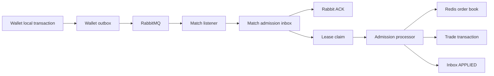
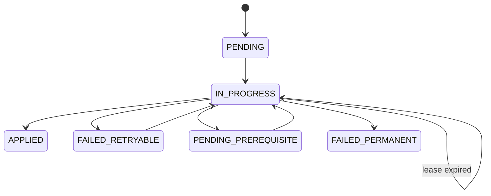

# Match 訂單入簿 Durable Inbox 與錯誤恢復

## 結論先講

Wallet 完成資產保留後，現在發布的 integration event 是
`OrderAssetReservationSucceededEvent`，routing key 是
`order.asset-reservation.succeeded`。MatchEngine 不再於 Rabbit listener 內直接撮合；listener
先把事件提交到 PostgreSQL `match_engine.order_admission_inbox`，成功後才返回並由 container
ACK。後續由有界並行的 lease worker 執行 Redis 訂單入簿與撮合。

這個改動解決的是：Rabbit 訊息一旦 ACK 後，即使 Match process crash、Redis 暫時故障或 worker
執行到一半中斷，服務仍有自己的 durable processing debt 可恢復。它不會把 PostgreSQL、Redis
與 RabbitMQ 變成 distributed transaction，也不保證任何錯誤都能無人介入自動修正。

## 為什麼事件要改名

`OrderConfirmedEvent` 沒說明由誰確認、確認了什麼，也容易被理解成整張訂單已完成。
`OrderAssetReservationSucceededEvent` 是 Wallet 擁有的過去式事實：這張訂單所需資產已成功保留，
Order 可以更新狀態，MatchEngine 可以把訂單送進 CDA admission。事件帶完整 order snapshot，兩個
consumer 不需要反查 Wallet table。

實體 queue 暫時仍叫 `matchEngine.orderConfirmed.queue` 與 `order.orderConfirmed.queue`。這只是為了
不遺棄部署中已存在的 durable queue 與其中訊息；Java type、routing key、bean、metrics 與文件語意
都採用新名稱。實體 queue 改名應另做有明確 drain／cutover 的 broker migration。

## 正常流程

1. Wallet 在資產 update、submission idempotency 與 outbox insert 的同一筆 local transaction 中，
   寫入 `OrderAssetReservationSucceededEvent`。
2. Wallet outbox relay 以 publisher confirm 發送到 `order.exchange`。
3. Match listener 驗證 order、user、market 與 market sequence，序列化完整 payload 並計算
   SHA-256 hash。
4. inbox insert commit 後 listener 才正常返回。這個 ACK 只代表「Match 已 durable 接收」，不代表
   訂單已入 order book 或已成交。
5. reconciler 用 `FOR UPDATE SKIP LOCKED` claim 到期資料，寫入 owner、30 秒 lease 並增加
   `attempt_count`。
6. worker 執行既有 admission processor；成功後以 `order_id + owner + IN_PROGRESS` fence 將 inbox
   標成 `APPLIED`。

## Inbox 保存什麼

| 欄位 | 用途 |
| --- | --- |
| `order_id` | message identity 與 primary key |
| `market_id, market_sequence` | market 內唯一排序 identity；另有 unique constraint |
| `payload, payload_hash, schema_version` | replay 原始事實、辨識相同 duplicate 與不同 payload conflict |
| `status, attempt_count, next_retry_at` | durable processing state 與 retry budget |
| `claimed_by, claim_until` | 多 worker／多 instance 的 lease ownership |
| `error_type, last_error` | transient、prerequisite、permanent 的操作證據 |
| `conflict_detected_at, conflicting_payload` | 保存相同 identity 的矛盾事實，不靜默覆寫 |
| `received_at, applied_at, updated_at` | intake、完成與 lag 觀測 |

狀態流向如下：

## 錯誤分類與處理

| 發生位置／錯誤 | 現行處理 | 為什麼 |
| --- | --- | --- |
| Match DB 在 inbox commit 前失敗 | listener 拋錯，不 ACK；交給 Spring Rabbit retry，耗盡後 DLQ | 服務尚未取得 durable ownership，不能假裝接收成功 |
| 完全相同 order 與 payload 重送 | 回 `DUPLICATE` 並 ACK | at-least-once 的正常結果，不重做撮合 |
| 同 order 或同 market sequence 出現不同 payload | 保存 conflict；未套用資料標 `FAILED_PERMANENT` | 自動猜哪個 payload 正確會破壞交易 identity |
| PostgreSQL／Redis 暫時故障 | `FAILED_RETRYABLE`，exponential backoff 加 jitter | 暫時技術錯誤值得自動恢復，但不能 hot loop |
| 原 admission claim 未 stale、reservation cleanup 未收斂 | `PENDING_PREREQUISITE` | 不是壞資料；先前工作尚未到可安全接手的時間點 |
| 無效 side、amount、market identity 或資料約束衝突 | `FAILED_PERMANENT` | 相同 payload 重送不會自行變正確 |
| retry budget 耗盡 | `FAILED_PERMANENT`，error type 加 `RETRY_EXHAUSTED_` | 停止無限消耗資源，轉成可觀測的 terminal debt |
| worker claim 後 crash | lease 到期後另一 worker reclaim | Rabbit 已 ACK，但 PostgreSQL inbox 仍保存工作 |
| processor 成功後、標 `APPLIED` 前 crash | reclaim 後重送 processor；Redis guard 吸收 duplicate | 這是不可消除的 at-least-once crash window |

預設最多 20 attempts，delay 從 250 ms 指數增加、上限 30 秒並加入 bounded jitter。load-test
profile 將初始 delay 降為 100 ms。`worker-concurrency` 預設 16，load-test 是 32；scheduler 只會依
可用 permit claim，避免無界 executor queue 把大量 row 提前租走。

## 為何不只靠 Rabbit retry 與 DLQ

Rabbit retry 的 ownership 在 broker，適合「listener 尚未 durable 接收」的短暫錯誤。若 listener
直接做完整撮合，process crash、長時間 Redis outage 或 30 秒 admission recovery 都會占住 consumer
thread，耗盡幾次 retry 後只剩 DLQ，而且 Rabbit row 無法保存 prerequisite、attempt、lease 與業務
identity conflict。

Durable inbox 把 ACK 的定義改成「服務已保存責任」。DLQ 仍然存在，但只守 inbox commit 前的
intake window 與 poison JSON；inbox commit 後的恢復由 Match 自己管理。

## 與既有冪等及 crash recovery 的分工

- PostgreSQL inbox 保證訊息在 ACK 後仍可發現、可分類、可 lease retry。
- Redis `IncomingOrderProcessingStore` 保護 order admission effect，不讓同一 order 重複入簿。
- per-order Redis lock 與 stale threshold 控制 crash takeover。
- PostgreSQL `trade_executions` 與 `trade_outbox` 的 transaction／unique identity 保護成交事實。
- `reservation_cleanup_tasks` 與 reservation reconciler 處理 trade commit 前後的 Redis cleanup window。

只做 inbox 不夠；只做 Redis completed marker 也不夠。前者保存工作責任，後者保護非交易式 Redis
effect，兩層是在解不同問題。

## 操作介面與限制

Actuator endpoint `matchOrderAdmissionInbox` 預設關閉。設定
`eap.match-engine.order-admission-inbox.admin-enabled=true` 後可以查看 status counts 與 conflict count，
也能把 `RETRY_EXHAUSTED_*` 的技術失敗重開為 `PENDING`。identity conflict 與永久 input error 不接受
此 generic retry；operator 必須先判定權威 payload，而不是按一次 replay 就掩蓋矛盾。

目前仍有以下限制：

- inbox commit 前若資料庫長時間不可用，訊息仍可能進 DLQ；還需要 broker delayed retry、consumer
  pause 與受控 DLQ replay runbook。
- lease 沒有 heartbeat。單筆 admission 若超過 30 秒可能被 reclaim；effect safety 依賴既有 Redis
  idempotency guard。
- terminal debt 已可查與有限重開，但不是完整的 operator UI、審批與 audit control plane。
- 新增每張訂單至少一次 inbox insert、claim update 與 terminal update，會增加 Match DB write
  amplification；效能數字必須重新量測，不能沿用改造前 benchmark。

## 驗證證據

目前測試涵蓋：相同 duplicate、不同 payload conflict、expired lease reclaim、processor 成功後在
`APPLIED` 前 crash、transient retry、prerequisite defer、retry exhaustion，以及 Match DB intake
故障時 listener exception 向 Rabbit 傳回。order-admission、Rabbit-to-Match isolated 與 full-chain
runners 也新增 inbox row、APPLIED row 與 non-APPLIED debt gate；queue 清空不再被當成 Match
business complete。reset path 會清除 Match inbox workload data，避免跨 run duplicate 或資料累積
污染下一輪結果。

2026-09-03 長窗中，Match admission inbox 在 200／300／400 workload 最終都全數 `APPLIED`；
Match durable trades 也和下游一致。高輸入的 current bottleneck 出現在 Order reservation-result
worker，而不是 Match admission。完整版本與限制見[最新全鏈報告](benchmarks/2026-09-03-current-version-full-chain.md)。
