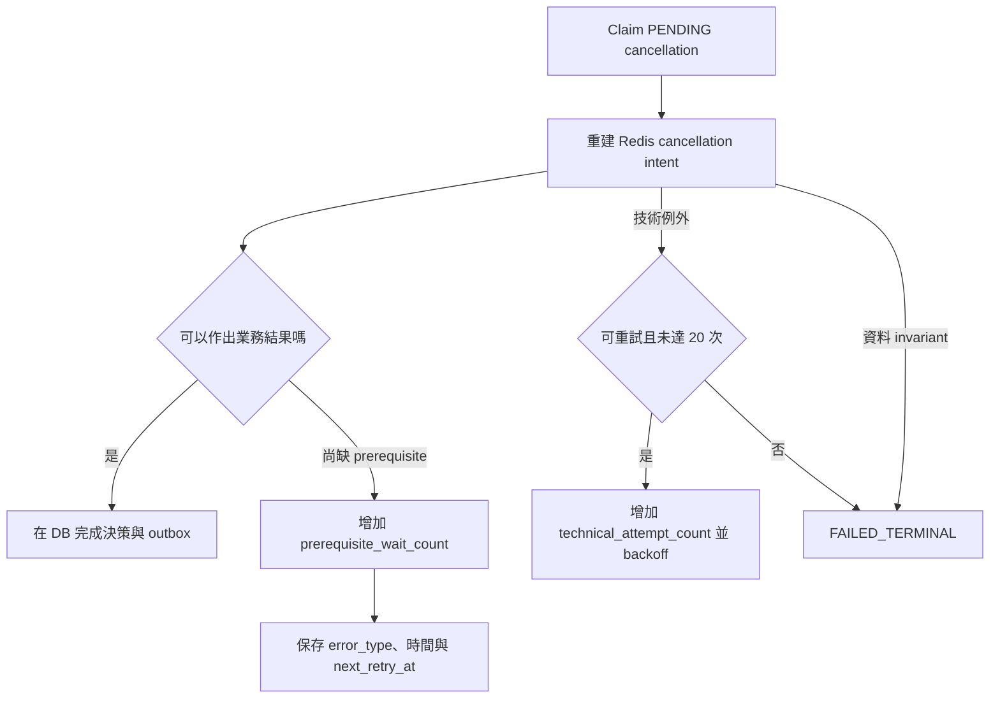

# MatchEngine terminal error semantics 與 recovery debt

> Ticket：EAP-REL-102
> 狀態：完成（2026-09-14）
> 範圍：CDA cancellation、order admission、Redis reservation reconciliation 與 cleanup task

## 這次修的是什麼

REL-101 先解決「Redis generation 不可信時停止撮合」。REL-102 再處理 runtime 已
`READY`，但某一筆本地 recovery 工作一直失敗的情況。修正前有四種混淆：

1. cancellation 等待 admission／reservation 與 Redis／DB 技術錯誤共用同一個
   `attempt_count`，沒有 terminal 上限；
2. orphan reservation 的壞 payload、trade ownership conflict 只有 log／metric，
   每次掃描都會重新碰撞；
3. Redis order-book detail 缺失或無效會落入 `UNKNOWN_RETRYABLE`；
4. cleanup worker 只以 `status=PROCESSING` 更新資料，舊 lease 過期後仍可能覆寫新 worker。

這些不是跨服務 rollback 問題。它們都是 MatchEngine 自己擁有的 PostgreSQL／Redis
邊界內，如何把「等待」、「可重試故障」和「重試不會變好的資料矛盾」說清楚。

## 統一分類

| 類別 | 例子 | 行為 | 是否消耗 technical budget |
| --- | --- | --- | --- |
| Prerequisite | admission 仍 `PROCESSING`、active reservation、order snapshot 尚未抵達、order-book generation 尚未 ready | 保存等待原因，延遲後再判斷；依等待次數定期告警 | 否 |
| Transient technical | PostgreSQL 暫時失敗、Redis connection／script 暫時失敗、未知 runtime exception | exponential backoff；到上限後轉 terminal | 是 |
| Permanent invariant／poison | order detail 缺失／無法解析、owner 缺失、reservation identity／trade ownership 衝突、constraint／invalid input | 第一次確認後直接保存 terminal，不再自動重碰 | 是一次或直接 terminal |

「prerequisite 無上限」不等於可以無聲等待。它不應被 technical retry 上限誤殺，但要以
`first_prerequisite_at`、`prerequisite_wait_count`、`next_retry_at` 與週期告警呈現
liveness debt。跨服務的 oldest-age、retry 與 terminal SLO 已由 `EAP-REL-103`
透過共用 `DurableDebtSnapshot` 契約統一。

## Cancellation reconciliation



`order_cancellations` 新增：

- `prerequisite_wait_count`、`first_prerequisite_at`：正常等待的次數與開始時間；
- `technical_attempt_count`、`first_technical_failure_at`：真正技術重試的 budget 與起點；
- `error_type`、`last_error`、`last_failure_at`：最近分類與可調查原因；
- `FAILED_TERMINAL`：不再被 `claimRetryable` 自動取出的永久 debt。

預設 technical budget 是 20 次；delay 從 250 ms 指數增加、最高 30 秒。prerequisite
等待使用獨立計數，預設每累積 40 次輸出 error-level alert。它仍可能在前置狀態恢復後
自動完成，不會因為等得久就捏造 `CANCELLED`、`ALREADY_MATCHED` 或 `NOT_OPEN`。

## Order admission 的壞資料

Redis Lua 找到 ZSET member 卻缺 order detail、detail 缺 owner、同一 visible order 已有
reservation，或 script 回傳無法解析的 order detail，都改丟
`OrderBookDataInvariantException`。Admission classifier 把它保存成：

```text
status = FAILED_PERMANENT
error_type = PERMANENT_ORDER_BOOK_DATA_INVARIANT
```

這與暫時 Redis 斷線不同。重試缺失或已毀損的相同資料不會使它變正確，持續重試反而會
佔住 worker 並洗掉第一個有用的錯誤現場。

## Reservation reconciliation issue

`ReservationReconciler` 是沒有正常 cleanup task 時的 safety net。現在新增
`reservation_reconciliation_issues`。隔離 identity 不是單獨使用可重複的 Redis key，而是
把 order-book generation、reservation key、trade ID、reserved time、order identity 與
原始 payload 組成 SHA-256 `issue_id`。因此同一張訂單後來產生的新 reservation 不會被
舊 trade 的 terminal 紀錄誤封鎖。資料表保存：

- `issue_id`、`generation_identity`、`reservation_key`；
- `trade_id`、`order_id`、`user_id`；
- `status = RETRYABLE / TERMINAL / RESOLVED`；
- `error_type`、`attempt_count`、首次／最後發現與最後 absence-check 時間；
- 原始 reservation `payload` 與 `last_error`。

invalid payload、durable trade identity mismatch 與 ownership conflict 直接成為
`TERMINAL`。reconciler 找到同 `tradeId` 的 PostgreSQL trade 時，還會核對 market、
order、user、side 對應的 market sequence、origin price 與 quantity 範圍；不一致時
保持 Redis 零變更。一般 action failure 最多重試 10 次，之後也成為 terminal。

每輪只讀取至多 `batch-size` 筆 reservation。共享的 Redis scan cursor 與 overflow
buffer 會輪轉 keyspace；cursor 也綁定 order-book generation，避免 process restart、
terminal／fresh key 或多 instance 一直卡在同一批 key。實際 mutation budget 同樣以
`batch-size` 為上限，而且由 active cleanup task 接管的 reservation 不消耗此 budget。

完全相同的 terminal `issue_id` 會被跳過，但 terminal row **不會**只因 Redis key 消失
就自動改為 `RESOLVED`；Redis restart、其他 worker 刪除或新 identity 取代舊值，都不能
證明 invariant 已經被調查。它必須保留到 REL-106 的受控處理。只有 `RETRYABLE` issue
會以另一個有界 DB page 輪流檢查原 reservation key；若 fingerprint 已不存在，才可視為
「Redis mutation 已成功、但 DB `markResolved` 失敗」並自動收斂。若 resolved identity
日後真的重現，row 會重設 attempt budget。

目前 transient reservation issue 沒有 per-row `next_retry_at`；預設每 5 秒 poll 一次，
最多 10 次，因此是 bounded retry，但還不是 exponential backoff。這是明確限制，後續
可在有量測到 retry storm 風險時再增加排程欄位。

這張表不會自動刪 Redis poison key，也不是 replay UI。操作者必須先確認 PostgreSQL
trade fact、reservation identity 與目前 generation，再修資料或決定 recovery 動作；
安全重播／稽核 API 屬於 `EAP-REL-106` control plane。

## Cleanup lease fencing

`reservation_cleanup_tasks` 新增 `claim_owner`、每次 claim 新產生的 `claim_token`、
`claim_until` 與 `error_type`。claim、renew、完成、重排與 terminal 更新的契約是：

```sql
WHERE id = :id
  AND status = 'PROCESSING'
  AND claim_owner = :owner
  AND claim_token = :token
```

同一 worker instance 的 owner 不足以 fencing：lease 到期後，同一 instance 或另一個
instance 可能取得同一 task。每次 claim 都不同的 token 才能證明「這次更新仍屬於我」。
若更新筆數不符，舊 worker 只能回報 lost lease，不能把新 owner 的 `PROCESSING` 改成
`COMPLETED`、`PENDING` 或 `FAILED`。Redis cleanup 本身仍用 order ID＋expected trade ID
做冪等與 ownership 保護，因此 DB lease fencing 和 Redis identity fence 各守一層。

## 操作者怎麼查

目前先提供 durable SQL visibility；受 RBAC 保護的 recovery API 留給 REL-106。

```sql
SELECT cancellation_id, order_id, status,
       prerequisite_wait_count, technical_attempt_count,
       error_type, last_error,
       first_prerequisite_at, first_technical_failure_at, last_failure_at
FROM match_engine.order_cancellations
WHERE status = 'FAILED_TERMINAL'
   OR prerequisite_wait_count > 0
ORDER BY COALESCE(last_failure_at, updated_at) DESC;
```

```sql
SELECT issue_id, generation_identity, reservation_key,
       trade_id, order_id, user_id, status,
       error_type, attempt_count, first_seen_at, last_seen_at, last_checked_at,
       payload, last_error
FROM match_engine.reservation_reconciliation_issues
WHERE status <> 'RESOLVED'
ORDER BY last_seen_at DESC;
```

```sql
SELECT id, trade_id, order_id, user_id, status, attempt_count,
       claim_owner, claim_token, claim_until, error_type, last_error
FROM match_engine.reservation_cleanup_tasks
WHERE status <> 'COMPLETED'
ORDER BY updated_at DESC;
```

## Crash windows 與保證邊界

| Crash／錯誤點 | 現在怎麼收斂 |
| --- | --- |
| prerequisite 被發現後、reschedule commit 前 crash | lease 到期後再次 claim；不消耗已提交的 technical budget |
| technical failure 後、failure row commit 前 crash | lease 到期重跑；handler／Lua 必須維持冪等 |
| issue 已成 terminal，reconciler 再掃到相同 generation／trade／payload identity | 由 durable terminal `issue_id` 跳過；同 key 的新 reservation 不受影響 |
| Redis mutation 成功，retryable issue 的 `RESOLVED` 更新前 DB 失敗 | 有界 absence-check page 直接讀該 reservation key；fingerprint 不存在後才收斂成 `RESOLVED` |
| terminal issue 的 Redis key 消失或換成新 identity | 舊 terminal row 保持可見；新 identity 可獨立處理，不能以「不見了」冒充已調查 |
| reservation 指向同 trade ID、但 durable trade 的 order／user／market／price／sequence／quantity 不符 | 保存 `DURABLE_TRADE_IDENTITY_CONFLICT`，Redis 零變更 |
| cleanup lease 到期，舊 worker 最後才回來寫 DB | owner＋token 不符，更新 0 row 並 fail closed |
| Redis runtime generation 改變 | REL-101 runtime gate／Lua sentinel fence 先停止 mutation；不把它耗盡成 poison |

本 ticket 不解決 inbox commit 前的長時間 DB outage、全域 Saga timeout、DLQ safe replay
或 Redis full-book rebuild。`EAP-REL-103` 已把這些新舊 durable debt 統一成 count、
oldest age、retry／terminal SLO 與 business-complete gate；下一步依 backlog 是
`EAP-REL-104` 的 intake DB-outage recovery 設計。

## 驗證

- MatchEngine unit tests：classification、prerequisite／technical 分流、bounded terminal、
  issue quarantine 與 cleanup token 更新。
- PostgreSQL＋Redis crash-recovery integration tests（58 項）：migration、issue retry 到
  terminal、payload／last error 可查、prerequisite 與 technical counter 分離、同 Redis
  key 的新舊 reservation 隔離、durable trade identity mismatch 零變更、terminal scan
  fairness、active cleanup 不消耗 action budget、partial-fill 連續 release failure 確實
  耗盡成 terminal、Redis-success／DB-resolution-failure 收斂、malformed Lua data 進入
  admission permanent debt，以及 stale cleanup worker 不能覆寫新 claim。
- 這次修改不增加 happy-path 跨服務事件，也不在撮合 Lua hot path 增加 PostgreSQL round trip；
  新資料庫成本位於 failure／reconciliation 與既有 cleanup claim 路徑。
