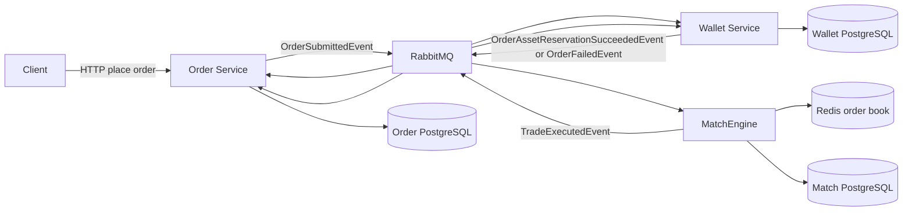
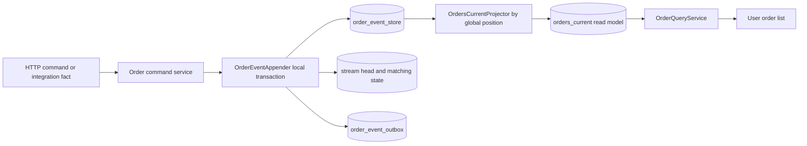
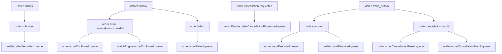
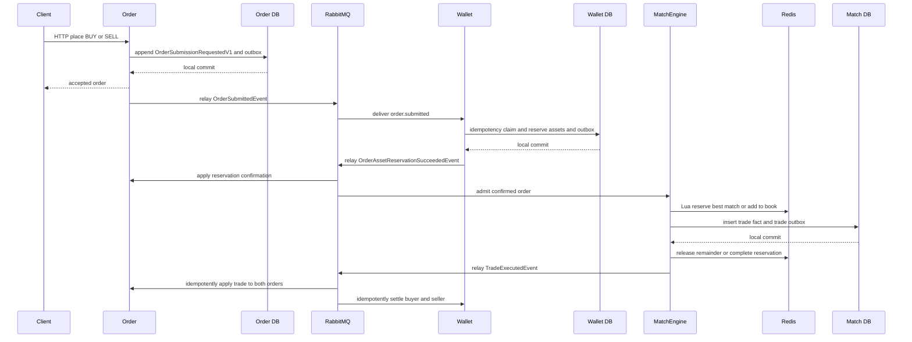
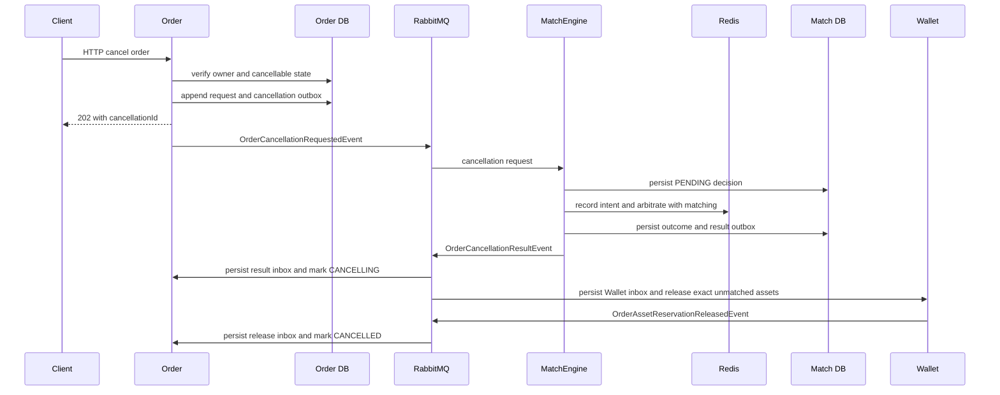
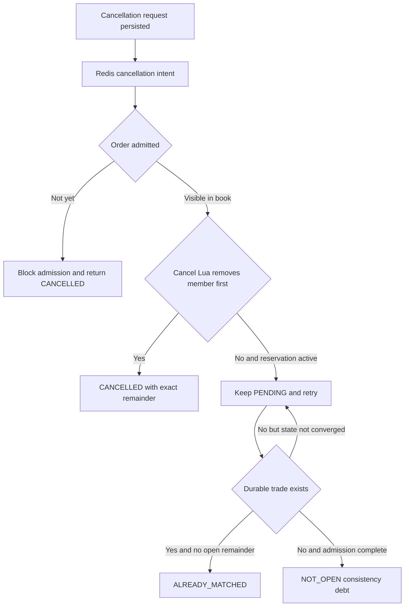
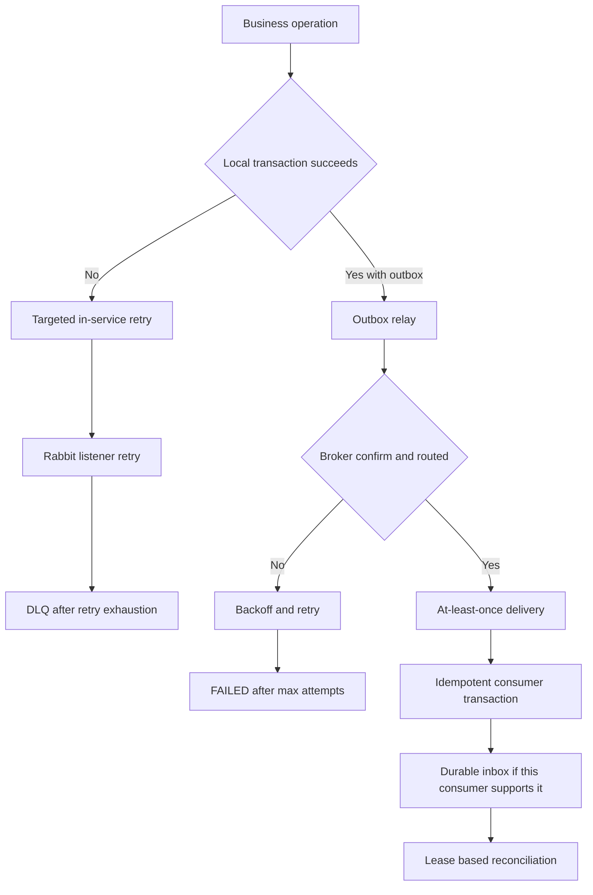
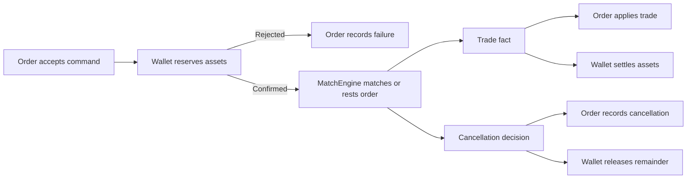

# CDA 訂單事件完整生命週期與失敗復原

> 文件狀態：依 2026-09-01 workspace 實作核對。本文只描述連續雙向競價（CDA）的現況；TDA 有不同的事件可靠性缺口，不能套用本文保證。

這份文件回答的不只是「訂單怎麼成交」，而是四個更重要的問題：每個服務擁有哪一段事實、失敗可能發生在哪裡、系統靠什麼重試並收斂，以及哪些事情目前仍需要人工處理。EAP 的 CDA 不是跨三個資料庫的 ACID transaction，也不是 exactly-once messaging；它採用每個服務的本地 ACID、transactional outbox、冪等 consumer、持久化 retry state 與外部一致性核對，建立可恢復的 at-least-once 流程。

## 建議閱讀路線

第一次只讀「一頁結論」、「架構與責任邊界」和兩張 sequence diagram，先能口述 happy path。第二次停在每一個 database commit／Rabbit ACK／Redis reservation，依序問：

1. 現在新增了哪個 durable fact，authority 是誰？
2. 下一個服務永遠沒收到時，哪一列 outbox／inbox／task 能證明仍有工作？
3. 同一訊息收到兩次，用哪個 business identity 阻止重複效果？
4. 這一步失敗要 rollback、retry、defer、reconcile、compensate，還是 reverse？

第三次遮住「失敗情境矩陣」，自己先填再對答案。最後從「程式碼查核入口」各選一個 producer、consumer、reconciler，確認文件不是只停在概念。設計原理與外部閱讀集中在[事件驅動一致性的五個核心問題](event-consistency-five-questions.zh-TW.md)，這份文件則負責證明 EAP 實際在哪裡做了什麼。

## 一頁結論

- Order 是訂單生命週期的權威來源；Wallet 是可用／鎖定資產與結算的權威來源；MatchEngine 是 order book、取消訂單競爭結果與 `TradeExecuted` 的權威來源。
- RabbitMQ 只負責傳遞，不是業務事實來源，也不保證跨 queue 的全域順序。
- 需要跨服務發布的 CDA 狀態轉換，先把本地事實與 outbox row 放進同一筆資料庫交易；relay 在 commit 後發布。
- relay 收到 publisher confirm 後才標記 `SENT`。若發布成功後、標記前當機，事件會重送，因此 consumer 必須冪等。
- 「本地狀態成功，但同一筆交易的 outbox insert 失敗」會整筆 rollback；若程式根本沒寫 outbox、或有人關閉 outbox write，outbox pattern 本身無法自動補救這種語意缺漏。
- 這是一個 choreography-based Saga：服務用事實事件接續流程，沒有中央 orchestrator，也沒有一張宣稱全域成功的 saga table。
- 取消訂單不是刪除資料。MatchEngine 用 Redis Lua 決定 match 與 cancel 誰先取得同一個 order book member，並發布 `CANCELLED`、`ALREADY_MATCHED` 或 `NOT_OPEN` 的持久化結果。
- business-complete 不是 RabbitMQ 已送出 `TradeExecuted`，而是 MatchEngine、Order、Wallet 的 durable `trade_id` 集合一致、資產守恆，而且 queue、DLQ、outbox／inbox／cleanup debt 已排空。

## 架構與責任邊界

| 元件 | 擁有的事實 | 不應宣稱擁有 |
| --- | --- | --- |
| Order | HTTP 命令、order event stream、command-side remaining amount／status、trade application、可重建 projection | Wallet balance、撮合結果 |
| Wallet | available／locked currency、available／locked energy、reservation、settlement ledger、cancellation release application | order book、訂單最終狀態 |
| MatchEngine | Redis order book、match／cancel 競爭判定、durable trade fact、cancellation decision | 資產異動、Order projection |
| RabbitMQ | durable queue、routing、redelivery、dead lettering | 業務正確性的 source of truth |
| 外部 verifier | 比對三服務最終 durable facts 與 debt | 介入線上交易或取代服務 ownership |

三個 PostgreSQL 之間沒有 distributed transaction。這是刻意的邊界：每個服務只在自己的 database 內提供強一致，跨服務則接受 eventual consistency，並用可重試、可去重、可核對的事件流程收斂。

## Order 的 CQRS／讀寫分離：實作、原因與影響

CQRS 的「分離」首先是模型和責任分離，不要求一開始就有兩套 database。EAP 目前只在 **Order bounded context** 做局部 CQRS；Wallet 和 MatchEngine 雖有不同 tables／Redis，也不能只因為會消費事件就稱為 CQRS。

這裡的「讀／寫」是依**用途**分 command 與 query，不是依 SQL 動詞分。Command side 當然也必須先讀 stream head／matching state，才能檢查版本、owner 和 remaining amount；差別是這個讀取用來決定「能不能改變狀態」。Query side 的讀取則只回答使用者「目前看見什麼」，不能拿可能落後的 `orders_current` 來裁決取消或資產。

### Write／command side 怎麼運作

1. HTTP 下單、取消命令，或 Wallet／Match 的 integration fact 進入 Order application service。
2. application service 不直接改 `orders_current`，而是建立 `OrderSubmissionRequestedV1`、`OrderMatchedV1` 等 Order domain event。
3. `OrderEventAppender` 以 expected aggregate version、event identity 與 row lock 保護併發；一筆 local transaction 寫入 `order_event_store`，並更新 `order_stream_heads`／`order_matching_state` 供下一個命令快速檢查 owner、remaining amount、status。需要通知其他 bounded context 時同時寫 `order_event_outbox`。
4. event stream 是 Order 的歷史依據；stream head／matching state 是 command-side 的目前狀態捷徑，不是提供 UI 查詢的 read model。

`order_matching_state` 之所以存在，是因為取消或套用成交不能每次都 replay 完整 event stream 才取得 remaining amount，也不能依賴可能落後的 query projection 來做正確性決策。Command side 要用與 event append 同一 transaction 內維護的狀態判斷不變量。

### Read／query side 怎麼運作

1. `OrdersCurrentProjector` 預設按排程輪詢 `order_event_store`，從 `projection_checkpoints.last_global_position` 之後依 global position 順序取一批事件。
2. Projector 將事件轉成 `orders_current` 的 user、side、price、matched／remaining amount 與 status；每筆用 aggregate version 防止缺號或倒退，批次成功才推進 checkpoint。
3. 若某張 order projection 缺失或 stale，projector 可以從該 aggregate 的 stream 重建 snapshot；另有週期性 repair 路徑。
4. `OrderQueryService` 不 replay events，也不跨服務同步查 Match Redis；它直接以 user／status index 查 `orders_current`，回傳使用者需要的列表形狀。

正常程式與目前 load-test profile 的 projector poll interval 都是 100 ms；壓測設定每批最多 500 個 events、每 tick 最多連續處理 4 批，避免舊的 5 秒輪詢讓 projection 人為落後。這不改變 command 已 durable 接受的事實，但「成交已成立」與「使用者查詢已追平」仍是兩個指標；完整壓測會分別驗證 event-store checkpoint lag、reservation status 與 user-visible execution status。

### 現在分離到哪一層

| 層次 | EAP 現況 | 能宣稱與不能宣稱 |
| --- | --- | --- |
| Code／model | command appender、projector、query service 分工 | 可以稱 CQRS；不能說 command entity 就是 query model |
| Table | event store／head／matching state 與 `orders_current` 分開 | read model 可重建、可依查詢塑形 |
| Connection pool | command、consumer、projection 有不同 Hikari pool | 可限制不同 workload 的 connection budget |
| Database | datasource URL 預設仍回到同一個 Order PostgreSQL | 不是 read replica，也沒有 database failure isolation |
| Query connection | projector 使用 projection datasource；`OrderQueryService` 現在仍注入 primary `JdbcTemplate` | projection writer 已分 pool，但實際 user query 尚未使用專屬 read pool |

所以「讀寫分離」的精確說法是：**EAP 已分離 command model 與 rebuildable read projection，但尚未把 user query 完整搬到獨立 datasource／read replica。**

### 為什麼這樣做，以及付出的代價

| 影響面 | 收益 | 代價／目前限制 |
| --- | --- | --- |
| 正確性 | command 不依賴落後的 UI projection；event stream 保留狀態變化與版本 | command-side state、event stream、projection 三者都要有 invariant 與修復策略 |
| 查詢 | `orders_current` 可直接依 user／status 查，不需 replay 或跨服務 join | 使用者會遇到 read-your-write lag；API 需說清楚 accepted 與 visible 的差異 |
| 效能 | projection 在 request transaction 之外批次處理；讀表可獨立建 index | 多寫 projection／checkpoint 造成 write amplification；同 DB 仍競爭 CPU、I/O、WAL 與 connections |
| 擴充 | 未來可把 projection 指到 read database、建立不同 view | 一旦物理分離，要處理複製延遲、schema deployment、重建與切換 |
| 維運 | checkpoint、aggregate version 能定位 lag／gap | 需要 projection lag metric、repair runbook；目前 query exception 回空集合可能把故障誤呈現成「沒有訂單」 |

這個設計不是為了追求 pattern 完整度，而是把「正確接受命令」與「方便顯示目前狀態」的變更原因分開。若讀寫規模沒有明顯差異，停在同一 PostgreSQL 的 logical CQRS 是合理學習階段；只有量測證明 read workload 會干擾 command SLO，或需要不同可用性／擴縮策略時，才值得引入 read replica 或獨立 datastore。

## 事件拓撲

| Event | 最少必要語意 | Producer | Consumer |
| --- | --- | --- | --- |
| `OrderSubmittedEvent` | order、user、market、market sequence、side、limit price、amount、created time | Order | Wallet |
| `OrderAssetReservationSucceededEvent` | Wallet 已成功保留資產；包含可直接進行撮合的完整 order snapshot | Wallet | Order、MatchEngine |
| `OrderFailedEvent` | 驗資的終止結果與 failure type | Wallet | Order |
| `TradeExecutedEvent` | 穩定 `tradeId`、market sequence、buyer／seller order、原始價格、成交價、數量、時間 | MatchEngine | Order、Wallet |
| `OrderCancellationRequestedEvent` | cancellation、order、owner、immutable original amount、request time | Order | MatchEngine |
| `OrderCancellationResultEvent` | outcome；成功時另含 side、limit price 與精確 unmatched remainder | MatchEngine | Order、Wallet |
| `OrderAssetReservationReleasedEvent` | Wallet 已釋放此次取消的精確 reservation；包含 workflow identity、數量與時間，不暴露餘額 | Wallet | Order |

這些 event 是已發生事實或需要權威服務判定的請求，不是「叫另一個服務執行某段內部程式」的 RPC 包裝。事件仍會形成業務與 schema coupling；解耦的意思是 producer 不需要知道 consumer 的部署、資料表或處理時機，不代表彼此完全沒有契約。

## 正常下單到成交的完整流程

### 階段 0：Order 接受 HTTP 命令

1. Controller 驗證 DTO；endpoint 另外示範 user-based rate limit。下單服務在寫入前檢查 Wallet queue backpressure，避免已知下游過載時繼續無限制接單。
2. Order 取得每個 market 的單調 `marketSequence`，建立 `OrderSubmissionRequestedV1` domain event 與 `OrderSubmittedEvent` integration event。
3. `OrderEventAppender` 鎖定／建立 stream head，檢查 expected version 與 event identity。
4. order event、command-side matching state、stream head 與 `order_event_outbox` 在同一筆 Order DB transaction／CTE 中寫入。
5. commit 成功才算 Order 接受命令。相同 event ID 且 payload 相同是 idempotent replay；相同 identity 卻不同 payload 是衝突，不會靜默覆蓋。

如果 outbox insert 在這一步失敗，整筆 local transaction rollback；不會留下「已接受訂單但 outbox row 缺失」的半套 commit。HTTP 明確回失敗時，client 可以提供相同 `orderId` 重試。若 connection 在 commit 後、response 前中斷，client 無法只靠 HTTP 判斷第一次是否成功；目前雖會偵測相同 order identity，但重試時重新配置的 market sequence／timestamp 可能形成 payload conflict。完整的 client-visible idempotency contract 應保存 request identity 與第一次 response，這是目前仍可補強的邊界。

### 階段 1：Order outbox 發布 `OrderSubmittedEvent`

1. relay 週期性取得到期的 `PENDING` rows；非同步模式還會使用 `IN_FLIGHT` lease 與 `SKIP LOCKED`，回收過期 claim。
2. 以 persistent message、mandatory routing 發到 `order.exchange` 的 `order.submitted`。
3. relay 等 publisher confirm，並檢查 returned／unroutable message。
4. 成功後把 row 標記為 `SENT`；失敗則增加 attempt，使用 exponential backoff，最多 10 次後標記 `FAILED`。

publisher confirm 只代表 broker 接受訊息，不代表 Wallet 已處理，更不代表整張訂單已成交。若 broker 已接受、但 relay 在 `SENT` commit 前中斷，之後會再次發布；這正是 at-least-once 的重複窗口。

### 階段 2：Wallet durable intake、驗資與保留資產

Wallet listener 收到 `OrderSubmittedEvent` 時不再直接執行驗資。它先以 `ORDER_SUBMITTED/order_id` 保存完整 payload、SHA-256、schema version 與 retry state 到 `wallet_service.message_inbox`；receive transaction commit 後正常返回，Rabbit container 才 ACK。相同 identity／相同 payload 是 duplicate success；相同 identity／不同 payload 會保存 conflict evidence，不能用重送覆蓋第一次事實。

lease worker 再以 `FOR UPDATE SKIP LOCKED` claim 到期 row。預設每 100 ms、每批 100 筆、lease 30 秒；worker crash 後可由 lease expiry 接手。下列效果與 inbox `APPLIED` 在同一個 Wallet transaction 內完成：

1. 以 `order_id` 寫入 `order_submission_idempotency`；duplicate processing 無法再次 claim。這個 identity 只用來防止相同命令重複套用，不代表 Wallet 為每張訂單建立鎖定資產歸屬。
2. Wallet 維護使用者層級的可替代資產總池。條件式 `UPDATE` 在真正取得該 Wallet row 的更新權時，才以最新的 `available_currency`／`available_amount` 判斷可行性，避免不同訂單同時讀到舊餘額後超額鎖定。
3. BUY 將 `price * amount` 從 `available_currency` 移到 `locked_currency`；SELL 將 amount 從 `available_amount` 移到 `locked_amount`。四個 aggregate balance 欄位另有 database `CHECK >= 0` 作最後防線。
4. 有足夠資產時建立 `OrderAssetReservationSucceededEvent` outbox；錢包不存在、餘額不足或電量不足時，不修改資產並建立 `OrderFailedEvent` outbox。
5. 程式要求新 business claim 恰好產生一筆 result outbox，並以 lease owner fencing 把 inbox 標成 `APPLIED`；任一步失敗都 rollback。

技術錯誤由 Wallet-owned retry state 處理，而不是在 listener 內反覆執行業務：`DataAccessException` 與 unknown failure 最多 20 attempts，250 ms 起始、最高 30 秒的 exponential backoff 並加入 bounded jitter；永久 identity／input／integrity error 直接成為 `FAILED_PERMANENT`。只有 inbox 尚未寫入而 Wallet DB 已不可用時，才仍落回 Spring Rabbit 3 attempts／DLQ 的 transport window。

「資產不足」是業務結果，不是技術例外，因此正常 commit 並透過 outbox 發布 `OrderFailedEvent`。Order 收到後先把結果寫入統一 durable inbox，再由 lease worker append `OrderAssetReservationFailedV1` 並把 inbox 標為 `APPLIED`；流程在未進入 MatchEngine 前終止。

### 階段 3：同一份 confirmation 分流到 Order 與 MatchEngine

Wallet relay 發布 `OrderAssetReservationSucceededEvent` 後，RabbitMQ topic exchange 將它複製到兩個獨立 queue：

- Order 先將 Wallet 整合事實存入 `order_asset_reservation_result_inbox`，durable intake 成功後 manual ACK；lease worker 再於單一 transaction 將它轉成 `OrderAssetReservationConfirmedV1` 並把 inbox 標為 `APPLIED`。
- MatchEngine 將相同 snapshot admission 到 CDA order book。兩個 consumer 沒有先後保證，因此後續 `TradeExecutedEvent` 可能早於 Order confirmation 抵達；這是 fan-out 的正常亂序，不應依賴跨 queue ordering。

2026-09-02 起，Order 將兩種進度拆開保存：

| 維度 | 欄位 | 狀態 |
| --- | --- | --- |
| Wallet 資產保留 | `asset_reservation_status` | `PENDING / SUCCEEDED / REJECTED / RELEASED` |
| Order 執行生命週期 | `status` | `PENDING_ASSET_CHECK / OPEN / PARTIALLY_MATCHED / MATCHED / CANCELLING / CANCELLED / REJECTED` |

`TradeExecutedEvent` 是比 reservation confirmation 更晚、資訊更強的 MatchEngine 事實。Trade 先到且 Order submission head 已存在時，Order 會推導 `asset_reservation_status=SUCCEEDED` 並直接套用 `PARTIALLY_MATCHED／MATCHED`。晚到的 `OrderAssetReservationSucceededEvent` 仍會保存、去重、append domain event，並將 reservation inbox 標成 `APPLIED`，但不再把 execution status 或 remaining amount 降回 `OPEN`。成交後才收到 reservation rejection 則是跨服務事實矛盾，必須永久隔離與告警，不能覆寫成交。

### 階段 4：MatchEngine admission、撮合與成交落盤

1. MatchEngine 驗證 order、market、side 與 sequence，並以 Redis processing state／completed bitmap 防止同一 confirmed order 被重複 admission。
2. Redis Lua 在單一原子操作中檢查 cancellation intent、取得最佳 opposing order 並建立 reservation；沒有可成交對手時，就在同一次 Lua 邊界把 incoming order 加入 order book。
3. 有 match 時先保留 resting order，再計算 matched quantity。此時 Redis reservation 尚不是 durable trade fact。
4. `JpaTradeExecutionRecorder` 在單一 Match DB transaction／CTE 中寫入 append-only `trade_executions` 與 `trade_outbox`。`trade_id` 由 market 與 match sequence 穩定產生。
5. commit 後才調整記憶體中的剩餘量；partial resting remainder 用 Redis lock 與 Lua 放回 order book，full fill 則完成 reservation。

重要的 crash／failure 分支：

- trade DB transaction 失敗：原始 resting amount 被放回 Redis reservation／order book，Rabbit listener 可重試 confirmed order。
- trade 已 durable commit，但同步 Redis cleanup 來不及完成：同一筆 transaction 可建立 `reservation_cleanup_tasks`，worker 以 lease、`SKIP LOCKED`、最多 10 次與 exponential backoff 重做 cleanup。
- crash 讓 reservation 沒有對應正常 cleanup task：`ReservationReconciler` 掃描超過 threshold 的 reservation；若存在 durable trade，就完成或釋放正確 remainder；若沒有 durable trade，就把原始 order 放回。
- incoming processing 卡在 `PROCESSING`：超過 stale threshold 後，processor 取得 per-order lock，從 visible order、reservation 與 durable matched quantity 判斷已完成部分，再從剩餘量恢復。

這套補償只收斂 MatchEngine 自己擁有的 Redis／PostgreSQL 邊界，不是假裝回滾 Wallet 或 Order。

### 階段 5：發布與套用 `TradeExecutedEvent`

Match `trade_outbox` relay 等 broker confirm 後才標 `SENT`；失敗最多嘗試 10 次、exponential backoff，最後為 `FAILED`。正常設定 `trade-outbox.write-enabled=true`；若刻意關閉它，交易仍可能被保存但不會產生現行 `TradeExecutedEvent`，這是設定造成的可靠性降級，不能稱為 outbox 保護。

Order 與 Wallet 各自消費同一個 trade fact：

- Order 在本地 transaction 對 buyer／seller order 套用 matched quantity，並以 `trade_id` 的 application record 去重。若 reservation confirmation 尚未由 Order consumer 套用，但 submission head 已存在，可信任的 `TradeExecutedEvent` 本身足以推導 reservation 已成功，Order 會建立／提升 matching command state 後直接成交，不再把這種正常 fan-out 亂序送進 prerequisite retry。只有 submission head 尚未建立等真正缺少本地基礎資料時才保存為 `PENDING_PREREQUISITE`；其他暫時錯誤為 `FAILED_RETRYABLE`。若 crash 發生在 application commit 後、inbox 標記前，worker 會依完整 trade identity 將既有 application 收斂成 `APPLIED`。技術錯誤最多 20 次後轉為 permanent failure；業務矛盾或未知 batch failure 才逐筆隔離，避免一筆 poison event 卡住整批。
- `PENDING_PREREQUISITE` 現在代表 submission／command base 尚未建立，不再代表單純等待 Order confirmation。2026-09-02 修改前的基準中，`28,000` 筆 trade 有 `25,746` 筆（`91.95%`）因正常跨 queue 亂序曾進 Order inbox、attempt 全部為 `2`；這是本次修正要移出 hot path 的歷史數據，不是新的穩態預期。
- Wallet 在一筆 transaction 鎖定 buyer／seller wallet、插入唯一 `trade_settlements.trade_id`，再同時扣除 locked asset、交付 energy、支付賣方並退回買方 price improvement。要求兩個 wallet update 與一個 settlement 恰好成立；任何不一致都 rollback。duplicate `trade_id` 不會再次結算。

Wallet 的 trade listener 沒有像 Order 一樣的 service-owned durable retry inbox；它依賴本地 transaction rollback、Rabbit listener retry、idempotent settlement 與耗盡後 DLQ。這是目前實作差異，不應把 Order inbox 的保證泛化給所有 consumer。

## 取消訂單的完整生命週期

取消訂單是另一條 Saga 分支，目標是讓 match 與 cancel 在同一個 MatchEngine authority 內決定先後，而不是讓 Order、Wallet 各自猜測。

### Order 接受取消請求

1. API 只回 `202 Accepted`，含 deterministic `cancellationId`；它代表命令已 durable 接受，不代表已取消。
2. Order transaction 鎖定 command matching state，確認 order 存在、request user 是 owner、狀態仍可取消。
3. append `OrderCancellationRequestedV1` 並在同一 transaction 寫入 `OrderCancellationRequestedEvent` outbox。
4. event 同時保存 immutable original amount。它用於 replay identity；不是部分成交後要釋放的數量。

相同取消命令 replay 會回到既有 event。相同 ID 但 order／user identity 不一致會被拒絕。

### MatchEngine 的競爭判定

1. 先在 `order_cancellations` 建立 `PENDING` recovery record，再寫 Redis cancellation intent。PENDING DB row 讓中斷後可重做，但真正擋住 admission／matching 的是 Redis intent 與 Lua 邊界。
2. 尚未 admission 的 confirmed order：admission Lua 看到 intent，回傳 cancellation pending；coordinator 以完整 snapshot 完成 `CANCELLED`。
3. 已在 order book 的 order：cancel Lua 與 match Lua 競爭移除同一個 ZSET member。cancel 先取得時回傳精確 remaining snapshot；match 已 reservation 時 cancel 等待或最後回 `ALREADY_MATCHED`。
4. coordinator 將 decision outcome 與 `OrderCancellationResultEvent` outbox 在同一筆 Match DB transaction 中提交。
5. pending reconciler 以 lease 與 `SKIP LOCKED` claim；每次重建 Redis intent，檢查 visible remainder、active reservation、admission state 與 durable trades，250 ms 起始 exponential delay、最高 30 秒，直到可分類。

### Order 與 Wallet 套用取消結果

- Order cancellation-result listener 先以 `cancellation_id` 把完整 payload 存進 durable inbox。reconciler 驗證 current remaining amount 已等於 MatchEngine 的 `cancelledAmount` 後，append `OrderCancellationAcceptedV1`；此時狀態是 `CANCELLING`，不是最終 `CANCELLED`。若成交事實尚未套用，result inbox 保持 `PENDING_PREREQUISITE`。
- Wallet cancellation-result listener 也先寫入 `wallet_service.message_inbox`。worker 只對 `CANCELLED` 釋放資產：BUY 釋放 `limitPrice * cancelledAmount`，SELL 釋放 `cancelledAmount`；application row、wallet update、release publication guard、`OrderAssetReservationReleasedEvent` outbox 與 inbox `APPLIED` 在同一 transaction，`cancellation_id`／`order_id` 保證只套用一次。
- Order 收到 release event 後先存入第二個 durable inbox。release worker 驗證 cancellation、order、user 與 quantity；若 cancellation result 尚未讓 Order 進入 `CANCELLING`，先以 `PENDING_PREREQUISITE` 等待。條件成立才 append `OrderCancellationCompletedV1` 並使狀態成為 `CANCELLED`。
- `ALREADY_MATCHED` 不釋放資產；後續由正常 `TradeExecutedEvent` 完成 Order／Wallet 收斂。
- `NOT_OPEN` 在 Order 被視為需調查的一致性債務，不會靜默標成取消成功；Wallet 不做資產異動。

因此 trade settlement 與 cancellation release 即使跨兩個 queue 以不同順序抵達，也只處理互不重疊的 matched quantity 與 unmatched remainder。這是補償式收斂，不是把已完成成交 rollback。

## 逐階段錯誤處理與 Retry 實作

閱讀這一節時要先分辨六種結果。否則「發生錯誤就 retry」不只不精確，還可能放大故障：

| 類型 | 判斷方式 | 正確動作 |
| --- | --- | --- |
| 業務終止 | 輸入合法，但資產不足或 authority 明確拒絕 | commit 終止事實；不做技術 retry |
| 暫時技術錯誤 | lock conflict、broker／Redis 暫時不可用、timeout | rollback 後有界 retry，搭配 backoff |
| 永久契約錯誤 | JSON 無法解析、缺 identity、相同 ID 不同 payload、不可能的狀態 | fail fast、隔離或 DLQ；重試同一 payload 沒有幫助 |
| Prerequisite 未到 | 事件本身可能正確，只是跨 queue 順序不同 | 先 durable defer，ACK broker，稍後 reconcile |
| Commit 結果不確定 | commit／publish 可能成功，但 response／confirm 遺失 | 以相同 identity replay，靠冪等判定已完成或重做 |
| Terminal debt | 自動重試耗盡，或沒有安全的自動決策 | 保留 `FAILED`／DLQ／pending evidence，告警與受控 recovery |

EAP 內有五個不同的 retry owner：HTTP client、service 內的小範圍 retry、Rabbit listener、outbox relay、durable inbox／reconciler。每一層都只應負責自己的 failure window，不能靠堆疊無限 retry 假裝錯誤會消失。

### 階段 0：Order 接受 HTTP 下單

| 錯誤點 | Transaction／回應 | Retry 與安全性 | 實作考量 |
| --- | --- | --- | --- |
| DTO、side、price、amount 不合法 | 寫入前拒絕，沒有 durable order | client 修正內容後才可重送 | 這是永久輸入錯誤，不應由 server 自動重試 |
| user rate limit | endpoint 以 user key 限制；回 `429` | 等下一個 window 再送 | 目前是 admission protection，不是交易失敗補償 |
| Wallet queue 無 consumer／不可查，或 depth ≥ 10,000 | 寫入前回 `503`，`Retry-After: 5` | client 延後並使用同一個 order identity 重試 | guard snapshot cache 1 秒；保護下游，但 queue depth 不是 business health |
| event、stream head、matching state 或 outbox 寫入失敗 | 同一 local transaction rollback，HTTP 失敗 | client 可重送；沒有半筆 accepted order | 不做 generic server retry，避免未知 DB 錯誤被重複放大 |
| DB 已 commit、HTTP response 前斷線 | Order fact 與 outbox 可能已存在，client 結果不確定 | 必須用相同 identity 查詢／重送 | 現況可辨識 replay，但重建的 sequence／timestamp 可能造成 payload conflict；完整 client idempotency contract 仍是缺口 |

設計理由：只有 local commit 成功才能稱為「Order 已接受」。RabbitMQ 當下不可用不應拖住 HTTP transaction，因為 outbox 已保存後續發布責任；反過來，若 local transaction 未 commit，就沒有東西可以由 outbox 恢復。

### 階段 1：Order outbox 發布

1. Relay 預設每 100 ms 輪詢，單批預設 200 筆；訊息設為 persistent，使用 mandatory routing，等待 publisher confirm，預設 confirm timeout 5 秒。
2. send exception、broker nack、confirm timeout、unroutable return 都算發布失敗。row 保持 `PENDING`，`attempt_count` 增加，以 1 秒起始的 exponential backoff 重試，最多 10 次；delay 最多 300 秒。
3. 非同步 relay 模式另有 `IN_FLIGHT` lease；process crash 後超過 30 秒的 claim 可被回收。預設模式直接處理 `PENDING`。
4. 第 10 次仍失敗時標成 `FAILED` 並停止自動發布。Order 目前沒有與 Wallet 同等完整且預設可用的 recovery API，必須先確認 broker、routing 與 payload 原因，再受控 requeue／backfill。
5. 若 Rabbit 已接受事件，但 process 在標 `SENT` 前當機，row 會再次發布。這是刻意選擇的 at-least-once window；安全性來自下游的 order／event identity，而不是 relay 猜測第一次是否成功。

設計理由：Outbox retry 只重送既有事實，不重新執行下單業務。永久 schema 或 routing 錯誤不能無限 retry，否則會持續佔用 DB、broker connection 與 log；因此必須有 terminal `FAILED`。

### 階段 2：Wallet 驗資與資產保留

| 分支 | Local transaction | Retry／ACK | 最終結果 |
| --- | --- | --- | --- |
| durable intake | 只寫 inbox，不執行 Wallet effect | commit 後 listener 返回並 ACK | `PENDING` processing debt |
| 餘額不足、電量不足、wallet 不存在 | idempotency claim、`OrderFailedEvent` outbox、inbox `APPLIED` 同時 commit；不保留資產 | business result，不 retry | Order 收到可解釋的終止事實 |
| reservation 成功 | asset update、idempotency、`OrderAssetReservationSucceededEvent` outbox、inbox `APPLIED` 同時 commit | worker 成功 | effectively-once reservation effect |
| transient DB／lock 錯誤 | 當次 Wallet effect 與 `APPLIED` 全 rollback | inbox `FAILED_RETRYABLE`；最多 20 attempts，250 ms 至 30 秒 backoff＋jitter | 恢復後自動重新 claim；耗盡為 permanent debt |
| duplicate identity／相同 payload | intake 回 existing row；business guard 也防止重做 | 正常 ACK | 不增加資產效果 |
| identity／payload 或永久 input conflict | 保存 conflicting payload 或 error type | `FAILED_PERMANENT`，不做無效重試 | 可稽核 terminal debt |
| Wallet DB 在 inbox commit 前不可用 | 沒有任何 Wallet local row 可寫 | listener exception；Spring 3 attempts 後目前進 DLQ | 尚待 delayed retry／consumer pause 補強 |

資產不足不能丟 exception 讓 Rabbit 重送，因為相同資產狀態下重送不會產生新資訊，還會讓訂單卡在 transport retry。EAP 將它轉成 durable `OrderFailedEvent`，正是業務失敗與技術失敗分流的例子。

### 階段 3：Wallet confirmation 分流到 Order 與 MatchEngine

先由 Wallet outbox 發布。它預設每 500 ms poll、confirm timeout 5 秒、最多 10 次，backoff 由 1 秒指數增加到最多 300 秒；永久失敗成為 `FAILED`。Wallet 有列出／requeue failed row 的 admin capability，但預設關閉，因為未修正 poison payload 前直接 replay 只會再次失敗。

兩個 consumer 的錯誤處理不同：

#### Order confirmation consumer

- 使用 manual ACK。整批 JSON 解析失敗時 `basicNack(..., requeue=false)`，直接進 DLX／DLQ；永久壞 payload 不做無意義 retry。
- confirmed／failed 現在共用 `order_id` 唯一的 durable processing record；listener 先保存 payload、hash、result type，commit 後才 ACK，不再在 listener thread 直接 append domain event。
- worker 以 `SKIP LOCKED`、owner 與 30 秒 lease claim；domain event append 與 inbox `APPLIED` 在同一 consumer transaction，worker crash 前未 commit 會一起 rollback，claim 後 crash 則由 lease expiry 接手。
- transient database error 記為 `FAILED_RETRYABLE`，最多 20 attempts，250 ms 起始、最高 30 秒 exponential backoff 並加入 bounded jitter；identity／state conflict 直接成為 `FAILED_PERMANENT`。
- 相同 order/result/payload 是 duplicate；同一 order 出現 confirmed／failed 或不同 payload，會保存 conflicting payload 與 incident。若原 result 已 `APPLIED`，不假裝 rollback 已成立的 Order fact。
- inbox 尚未寫入前若 Order DB 完全不可用，目前仍交給 Spring listener retry／DLQ；這個 intake window 仍需 consumer pause 或 delayed retry queue，不能把 durable inbox 的保證誇大到 commit 前。

#### MatchEngine confirmation consumer

- 一般 container ACK 仍存在，但 ACK 邊界已提前成「`order_admission_inbox` insert commit 成功」，不再等待完整撮合。Match DB 在此 commit 前故障時 listener 會拋錯，仍由 Rabbit short retry／DLQ 保護 intake window。
- inbox 以 `order_id` 為 message identity，另以 `market_id + market_sequence` 建 unique constraint；保存 payload、SHA-256 hash、schema version、attempt、next retry、owner、lease、error 與 conflicting payload。
- lease worker 使用 `FOR UPDATE SKIP LOCKED` claim。預設有界並行度 16、batch 100、poll 100 ms、lease 30 秒；只依 executor 可用 permit claim，不建立無界的待執行 queue。
- transient PostgreSQL／Redis error 進 `FAILED_RETRYABLE`；既有 Redis admission claim 未 stale或 reservation 尚未收斂時進 `PENDING_PREREQUISITE`；兩者最多 20 attempts，以 250 ms 到 30 秒 exponential backoff 加 jitter 重試。invalid event／constraint conflict 與耗盡的 retry 進 `FAILED_PERMANENT`。
- 相同 identity／payload 的 duplicate 正常 ACK；相同 order 或 market sequence 的不同 payload 保存 conflict，不靜默覆寫。operator endpoint 預設關閉，只允許重開 `RETRY_EXHAUSTED_*` 技術失敗，不會 generic replay identity conflict。
- worker crash 後由 lease expiry 接手。若 Match effect 已成功、但 inbox 尚未標 `APPLIED` 就 crash，redelivery 仍由 `IncomingOrderProcessingStore` 的 Redis processing／completed guard、per-order recovery lock 與 durable trade identity 吸收，不會把同一 order 重複 admission。
- processor 不再在 listener thread 內輪詢 30 秒。遇到 fresh `PROCESSING` 或 active reservation 會立即拋出 prerequisite-not-ready，保存 delay 後再試，避免占住 Rabbit consumer。
- inbox 是 durable work ownership；Redis guard 是 effect idempotency，兩者不能互相取代。Redis 全毀時仍需依 PostgreSQL trade 與其他 durable fact 重建更多 Match runtime state，不能宣稱 inbox 已使整個 Redis order book 可完整復原。

兩個 queue 沒有先後保證。Order confirmation consumer 成功與否，不會阻擋 Match consumer 先成交；Order 改以「較強事實勝出」的單向狀態合併處理正常亂序：Trade 可推導 reservation success，晚到 confirmation 只補齊 durable lifecycle fact，不改退 execution state。trade inbox 保留給 submission head 尚未建立、技術失敗與 crash recovery，而不是把 confirmation consumer 的正常速度差當成錯誤。

Match inbox 的 schema、crash window、operator retry 與限制另見 [Match 訂單入簿 Durable Inbox 與錯誤恢復](match-order-admission-inbox.zh-TW.md)。

### 階段 4：MatchEngine reservation、成交落盤與 Redis 清理

這一段有 PostgreSQL 與 Redis 兩個不能共同 transaction 的資源，必須按 durable trade commit 前後分開處理：

#### Durable trade commit 前

1. Redis Lua 原子執行 admission fence、cancel intent 檢查、最佳單移除與 reservation 建立。Lua／Redis 失敗時沒有 durable trade，exception 回到 listener retry。
2. reservation 成功後，Match 用單一 PostgreSQL transaction 寫 `trade_executions` 與 `trade_outbox`；若 resting order 完全成交，同 transaction 也建立 `reservation_cleanup_tasks`。
3. trade transaction 失敗時，catch block 立即把 resting order 的原始 amount 放回 Redis，再重新拋出原錯誤，讓 confirmed event 可 redeliver。
4. 若立即 release 也失敗，release exception 會附加在原錯誤上；Redis reservation 保留。`ReservationReconciler` 每 5 秒掃描，超過 30 秒才視為 orphan：查不到 durable trade 就放回原 order。

這裡叫 failure recovery／technical compensation，因為 durable trade 尚未成立。重試的安全性由 Redis processing claim、穩定 trade identity 與 PostgreSQL unique constraint 共同提供。

#### Durable trade commit 後

1. `TradeExecuted` 已是 pivot，不允許因 Redis cleanup 失敗而刪除 trade。
2. full fill 的 cleanup task 與 trade 同 transaction commit；worker 預設每 100 ms claim，使用 `SKIP LOCKED` 與 30 秒 processing timeout，最多 10 次，1 秒 exponential backoff、最高 300 秒，最後標 `FAILED`。
3. partial fill 需取得 per-order lock，最多等 5 秒、lease 10 秒，再把精確 remainder 放回。若這一步失敗，reservation 仍在 Redis；generic listener retry 之外，orphan reconciler 也會查 durable trade，依 `trade.quantity` 釋放正確 remainder。
4. orphan reconciler 沒有自己的 attempt row／terminal status；單筆失敗只記 metrics／log，下次 5 秒掃描仍會再試。invalid reservation 目前只記 error，不會自動修正或隔離。
5. incoming order 已完成部分成交後中斷時，redelivery recovery 會從 durable trades 加總已成交量，再處理剩餘量，避免把原始 amount 全部重做。

這一層的設計重點不是「Redis 操作都能 rollback」，而是 PostgreSQL trade 決定真相。commit 前可以恢復 reservation；commit 後只能 roll forward cleanup。`cleanup FAILED`、invalid reservation 或仍存在的 orphan 都必須算 correctness debt，不能因 trade 已發布就宣稱完成。

### 階段 5：Trade 發布、Order 套用與 Wallet 結算

#### Match trade outbox

Match relay 預設每 500 ms poll、confirm timeout 5 秒、最多 10 次，1 秒 exponential backoff、最高 300 秒。它同時發布 `TradeExecutedEvent` 與 cancellation result。broker confirm 後、標 `SENT` 前的 crash 仍會造成 duplicate；第 10 次失敗則為 `FAILED`，目前沒有完整公開 recovery API。

#### Order trade consumer

- JSON 無法解析：manual NACK、不 requeue，直接 DLQ。
- 正常可套用：buyer／seller 的 event append、`trade_id` application 與 command state 在本地 transaction 完成，再 ACK。
- confirmation projection 尚未就緒：先把完整 payload 寫為 `PENDING_PREREQUISITE`，成功後 ACK Rabbit；reconciler 再重排，所以不會用 broker hot-loop 等跨 queue 順序。
- 其他暫時技術錯誤：先寫 `FAILED_RETRYABLE` inbox，再 ACK；reconciler 預設每 100 ms claim、lease 30 秒，以 100 ms 起始、最高 10 秒的 exponential delay，技術錯誤最多 20 attempts 後 `FAILED_PERMANENT`。
- Prerequisite 不足目前不套用 20 次上限，而是持續 `PENDING_PREREQUISITE` 重排。這避免合法 late event 被過早判死，但需要 age／lag 告警，否則缺失的上游事件會永久佔 debt。
- 業務矛盾：batch fallback 成逐筆處理，只把衝突 event 標為 `FAILED_PERMANENT`，其他合法 trade 繼續；不拿相同矛盾做 20 次 retry。
- 只有當 inbox 狀態也寫不下來時才 `requeue=true`。這保住訊息不遺失，但仍可能 hot-loop，是需要 broker delayed retry／受控 backoff 的 intake 邊界；confirmation listener 已先完成 durable inbox 改造，不再用相同的 apply-failure requeue 路徑。

#### Wallet trade consumer

- buyer／seller row lock、唯一 `trade_settlements.trade_id`、兩個 wallet update 在同一 transaction；任一 row-count 不符就全部 rollback。
- duplicate `trade_id` 正常返回，因此 consumer commit 後、ACK 前 crash 所造成的 redelivery 不會再次結算。
- 其他 exception 交給 Spring listener：最多 3 attempts，間隔約 1 秒、2 秒，耗盡後 DLQ。
- Wallet 沒有 service-owned trade inbox。Rabbit ACK 後沒有額外 retry debt；而進 DLQ 後也沒有自動安全 replay control plane。因此 Wallet DB 長時間故障若超過 listener retry window，會比 Order 更快轉成人工 debt。
- 缺 wallet、locked amount 不足或 identity conflict 雖屬永久資料矛盾，現況仍走通用 3 attempts 再 DLQ；後續需要依 error type 分類，而不是無條件重送。

### 取消分支 A：Order 接受取消命令與發布 request

- owner 不符、order 不存在、狀態不可取消：local transaction 不提交，不應自動 retry；client 必須改正命令或接受終止結果。
- 取消命令受每 user 每秒 5 次 rate limit；超量回 `429`。
- append cancellation domain event 與 outbox 失敗：整筆 rollback。成功時才回 `202`；這只代表 request durable，不代表 Match 已判定 `CANCELLED`。
- deterministic `cancellationId` 讓相同 request replay 回到既有事實；相同 ID 不同 owner／order payload 是永久 conflict。
- request outbox 使用與下單相同的 10 次 relay policy；terminal `FAILED` 時 Match 不會憑空知道有取消命令。

### 取消分支 B：MatchEngine 競爭判定

1. Listener 是一般 container ACK。`coordinator.request` exception 會走 Rabbit 3 attempts，耗盡後 DLQ。
2. 先在 PostgreSQL 建立冪等 `PENDING` decision，再寫 Redis cancellation intent。若 process 在兩者之間 crash，broker redelivery 與 scheduled reconciler 都能從 PENDING 重建 intent。
3. cancel Lua 沒贏過 active reservation 時不猜結果，decision 留在 PENDING。Reconciler 預設每 250 ms 掃描、初始 delay 1 秒、batch 50、lease 30 秒；retry delay 從 250 ms 指數增加，最高 30 秒。
4. 現在 Match cancellation reconciliation **沒有 max-attempts／terminal status**。這適合等待短暫 match convergence，但永久 Redis／identity 問題會無限累積 attempt；必須靠 age、attempt、last error 告警，未來應區分 prerequisite waiting 與 permanent technical failure。
5. Redis arbitration 已移除 order、但 PostgreSQL complete 前 crash 時，reconciler 可以用 snapshot 重放 Lua marker，再完成 decision。
6. outcome 與 `OrderCancellationResultEvent` outbox 在同一 Match DB transaction 提交；任一失敗就不留下只有 decision、沒有發布意圖的完成狀態。

取消與撮合競爭不能靠 retry 決定「誰應該贏」。唯一 authority 是 Match 的 Redis Lua 與 durable trade；retry 只能重做同一個判定流程，不能自行改成比較有利的結果。

### 取消分支 C：Order 與 Wallet 套用結果

#### Order

- listener 先驗證 envelope，再把 payload 以 `cancellation_id` 存入 durable inbox；相同 ID 不同 payload 會丟 identity conflict。receive transaction 失敗才交給 Rabbit 3 attempts／DLQ，成功後 container ACK。
- reconciler 預設每 500 ms claim、lease 30 秒。若 trade 尚未把 remaining amount 降到 Match 宣告的 `cancelledAmount`，標 `PENDING_PREREQUISITE` 並以 100 ms 起始、最高 10 秒重排；這個 prerequisite 分支目前持續等待，不套用技術錯誤的 20-attempt 上限。
- 其他技術錯誤最多 20 attempts 後 `FAILED_PERMANENT`。`CANCELLED` 結果成功後 append `OrderCancellationAcceptedV1`、狀態為 `CANCELLING`；`ALREADY_MATCHED` 是可接受終止。`NOT_OPEN` 是需要調查的一致性 debt。
- Wallet release event 使用另一張 durable inbox。預設每 100 ms claim、lease 30 秒；若 cancellation accepted 尚未可見就進 `PENDING_PREREQUISITE`，條件成立後才 append `OrderCancellationCompletedV1` 並成為 `CANCELLED`。

#### Wallet

- `ALREADY_MATCHED`／`NOT_OPEN` 正常返回且不釋放；未知 outcome 是永久契約錯誤。
- listener 先以 `ORDER_CANCELLATION_RESULT/cancellation_id` 寫入 Wallet durable inbox，成功後 ACK。worker 預設每 100 ms claim、lease 30 秒；transient／unknown 技術錯誤最多 20 attempts，250 ms 起始、最高 30 秒 backoff＋jitter。
- `CANCELLED` 在單一 transaction 鎖 wallet、建立 cancellation application、釋放精確 unmatched amount、建立 release publication guard 與 `OrderAssetReservationReleasedEvent` outbox，最後把 inbox 標為 `APPLIED`。相同 `cancellation_id`／order／payload 是 duplicate success；相同 identity 不同內容是 permanent conflict。
- 如果取消要求釋放的 currency／energy 超過目前 locked asset，這不再視為 prerequisite。reservation 在 Wallet 發出 confirmation 前已 durable commit，而後續 settlement 只會減少 locked asset，等待不會自行修復不足。整筆 asset/application/publication/outbox transaction rollback，inbox 直接成為 `FAILED_PERMANENT`，`error_type=PERMANENT_ASSET_INVARIANT`；Order 保持 `CANCELLING`，等待調查而不假裝完成。

trade 與 cancellation result 即使亂序，兩邊都以不同 identity 寫入獨立 application，並分別處理 matched quantity 和 authority 宣告的 unmatched remainder。重送可以重做「套用同一事實」，但不能重新計算 cancelled amount。

### Retry 參數與設計債務總表

| Retry owner | 目前參數 | 耗盡後 | 主要考量／缺口 |
| --- | --- | --- | --- |
| HTTP client | rate limit window；backpressure 建議 5 秒後 | request 未 accepted，或 commit 結果不確定 | 需要穩定 idempotency key 與第一次 response contract |
| Spring Rabbit simple listener | 3 attempts；1 秒起始、倍增、最高 10 秒；不預設 requeue | shared DLQ | 同一設定同時套 transient 與 permanent exception，分類仍粗 |
| Order asset reservation result inbox | poll 100 ms、lease 30 秒；技術錯誤最多 20 attempts；250 ms 起始、最高 30 秒且有 jitter | `FAILED_PERMANENT` | confirmed／failed 共用 `order_id` terminal guard；intake DB outage 仍需 delayed retry／consumer pause |
| Wallet message inbox | poll 100 ms、lease 30 秒；技術錯誤最多 20 attempts；250 ms 起始、最高 30 秒且有 jitter | `FAILED_PERMANENT` | 驗資／取消共用機制；locked asset 不足直接是 permanent invariant，intake DB outage 仍需 transport recovery |
| Order／Wallet／Match outbox | 最多 10 次；約 1 秒 exponential backoff，最高 300 秒 | `FAILED` | Order／Match recovery control plane 不完整；需 terminal alert |
| Order trade inbox | poll 100 ms、lease 30 秒；技術錯誤 20 attempts；100 ms 至 10 秒 backoff | `FAILED_PERMANENT` | prerequisite 無上限，必須有 age SLO |
| Order cancellation inbox | poll 500 ms、lease 30 秒；技術錯誤 20 attempts；100 ms 至 10 秒 backoff | `FAILED_PERMANENT` | prerequisite 無上限，必須有 age SLO |
| Order asset-release inbox | poll 100 ms、lease 30 秒；技術錯誤 20 attempts | `FAILED_PERMANENT` | release 早於 cancellation accepted 時 prerequisite 無上限 |
| Match cleanup task | poll 100 ms、lease timeout 30 秒；10 attempts；1 秒至 300 秒 | `FAILED` | 必須納入 business-complete gate |
| Match orphan reservation scan | 每 5 秒；30 秒後才處理 | 沒有 terminal row | 失敗會反覆掃描；invalid reservation 只有 log／metric |
| Match cancellation reconciler | poll 250 ms、lease 30 秒；250 ms 至 30 秒 backoff | 目前無上限 | 需區分正常等待、poison data 與基礎設施故障 |

目前架構判定仍是 **Conditional**：Order 驗資結果、trade、取消結果與 Wallet release fact，以及 Wallet 驗資／取消結果都已有 durable inbox 或既有 durable application guard；取消狀態也已拆成 `CANCELLING → CANCELLED`。但各 inbox commit 前的 DB outage、Saga timeout、Match cancellation 無上限、Wallet trade inbox，以及 terminal outbox／DLQ 的完整 recovery control plane 仍未完成。實作細節見 [Wallet Inbox 與取消最終確認](wallet-inbox-and-cancellation-completion.zh-TW.md)，後續範圍追蹤在 [Order reliability ticket](features/order-asset-reservation-result-reliability.zh-TW.md) 與 [Wallet reliability ticket](features/wallet-reservation-reliability-and-saga-recovery.zh-TW.md)。

## Retry、ACK、DLQ 與恢復層次

| 層次 | 解決的問題 | 目前行為 | 不能解決的問題 |
| --- | --- | --- | --- |
| PostgreSQL transaction | 同一服務內部分成功 | state、idempotency、outbox／application 一起 commit 或 rollback | 跨服務原子提交 |
| Redis Lua | 同一 order book key 的競爭 | match、cancel、admission fence 原子判定 | PostgreSQL 與 Redis 的單一 ACID transaction |
| service-owned retry | 已 durable intake 的暫時衝突 | Wallet／Order reconciler 保存狀態，以 lease、backoff、jitter 重試 | inbox commit 前 DB outage；永久 schema／資料錯誤 |
| Rabbit listener retry | consumer 暫時失敗 | 預設 3 次，之後 dead-letter | DLQ 自動判讀與安全 replay |
| idempotency | duplicate publish／redelivery | order ID、event ID、trade ID、cancellation ID unique guards | 相同 ID 卻不同 payload；這會被當成 conflict |
| durable inbox／reconciler | out-of-order 或長於 broker retry 的失敗 | Order reservation result、trade、cancellation result、Wallet release，以及 Wallet reservation／cancellation 有持久化狀態、lease、backoff | Wallet trade 與所有 listener 並未自動擁有同等 inbox 保證 |
| external verifier | 找出整體尚未收斂 | 比對 durable IDs、asset、queue 與 debt | 自動修復所有未知 bug |

ACK 規則也需要精確表達：Order 的 confirmation／trade batch listener 明確 manual ACK；Wallet 與 MatchEngine 的主要 simple listener 在方法正常返回後由 container ACK。若必要的本地 transaction 尚未成功，不能先 ACK。反序列化失敗或 retry 耗盡的 poison message 會進綁定到 `order.dlx` 的 shared `order.dlq`。

### 不要把所有回復都叫做 compensation

| 機制 | EAP 例子 | 觸發條件 | 它保護的範圍 | 現況 |
| --- | --- | --- | --- | --- |
| Rollback | Wallet settlement 任一 row-count invariant 失敗 | local transaction 尚未 commit | 只讓這次本地變更全部不成立 | 已實作 |
| Retry | outbox publish、暫時 DB lock conflict、Rabbit redelivery | 同一操作仍可安全重做 | 依原方向再做一次，不反轉已成立事實 | 已實作；terminal failure 仍需 runbook |
| Defer | Order trade／cancellation／release inbox，或 Wallet cancellation inbox 等 prerequisite | 必要事實只是尚未抵達 | 保存 payload，等順序收斂後套用 | 已實作；尚需 age SLO／timeout detector |
| Reconciliation | reservation／cleanup worker 比對 Redis 與 durable trade | crash 留下跨資源中間狀態 | 以 authority 的 durable fact 決定 roll forward 或恢復暫存狀態 | 局部 reservation 已實作；Redis 全毀重建未完成 |
| Business compensation | Wallet 依 `CANCELLED` 釋放 unmatched locked asset | 先前 reservation 已成立，但剩餘訂單合法終止 | 新增一筆冪等、可稽核的釋放效果 | 已實作 |
| Reversal | 未來若需沖銷錯誤 trade | durable trade 已成立後才發現業務錯誤 | 需要新的反向交易 | 未實作，也不屬於目前取消訂單 |

記憶判斷式是：**尚未 local commit 才能 rollback；只是暫時失敗就 retry；缺 prerequisite 就 defer；跨資源狀態不明就依 durable authority reconcile；已提交且仍可抵銷的效果才 compensation；越過成交 pivot 後若要修正則是 reversal。**

## 「訊息沒寫進 outbox」到底怎麼處理

這句話其實有三種完全不同的 failure window：

### 1. 同一筆 transaction 正在寫 state 與 outbox，但 outbox insert 失敗

transaction rollback，state 也不能 commit。這是 transactional outbox 真正處理的 dual-write 問題。呼叫端或 broker redelivery 重新執行整個本地 operation。

### 2. state 與 outbox 都 commit，但 relay 尚未發布

row 保持 `PENDING`；relay poll 後重試。服務重啟不會遺失它。

### 3. state commit 了，但程式路徑根本沒有建立 outbox

這不是 relay 能恢復的 publish failure，而是 semantic omission／錯誤設定／程式 bug。正常 CDA 路徑用 CTE、row-count invariant 與整合測試降低這個風險；Match 的 `trade-outbox.write-enabled` 也必須維持 `true`。若真的發生，需要：

1. 以「本地事實存在但沒有相對應 outbox／下游 durable fact」的 reconciliation query 或 benchmark verifier 找出缺口。
2. 停止把該狀態宣稱為已完成，保存 event identity 與原始 payload。
3. 修正 code／configuration 後，以有 idempotency key 的受控 replay 或 backfill 建立事件。
4. 再次核對下游 durable facts、資產、queue、DLQ 與 retry debt。

目前不是每一種 terminal `FAILED` 都有完整的公開 recovery API。Wallet 有可列出／requeue `FAILED` outbox 的 admin capability，但預設關閉；Order 與 Match 主要依賴 status／metrics、資料庫操作與受控 runbook。把 terminal failure 自動改回 `PENDING` 可能重送 poison event，因此必須先查原因，不能用無限 retry 掩蓋。

## Saga Pattern：目前真正實作的是什麼

EAP 的 CDA 可以稱為「以事件編排的 Saga」或 choreography-based Saga，但要帶著限制說明：

已實作的 Saga 特性：

- 每一步只提交本服務狀態，不持有跨服務 database lock。
- 下一步由 integration event 觸發；producer 不同步等待整條鏈完成。
- compensation 不是 database rollback：驗資失敗產生終止事實；取消成功只釋放尚未成交的 reservation；Match 的 Redis 補償只恢復自己的 reservation。
- duplicate、暫時失敗、out-of-order 被當作正常分散式系統情境。
- correlation 使用 order ID、trade ID、cancellation ID 與 market sequence，而不是靠 log 文字猜測。

目前沒有的能力：

- 沒有中央 Saga orchestrator 或單一 global saga status；任何服務都不能單獨宣稱三服務已完成。
- 沒有跨服務 exactly-once；提供的是 at-least-once delivery 加上 effectively-once local state transition。
- 沒有統一的 end-to-end timeout，自動找出每一張長時間卡住的 order 並決定補償。
- shared DLQ 尚不是完整的分類、審核、replay control plane；Wallet reservation／cancellation-result 已有 service-owned inbox，但 `TradeExecutedEvent` settlement 尚未納入同一套 inbox。
- Order／Match terminal outbox failure 的人工 recovery 介面不如 Wallet 完整。
- Redis 全毀後由 PostgreSQL 重建完整 order book，仍是較大的 recovery architecture 題目；reservation reconciler 只處理局部中斷。

因此面試時不應說「我用了 Saga，所以跨服務一致性已解決」。更精確的說法是：

> 我把下單、資產保留、撮合、成交套用與取消訂單切成各服務擁有的本地交易，再以事實事件接續。Outbox 解決 commit 後可靠發布，冪等與 inbox 解決重送及亂序，補償流程處理未成交資產與 Redis reservation；最後用跨服務 durable fact verifier 定義是否收斂。它是 choreography Saga，仍保留 terminal failure、DLQ replay 與全域 timeout control plane 等明確缺口。

## 失敗情境矩陣

| 故障點 | 當下可能狀態 | 自動恢復路徑 | 最後仍失敗時 |
| --- | --- | --- | --- |
| Order event／outbox insert | 尚未 commit | 整筆 rollback，HTTP retry | client 取得失敗，無 accepted order |
| Order outbox publish | Order fact 已 commit | relay backoff、重啟後續跑 | outbox `FAILED`，需告警與受控處理 |
| Wallet inbox insert 時 DB outage | broker message 未 ACK | Spring listener 短期 retry | shared DLQ；仍缺 delayed retry／consumer pause |
| Wallet worker lock／DB transient | 訊息已在 durable inbox | `FAILED_RETRYABLE`、backoff＋jitter、lease reclaim | 20 attempts 後 `FAILED_PERMANENT` |
| Wallet 資產不足 | reservation 不成立 | commit `OrderFailedEvent` outbox | 這是正常終止，不是 DLQ |
| Wallet outbox publish | reservation／failure fact 已 commit | relay 最多 10 次 | `FAILED`；admin 預設關閉 |
| Match Redis reserve 後 trade DB 寫入失敗 | admission 已在 durable inbox，resting order 暫時被 reserve | 立即 release；inbox worker retry／lease reclaim | reservation reconciler 或 permanent inbox debt／告警 |
| Trade commit 後 Redis cleanup crash | durable trade 已存在 | cleanup task 或 orphan reconciler | cleanup `FAILED` debt，不可算測試通過 |
| Match trade outbox publish | durable trade 已存在 | relay 最多 10 次 | `FAILED`；Order／Wallet 不會憑空知道 trade |
| Order trade 比 reservation confirmation 早到 | submission head 已存在 | 由較強的 `TradeExecutedEvent` 推導 reservation success 並直接套用 | 只有 submission head 也缺失時才進 `PENDING_PREREQUISITE` 並告警 age |
| Wallet settlement 中途失敗 | 無 partial settlement commit | transaction rollback、listener retry | DLQ |
| publish 成功但 outbox 未標 SENT | consumer 可能已完成 | 重送同一 event | unique／identity guard 吸收 duplicate |
| cancel 與 match 同時發生 | 一方已取得 Redis member | Redis Lua 決定；pending reconciler 查 durable trade | `NOT_OPEN` 或 permanent debt 需調查 |
| cancellation result 早於 Order trade | Order remaining 尚過大 | cancellation inbox 持續等待 prerequisite | 長時間不收斂時成為可觀測 debt，不會錯誤取消已成交量 |

## 什麼時候才算服務正確

單一 `curl`、HTTP 2xx、Rabbit publisher confirm、queue 最後為 0，都不足以各自證明完整交易正確。完整 CDA 測試至少需要同時驗證：

1. offered／scheduled／sent／HTTP success 與失敗分類。
2. Match durable trade count 與唯一 `trade_id`。
3. Order trade application 的 `trade_id` 集合等於 Match。
4. Wallet settlement 的 `trade_id` 集合等於 Match。
5. buyer／seller 資產、locked remainder 與 price improvement 守恆。
6. Rabbit ready／unacked 與 DLQ 為 0。
7. 三個服務的 outbox `PENDING`／`IN_FLIGHT`／`FAILED`、Order inbox retry debt、Match cleanup／cancellation pending debt 為 0。
8. 明確區分同窗 completion throughput 與輸入停止後 drain 完成的 full-lifecycle throughput。

目前效能數字、工作負載限制與證據等級以[效能報告](performance-report.md)為準；本文只定義流程與正確性語意，不用局部吞吐量替整體容量背書。

## 面試時可以從這裡開始講

一分鐘版本：

> 這個專案最初看起來只是 Order、Wallet、MatchEngine 用 RabbitMQ 串起來，但我後來把問題改成「每一段事實由誰負責，以及 crash 可以落在哪裡」。Order 接受命令時把事件與 outbox 一起 commit；Wallet 在一筆交易中做冪等 claim、資產保留與 confirmation outbox；MatchEngine 用 Redis Lua 判定 order book 競爭，再把成交事實與 trade outbox 一起寫入 PostgreSQL。RabbitMQ 是 at-least-once，所以我刻意讓 publisher 可能重送，consumer 以 trade ID、order ID、cancellation ID 去重。遇到跨 queue 亂序時，Order 用 durable inbox 等 prerequisite；遇到 Redis 與資料庫之間的 crash window，Match 用 cleanup task 與 reconciler 收斂。最後不是看訊息有沒有送出，而是比對三個服務的 durable trade facts、資產與所有 retry debt。

主管若追問「這算 Saga 嗎」：

> 算 choreography Saga，但我不把 Saga 當成魔法。它沒有中央 orchestrator，也沒有跨服務 exactly-once。補償不是回滾已成交交易，而是對尚未成交的 reservation 做可稽核釋放；terminal outbox、DLQ replay 與全域 timeout 仍是目前刻意留下的 production gap。

主管若追問「event 真的解耦嗎」：

> 它降低執行與部署耦合，producer 不需要同步呼叫 consumer；但 event name、欄位與業務順序仍形成 semantic coupling。我讓 event 攜帶 consumer 做決策所需的穩定事實，例如 `TradeExecutedEvent` 的雙方 order、價格與數量，但不塞 consumer 的資料表命令。真正的解耦來自 ownership、版本策略、冪等與可獨立恢復，不是只因為中間放了 RabbitMQ。

## 程式碼查核入口

| 主題 | 實作入口 |
| --- | --- |
| 下單 command 與 Order outbox | [`OrderEventSourcingService`](../eap-order/src/main/java/com/eap/eap_order/application/OrderEventSourcingService.java)、[`OrderEventAppender`](../eap-order/src/main/java/com/eap/eap_order/eventstore/OrderEventAppender.java) |
| Order CQRS projection／查詢 | [`OrdersCurrentProjector`](../eap-order/src/main/java/com/eap/eap_order/eventstore/OrdersCurrentProjector.java)、[`OrderQueryService`](../eap-order/src/main/java/com/eap/eap_order/application/OrderQueryService.java)、[`OrderWorkloadDataSourceConfig`](../eap-order/src/main/java/com/eap/eap_order/configuration/config/OrderWorkloadDataSourceConfig.java) |
| Order outbox relay | [`OrderEventOutboxRelay`](../eap-order/src/main/java/com/eap/eap_order/eventstore/OrderEventOutboxRelay.java) |
| Rabbit retry／DLQ 設定 | [Order `application.yml`](../eap-order/src/main/resources/application.yml)、[Wallet `application.yml`](../eap-wallet/src/main/resources/application.yml)、[Match `application.yml`](../eap-matchEngine/src/main/resources/application.yml) |
| Order manual ACK／NACK | [`OrderStatusUpdateListener`](../eap-order/src/main/java/com/eap/eap_order/application/OrderStatusUpdateListener.java)、[`TradeExecutedListener`](../eap-order/src/main/java/com/eap/eap_order/application/TradeExecutedListener.java) |
| Wallet durable intake／retry | [`WalletMessageInbox`](../eap-wallet/src/main/java/com/eap/eap_wallet/application/WalletMessageInbox.java)、[`WalletMessageReconciler`](../eap-wallet/src/main/java/com/eap/eap_wallet/application/WalletMessageReconciler.java)、[`WalletMessageProcessor`](../eap-wallet/src/main/java/com/eap/eap_wallet/application/WalletMessageProcessor.java) |
| Wallet reservation／idempotency／outbox | [`WalletOrderReservationProcessor`](../eap-wallet/src/main/java/com/eap/eap_wallet/application/WalletOrderReservationProcessor.java) |
| Wallet outbox | [`OutboxPoller`](../eap-wallet/src/main/java/com/eap/eap_wallet/application/OutboxPoller.java) |
| Match admission recovery | [`MatchOrderAdmissionProcessor`](../eap-matchEngine/src/main/java/com/eap/eap_matchengine/application/MatchOrderAdmissionProcessor.java) |
| Redis match／reservation | [`MatchingEngineService`](../eap-matchEngine/src/main/java/com/eap/eap_matchengine/application/MatchingEngineService.java)、[`RedisOrderBookService`](../eap-matchEngine/src/main/java/com/eap/eap_matchengine/application/RedisOrderBookService.java) |
| Durable trade 與 outbox | [`JpaTradeExecutionRecorder`](../eap-matchEngine/src/main/java/com/eap/eap_matchengine/application/JpaTradeExecutionRecorder.java)、[`TradeOutboxRelay`](../eap-matchEngine/src/main/java/com/eap/eap_matchengine/application/TradeOutboxRelay.java) |
| Redis crash-window recovery | [`ReservationCleanupWorker`](../eap-matchEngine/src/main/java/com/eap/eap_matchengine/application/ReservationCleanupWorker.java)、[`ReservationReconciler`](../eap-matchEngine/src/main/java/com/eap/eap_matchengine/application/ReservationReconciler.java) |
| Order trade inbox | [`TradeExecutedListener`](../eap-order/src/main/java/com/eap/eap_order/application/TradeExecutedListener.java)、[`OrderTradeExecutedReconciler`](../eap-order/src/main/java/com/eap/eap_order/application/OrderTradeExecutedReconciler.java) |
| Wallet settlement／listener retry | [`TradeExecutedListener`](../eap-wallet/src/main/java/com/eap/eap_wallet/application/TradeExecutedListener.java)、[`WalletTradeSettlementAppender`](../eap-wallet/src/main/java/com/eap/eap_wallet/application/WalletTradeSettlementAppender.java) |
| 取消訂單競爭判定 | [`OrderCancellationCoordinator`](../eap-matchEngine/src/main/java/com/eap/eap_matchengine/application/OrderCancellationCoordinator.java)、[`OrderCancellationDecisionStore`](../eap-matchEngine/src/main/java/com/eap/eap_matchengine/application/OrderCancellationDecisionStore.java) |
| Order cancellation inbox | [`OrderCancellationResultInbox`](../eap-order/src/main/java/com/eap/eap_order/application/OrderCancellationResultInbox.java)、[`OrderCancellationResultReconciler`](../eap-order/src/main/java/com/eap/eap_order/application/OrderCancellationResultReconciler.java) |
| Wallet cancellation release／listener | [`OrderCancellationResultListener`](../eap-wallet/src/main/java/com/eap/eap_wallet/application/OrderCancellationResultListener.java)、[`WalletOrderCancellationAppender`](../eap-wallet/src/main/java/com/eap/eap_wallet/application/WalletOrderCancellationAppender.java) |
| Wallet release fact／Order final confirmation | [`OrderAssetReservationReleasedEvent`](../eap-common/src/main/java/com/eap/common/event/OrderAssetReservationReleasedEvent.java)、[`OrderAssetReservationReleasedInbox`](../eap-order/src/main/java/com/eap/eap_order/application/OrderAssetReservationReleasedInbox.java)、[`OrderAssetReservationReleasedReconciler`](../eap-order/src/main/java/com/eap/eap_order/application/OrderAssetReservationReleasedReconciler.java) |
| Queue／routing contract | [`RabbitMQConstants`](../eap-common/src/main/java/com/eap/common/constants/RabbitMQConstants.java) |

延伸閱讀：[Wallet Inbox 與取消最終確認](wallet-inbox-and-cancellation-completion.zh-TW.md)、[事件驅動一致性的五個核心問題](event-consistency-five-questions.zh-TW.md)、[系統架構](architecture.zh-TW.md)、[取消責任與回歸報告](benchmarks/2026-08-24-cancellation-ownership-and-regression.md)、[效能報告](performance-report.md)、[面試快速入口](interview-guide.zh-TW.md)。
