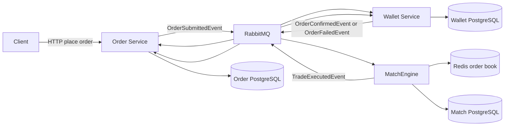
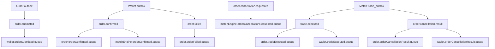
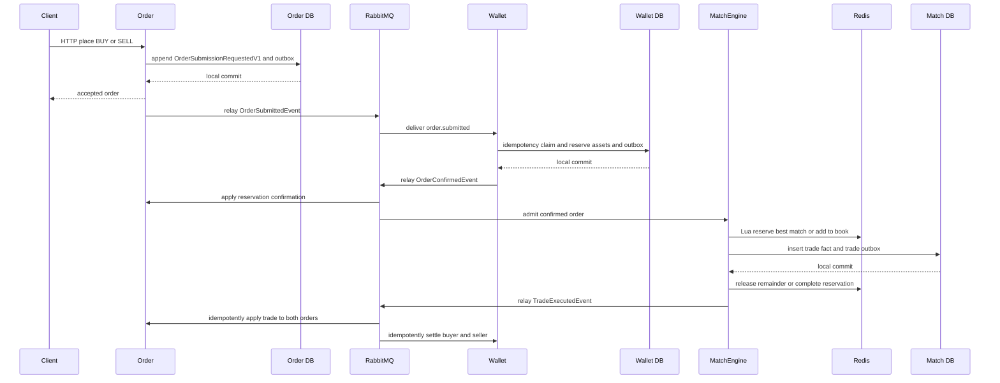
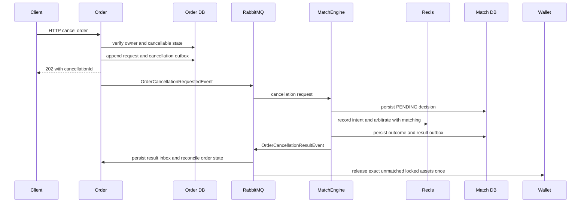
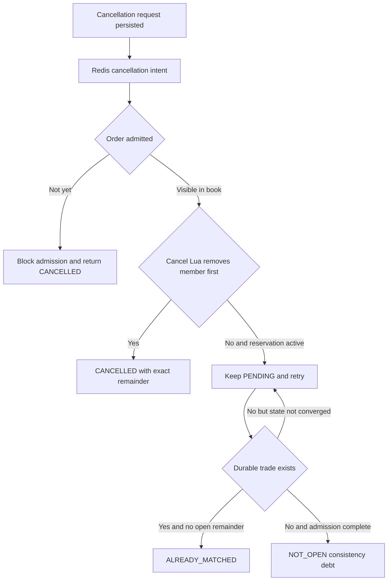
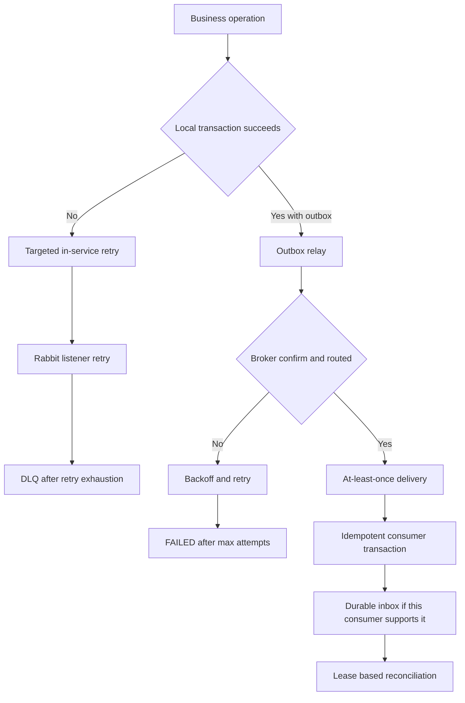
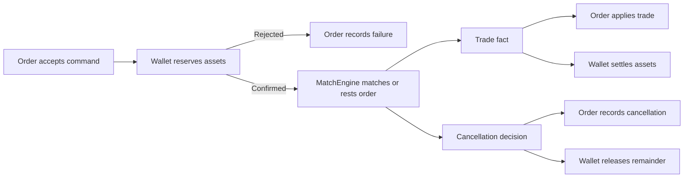

# CDA 訂單事件完整生命週期與失敗復原

> 文件狀態：依 2026-08-25 workspace 實作核對。本文只描述連續雙向競價（CDA）的現況；TDA 有不同的事件可靠性缺口，不能套用本文保證。

這份文件回答的不只是「訂單怎麼成交」，而是四個更重要的問題：每個服務擁有哪一段事實、失敗可能發生在哪裡、系統靠什麼重試並收斂，以及哪些事情目前仍需要人工處理。EAP 的 CDA 不是跨三個資料庫的 ACID transaction，也不是 exactly-once messaging；它採用每個服務的本地 ACID、transactional outbox、冪等 consumer、持久化 retry state 與外部一致性核對，建立可恢復的 at-least-once 流程。

## 一頁結論

- Order 是訂單生命週期的權威來源；Wallet 是可用／鎖定資產與結算的權威來源；MatchEngine 是 order book、取消訂單競爭結果與 `TradeExecuted` 的權威來源。
- RabbitMQ 只負責傳遞，不是業務事實來源，也不保證跨 queue 的全域順序。
- 需要跨服務發布的 CDA 狀態轉換，先把本地事實與 outbox row 放進同一筆資料庫交易；relay 在 commit 後發布。
- relay 收到 publisher confirm 後才標記 `SENT`。若發布成功後、標記前當機，事件會重送，因此 consumer 必須冪等。
- 「本地狀態成功，但同一筆交易的 outbox insert 失敗」會整筆 rollback；若程式根本沒寫 outbox、或有人關閉 outbox write，outbox pattern 本身無法自動補救這種語意缺漏。
- 這是一個 choreography-based Saga：服務用事實事件接續流程，沒有中央 orchestrator，也沒有一張宣稱全域成功的 saga table。
- 取消訂單不是刪除資料。MatchEngine 用 Redis Lua 決定 match 與 cancel 誰先取得同一個 order book member，並發布 `CANCELLED`、`ALREADY_MATCHED` 或 `NOT_OPEN` 的持久化結果。
- business-complete 不是 RabbitMQ 已送出 `TradeExecuted`，而是 MatchEngine、Order、Wallet 的 durable `trade_id` 集合一致、資產守恆，而且 queue、DLQ、outbox／inbox／cleanup debt 已排空。

## 架構與責任邊界

| 元件 | 擁有的事實 | 不應宣稱擁有 |
| --- | --- | --- |
| Order | HTTP 命令、order event stream、command-side remaining amount／status、trade application、可重建 projection | Wallet balance、撮合結果 |
| Wallet | available／locked currency、available／locked energy、reservation、settlement ledger、cancellation release application | order book、訂單最終狀態 |
| MatchEngine | Redis order book、match／cancel 競爭判定、durable trade fact、cancellation decision | 資產異動、Order projection |
| RabbitMQ | durable queue、routing、redelivery、dead lettering | 業務正確性的 source of truth |
| 外部 verifier | 比對三服務最終 durable facts 與 debt | 介入線上交易或取代服務 ownership |

三個 PostgreSQL 之間沒有 distributed transaction。這是刻意的邊界：每個服務只在自己的 database 內提供強一致，跨服務則接受 eventual consistency，並用可重試、可去重、可核對的事件流程收斂。

## 事件拓撲

| Event | 最少必要語意 | Producer | Consumer |
| --- | --- | --- | --- |
| `OrderSubmittedEvent` | order、user、market、market sequence、side、limit price、amount、created time | Order | Wallet |
| `OrderConfirmedEvent` | Wallet 已成功保留資產；包含可直接進行撮合的完整 order snapshot | Wallet | Order、MatchEngine |
| `OrderFailedEvent` | 驗資的終止結果與 failure type | Wallet | Order |
| `TradeExecutedEvent` | 穩定 `tradeId`、market sequence、buyer／seller order、原始價格、成交價、數量、時間 | MatchEngine | Order、Wallet |
| `OrderCancellationRequestedEvent` | cancellation、order、owner、immutable original amount、request time | Order | MatchEngine |
| `OrderCancellationResultEvent` | outcome；成功時另含 side、limit price 與精確 unmatched remainder | MatchEngine | Order、Wallet |

這些 event 是已發生事實或需要權威服務判定的請求，不是「叫另一個服務執行某段內部程式」的 RPC 包裝。事件仍會形成業務與 schema coupling；解耦的意思是 producer 不需要知道 consumer 的部署、資料表或處理時機，不代表彼此完全沒有契約。

## 正常下單到成交的完整流程

### 階段 0：Order 接受 HTTP 命令

1. Controller 驗證 DTO；endpoint 另外示範 user-based rate limit。下單服務在寫入前檢查 Wallet queue backpressure，避免已知下游過載時繼續無限制接單。
2. Order 取得每個 market 的單調 `marketSequence`，建立 `OrderSubmissionRequestedV1` domain event 與 `OrderSubmittedEvent` integration event。
3. `OrderEventAppender` 鎖定／建立 stream head，檢查 expected version 與 event identity。
4. order event、command-side matching state、stream head 與 `order_event_outbox` 在同一筆 Order DB transaction／CTE 中寫入。
5. commit 成功才算 Order 接受命令。相同 event ID 且 payload 相同是 idempotent replay；相同 identity 卻不同 payload 是衝突，不會靜默覆蓋。

如果 outbox insert 在這一步失敗，整筆 local transaction rollback；不會留下「已接受訂單但 outbox row 缺失」的半套 commit。HTTP 明確回失敗時，client 可以提供相同 `orderId` 重試。若 connection 在 commit 後、response 前中斷，client 無法只靠 HTTP 判斷第一次是否成功；目前雖會偵測相同 order identity，但重試時重新配置的 market sequence／timestamp 可能形成 payload conflict。完整的 client-visible idempotency contract 應保存 request identity 與第一次 response，這是目前仍可補強的邊界。

### 階段 1：Order outbox 發布 `OrderSubmittedEvent`

1. relay 週期性取得到期的 `PENDING` rows；非同步模式還會使用 `IN_FLIGHT` lease 與 `SKIP LOCKED`，回收過期 claim。
2. 以 persistent message、mandatory routing 發到 `order.exchange` 的 `order.submitted`。
3. relay 等 publisher confirm，並檢查 returned／unroutable message。
4. 成功後把 row 標記為 `SENT`；失敗則增加 attempt，使用 exponential backoff，最多 10 次後標記 `FAILED`。

publisher confirm 只代表 broker 接受訊息，不代表 Wallet 已處理，更不代表整張訂單已成交。若 broker 已接受、但 relay 在 `SENT` commit 前中斷，之後會再次發布；這正是 at-least-once 的重複窗口。

### 階段 2：Wallet 驗資與保留資產

Wallet 收到 `OrderSubmittedEvent` 後，在一個 PostgreSQL CTE／transaction 內完成：

1. 以 `order_id` 寫入 `order_submission_idempotency`；duplicate delivery 無法再次 claim。
2. 鎖定並檢查 Wallet。
3. BUY 將 `price * amount` 從 `available_currency` 移到 `locked_currency`；SELL 將 amount 從 `available_amount` 移到 `locked_amount`。
4. 有足夠資產時建立 `OrderConfirmedEvent` outbox；錢包不存在、餘額不足或電量不足時，不修改資產並建立 `OrderFailedEvent` outbox。
5. 程式要求新 claim 必須恰好寫入一筆 outbox，否則拋錯讓 transaction rollback。

這裡有兩層技術重試：

- service 內只針對 `CannotAcquireLockException` 最多重試 3 次；這是短暫 database lock conflict，不會把所有例外盲目重試。
- listener 若仍拋錯，Spring Rabbit listener retry 依預設設定嘗試 3 次，間隔約 1 秒、2 秒，最高 10 秒；耗盡且 `default-requeue-rejected=false` 時進 DLX／DLQ。

「資產不足」是業務結果，不是技術例外，因此正常 commit 並透過 outbox 發布 `OrderFailedEvent`。Order 收到後 append `OrderAssetReservationFailedV1`，流程在未進入 MatchEngine 前終止。

### 階段 3：同一份 confirmation 分流到 Order 與 MatchEngine

Wallet relay 發布 `OrderConfirmedEvent` 後，RabbitMQ topic exchange 將它複製到兩個獨立 queue：

- Order 將 Wallet 的整合事實轉成 `OrderAssetReservationConfirmedV1`，更新 command state；batch listener 只有在本地 append 成功後才 manual ACK。
- MatchEngine 將相同 snapshot admission 到 CDA order book。兩個 consumer 沒有先後保證，因此後續 `TradeExecutedEvent` 可能早於 Order confirmation projection 抵達；Order 的 trade inbox 專門吸收這個正常的 out-of-order 情況。

### 階段 4：MatchEngine admission、撮合與成交落盤

1. MatchEngine 驗證 order、market、side 與 sequence，並以 Redis processing state／completed bitmap 防止同一 confirmed order 被重複 admission。
2. Redis Lua 在單一原子操作中檢查 cancellation intent、取得最佳 opposing order 並建立 reservation；沒有可成交對手時，就在同一次 Lua 邊界把 incoming order 加入 order book。
3. 有 match 時先保留 resting order，再計算 matched quantity。此時 Redis reservation 尚不是 durable trade fact。
4. `JpaTradeExecutionRecorder` 在單一 Match DB transaction／CTE 中寫入 append-only `trade_executions` 與 `trade_outbox`。`trade_id` 由 market 與 match sequence 穩定產生。
5. commit 後才調整記憶體中的剩餘量；partial resting remainder 用 Redis lock 與 Lua 放回 order book，full fill 則完成 reservation。

重要的 crash／failure 分支：

- trade DB transaction 失敗：原始 resting amount 被放回 Redis reservation／order book，Rabbit listener 可重試 confirmed order。
- trade 已 durable commit，但同步 Redis cleanup 來不及完成：同一筆 transaction 可建立 `reservation_cleanup_tasks`，worker 以 lease、`SKIP LOCKED`、最多 10 次與 exponential backoff 重做 cleanup。
- crash 讓 reservation 沒有對應正常 cleanup task：`ReservationReconciler` 掃描超過 threshold 的 reservation；若存在 durable trade，就完成或釋放正確 remainder；若沒有 durable trade，就把原始 order 放回。
- incoming processing 卡在 `PROCESSING`：超過 stale threshold 後，processor 取得 per-order lock，從 visible order、reservation 與 durable matched quantity 判斷已完成部分，再從剩餘量恢復。

這套補償只收斂 MatchEngine 自己擁有的 Redis／PostgreSQL 邊界，不是假裝回滾 Wallet 或 Order。

### 階段 5：發布與套用 `TradeExecutedEvent`

Match `trade_outbox` relay 等 broker confirm 後才標 `SENT`；失敗最多嘗試 10 次、exponential backoff，最後為 `FAILED`。正常設定 `trade-outbox.write-enabled=true`；若刻意關閉它，交易仍可能被保存但不會產生現行 `TradeExecutedEvent`，這是設定造成的可靠性降級，不能稱為 outbox 保護。

Order 與 Wallet 各自消費同一個 trade fact：

- Order 在本地 transaction 對 buyer／seller order 套用 matched quantity，並以 `trade_id` 的 application record 去重。若 confirmation／projection 尚未就緒，先把 payload 保存為 `PENDING_PREREQUISITE`；其他暫時錯誤為 `FAILED_RETRYABLE`。reconciler 使用 lease 每 100 ms claim，並採用 100 ms 起始的 exponential delay；prerequisite 尚未收斂時會持續重排，其他技術錯誤最多 20 次後轉為 permanent failure。成功後標 `APPLIED`；業務矛盾則隔離單筆並立即標 `FAILED_PERMANENT`，避免一筆 poison event 卡住整個 batch。
- Wallet 在一筆 transaction 鎖定 buyer／seller wallet、插入唯一 `trade_settlements.trade_id`，再同時扣除 locked asset、交付 energy、支付賣方並退回買方 price improvement。要求兩個 wallet update 與一個 settlement 恰好成立；任何不一致都 rollback。duplicate `trade_id` 不會再次結算。

Wallet 的 trade listener 沒有像 Order 一樣的 service-owned durable retry inbox；它依賴本地 transaction rollback、Rabbit listener retry、idempotent settlement 與耗盡後 DLQ。這是目前實作差異，不應把 Order inbox 的保證泛化給所有 consumer。

## 取消訂單的完整生命週期

取消訂單是另一條 Saga 分支，目標是讓 match 與 cancel 在同一個 MatchEngine authority 內決定先後，而不是讓 Order、Wallet 各自猜測。

### Order 接受取消請求

1. API 只回 `202 Accepted`，含 deterministic `cancellationId`；它代表命令已 durable 接受，不代表已取消。
2. Order transaction 鎖定 command matching state，確認 order 存在、request user 是 owner、狀態仍可取消。
3. append `OrderCancellationRequestedV1` 並在同一 transaction 寫入 `OrderCancellationRequestedEvent` outbox。
4. event 同時保存 immutable original amount。它用於 replay identity；不是部分成交後要釋放的數量。

相同取消命令 replay 會回到既有 event。相同 ID 但 order／user identity 不一致會被拒絕。

### MatchEngine 的競爭判定

1. 先在 `order_cancellations` 建立 `PENDING` recovery record，再寫 Redis cancellation intent。PENDING DB row 讓中斷後可重做，但真正擋住 admission／matching 的是 Redis intent 與 Lua 邊界。
2. 尚未 admission 的 confirmed order：admission Lua 看到 intent，回傳 cancellation pending；coordinator 以完整 snapshot 完成 `CANCELLED`。
3. 已在 order book 的 order：cancel Lua 與 match Lua 競爭移除同一個 ZSET member。cancel 先取得時回傳精確 remaining snapshot；match 已 reservation 時 cancel 等待或最後回 `ALREADY_MATCHED`。
4. coordinator 將 decision outcome 與 `OrderCancellationResultEvent` outbox 在同一筆 Match DB transaction 中提交。
5. pending reconciler 以 lease 與 `SKIP LOCKED` claim；每次重建 Redis intent，檢查 visible remainder、active reservation、admission state 與 durable trades，250 ms 起始 exponential delay、最高 30 秒，直到可分類。

### Order 與 Wallet 套用取消結果

- Order listener 先以 `cancellation_id` 把完整 payload 存進 durable inbox，若相同 ID 的 payload 不同就報 identity conflict。reconciler 再套用結果；如果 `TradeExecutedEvent` 尚未讓 current remaining amount 降到 MatchEngine 提供的 `cancelledAmount`，狀態保持 `PENDING_PREREQUISITE`，不會錯把已成交量取消。最多 20 次後技術失敗會成為 `FAILED_PERMANENT`。
- Wallet 只對 `CANCELLED` 釋放資產。BUY 釋放 `limitPrice * cancelledAmount`，SELL 釋放 `cancelledAmount`；application row 與 wallet update 在同一 transaction，`cancellation_id`／`order_id` 保證只套用一次，並檢查 locked amount 不得變負。
- `ALREADY_MATCHED` 不釋放資產；後續由正常 `TradeExecutedEvent` 完成 Order／Wallet 收斂。
- `NOT_OPEN` 在 Order 被視為需調查的一致性債務，不會靜默標成取消成功；Wallet 不做資產異動。

因此 trade settlement 與 cancellation release 即使跨兩個 queue 以不同順序抵達，也只處理互不重疊的 matched quantity 與 unmatched remainder。這是補償式收斂，不是把已完成成交 rollback。

## Retry、ACK、DLQ 與恢復層次

| 層次 | 解決的問題 | 目前行為 | 不能解決的問題 |
| --- | --- | --- | --- |
| PostgreSQL transaction | 同一服務內部分成功 | state、idempotency、outbox／application 一起 commit 或 rollback | 跨服務原子提交 |
| Redis Lua | 同一 order book key 的競爭 | match、cancel、admission fence 原子判定 | PostgreSQL 與 Redis 的單一 ACID transaction |
| service 內 retry | 已知短暫衝突 | Wallet lock conflict 最多 3 次；各 reconciler 有獨立 backoff | 永久 schema／資料錯誤 |
| outbox retry | DB 已 commit、broker 暫時不可用 | publisher confirm、mandatory return、最多 10 次後 `FAILED` | 沒有建立 outbox row 的程式錯誤 |
| Rabbit listener retry | consumer 暫時失敗 | 預設 3 次，之後 dead-letter | DLQ 自動判讀與安全 replay |
| idempotency | duplicate publish／redelivery | order ID、event ID、trade ID、cancellation ID unique guards | 相同 ID 卻不同 payload；這會被當成 conflict |
| durable inbox／reconciler | out-of-order 或長於 broker retry 的失敗 | Order trade 與 cancellation result 有持久化狀態、lease、backoff | Wallet 與所有 listener 都自動擁有同等 inbox 保證 |
| external verifier | 找出整體尚未收斂 | 比對 durable IDs、asset、queue 與 debt | 自動修復所有未知 bug |

ACK 規則也需要精確表達：Order 的 confirmation／trade batch listener 明確 manual ACK；Wallet 與 MatchEngine 的主要 simple listener 在方法正常返回後由 container ACK。若必要的本地 transaction 尚未成功，不能先 ACK。反序列化失敗或 retry 耗盡的 poison message 會進綁定到 `order.dlx` 的 shared `order.dlq`。

## 「訊息沒寫進 outbox」到底怎麼處理

這句話其實有三種完全不同的 failure window：

### 1. 同一筆 transaction 正在寫 state 與 outbox，但 outbox insert 失敗

transaction rollback，state 也不能 commit。這是 transactional outbox 真正處理的 dual-write 問題。呼叫端或 broker redelivery 重新執行整個本地 operation。

### 2. state 與 outbox 都 commit，但 relay 尚未發布

row 保持 `PENDING`；relay poll 後重試。服務重啟不會遺失它。

### 3. state commit 了，但程式路徑根本沒有建立 outbox

這不是 relay 能恢復的 publish failure，而是 semantic omission／錯誤設定／程式 bug。正常 CDA 路徑用 CTE、row-count invariant 與整合測試降低這個風險；Match 的 `trade-outbox.write-enabled` 也必須維持 `true`。若真的發生，需要：

1. 以「本地事實存在但沒有相對應 outbox／下游 durable fact」的 reconciliation query 或 benchmark verifier 找出缺口。
2. 停止把該狀態宣稱為已完成，保存 event identity 與原始 payload。
3. 修正 code／configuration 後，以有 idempotency key 的受控 replay 或 backfill 建立事件。
4. 再次核對下游 durable facts、資產、queue、DLQ 與 retry debt。

目前不是每一種 terminal `FAILED` 都有完整的公開 recovery API。Wallet 有可列出／requeue `FAILED` outbox 的 admin capability，但預設關閉；Order 與 Match 主要依賴 status／metrics、資料庫操作與受控 runbook。把 terminal failure 自動改回 `PENDING` 可能重送 poison event，因此必須先查原因，不能用無限 retry 掩蓋。

## Saga Pattern：目前真正實作的是什麼

EAP 的 CDA 可以稱為「以事件編排的 Saga」或 choreography-based Saga，但要帶著限制說明：

已實作的 Saga 特性：

- 每一步只提交本服務狀態，不持有跨服務 database lock。
- 下一步由 integration event 觸發；producer 不同步等待整條鏈完成。
- compensation 不是 database rollback：驗資失敗產生終止事實；取消成功只釋放尚未成交的 reservation；Match 的 Redis 補償只恢復自己的 reservation。
- duplicate、暫時失敗、out-of-order 被當作正常分散式系統情境。
- correlation 使用 order ID、trade ID、cancellation ID 與 market sequence，而不是靠 log 文字猜測。

目前沒有的能力：

- 沒有中央 Saga orchestrator 或單一 global saga status；任何服務都不能單獨宣稱三服務已完成。
- 沒有跨服務 exactly-once；提供的是 at-least-once delivery 加上 effectively-once local state transition。
- 沒有統一的 end-to-end timeout，自動找出每一張長時間卡住的 order 並決定補償。
- shared DLQ 尚不是完整的分類、審核、replay control plane；Wallet trade／cancellation consumer 也沒有 service-owned inbox。
- Order／Match terminal outbox failure 的人工 recovery 介面不如 Wallet 完整。
- Redis 全毀後由 PostgreSQL 重建完整 order book，仍是較大的 recovery architecture 題目；reservation reconciler 只處理局部中斷。

因此面試時不應說「我用了 Saga，所以跨服務一致性已解決」。更精確的說法是：

> 我把下單、資產保留、撮合、成交套用與取消訂單切成各服務擁有的本地交易，再以事實事件接續。Outbox 解決 commit 後可靠發布，冪等與 inbox 解決重送及亂序，補償流程處理未成交資產與 Redis reservation；最後用跨服務 durable fact verifier 定義是否收斂。它是 choreography Saga，仍保留 terminal failure、DLQ replay 與全域 timeout control plane 等明確缺口。

## 失敗情境矩陣

| 故障點 | 當下可能狀態 | 自動恢復路徑 | 最後仍失敗時 |
| --- | --- | --- | --- |
| Order event／outbox insert | 尚未 commit | 整筆 rollback，HTTP retry | client 取得失敗，無 accepted order |
| Order outbox publish | Order fact 已 commit | relay backoff、重啟後續跑 | outbox `FAILED`，需告警與受控處理 |
| Wallet lock conflict | broker message 未 ACK | service 內 3 次，再由 listener retry | DLQ |
| Wallet 資產不足 | reservation 不成立 | commit `OrderFailedEvent` outbox | 這是正常終止，不是 DLQ |
| Wallet outbox publish | reservation／failure fact 已 commit | relay 最多 10 次 | `FAILED`；admin 預設關閉 |
| Match Redis reserve 後 trade DB 寫入失敗 | resting order 暫時被 reserve | 立即 release；listener redelivery | reservation reconciler、DLQ／告警 |
| Trade commit 後 Redis cleanup crash | durable trade 已存在 | cleanup task 或 orphan reconciler | cleanup `FAILED` debt，不可算測試通過 |
| Match trade outbox publish | durable trade 已存在 | relay 最多 10 次 | `FAILED`；Order／Wallet 不會憑空知道 trade |
| Order trade 比 confirmation 早到 | prerequisite 未就緒 | durable inbox 持續以 `PENDING_PREREQUISITE` 重排 | 長時間不收斂時告警並追查缺失的上游事實 |
| Wallet settlement 中途失敗 | 無 partial settlement commit | transaction rollback、listener retry | DLQ |
| publish 成功但 outbox 未標 SENT | consumer 可能已完成 | 重送同一 event | unique／identity guard 吸收 duplicate |
| cancel 與 match 同時發生 | 一方已取得 Redis member | Redis Lua 決定；pending reconciler 查 durable trade | `NOT_OPEN` 或 permanent debt 需調查 |
| cancellation result 早於 Order trade | Order remaining 尚過大 | cancellation inbox 持續等待 prerequisite | 長時間不收斂時成為可觀測 debt，不會錯誤取消已成交量 |

## 什麼時候才算服務正確

單一 `curl`、HTTP 2xx、Rabbit publisher confirm、queue 最後為 0，都不足以各自證明完整交易正確。完整 CDA 測試至少需要同時驗證：

1. offered／scheduled／sent／HTTP success 與失敗分類。
2. Match durable trade count 與唯一 `trade_id`。
3. Order trade application 的 `trade_id` 集合等於 Match。
4. Wallet settlement 的 `trade_id` 集合等於 Match。
5. buyer／seller 資產、locked remainder 與 price improvement 守恆。
6. Rabbit ready／unacked 與 DLQ 為 0。
7. 三個服務的 outbox `PENDING`／`IN_FLIGHT`／`FAILED`、Order inbox retry debt、Match cleanup／cancellation pending debt 為 0。
8. 明確區分同窗 completion throughput 與輸入停止後 drain 完成的 full-lifecycle throughput。

目前效能數字、工作負載限制與證據等級以[效能報告](performance-report.md)為準；本文只定義流程與正確性語意，不用局部吞吐量替整體容量背書。

## 面試時可以從這裡開始講

一分鐘版本：

> 這個專案最初看起來只是 Order、Wallet、MatchEngine 用 RabbitMQ 串起來，但我後來把問題改成「每一段事實由誰負責，以及 crash 可以落在哪裡」。Order 接受命令時把事件與 outbox 一起 commit；Wallet 在一筆交易中做冪等 claim、資產保留與 confirmation outbox；MatchEngine 用 Redis Lua 判定 order book 競爭，再把成交事實與 trade outbox 一起寫入 PostgreSQL。RabbitMQ 是 at-least-once，所以我刻意讓 publisher 可能重送，consumer 以 trade ID、order ID、cancellation ID 去重。遇到跨 queue 亂序時，Order 用 durable inbox 等 prerequisite；遇到 Redis 與資料庫之間的 crash window，Match 用 cleanup task 與 reconciler 收斂。最後不是看訊息有沒有送出，而是比對三個服務的 durable trade facts、資產與所有 retry debt。

主管若追問「這算 Saga 嗎」：

> 算 choreography Saga，但我不把 Saga 當成魔法。它沒有中央 orchestrator，也沒有跨服務 exactly-once。補償不是回滾已成交交易，而是對尚未成交的 reservation 做可稽核釋放；terminal outbox、DLQ replay 與全域 timeout 仍是目前刻意留下的 production gap。

主管若追問「event 真的解耦嗎」：

> 它降低執行與部署耦合，producer 不需要同步呼叫 consumer；但 event name、欄位與業務順序仍形成 semantic coupling。我讓 event 攜帶 consumer 做決策所需的穩定事實，例如 `TradeExecutedEvent` 的雙方 order、價格與數量，但不塞 consumer 的資料表命令。真正的解耦來自 ownership、版本策略、冪等與可獨立恢復，不是只因為中間放了 RabbitMQ。

## 程式碼查核入口

| 主題 | 實作入口 |
| --- | --- |
| 下單 command 與 Order outbox | [`OrderEventSourcingService`](../eap-order/src/main/java/com/eap/eap_order/application/OrderEventSourcingService.java)、[`OrderEventAppender`](../eap-order/src/main/java/com/eap/eap_order/eventstore/OrderEventAppender.java) |
| Order outbox relay | [`OrderEventOutboxRelay`](../eap-order/src/main/java/com/eap/eap_order/eventstore/OrderEventOutboxRelay.java) |
| Wallet reservation／idempotency／outbox CTE | [`CreateOrderListener`](../eap-wallet/src/main/java/com/eap/eap_wallet/application/CreateOrderListener.java) |
| Wallet outbox | [`OutboxPoller`](../eap-wallet/src/main/java/com/eap/eap_wallet/application/OutboxPoller.java) |
| Match admission recovery | [`OrderConfirmedProcessor`](../eap-matchEngine/src/main/java/com/eap/eap_matchengine/application/OrderConfirmedProcessor.java) |
| Redis match／reservation | [`MatchingEngineService`](../eap-matchEngine/src/main/java/com/eap/eap_matchengine/application/MatchingEngineService.java)、[`RedisOrderBookService`](../eap-matchEngine/src/main/java/com/eap/eap_matchengine/application/RedisOrderBookService.java) |
| Durable trade 與 outbox | [`JpaTradeExecutionRecorder`](../eap-matchEngine/src/main/java/com/eap/eap_matchengine/application/JpaTradeExecutionRecorder.java)、[`TradeOutboxRelay`](../eap-matchEngine/src/main/java/com/eap/eap_matchengine/application/TradeOutboxRelay.java) |
| Redis crash-window recovery | [`ReservationCleanupWorker`](../eap-matchEngine/src/main/java/com/eap/eap_matchengine/application/ReservationCleanupWorker.java)、[`ReservationReconciler`](../eap-matchEngine/src/main/java/com/eap/eap_matchengine/application/ReservationReconciler.java) |
| Order trade inbox | [`TradeExecutedListener`](../eap-order/src/main/java/com/eap/eap_order/application/TradeExecutedListener.java)、[`OrderTradeExecutedReconciler`](../eap-order/src/main/java/com/eap/eap_order/application/OrderTradeExecutedReconciler.java) |
| Wallet settlement | [`WalletTradeSettlementAppender`](../eap-wallet/src/main/java/com/eap/eap_wallet/application/WalletTradeSettlementAppender.java) |
| 取消訂單競爭判定 | [`OrderCancellationCoordinator`](../eap-matchEngine/src/main/java/com/eap/eap_matchengine/application/OrderCancellationCoordinator.java)、[`OrderCancellationDecisionStore`](../eap-matchEngine/src/main/java/com/eap/eap_matchengine/application/OrderCancellationDecisionStore.java) |
| Order cancellation inbox | [`OrderCancellationResultInbox`](../eap-order/src/main/java/com/eap/eap_order/application/OrderCancellationResultInbox.java)、[`OrderCancellationResultReconciler`](../eap-order/src/main/java/com/eap/eap_order/application/OrderCancellationResultReconciler.java) |
| Wallet cancellation release | [`WalletOrderCancellationAppender`](../eap-wallet/src/main/java/com/eap/eap_wallet/application/WalletOrderCancellationAppender.java) |
| Queue／routing contract | [`RabbitMQConstants`](../eap-common/src/main/java/com/eap/common/constants/RabbitMQConstants.java) |

延伸閱讀：[系統架構](architecture.zh-TW.md)、[取消責任與回歸報告](benchmarks/2026-08-24-cancellation-ownership-and-regression.md)、[效能報告](performance-report.md)、[面試快速入口](interview-guide.zh-TW.md)。
