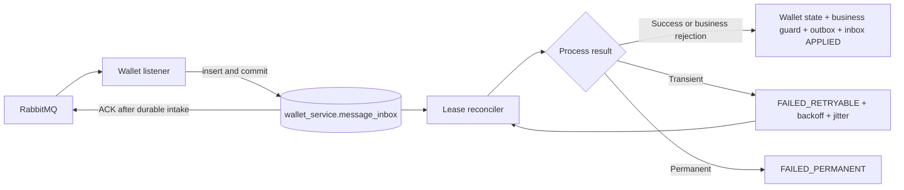
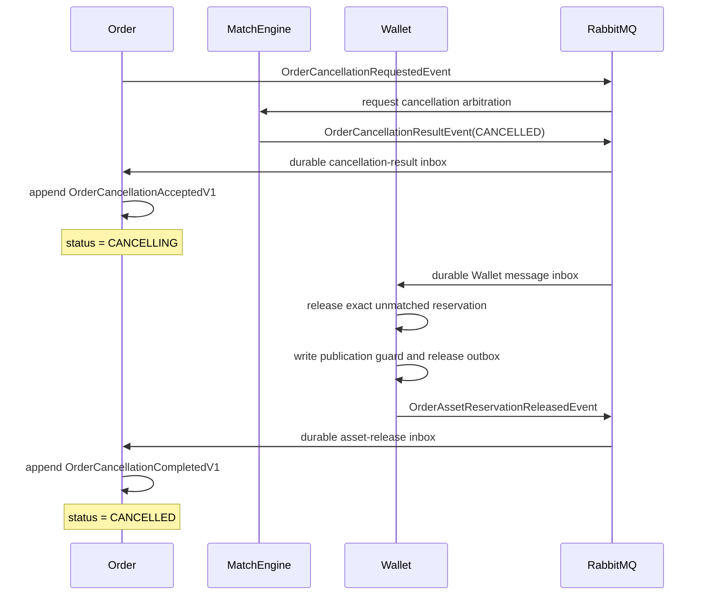

# Wallet Durable Inbox 與取消訂單最終確認

> 更新日期：2026-09-01
>
> 適用範圍：CDA `OrderSubmittedEvent`、`OrderCancellationResultEvent`、`OrderAssetReservationReleasedEvent`
>
> 定位：本文件說明目前已實作的可靠性邊界、資料庫寫入、重試、錯誤分類、crash window 與尚未完成的 production gap。

## 先說結論

這次修改補上兩件事：

1. Wallet 不再於 Rabbit listener 內直接做驗資或取消釋放。訊息會先寫入 Wallet-owned durable inbox，commit 成功後 listener 才正常返回並由 container ACK；後續由可 reclaim 的 lease worker 執行業務交易。
2. MatchEngine 的 `CANCELLED` 只確認「剩餘數量已由取消取得，不會再被撮合」。Order 先進入 `CANCELLING`；Wallet 真的釋放鎖定資產並透過 outbox 發出 `OrderAssetReservationReleasedEvent` 後，Order 才 append 完成事實並成為 `CANCELLED`。

這不是 distributed transaction，也不是跨服務 exactly-once。它以各服務的 local transaction、outbox、durable inbox、穩定 identity 與冪等效果，讓 at-least-once delivery 在 duplicate、亂序與 worker crash 下仍可收斂。

## 為什麼要多一個 Wallet Inbox

舊流程是 listener 收到訊息後立即呼叫 Wallet 業務交易。短暫 lock conflict 會在 service 內重試，仍失敗再由 Spring Rabbit retry；幾次重試後就進 DLQ。這有兩個限制：

- broker ACK 與業務處理綁在同一個 listener execution，無法在 Wallet 內清楚回答「訊息已收到，但尚待處理」；
- DB outage 若長於幾秒，合法工作會快速變成 DLQ 人工債務，缺少 service-owned 的長期 retry state。

新流程把 delivery lifecycle 與 business effect 分開：



Rabbit ACK 現在只證明 Wallet 已 durable intake，不代表資產已保留、已拒絕或已釋放。業務完成要看 inbox `APPLIED`、Wallet 業務資料及對應 outbox／下游狀態。

## Wallet 新增哪些資料

### `wallet_service.message_inbox`

這是 delivery 與 processing lifecycle 的 durable record，不取代 Wallet 原有的 business idempotency tables。

| 欄位 | 用途 |
| --- | --- |
| `message_type`、`message_id` | 複合主鍵；目前支援 `ORDER_SUBMITTED/order_id` 與 `ORDER_CANCELLATION_RESULT/cancellation_id` |
| `payload`、`payload_hash`、`schema_version` | 保存原始工作與版本；判斷 same-ID/same-payload replay 或 identity conflict |
| `status` | `PENDING`、`IN_PROGRESS`、`APPLIED`、`FAILED_RETRYABLE`、`FAILED_PERMANENT` |
| `attempt_count`、`next_retry_at` | 有界技術 retry 與排程時間 |
| `claimed_by`、`claim_until` | worker lease、owner fencing 與 crash reclaim |
| `error_type`、`last_error` | 可查詢的失敗分類與最後錯誤 |
| `conflicting_payload`、`conflict_detected_at` | 保存 same identity/different payload 的事故證據 |
| `received_at`、`applied_at`、`updated_at` | intake、完成與 debt age 稽核 |

retry partial index 只涵蓋仍可能被 claim 的狀態，避免每次掃描整張歷史表。

### `wallet_service.order_asset_release_publications`

這張表是取消釋放事件的 publication guard：

- `cancellation_id` 為主鍵；
- `event_id` 與 `order_id` 也唯一；
- event ID 由 `ORDER_ASSET_RESERVATION_RELEASED:<cancellationId>` deterministic 產生。

它防止 Wallet 在 cancellation redelivery 或 worker crash 後建立兩個邏輯相同的 release outbox row。這張 guard、資產釋放 application、Wallet balance update、release outbox 與 inbox `APPLIED` 都在同一筆 Wallet transaction 中提交。

## 冪等性與資產不變量是兩層不同保護

取消的 business idempotency 以 `cancellation_id`／`order_id` 判斷「同一個取消效果是否已成功套用」。它處理 duplicate delivery：第一次成功後，第二次不再釋放資產，也不再建立 release event。

locked asset guard 則回答「第一次套用是否具備正確資產前置條件」。例如 BUY 要釋放 500，但 Wallet 只有 200 locked currency，不能因為 cancellation ID 尚未出現就放行。SQL 雖會在同一個 CTE 嘗試建立 cancellation application，但 wallet update 為 0 後會拋出 `WalletAssetConsistencyException`；外層 transaction 會把 application insert 一起 rollback。因此不會出現「資產沒有釋放，冪等 row 卻宣稱已完成」的 ghost success。

```text
same identity 已成功套用
    -> duplicate success，不再次變更資產

第一次套用
    -> locked asset 足夠：asset + application + publication + outbox + inbox APPLIED 一起 commit
    -> locked asset 不足：全部 rollback，inbox 標 FAILED_PERMANENT / PERMANENT_ASSET_INVARIANT
```

所以冪等性是最優先的重複效果保護，但它不能證明第一次收到的 quantity 或當下 balance 一定正確；資產不變量仍必須獨立驗證。

## Listener、Worker 與交易邊界

### 第一步：listener durable intake

`CreateOrderListener` 與 `OrderCancellationResultListener` 只做：

1. 驗證必要 identity；
2. serialize payload 並計算 SHA-256；
3. `INSERT ... ON CONFLICT DO NOTHING`；
4. same identity/same hash 視為 duplicate success；
5. same identity/different hash 保存 conflict，未完成的 row 轉 `FAILED_PERMANENT`；
6. receive transaction commit 後正常返回，Rabbit container 才 ACK。

因此 consumer 在 inbox commit 後、broker ACK 前 crash，只會造成 redelivery；相同 payload 會命中同一筆 inbox，不會重複做資產效果。

### 第二步：lease worker claim

`WalletMessageReconciler` 預設每 100 ms 取最多 100 筆，以 `FOR UPDATE SKIP LOCKED` claim 到期工作：

```text
PENDING / FAILED_RETRYABLE
或 lease 已過期的 IN_PROGRESS
    -> IN_PROGRESS
    -> attempt_count + 1
    -> claimed_by = worker UUID
    -> claim_until = now + 30 seconds
```

多個 instance 不會互相等待同一列。worker 在 claim 後 crash，30 秒 lease 到期後其他 worker 可接手。完成或改寫 retry state 時都要求 `status = IN_PROGRESS AND claimed_by = owner`；若 lease 已失去，update 必須失敗。

### 第三步：業務效果與 `APPLIED` 原子提交

`WalletMessageProcessor.process` 是單一 transaction：

- 驗資：business idempotency claim、Wallet 資產保留或拒絕、`OrderAssetReservationSucceededEvent/OrderFailedEvent` outbox、inbox `APPLIED` 一起 commit；
- 取消：cancellation application、Wallet locked asset 釋放、publication guard、`OrderAssetReservationReleasedEvent` outbox、inbox `APPLIED` 一起 commit。

若最後的 owner fencing 無法把 inbox 標成 `APPLIED`，整筆 transaction rollback。因此不會留下「資產已變更、outbox 已建立，但 inbox 仍可被另一個 worker 重做」的部分 commit。

## 錯誤如何分類與重試

| 類別 | 目前例子 | Wallet 動作 | 是否有 attempt 上限 |
| --- | --- | --- | --- |
| Business result | wallet 不存在、餘額或電量不足 | 正常建立 `OrderFailedEvent`，整筆交易 commit | 不走技術 retry |
| Transient | Spring `DataAccessException`，包含 lock／連線等 DB 暫時錯誤 | `FAILED_RETRYABLE`，延後再 claim | 20 attempts |
| Asset invariant | 要釋放的 currency／energy 超過 locked asset | 全部 rollback，`FAILED_PERMANENT/PERMANENT_ASSET_INVARIANT` | 不重試；需調查 quantity、reservation 與 settlement facts |
| Permanent identity | same identity/different payload、publication identity 衝突 | `FAILED_PERMANENT`，保留證據 | 不重試 |
| Permanent input/data | 不合法 event、算術錯誤、data integrity violation | `FAILED_PERMANENT` | 不重試 |
| Unknown | 尚未明確分類的 exception | 先當 `UNKNOWN_RETRYABLE` | 20 attempts |

技術 retry 使用 exponential backoff 與 bounded jitter：預設 250 ms 起始、最高 30 秒，jitter 最多約為 capped delay 的四分之一。worker 不在 thread 內 `sleep`，而是保存 `next_retry_at` 後釋放資源。

Wallet 現行兩種 message 沒有可證明會自行補齊的 prerequisite，因此 Wallet state machine 已移除 `PENDING_PREREQUISITE`。特別是 locked asset 不足不會因為等待成交而改善：settlement 只會消耗 locked asset，所以它直接成為永久一致性衝突。`PENDING_PREREQUISITE` 仍是 Order inbox 的合法狀態，因為 Order 確實可能先收到 trade、cancellation result 或 release event，再等待另一個 queue 的前置事實。

## 取消訂單為什麼拆成兩階段

MatchEngine 與 Wallet 各自擁有不同事實：

- MatchEngine 有權判定 order book 中的剩餘數量究竟被 match 或 cancel 取得；
- Wallet 有權宣告鎖定資產確實已釋放；
- Order 擁有對外呈現的訂單生命週期。

所以 `OrderCancellationResultEvent(CANCELLED)` 不能直接代表整張訂單已完整取消。新的生命週期是：



`OrderAssetReservationReleasedEvent` 是 integration event，不是要求 Order 操作 Wallet 狀態的 command。它只描述 Wallet 已完成的事實，包含：

- `eventId`
- `cancellationId`
- `orderId`
- `userId`
- `orderType`
- `releasedQuantity`
- `releasedAt`

它刻意不暴露可用餘額、鎖定餘額或 Wallet table schema。Order 只用 workflow identity、owner 與 quantity 驗證「這次取消的補償步驟已由正確 bounded context 完成」。

## Order 如何安全完成取消

Order 新增 `order_service.order_asset_reservation_released_inbox`，以 `cancellation_id` 為主鍵，並保存 event identity、order identity、payload hash、lease、retry、conflict 與時間欄位。

流程如下：

1. release listener 先把 Wallet fact 寫入 durable inbox；commit 後才 ACK。
2. Order release reconciler claim row。
3. `completeCancellation` 驗證 order、user、cancellation、released quantity，以及 command-side status。
4. 若 MatchEngine 的 cancellation result 尚未被 Order 套用，status 還不是 `CANCELLING`，release row 進 `PENDING_PREREQUISITE`，稍後重試。
5. 條件成立後 append `OrderCancellationCompletedV1`，command state 與 query projection 成為 `CANCELLED`。
6. domain append 與 release inbox `APPLIED` 使用同一個 Order consumer transaction；lost lease 會一起 rollback。

舊 event stream 中的 `OrderCancelledV1` 仍可 replay，避免破壞既有資料；新寫入則使用 `OrderCancellationAcceptedV1` 與 `OrderCancellationCompletedV1` 表達兩個不同事實。

## Crash、重複與亂序會發生什麼

| Failure window | 結果與恢復方式 |
| --- | --- |
| Rabbit delivery 後、Wallet inbox commit 前 crash | 沒有 ACK；broker redelivery |
| Wallet inbox commit 後、ACK 前 crash | redelivery 命中 same payload duplicate；只留一筆 inbox |
| worker claim 後、業務 transaction 前 crash | lease 到期後由其他 worker reclaim |
| reservation／release transaction 中途失敗 | Wallet effect、guard、outbox、inbox `APPLIED` 全部 rollback |
| transaction commit 後、worker process crash | inbox 已 `APPLIED`；不重做 |
| Wallet outbox publish 成功、標 `SENT` 前 crash | outbox 可能重送；Order release inbox 用 identity 吸收 duplicate |
| release event 先於 Match cancellation result 抵達 Order | release inbox 保存為 `PENDING_PREREQUISITE`；Order 不會提早變 `CANCELLED` |
| same identity/different payload | 保存 conflicting payload 並標 permanent incident，不用 last-write-wins 覆蓋 |
| trade 與 cancellation result 亂序抵達 Wallet | trade settlement 與 cancellation application 各自冪等；若 release 超過 locked asset，整筆 rollback 並標永久一致性衝突，不猜測或無限等待 |
| permanent bad payload | `FAILED_PERMANENT`，等待調查；不持續轟炸 DB |

## 這次已解決與尚未解決的事

### 已解決

- Wallet 驗資與取消結果在業務處理前有 durable processing record。
- listener ACK 不再等價於業務完成，但有可查詢的 inbox debt。
- duplicate、same-ID conflict、worker crash、expired lease 與 lost-lease fencing 有測試。
- Wallet 資產效果、business guard、outbox 與 inbox terminal state 使用 local transaction 原子提交。
- Wallet reservation 以最終條件式 `UPDATE` 對最新 aggregate balance 驗資；不同訂單不能重用等待 row lock 前的舊判斷。四個 available／locked 欄位也有非負數 database constraint。
- `order_id` 是重複效果的 identity guard，不是訂單級資產歸屬；Wallet 只維護使用者層級的可替代資產總池。
- 已移除可繞過 durable inbox、冪等 claim 與原子驗資的舊 `/v1/wallet/check` 寫入入口。
- Wallet 發出資產釋放事實，Order 不再於 Match 決策一到就過早標成 `CANCELLED`。
- Order 能吸收 release/cancellation-result 的跨 queue 亂序。

### 尚未解決

- **Wallet DB 在 inbox insert 前長時間不可用**：此時沒有本地資料可寫，仍靠 Spring listener 3 attempts 後進目前 DLQ。需要 delayed retry queue、consumer pause 或其他 transport recovery policy；durable inbox 無法解決「尚未進 inbox」的窗口。
- **Saga timeout 與 age SLO**：Order 的合法 `PENDING_PREREQUISITE` 仍可持續等待，尚無自動 timeout detector 或 escalation workflow。
- **DLQ recovery control plane**：還沒有完整的 inspect、原因修正、rate-limited replay、audit 與 re-verification 流程。
- **Wallet trade consumer**：此次沒有把 `TradeExecutedEvent` 改成同一套 durable inbox；它仍依賴 local transaction、trade identity、短期 broker retry 與 DLQ。
- **Metrics 成本**：目前 inbox status gauge 會查詢資料庫；可用於學習與開發驗證，未來需評估降低 scrape query amplification 並補 oldest-age alert。
- **事件命名遷移**：後續已將語意不清的 `OrderConfirmedEvent` 改名為 `OrderAssetReservationSucceededEvent`；`OrderSubmittedEvent` 與 `OrderFailedEvent` 仍保留。新 release contract 使用明確的過去式事實名稱 `OrderAssetReservationReleasedEvent`。

## 驗收證據

2026-09-01 已完成：

- `eap-common`、`eap-wallet`、`eap-order` unit tests；
- Wallet PostgreSQL integration suite：inbox duplicate/conflict、lease reclaim、reservation 與 `APPLIED` 原子性、lost-lease rollback、release publication exactly once、settlement/cancellation ordering；
- locked asset 不足反例：一次處理後成為 `FAILED_PERMANENT/PERMANENT_ASSET_INVARIANT`，餘額不變，且 cancellation application、release publication 與 release outbox 都是 0；
- Order PostgreSQL integration suite：`CANCELLING → CANCELLED`、release inbox duplicate/conflict/reclaim、lost-lease rollback；
- 三服務 RabbitMQ 取消生命週期：open cancel、partial remainder cancel、match/cancel race。

本次三服務實測結果：

| 指標 | 結果 |
| --- | ---: |
| cancellation result inbox `APPLIED` | 22 |
| Wallet cancellation applications | 22 |
| Wallet release publications | 22 |
| Order cancellation completions | 22 |
| race mutual exclusion | valid |
| Order／Wallet／Match outbox debt | 0／0／0 |
| final queue backlog | 0 |
| DLQ | 0 |

本機可讀報告位於 `build/load-test-reports/http-cancellation-CANCELLATION_LIFECYCLE_20260901_WALLET_INBOX_R1-result-report.md`。`build/` 是可重建的測試輸出，不是版本控制下的文件來源；本頁才是此次設計與證據摘要。

後續三服務 inbox 與 Order 雙狀態整合後的正常交易回歸，請以
[2026-09-03 最新全鏈報告](benchmarks/2026-09-03-current-version-full-chain.md)為準；本頁的取消生命週期數據是 correctness evidence，不是目前 mixed-flow 容量。

## 面試版說法

> 我把 Wallet consumer 從「listener 直接做業務，短期重試後進 DLQ」改成 durable inbox。Rabbit ACK 只代表訊息已在 Wallet 落盤；lease worker 以 `SKIP LOCKED`、owner fencing、backoff 與 jitter 重試。資產異動、business idempotency、outbox 與 inbox `APPLIED` 在同一筆 local transaction，所以 worker crash 不會留下半套效果。取消流程則拆成 MatchEngine 判定取消成功與 Wallet 確實釋放資產兩個事實，Order 中間是 `CANCELLING`，收到 Wallet 的 `OrderAssetReservationReleasedEvent` 才成為 `CANCELLED`。這提高 safety 與一般 crash recovery，但 inbox commit 前的 DB outage、Saga timeout 與 DLQ control plane 仍是我明確保留的 production gap。

## 程式碼入口

| 主題 | 實作 |
| --- | --- |
| Wallet intake／identity | [`WalletMessageInbox`](../eap-wallet/src/main/java/com/eap/eap_wallet/application/WalletMessageInbox.java) |
| Wallet claim／retry | [`WalletMessageReconciler`](../eap-wallet/src/main/java/com/eap/eap_wallet/application/WalletMessageReconciler.java)、[`WalletMessageErrorClassifier`](../eap-wallet/src/main/java/com/eap/eap_wallet/application/WalletMessageErrorClassifier.java) |
| Wallet local transaction | [`WalletMessageProcessor`](../eap-wallet/src/main/java/com/eap/eap_wallet/application/WalletMessageProcessor.java) |
| Wallet reservation | [`WalletOrderReservationProcessor`](../eap-wallet/src/main/java/com/eap/eap_wallet/application/WalletOrderReservationProcessor.java) |
| Wallet cancellation release | [`WalletOrderCancellationAppender`](../eap-wallet/src/main/java/com/eap/eap_wallet/application/WalletOrderCancellationAppender.java) |
| Wallet release outbox | [`OutboxPoller`](../eap-wallet/src/main/java/com/eap/eap_wallet/application/OutboxPoller.java) |
| Order release intake／worker | [`OrderAssetReservationReleasedInbox`](../eap-order/src/main/java/com/eap/eap_order/application/OrderAssetReservationReleasedInbox.java)、[`OrderAssetReservationReleasedReconciler`](../eap-order/src/main/java/com/eap/eap_order/application/OrderAssetReservationReleasedReconciler.java) |
| Order final state transition | [`OrderEventSourcingService`](../eap-order/src/main/java/com/eap/eap_order/application/OrderEventSourcingService.java)、[`OrderEventAppender`](../eap-order/src/main/java/com/eap/eap_order/eventstore/OrderEventAppender.java) |
| Integration event contract | [`OrderAssetReservationReleasedEvent`](../eap-common/src/main/java/com/eap/common/event/OrderAssetReservationReleasedEvent.java) |

搭配閱讀：[CDA 訂單事件完整生命週期](order-event-lifecycle.zh-TW.md)、[事件驅動一致性的五個核心問題](event-consistency-five-questions.zh-TW.md)、[Wallet reliability ticket](features/wallet-reservation-reliability-and-saga-recovery.zh-TW.md)。
