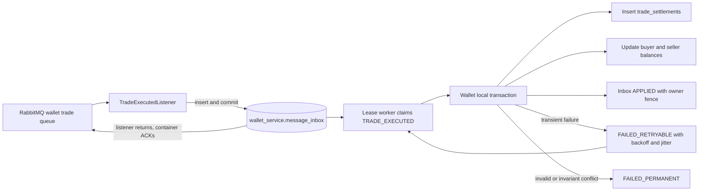

# Wallet 成交結算 Durable Inbox 與 Crash Recovery

> 更新日期：2026-09-04
>
> 適用範圍：CDA `TradeExecutedEvent → Wallet settlement`
>
> 定位：說明 Wallet 如何先接管成交訊息，再以可恢復的本地 transaction 結算 buyer／seller 資產；inbox insert 前 DB outage、Order warning-only timeout detection 與 terminal recovery control plane 已由後續 REL-104／105／106 補上。REL-107 只為這條 Wallet trade route 增加 owner-aware conditional DLQ replay，仍不代表有自動業務補償或全域 DLQ redrive。

## 先說結論

Wallet 的 `TradeExecutedEvent` consumer 已從「Rabbit listener 直接結算，失敗幾次後進 DLQ」改為兩階段：

1. listener 只用 `tradeId` 將完整 payload 與 hash 寫進 `wallet_service.message_inbox`；資料庫 commit 後方法才返回，Rabbit container 才能 ACK；
2. lease worker 從 inbox claim 工作，在同一筆 Wallet transaction 內寫入 `trade_settlements`、更新 buyer／seller balance，並把 inbox 標成 `APPLIED`。

因此 Rabbit ACK 現在代表「Wallet 已持久接管這筆成交」，不再代表「資產已經結算」。真正完成必須同時看到：

- inbox 為 `APPLIED`；
- `trade_settlements.trade_id` 存在；
- buyer／seller 資產異動符合成交內容；
- 沒有 Wallet retry／permanent debt。

## 改造前後



舊流程把 broker delivery lifetime 和結算 transaction 綁在一起。若 Wallet DB outage 超過 Spring listener 的短期重試窗口，合法成交就會直接變成 DLQ 人工債務。新流程只要 inbox 已經 commit，即使 broker 訊息已 ACK、service 隨後 crash，Wallet 仍能從自己的資料庫找回工作。

## Inbox schema 為什麼調整

既有 Wallet inbox 原本只保存：

- `ORDER_SUBMITTED/order_id`
- `ORDER_CANCELLATION_RESULT/cancellation_id`

兩種 identity 都是 UUID，所以 `message_id` 原先使用 PostgreSQL UUID。MatchEngine 的 `tradeId` 並不是 UUID，而是 `<marketId>-<Redis match sequence>` 的穩定字串；現行 `ENERGY-SPOT` 加最長 19 位數 sequence 只有 31 字元，跨服務 schema 保留 80 字元上限。它不應被雜湊成另一個假 UUID。因此 migration `wallet-025`：

- 將 `message_id` 從 UUID 轉成與跨服務 trade contract 一致的 `VARCHAR(80)`；
- 既有 UUID 值以原文字串保留，不改變 identity；
- `message_type` constraint 新增 `TRADE_EXECUTED`；
- `trade_settlements` 保存新成交的 `event_payload_hash`；舊 row 沒有 hash 時不會被靜默當成可驗證 duplicate；
- 複合主鍵仍是 `(message_type, message_id)`。

這個 migration 不是 zero-downtime expand／contract：舊版只認 UUID message ID，新版要寫
字串 trade ID，因此目前部署順序必須是**先暫停 Wallet consumers，再執行 migration，
最後整批啟動新版**。若未來要 rolling upgrade，必須另做可雙寫／雙讀的欄位擴充與資料
搬移階段，不能直接沿用這個單步型別轉換。

Inbox row 仍保存完整 payload、SHA-256、schema version、status、attempt、next retry time、lease owner、lease expiry 與錯誤資料。相同 `tradeId`／相同 payload 是安全 duplicate；相同 `tradeId`／不同 payload 形成 `IDENTITY_CONFLICT`，不能用後到資料覆蓋第一次事實。

目前 `schema_version=1` 的 hash 是 Java object 經現行 `ObjectMapper` 重新序列化後的結果。
這在同版本 redelivery 下穩定，但不是永久 canonical event fingerprint；未來若調整欄位、
序列化設定或做 rolling upgrade，必須先定義穩定欄位集合並升版，否則語意相同的事件也
可能被 fail-closed 成 conflict。既有 `trade_settlements` 因 migration 前沒有保存 payload
identity，`event_payload_hash IS NULL` 的 replay 也會進 terminal review；這是刻意不猜測，
但部署前必須納入 rollout runbook。

## 可觀測性與只讀檢視

Wallet 每 5 秒用一次 owner-local 聚合查詢更新全服務的 durable-debt snapshot；
Prometheus scrape 與 Actuator 只讀記憶體 cache，不會對每個 status 重複掃描 inbox。
`eap_durable_debt_items{service="eap-wallet",work="trade_execution_inbox",class="total|retry|terminal"}`
顯示未完成、可重試與 permanent／identity-conflict debt，
`eap_durable_debt_oldest_age_seconds{service="eap-wallet",work="trade_execution_inbox"}`
顯示最舊未解決年齡。初始 SLO 對 oldest age 超過 30 秒持續 2 分鐘告警；terminal
debt 持續 30 秒即告警。DB 暫時不可用時保留最後一次 snapshot，同時把
`observationSuccess=false` 與持續增加的 snapshot age 明確揭露，避免舊零值被當成完成。

只有啟用 `local`、`test` 或 `loadtest` profile，並同時設定
`eap.wallet.inbox-admin.enabled=true` 時，才可用
`GET /internal/inbox/messages?status=FAILED_RETRYABLE&messageType=TRADE_EXECUTED&limit=50`
檢視 message identity、attempt、next retry、lease owner／expiry 與 error。端點預設關閉、
上限 100 筆、只讀，且刻意不回傳 payload；production profile 即使誤設 property 也不會
註冊 controller。它用來診斷 WRR-106，不提供 replay，受控重播仍屬 WRR-301。

## ACK 與 transaction 邊界

### Durable intake

```text
Rabbit delivery
  → INSERT inbox
  → database commit
  → listener returns
  → Rabbit ACK
```

若 insert 或 commit 失敗，listener 拋出 exception，不應 ACK。這個窗口仍由 Rabbit listener retry／DLQ 負責；durable inbox 無法在自己的 database 完全不可用時保存工作。

### Durable settlement

```text
claim row as IN_PROGRESS + claimed_by + claim_until
  → begin Wallet transaction
  → lock buyer/seller Wallet rows in stable user-ID order
  → INSERT trade_settlements(trade_id)
  → update buyer
  → update seller
  → UPDATE inbox SET status = APPLIED
       WHERE status = IN_PROGRESS AND claimed_by = current worker
  → commit all effects together
```

`markApplied` 是 owner fencing。若 worker 處理太久、lease 已被其他 instance 接手，舊 worker 無法標記完成；它會拋錯，使 settlement row 和兩個 balance update 一起 rollback。

現行 worker token 是 process instance 級 UUID，安全前提是同一 instance 的 fixed-delay
reconciler 不重疊執行；跨 instance token 不同。若未來把 scheduler 改為同 instance
平行執行，必須先改成 per-claim／per-batch token，不能直接只加 thread 數。

## 三層冪等各自解決什麼

| 層次 | Identity | 用途 |
| --- | --- | --- |
| Inbox delivery identity | `(TRADE_EXECUTED, tradeId)` | 吸收 Rabbit redelivery並保存 processing lifecycle |
| Payload hash | `SHA-256(serialized event)` | 區分相同 replay 與 same-ID/different-payload conflict |
| Business effect identity | `trade_settlements.trade_id` primary key＋event payload hash | 防止結算效果被套用兩次，並核對既有 effect 是否真的是同一事實 |

Inbox 不能取代 `trade_settlements`。前者回答「訊息處理到哪裡」，後者回答「這筆成交是否已在 Wallet 成立」。保留兩層可以處理 migration、舊流程或 commit 結果不確定時已存在 settlement 的情況。

## 錯誤分類與重試

| 類型 | 例子 | Inbox 結果 |
| --- | --- | --- |
| Transient database | connection、lock、deadlock、暫時資料庫錯誤 | `FAILED_RETRYABLE`，exponential backoff＋bounded jitter |
| Unknown technical | 尚未分類的 runtime failure | 先有界 retry；budget 耗盡後 permanent debt |
| Invalid event | 缺 buyer／seller／order identity、self-trade、價格或數量非正數、成交價超出 buyer／seller limit | `FAILED_PERMANENT` |
| Identity conflict | 相同 `tradeId` 但 payload 不同 | `FAILED_PERMANENT/IDENTITY_CONFLICT` |
| Asset invariant | wallet 不存在、locked asset 不足、兩個必要 wallet update 未完成 | transaction rollback，`FAILED_PERMANENT/PERMANENT_ASSET_INVARIANT` |
| Duplicate business effect | 相同 `tradeId` 已存在且 payload hash 相同 | 不再異動資產，inbox 收斂成 `APPLIED` |
| Legacy／conflicting business effect | settlement 已存在但 payload hash 缺失或不同 | 不猜測為 duplicate；transaction rollback 並形成 identity conflict debt |

Wallet 不對 trade 使用 `PENDING_PREREQUISITE`。`TradeExecutedEvent` 只有在 Wallet 已經 durable 保留資產並發布 reservation success 後，才可能由 MatchEngine 產生。若結算時 locked asset 已不足，等待只會讓 locked asset 被更多成交／取消消耗，不會自行補足；因此這是需要停止與調查的一致性衝突，不是合法亂序。

## 金額安全

成交金額與 buyer 原始鎖定金額改用 `Math.multiplyExact`，退款改用 `Math.subtractExact`：

```text
dealCurrency = dealPrice × quantity
originalLockedCurrency = originBuyerPrice × quantity
refundCurrency = originalLockedCurrency - dealCurrency
```

若 Java `int` 溢位，會拋出 `ArithmeticException` 並分類為永久 invalid event，不會讓溢位後的負數或截斷金額進入 Wallet。這仍不等於貨幣模型已成熟；若產品數值範圍會超過 `int`，後續應把 event contract 與資料庫欄位一起遷移為 `long`／明確 decimal type，不能只在單一服務局部改型別。

## Crash window

| Crash 時點 | Durable 狀態 | 恢復結果 |
| --- | --- | --- |
| inbox insert 前 | Rabbit 尚未 ACK | broker redelivery；長時間 DB outage 仍可能耗盡短期 retry 進 DLQ |
| inbox commit 後、ACK 前 | inbox `PENDING` 已存在 | redelivery 命中 same-payload duplicate；仍只有一筆工作 |
| ACK 後、worker claim 前 | inbox `PENDING` | worker 稍後 claim |
| claim commit 後、settlement 前 | inbox `IN_PROGRESS` | lease 到期後其他 worker reclaim |
| settlement transaction 中 | 尚未 local commit | balance、settlement、`APPLIED` 全 rollback |
| settlement 完成但 owner fence 失敗 | local transaction rollback | 新 lease owner 重做；不留下 ghost settlement |
| local commit 後 process crash | settlement 與 inbox 都已完成 | row 已 `APPLIED`，不需要 Rabbit message |

這裡提供的是 at-least-once delivery 加上 effectively-once local state transition，不是 exactly-once messaging。

## 驗收證據

2026-09-04 已執行：

```bash
cd eap-wallet
GRADLE_USER_HOME=../.cache/gradle ./gradlew --no-daemon test
GRADLE_USER_HOME=../.cache/gradle ./gradlew --no-daemon \
  -Deap.integration.postgres.url=jdbc:postgresql://localhost:25433/eap_wallet_db \
  walletPostgresIntegrationTest
GRADLE_USER_HOME=../.cache/gradle ./gradlew --no-daemon \
  -Deap.integration.rabbit.port=25672 walletRabbitIntegrationTest
```

結果：unit suite 通過；乾淨的一次性 PostgreSQL suite 共 49 tests，Rabbit retry／DLQ
integration 1 test，皆為 0 failure／0 error。其中 `WalletTradeExecutedInboxPostgresIT` 覆蓋：

- same payload duplicate；
- same `tradeId` different payload conflict；
- 已 `APPLIED` 後的 conflicting payload 仍保留完成事實並暴露 conflict；
- 無 payload identity 的 legacy settlement 不會被靜默接受；
- settlement、buyer／seller balance 與 inbox `APPLIED` 原子提交；
- lost lease 時 settlement、balance 與 inbox completion 一起 rollback；
- lease 過期後由新 worker reclaim，舊 worker 無法提交，最後只結算一次；
- 已存在的相同 hash settlement 收斂為 duplicate，不同 hash 則成為 permanent conflict。

`WalletCancellationSettlementOrderingPostgresIT` 同時覆蓋 BUY／SELL 取消先到、成交先到與
併發到達，兩種資產路徑都收斂到相同最終餘額。

另外，最新版完整 HTTP k6 長窗以 `60s + 900s`、`200 orders/s` 驗證新增寫入路徑：
`192000/192000` 訂單接受、三服務各 `96000` 筆 trade ID 相同、Wallet inbox max
`389`、oldest age max `1s`、terminal debt `0`，資產與所有 final debt 收斂。詳見
[2026-09-04 全鏈報告](benchmarks/2026-09-04-current-reliability-full-chain.md)。這仍不是完整
Rabbit／service process failure-injection，也不是 release-pinned capacity 上限。

## 成本與限制

每筆成交現在至少多出：

- 一次 inbox intake insert；
- claim／lease update；
- settlement transaction 內一次 inbox `APPLIED` update；
- retry index 與已完成 row 的儲存成本。

這是用 write amplification 換取 ACK 後可恢復、可觀測 retry debt 與 worker crash 接手。完整壓測必須分開量 Rabbit intake rate、Wallet inbox apply rate、oldest pending age、settlement rate 與最終三服務 trade-ID／asset reconciliation，不能把 queue 清空或 inbox insert TPS 當成 business-complete TPS。

目前仍未完成：

- inbox insert 前 Wallet DB 長時間 connectivity outage 已由 REL-104 的 service-local circuit／consumer pause 處理；poison message 仍走 DLQ；
- oldest-age 與 permanent-debt metric／基本告警已存在，200 orders/s 長窗未觸發；正式 SLO 仍需多 seed、故障注入與 production-like 環境校準；
- terminal inbox 已接入 REL-106 的 classify、dry-run、rate-limited owner-side replay 與 audit；
  REL-107 的 shared-DLQ 切片只在 exact route、transient failure 與 Wallet inbox preflight 都
  通過時 direct replay 回本 queue；其他 Wallet route 尚未開放；
- 真實 Rabbit delivery 下的 60 秒 DB outage 已由 REL-104 驗證；process kill、duplicate、
  late event 與 ambiguous recovery response 仍待 REL-107 campaign；
- 200 orders/s 以上的邊界搜尋與 clean revision release-pinned 重跑。

## 面試版說法

> Wallet 原本直接在 Rabbit listener 裡結算成交，DB 故障超過幾次 retry 就只剩 DLQ。我把 TradeExecuted 納入 Wallet-owned durable inbox：listener 在 inbox commit 後才返回，lease worker 再把 trade settlement、buyer／seller balance 與 inbox APPLIED 放進同一筆 transaction。相同 trade ID 由 inbox hash 與 settlement primary key 兩層去重；worker 失去 lease 時整筆 rollback，crash 後由新 worker接手。REL-104 再把 inbox insert 前的 connectivity outage 改為 pause consumer、保留未 ACK delivery並自動恢復；REL-106 讓 technical retry exhausted 可經受保護的單筆操作交回同一個 Wallet worker，永久 invariant 與 identity conflict 仍 fail closed。
